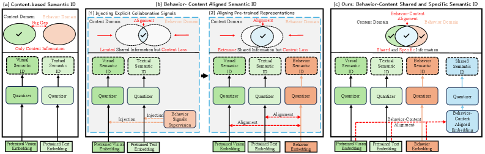
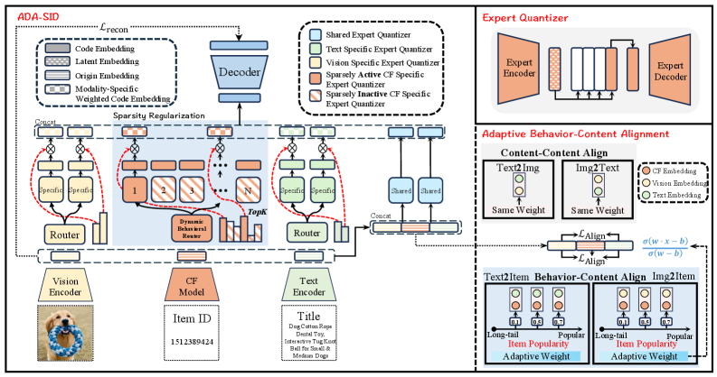
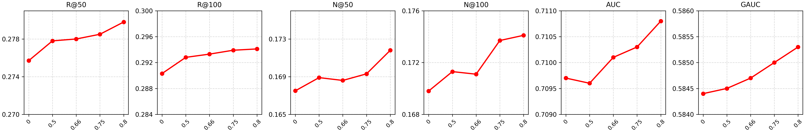
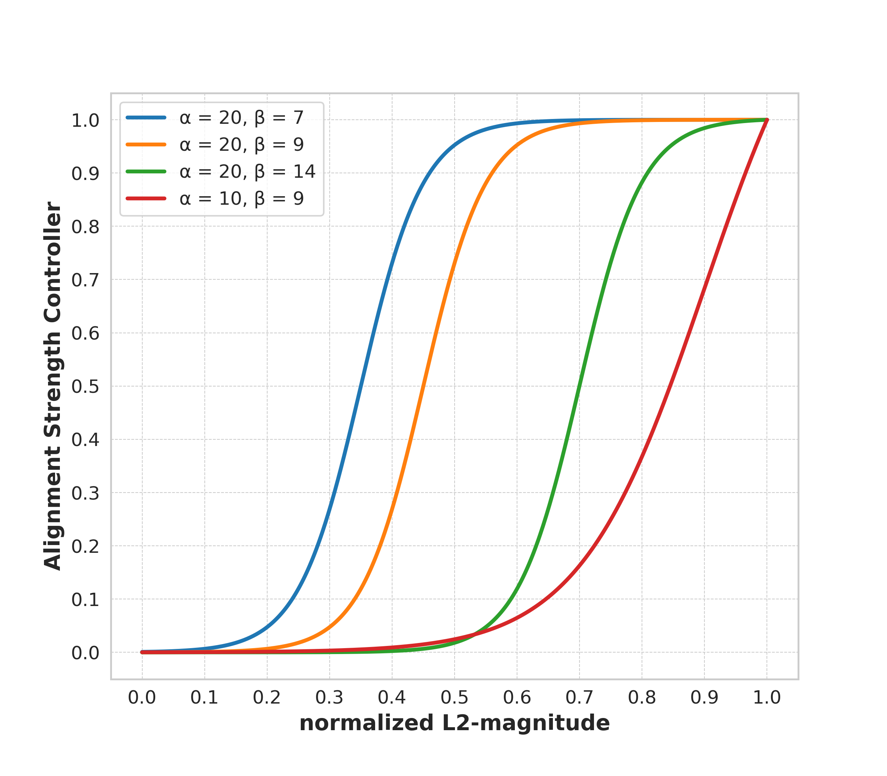
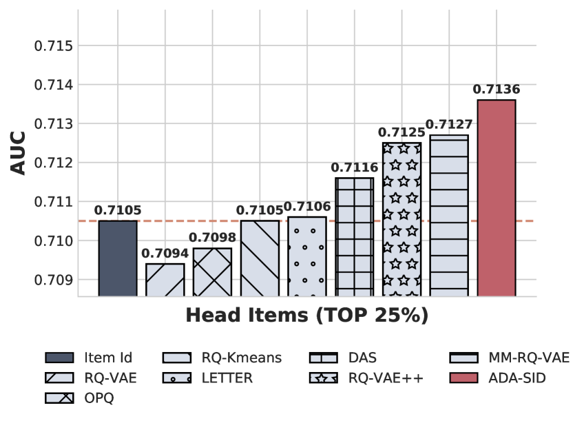
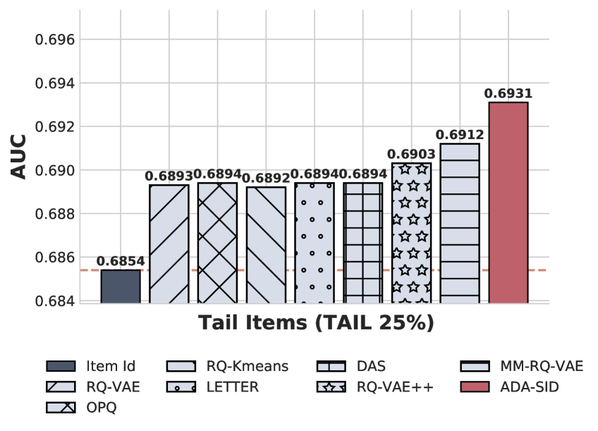

# MMQ-v2 / ADA-SID: Align, Denoise, and Amplify — Adaptive Behavior Mining for Semantic IDs in Recommendation

> **arxiv**: https://arxiv.org/abs/2510.25622  
> **Authors**: (Alibaba Group, e-commerce advertising platform)  
> **Venue**: ACM Conference 2025 (submitted as ACM paper)

## Abstract

Industrial recommender systems rely on unique Item Identifiers (ItemIDs) but this approach struggles with scalability and generalization on large, dynamic datasets with sparse long-tail data. Content-based Semantic IDs (SIDs) share knowledge through content quantization, but purely content-based SIDs ignore dynamic behavioral properties.

Existing behavior-content alignment methods overlook a critical distinction: **user-item interactions are highly skewed and diverse**, creating a vast information gap between popular and long-tail items. This leads to two critical limitations:
1. **Noise Corruption**: Indiscriminate alignment corrupts long-tail item content representations with noisy collaborative signals; over-compresses popular item behavioral patterns
2. **Signal Obscurity**: Equal weighting of SIDs fails to reflect varying importance of behavioral signals

We propose **ADA-SID** (within framework **MMQ-v2**), a mixture-of-quantization framework that adaptively **Aligns, Denoises, and Amplifies** multimodal information with two innovations:
- **Adaptive behavior-content alignment**: dynamically calibrates alignment strength based on interaction richness
- **Dynamic behavioral router**: amplifies critical signals by assigning importance weights to behavioral SIDs

**Offline results**: ADA-SID outperforms all baselines on both generative retrieval and discriminative ranking.  
**Online A/B test (5 days, 10% traffic)**: **+3.50% Advertising Revenue**, **+1.15% CTR**.

## 1. Introduction

> **Figure 1.** Three SID generation paradigms: (a) Content-based SIDs: quantize multimodal content into SIDs. (b) Behavior-content aligned SIDs: inject collaborative signals or align pre-trained representations. (c) Ours (ADA-SID): learn both shared and modality-specific behavior–content representations for SIDs.

The evolution of SID approaches:
- **Content-based SIDs** (TIGER with RQ-VAE): quantize multimodal content so similar items share similar identifiers
- **Behavior-content aligned SIDs**: incorporate collaborative signals via explicit injection (LC-Rec, ColaRec, IDGenRec) or representation alignment (EAGER, DAS, LETTER, MM-RQ-VAE)

**Problem with existing alignment**: Extreme sparsity and skewed distribution of user-item interactions (long-tail phenomenon) creates a fundamental mismatch:
- Long-tail items: sparse interactions → noisy behavioral signals that corrupt reliable content representations
- Popular items: rich behavioral patterns → over-compressed by uniform alignment

**ADA-SID contributions:**
1. First to customize behavior–content multimodal SIDs based on item behavioral information richness
2. Adaptive behavior-content alignment with alignment strength controller
3. Dynamic behavioral router with sparsity regularization
4. Offline + online A/B test validation on large-scale industrial dataset

## 2. Related Works

**Traditional ItemIDs**: lack semantic sharing, poor generalization.

**Content-based SIDs**: TIGER (RQ-VAE), SPM-SID, PMA. Ignore behavioral dynamics.

**Behavior-content aligned SIDs** (two categories):
- Explicit collaborative signals: LC-Rec, ColaRec, IDGenRec
- Representation alignment: EAGER, DAS, LETTER, MM-RQ-VAE

ADA-SID advances beyond all these by adaptively fusing content and behavior according to **information richness**.

## 3. Methodology

### 3.1. Problem Formulation

Item tokenizer quantizes pretrained textual (**e_t**), visual (**e_v**), and behavioral (**e_b**) embeddings into discrete SID sequences:

\\[
\text{Semantic\\_IDs} = (c_1, c_2, \ldots, c_l) = \mathcal{T}_{\text{item}}([\mathbf{e}_t, \mathbf{e}_v, \mathbf{e}_b]) \tag{1}
\\]

where **e_b** is obtained from SASRec with collaborative signals; pretrained vision/text embeddings from Qwen3-Embedding 7B and PailiTAO v8.

### 3.2. Behavior-Content Mixture-of-Quantization Network

> **Figure 2.** ADA-SID framework: (i) sparse MoE-based quantization network for shared and modality-specific representations; (ii) adaptive behavior-content alignment mechanism; (iii) dynamic behavioral router with adaptive SID weights.

#### Shared Experts
Capture behavior-content aligned shared information. Projected hidden representations:

\\[
\mathbf{h}_t = D_t(\mathbf{e}_t),\ \mathbf{h}_v = D_v(\mathbf{e}_v),\ \mathbf{h}_b = D_b(\mathbf{e}_b) \tag{2}
\\]
\\[
\mathbf{h} = [\mathbf{h}_t, \mathbf{h}_v, \mathbf{h}_b] \tag{3}
\\]

For the i-th shared expert E_{s,i}, shared semantic ID selected by cosine distance maximization:

\\[
\mathbf{z}_{s,i} = E_{s,i}(\mathbf{h}) \tag{4}
\\]
\\[
c_{s,i} = \underset{j \in \{1,\ldots,K\}}{\arg\max} \frac{\mathbf{z}_{s,i}^\top \mathbf{z}_{q,j}}{\|\mathbf{z}_{s,i}\| \|\mathbf{z}_{q,j}\|} \tag{5}
\\]

#### Specific Experts
Capture modality-specific information. For each modality (text, visual, behavior), dedicated experts generate modality-specific SIDs. Gating weights for text and visual modalities:

\\[
g_t = \text{softmax}(MLP_t(\mathbf{e}_t) + b_t) \tag{9}
\\]
\\[
g_v = \text{softmax}(MLP_v(\mathbf{e}_v) + b_v) \tag{10}
\\]

Fused latent representations and quantized representations:

\\[
\mathbf{z} = \sum_{i=1}^{N_s}\mathbf{z}_{s,i} + \sum_{i=1}^{N_v}g_{v,i}\mathbf{z}_{v,i} + \sum_{i=1}^{N_t}g_{t,i}\mathbf{z}_{t,i} + \sum_{i=1}^{N_b}g_{b,i}\mathbf{z}_{b,i} \tag{7}
\\]
\\[
\mathbf{z}_q = \sum_{i=1}^{N_s}\mathbf{z}_{q_{s,i}} + \sum_{i=1}^{N_v}g_{v,i}\mathbf{z}_{q_{v,i}} + \sum_{i=1}^{N_t}g_{t,i}\mathbf{z}_{q_{t,i}} + \sum_{i=1}^{N_b}R(\mathbf{e}_b)_i\mathbf{z}_{q_{b,i}} \tag{8}
\\]

Reconstruction loss:

\\[
\mathcal{L}_{recon} = \|\mathbf{e} - \text{decoder}(\mathbf{z} + \text{sg}(\mathbf{z}_q - \mathbf{z}))\|^2 \tag{11}
\\]

### 3.3. Adaptive Behavior-Content Alignment

#### Alignment Strength Controller
Uses L2-magnitude of behavioral embedding as proxy for information richness. For the j-th item:

\\[
N_{\max} = \max_{i}(\|\mathbf{e}_{b,i}\|_2),\quad N_{\min} = \min_{i}(\|\mathbf{e}_{b,i}\|_2) \tag{12}
\\]
\\[
N_{\text{norm}}(\mathbf{e}_{b,j}) = \frac{\|\mathbf{e}_{b,j}\|_2 - N_{\min}}{N_{\max} - N_{\min}} \tag{13}
\\]
\\[
w = \frac{\sigma(\alpha N_{\text{norm}}(\mathbf{e}_{b,j}) - \beta)}{\sigma(\alpha - \beta)} \tag{14}
\\]

where α and β control steepness and threshold. Optimal: **α=10, β=9** (noise filtering for ~40% least frequent items).

#### Behavior-Content Contrastive Learning
Two-stage process: (1) align text + visual → unified content h_c = h_t + h_v; (2) contrastive learning between h_c and behavioral h_b.

Content alignment loss:

\\[
\mathcal{L}_{content} = -\log\frac{\exp(\text{sim}(h_t, h_{v^+})/\tau)}{\exp(\text{sim}(h_t, h_{v^+})/\tau) + \sum_{i=1}^{B-1}\exp(\text{sim}(h_t, h_{v_i^-})/\tau)} + \text{[symmetric term]} \tag{15}
\\]

Behavior-content alignment loss (weighted by alignment strength w):

\\[
\mathcal{L}_{align} = -\log\frac{\exp(\text{sim}(h_b, h_{c^+})/\tau)}{\exp(\text{sim}(h_b, h_{c^+})/\tau) + \sum_{i=1}^{B-1}\exp(\text{sim}(h_b, h_{c_i^-})/\tau)} \tag{16}
\\]
\\[
\mathcal{L}_{align\_total} = \mathcal{L}_{content} + w \cdot \mathcal{L}_{align} \tag{17}
\\]

Temperature τ = 0.07 in experiments.

### 3.4. Dynamic Behavioral Router Mechanism

#### Behavior-Guided Dynamic Router
Learnable gate assigning importance scores to behavioral SIDs:

\\[
R(\mathbf{e}_b) = \sigma(N_{\text{norm}}(\mathbf{e}_b)) * \text{relu}(MLP(\mathbf{e}_b) + b) \tag{18}
\\]

- MLP extracts behavior-specific semantics
- ReLU induces exact-zero sparsity
- Magnitude-based scaler σ(·) calibrates by information richness
- Popular items: dense behavioral SIDs; long-tail items: sparse behavioral SIDs

#### Sparsity Regularization with Load Balancing
Item-specific target sparsity inversely proportional to information richness:

\\[
\mathcal{L}_{reg_i} = \lambda_i \frac{1}{B}\sum_t^B\sum_j^{N_b} f_{lb}\|R(\mathbf{e}_b)_j\|_1 \tag{19}
\\]
\\[
\lambda_i = \lambda_{i-1} \alpha^{\text{sign}(s_{target} - s_{current})} \tag{20}
\\]
\\[
s_{current} = 1 - \sum_j^{N_b} \mathbf{1}\{R(e_b)_j > 0\}/N_b \tag{21}
\\]
\\[
s_{target} = \theta \cdot (1 - N_{\text{norm}}(\mathbf{e}_b)/(N_{max} - N_{min})) \tag{22}
\\]

Load-balancing term to prevent routing collapse:

\\[
f_{lb} = \frac{1}{(1-s_{target})B}\sum_t^B\sum_j^{N_b}\mathbf{1}\{R(e_b)_j > 0\}/N_b \tag{23}
\\]

## 4. Experiments

### 4.1. Experimental Setup

#### 4.1.1. Dataset

**Table 1.** Dataset Statistics.

- **Industrial Dataset**: Southeast Asia e-commerce advertising platform (Oct 2024 – May 2025). 30M users, 40M advertisements, avg behavior sequence length 128, rich multimodal content.
- **Public Dataset**: Amazon Beauty (5-core filter, chronological sequences up to length 20 for retrieval; 90%/10% split for ranking)

#### 4.1.2. Evaluation Metrics
- **Quantization**: Reconstruction loss L_recon↓, Token Distribution Entropy↑, Codebook Utilization↑
- **Generative Retrieval**: Recall@N and NDCG@N (N=50, 100)
- **Discriminative Ranking**: AUC↑, GAUC↑
- **Online**: Advertising Revenue↑, CTR↑

#### 4.1.3. Baselines
- Content-based: RQ-VAE, OPQ
- Behavior-content: RQ-Kmeans, DAS, LETTER, MMRQVAE, RQVAE++

#### 4.1.4. Experiment Setup
- **Generative Retrieval base**: REG4Rec (strong multi-token prediction model)
- **Discriminative Ranking base**: PPNet (Parameter Personalized Network)
- **Pre-trained embeddings**: Qwen3-Embedding 7B (text), SASRec (behavior), PailiTAO v8 (vision)
- **Industrial config**: codebook size=3000, SID length=8, N_s=2, N_t=2, N_v=2, N_b=6, s_target=1/3
- **Public config**: codebook size=100, SID length=6, N_s=1, N_t=1, N_v=1, N_b=5, s_target=3/5

### 4.2. Overall Performance (RQ1)

**Table 2(a).** Generative Retrieval Evaluation.

**Table 2(b).** Discriminative Ranking Evaluation.

| Methods | Ind. L_recon↓ | Ind. Entropy↑ | Ind. AUC↑ | Ind. GAUC↑ | Beauty L_recon↓ | Beauty Entropy↑ | Beauty AUC↑ | Beauty GAUC↑ |
|---------|--------------|--------------|----------|-----------|----------------|----------------|------------|-------------|
| Item ID | — | — | 0.7078 | 0.5845 | — | — | 0.6455 | 0.5897 |
| RQVAE | 0.0033 | 4.2481 | 0.7071 | 0.5805 | 0.6028 | 3.4904 | 0.6446 | 0.5852 |
| OPQ | 0.0038 | 4.3981 | 0.7086 | 0.5829 | 0.9647 | 3.3980 | 0.6449 | 0.5898 |
| RQKmeans | 0.0065 | 4.7232 | 0.7089 | 0.5832 | 0.6240 | 1.7100 | 0.6472 | 0.5999 |
| LETTER | 0.0054 | 4.2072 | 0.7089 | 0.5828 | 0.5431 | 2.6819 | 0.6444 | 0.5973 |
| DAS | 0.0051 | 4.3539 | 0.7091 | 0.5845 | 0.5432 | 3.6819 | 0.6466 | 0.5933 |
| RQVAE++ | 0.0034 | 3.5566 | 0.7100 | 0.5838 | 0.6028 | 3.4904 | 0.6466 | 0.5952 |
| MMRQVAE | 0.0055 | 4.2125 | 0.7095 | 0.5843 | 0.5081 | 2.8449 | 0.6453 | 0.5991 |
| **ADASID** | **0.0032** | **5.0977** | **0.7101** | **0.5846** | **0.4470** | **4.4206** | **0.6480** | **0.6125** |
| Improv. | +3.03% | +7.92% | +0.07% | +0.02% | **+12.02%** | **+20.06%** | +0.12% | **+2.10%** |

**Key observations:**
1. Behavior-content aligned SIDs consistently outperform content-only SIDs — behavioral signals are necessary
2. Explicitly generating dedicated behavior SIDs (RQ-VAE++, MM-RQ-VAE) > aligned representations (LETTER, DAS)
3. ADA-SID's adaptive information richness assessment outperforms all baselines, especially on Amazon Beauty (+12.02% L_recon, +20.06% Entropy, +2.10% GAUC)

### 4.3. Ablation Study on Industrial Dataset (RQ2)

**Table 3.** Ablation Experiments.

| Variant | Performance Change |
|---------|-------------------|
| w/o Alignment Strength Controller | ↓ (noise in alignment) |
| w/o Behavior-Content Contrastive Learning | ↓ (modality gap not bridged) |
| w/o Dynamic Behavior-Guided Router | ↓ (no importance weighting) |
| w/o Sparsity Regularization | ↓ (less specialized representations) |

**Impact of Alignment Strength Controller**: Disabling it leads to indiscriminate alignment → noise corruption. Demonstrates necessity of suppressing noise for long-tail items.

**Impact of Behavior-Content Contrastive Learning**: Removing it drops performance substantially. The modality gap between content and behavioral domains requires explicit bridging.

**Impact of Dynamic Behavioral Router**: Removing it impairs model's ability to estimate and weight collaborative signals → performance drop on both tasks.

**Impact of Sparsity Regularization**: Two critical roles: (1) sparse activations force more specialized/disentangled representations (MoE-style capacity expansion); (2) item-specific sparsity target allocates representational budget wisely.

### 4.4. Hyper-Parameter Analysis (RQ3)

> **Figure 3.** Hyper-Parameter Analysis on Sparsity Regularization. Reducing sparsity intensity expands model capacity (larger encoder), leading to significant accuracy improvements in both retrieval and ranking. ADA-SID's variable-length flexibility allows head items to use longer collaborative SID sequences.

**Table 4.** Hyper-Parameter Analysis on Contrastive Loss Weight.

> **Figure 4.** Alignment strength controller curves with different (α, β) hyperparameters. Optimal (α=10, β=9) effectively filters ~40% least-frequent long-tail items.

### 4.5. Item Popularity Stratified Performance Analysis (RQ4)

 

> **Figure 5.** Popularity-stratified comparison: (a) Popular items (top 25% by impression count). (b) Long-tail items (bottom 25% by impression count).

**Stratification methodology**: Items categorized into "popular" (top 25%) and "long-tail" (bottom 25%) by impression counts over last 30 days.

**For Head Items**: Content-based SIDs underperform simple Item IDs (insufficient expressiveness). Integrating collaborative information is crucial. ADA-SID's explicit align-denoise-amplify process yields most expressive semantic representation.

**For Tail Items**: All SID-based methods outperform ItemIDs via knowledge sharing across similar items. ADA-SID achieves the largest gain:
- Adaptive alignment shields content representations from noisy behavioral signals
- Dynamic behavioral router produces sparser, more robust representations relying on high-level semantics

## 5. Online Experiments

**5-day online A/B test** on large-scale e-commerce platform's generative retrieval system:
- **Setup**: 8-token SIDs, 10% random user traffic vs. production Item ID-based system
- **Results**: **+3.50% Advertising Revenue**, **+1.15% Click-Through Rate (CTR)**

These online gains confirm ADA-SID's practical value and production-readiness on a real-world industrial platform.

## 6. Conclusion

ADA-SID introduces adaptive fusion of content and behavior modalities based on **information richness**:
1. Adaptive behavior-content alignment (alignment strength controller) suppresses noise corruption for long-tail items
2. Dynamic behavioral router amplifies critical collaborative signals for popular items while producing sparse representations for long-tail items
3. Information-richness-aware design enables adaptive representation across the full popularity spectrum
4. Validated on 30M user/40M item industrial dataset + public dataset + production A/B test

Future directions: applying these principles to **user-side modeling**.

## References

- TIGER/RQ-VAE (Rajput et al., 2023): Recommender systems with generative retrieval. arXiv:2305.05065
- LETTER (Wang et al., 2024): Learnable item tokenization for generative recommendation. arXiv:2405.07314
- DAS (Ye et al., 2025): Dual-aligned semantic IDs for industrial recommendation. arXiv:2508.10584
- EAGER (Wang et al., 2024): Two-stream generative recommender with behavior-semantic collaboration. arXiv:2406.14017
- MM-RQ-VAE (Wang et al., 2025): Empowering LLM for sequential recommendation via multimodal embeddings and semantic IDs. arXiv:2509.02017
- QARM (Luo et al., 2024): Quantitative alignment multi-modal recommendation at Kuaishou. arXiv:2411.11739
- REG4Rec (Xing et al., 2025): Reasoning-enhanced generative model for large-scale recommendation. arXiv:2508.15308
- PPNet (Chang et al., 2023): PEPNet — parameter embedding personalized network. arXiv:2302.01115
- Qwen3-Embedding (Zhang et al., 2025). arXiv:2506.05176
- SASRec (Kang & McAuley, 2018): Self-attentive sequential recommendation. arXiv:1808.09781
- Amazon Beauty dataset (He & McAuley, 2016). WWW '16.
