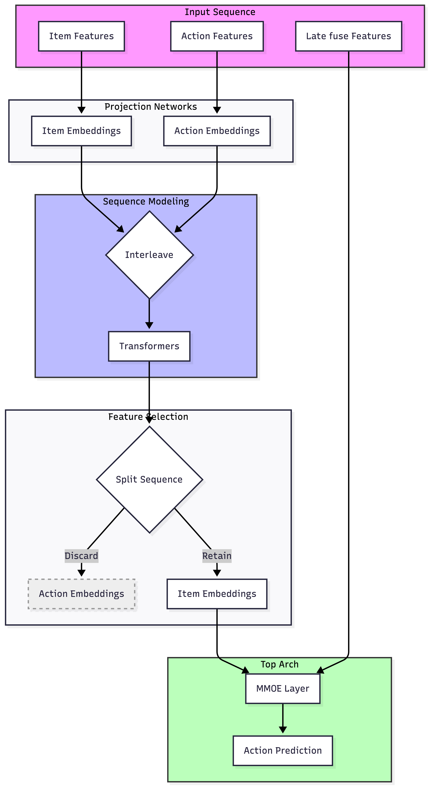
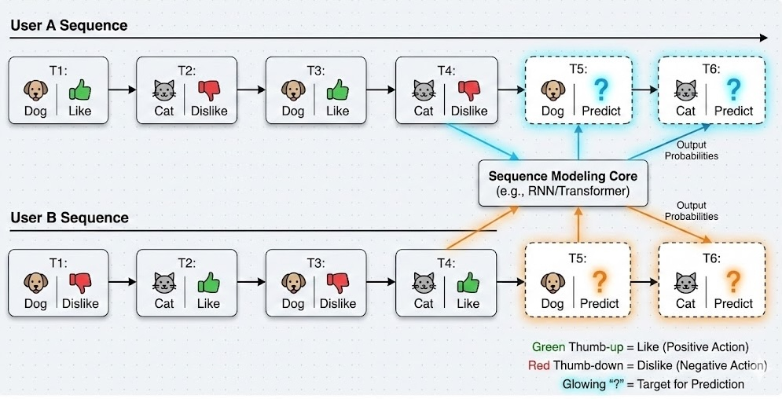
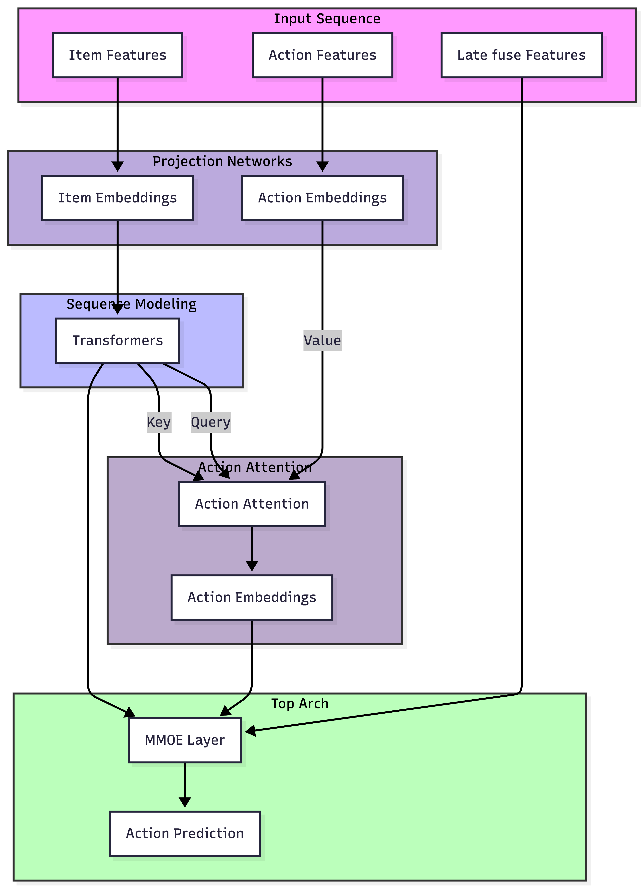
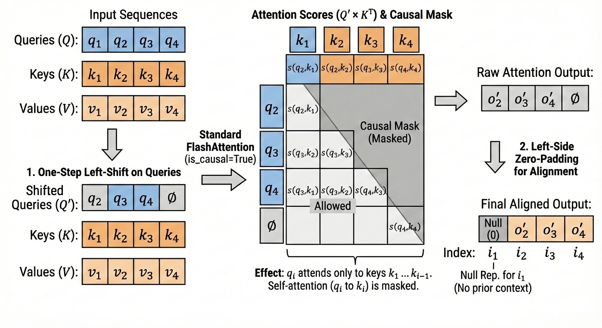
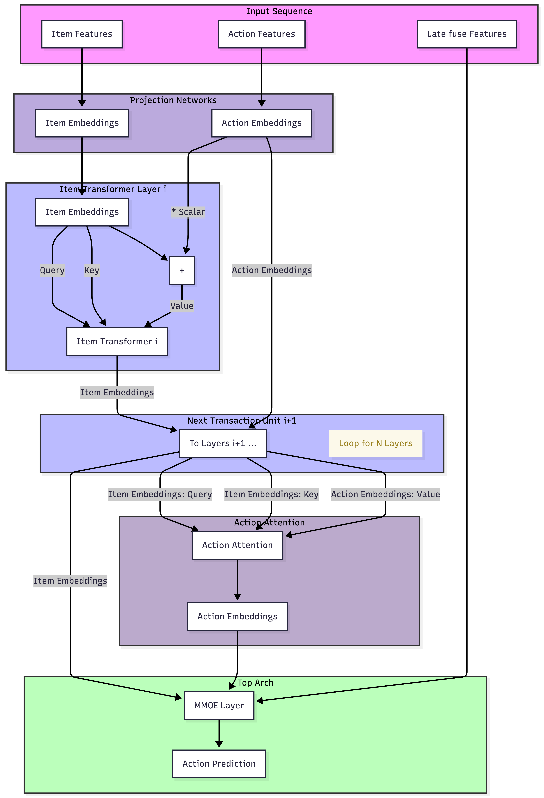
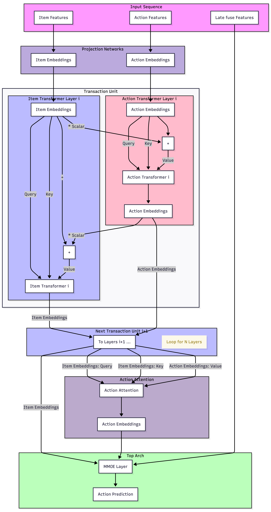

# Beyond Interleaving: Causal Attention Reformulations for Generative Recommender Systems

> **arxiv**: https://arxiv.org/abs/2603.10369  
> **Authors**: Hailing Cheng (LinkedIn)  
> **Date**: 2026 (KDD 2026, The 32nd ACM SIGKDD Conference on Knowledge Discovery and Data Mining; June 03–05, 2026; Jeju, Korea)

## Abstract

Generative recommender systems (GR), exemplified by Meta's HSTU ranker architecture, model user behavior as a sequence generation problem by interleaving item and action tokens. While effective, this formulation introduces fundamental limitations: it doubles sequence length, incurs quadratic computational overhead, and relies on implicit attention mechanisms to recover the causal relationship that an item interaction $i_n$ elicits a user action $a_n$. Moreover, interleaving heterogeneous item and action tokens forces Transformers to disentangle semantically incompatible signals, introducing attention noise and reducing representation efficiency.

This work presents a principled reformulation of generative recommendation—specifically targeting architectures like Meta's HSTU as a ranker—by aligning sequence modeling with causal structure and attention theory. We demonstrate that the interleaving mechanism prevalent in current models acts as an inefficient proxy for similarity-weighted action pooling. To address this, we propose a structural shift that explicitly encodes the $i_n \rightarrow a_n$ causal dependency. We introduce two novel architectures, **Attention-based Late Fusion for Actions (AttnLFA)** and **Attention-based Mixed Value Pooling (AttnMVP)**, which eliminate interleaved dependencies to reduce sequence complexity by 50%.

AttnLFA performs causal attention pooling over historical actions conditioned on item similarity, whereas AttnMVP further integrates action signals early by mixing item and action embeddings in the Transformer value stream, progressively learning preference-aware item representations.

We evaluate our methods on large-scale product recommendation data from a major social network. Compared with the interleaved ranker baseline, AttnLFA and AttnMVP achieve consistent improvements in evaluation loss by **0.29% and 0.8%**, and normalized entropy (NE) gains across multiple tasks, while **reducing training time by 23% and 12%** respectively.

## 1. Introduction

Generative recommender (GR) systems (e.g., Meta's Hierarchical Sequential Transduction Units (HSTU) [Zhai et al., 2024]) model user behavior as a sequential prediction problem. These systems adopt Transformer architectures originally developed for large language models (LLMs) and formulate user action prediction as a token generation process by interleaving item and action tokens. Despite its success, the interleaving formulation introduces fundamental limitations.

**Semantic Heterogeneity of Tokens:** In contrast to natural language where tokens share a common semantic space, recommender systems operate over fundamentally heterogeneous entities: items (e.g., posts, videos, products) $i_n \in \mathcal{I}$ and actions (e.g., click, like, share) $a_n \in \mathcal{A}$, where $\mathcal{I}$ and $\mathcal{A}$ are disjoint semantic spaces. Interleaving into $\mathbf{x}=[i_0, a_0, i_1, a_1, \dots, i_n, a_n]$ implicitly assumes a shared latent structure across $\mathcal{I} \cup \mathcal{A}$, which is weak in practice.

**Missing Explicit Causality in Self-Attention:** We posit that the specific action $a_n$ is primarily a response to the proximal stimulus $i_n$. Formally:

$$P(a_n \mid i_n, \mathcal{H}_{<n}) \approx P(a_n \mid i_n; \theta_{\mathcal{H}_{<n}})$$

Standard interleaved formulations fail to explicitly articulate this functional mapping. In the standard causal self-attention:

$$\text{Attn}(Q_n, K_{\leq n}, V_{\leq n})$$

where items and actions up to index $n$ contribute symmetrically, two primary issues arise:
- **Causal Dilution**: Action tokens attend to the entire historical prefix, diluting the direct causal dependency on $i_n$.
- **Structural Ambiguity**: Item tokens face difficulty mapping specific previous actions to their corresponding items.

> **Figure 1.** *(inline SVG)* Interleaved generative recommenders treat items and actions as a single token stream. Action $a_2$ attends to all prior tokens, obscuring the direct causal dependency $i_2 \rightarrow a_2$ and introducing attention noise.

**Attention Noise Induced by Interleaving:** Once the model establishes a strong causal dependency between $i_{n-1}$ and $a_{n-1}$, the subsequent token $i_n$—due to RoPE or RAB—inherits a nearly identical attention bias toward $a_{n-1}$. This leads to spurious dependencies that impose an unnecessary burden on subsequent layers to 'correct' these correlations.

> **Figure 2.** *(inline SVG)* True causal structure of user interactions. Each action $a_n$ is a response to the corresponding item $i_n$, conditioned on prior history. This structure is not explicitly represented by interleaved self-attention.

**Computational Inefficiency:** Interleaving increases effective sequence length from $N$ to $2N$, resulting in approximately a $4\times$ increase in both memory and computational cost. This is especially detrimental in long-horizon recommendation settings.

In this work, we reformulate GR modeling as an **attention pooling mechanism** in which item embeddings construct query and key projections, while action embeddings are incorporated exclusively through value projections under strict causal masking.

## 2. Architecture Overview and Attention Mechanism

> **Figure 3.** Traditional Generative Recommender (Interleaving Item and Action Tokens) architecture: the item and action tokens are interleaved before the transformer layers.

Figure 3 illustrates a standard Transformer-based GR architecture. Raw item features are projected into item embeddings; action features (click, dwell time, like, share, comment) are projected into action embeddings. The resulting item and action embeddings are interleaved to form an input token sequence $[i_0, a_0, i_1, a_1, \dots]$, processed by 12 Transformer layers.

We use a toy example (Figure 4) to illustrate how GR architectures operate. User A consistently exhibits positive engagement with dog-related items and negative with cat-related items; User B demonstrates the opposite.

> **Figure 4.** Illustrative toy sequences for Users A and B. User A consistently exhibits positive interactions ("Like") with dog-related items and negative interactions with cat-related items, while User B exhibits the inverse preference profile.

In interleaved GR models, after one Transformer layer, User A's sequence may evolve from $[i_0=\text{dog}, a_0=\text{like}]$ to contextualized representations $[dog'_0, like'_0 + \alpha \cdot dog'_0]$, where the action token aggregates information from its associated item through self-attention. This analysis suggests that **the effectiveness of interleaved GR models stems from using self-attention as a structured pooling operator** that implicitly associates items with their corresponding user actions via semantic similarity—but this association is formed only indirectly and introduces attention noise.

## 3. AttnLFA: Attention-based Late Fusion for Action Architecture

Our key insight is that user actions can be modeled as a **similarity-weighted aggregation over historical actions**: if a target item is semantically similar to previously consumed items, then the user's response should resemble the actions associated with those similar items.

> **Figure 5.** Attention-based Late Fusion for Action (AttnLFA). Item embeddings are transformed through Transformer blocks to generate latent sequence representations. These representations serve as both Queries and Keys for the subsequent attention mechanism. Action embeddings are integrated as Values via causally-constrained attention pooling. The resulting aggregated action representation is then passed to the prediction head.

Under this formulation, the recommendation problem is cast as an **item-conditioned action pooling task**. Item embeddings are processed by a stack of Transformer layers. The final-layer item embeddings are used as both Queries and Keys, while action embeddings are supplied as Values in the attention operation.

To prevent label leakage, the attention pooling is enforced under a **strict causal constraint**: the representation of item $i_n$ may attend only to items at positions $\{0, \ldots, n-1\}$, explicitly prohibited from attending to its own position $n$.

**Query-shifting mechanism:** To leverage high-throughput FlashAttention kernels while maintaining compatibility, we apply a one-step left-shift to the query sequence $\{q_1, \dots, q_n\}$ relative to the keys. This ensures each query $q_i$ is restricted to the preceding key prefix $\{k_1, \dots, k_{i-1}\}$.

> **Figure 6.** The query-shifting mechanism to enforce a strict causal constraint.

**Experimental setup:** Large-scale product recommendation logs from a major professional social network. User interaction sequences of up to 1024 events over the past 12 months. Models trained for a single epoch with RoPE positional embeddings.

**Table 1.** Performance comparison between AttnLFA and Baseline.

| Model | BCE Loss | NE Long Dwell | NE Contribution | NE Like | Training Time |
|-------|----------|---------------|-----------------|---------|---------------|
| Baseline (Interleaved) | 0 (ref) | 0 (ref) | 0 (ref) | 0 (ref) | 0 (ref) |
| AttnLFA | **-0.29%** | **improved** | **improved** | **improved** | **-22.8%** |

AttnLFA achieves substantial improvements in evaluation loss and NE across primary prediction tasks. By eliminating the interleaving formulation, training time is reduced by **22.8%**.

## 4. AttnMVP: Attention-based Mixed Value Pooling Architecture

> **Figure 7.** Attention-based Mixed Value Pooling (AttnMVP) architecture. Item embeddings serve as Queries and Keys in each Transformer layer, while item and action embeddings are additively fused as mixed Values. Across stacked layers, action signals are progressively injected into item representations under strict causal constraints. In the final stage, action embeddings are pooled via causally masked attention conditioned on sequence-level item representations.

AttnMVP introduces an **early-fusion variant** that integrates item–action interactions at earlier stages of representation learning.

At Transformer layer $\ell$, AttnMVP applies self-attention over item representations using:
$$\mathbf{Q}^{(\ell)} = \mathbf{K}^{(\ell)} = \mathbf{H}^{(\ell-1)}$$

where $\mathbf{H}^{(0)} = \{\mathbf{i}_t\}$. The value vectors are constructed via **mixed-value fusion**:
$$\mathbf{V}^{(\ell)}_t = \mathbf{H}^{(\ell-1)}_t + \lambda \mathbf{a}_t$$

where $\lambda \geq 0$ controls the contribution of action signals (in practice $\lambda = 1$).

After $T = 12$ Transformer layers, an action pooling operation identical to AttnLFA is applied. This formulation enables each layer to perform causally masked, attention-weighted aggregation of historical action signals into item representations. As item embeddings propagate through successive layers, they evolve from encoding generic content semantics (e.g., dog versus cat) to capturing **user-conditioned semantics** (e.g., preferred dog versus disfavored cat).

**Table 2.** Relative performance improvement for Baseline, AttnMVP, and AttnMVP-LFA (AttnMVP without late fusion attention).

| Model | Eval Loss | NE Long Dwell | NE Contribution | NE Like | Training Time |
|-------|-----------|---------------|-----------------|---------|---------------|
| Baseline | 0 (ref) | 0 (ref) | 0 (ref) | 0 (ref) | 0 (ref) |
| AttnMVP | **-0.8%** | **improved** | **improved** | **improved** | **-12.3%** |
| AttnMVP-LFA | marginal degradation vs full | — | — | — | comparable |

AttnMVP delivers consistent and larger gains than AttnLFA while reducing training time by 12.3%. The AttnMVP–LFA ablation (removing late fusion) achieves comparable performance, suggesting that the majority of gains stem from **early, causally constrained integration of action signals**.

## 5. Future Work: AttnDHN — Attention-based Dual-Helix Network

> **Figure 8.** Attention-based Dual-Helix Network (AttnDHN) architecture. Action embeddings and Item embeddings are updated in pair-wise sequence in individual Transformer layers. Both transformer layers use either action and item embeddings as query and key, and use a combination of item + action embedding as value.

AttnDHN proposes a symmetric dual-stream architecture. In AttnMVP, item representations are updated via $(Q_t, K_t, V_t) = (i_t, i_t, i_t + a_t)$. AttnDHN extends this by introducing a complementary action-centric update: $(Q_t, K_t, V_t) = (a_t, a_t, i_t + a_t)$.

Within each Transformer block, item and action streams are updated sequentially in a paired manner, forming a tightly coupled interaction unit analogous to a **double-helix structure**.

AttnDHN does not consistently outperform AttnMVP due to:
1. Reduced training stability (requires halving the learning rate)
2. Effectively doubles Transformer updates per layer, complicating fair comparison
3. Item and action tokens reside in highly heterogeneous semantic spaces (action vocabulary is small ~tens; item space is effectively unbounded)

AttnDHN may be better suited to settings with more homogeneous representation spaces, such as multimodal recommendation scenarios jointly modeling text and visual embeddings.

## 6. Conclusion

We revisit the interleaved-token formulation common in generative recommendation and offer a first-principles critique. Our analysis reveals that while self-attention effectively acts as a latent pooling mechanism for user actions via item-level semantics, the standard interleaved approach:
- Introduces representational noise by interleaving heterogeneous tokens
- Doubles sequence length, incurring quadratic computational overhead
- Complicates the attention landscape

Guided by the causal structure $i_t \rightarrow a_t$, we propose a family of attention-based architectures (AttnLFA, AttnMVP) that explicitly encode this causality without interleaving. Both architectures consistently outperform a strong interleaved ranker baseline on large-scale real-world recommendation data, achieving lower evaluation loss and NE across major tasks while substantially reducing training time.

## References

- Cheng et al. (2016). Wide & deep learning for recommender systems. DLRS Workshop.
- Dao et al. (2022). FlashAttention: fast and memory-efficient exact attention with IO-awareness. NeurIPS.
- Deng et al. (2025). OneRec: unifying retrieve and rank with generative recommender and iterative preference alignment. arXiv:2502.18596.
- Geng et al. (2022). Recommendation as language processing (RLP): P5. RecSys.
- Han et al. (2025). MTGR: industrial-scale generative recommendation framework in Meituan. CIKM.
- Huang et al. (2025). Towards large-scale generative ranking. arXiv:2505.04180.
- Kang & McAuley (2018). Self-attentive sequential recommendation. ICDM.
- Kang et al. (2023). Do LLMs understand user preferences? arXiv:2305.06474.
- Liang et al. (2025). TBGRecall: a generative retrieval model for e-commerce. arXiv:2508.11977.
- Ma et al. (2018). Modeling task relationships in multi-task learning with MMoE. KDD.
- Naumov et al. (2019). Deep learning recommendation model (DLRM). arXiv:1906.00091.
- Pei et al. (2021). End-to-end user behavior retrieval in CTR prediction. ICML.
- Raffel et al. (2023). T5: Exploring the limits of transfer learning. arXiv:1910.10683.
- Su et al. (2023). RoFormer: enhanced transformer with rotary position embedding. arXiv:2104.09864.
- Sun et al. (2019). BERT4Rec: sequential recommendation with BERT. CIKM.
- Vaswani et al. (2017). Attention is all you need. NeurIPS.
- Wang et al. (2021). DCN V2. WWW.
- Wei et al. (2025). The layout is the model: on action-item coupling in generative recommendation. arXiv:2510.16804.
- Zhai et al. (2024). Actions speak louder than words: HSTU for generative recommendations. arXiv:2402.17152.
- Zhang et al. (2025). Recommendation as instruction following. ACM TOIS.
