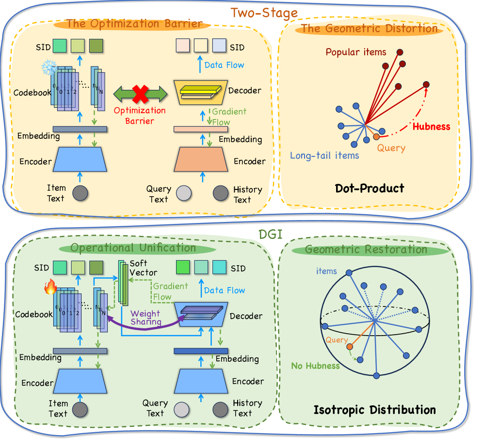
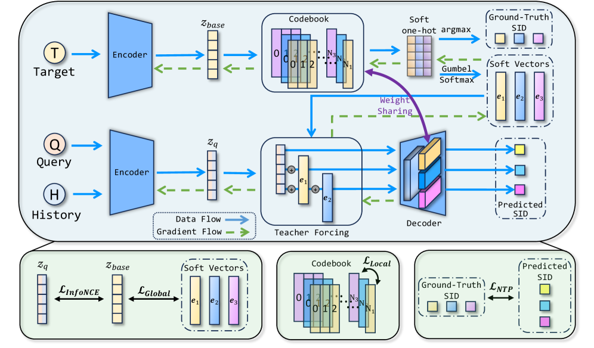
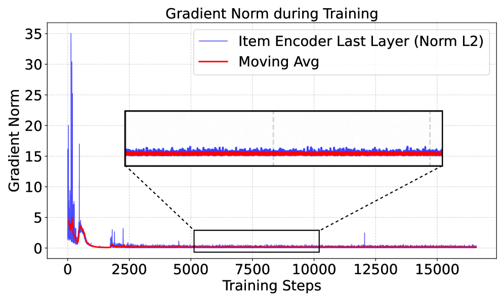
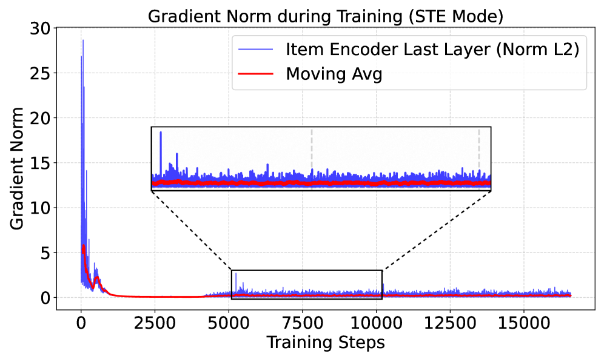
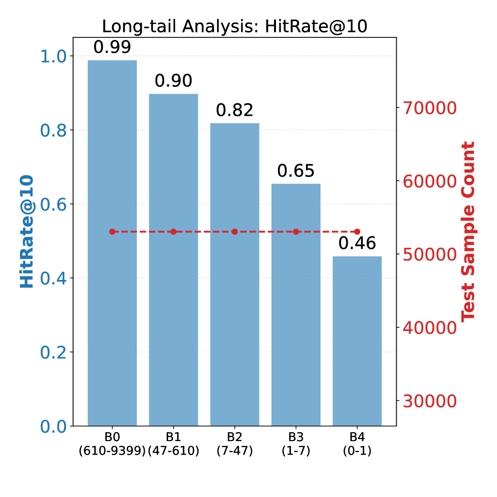
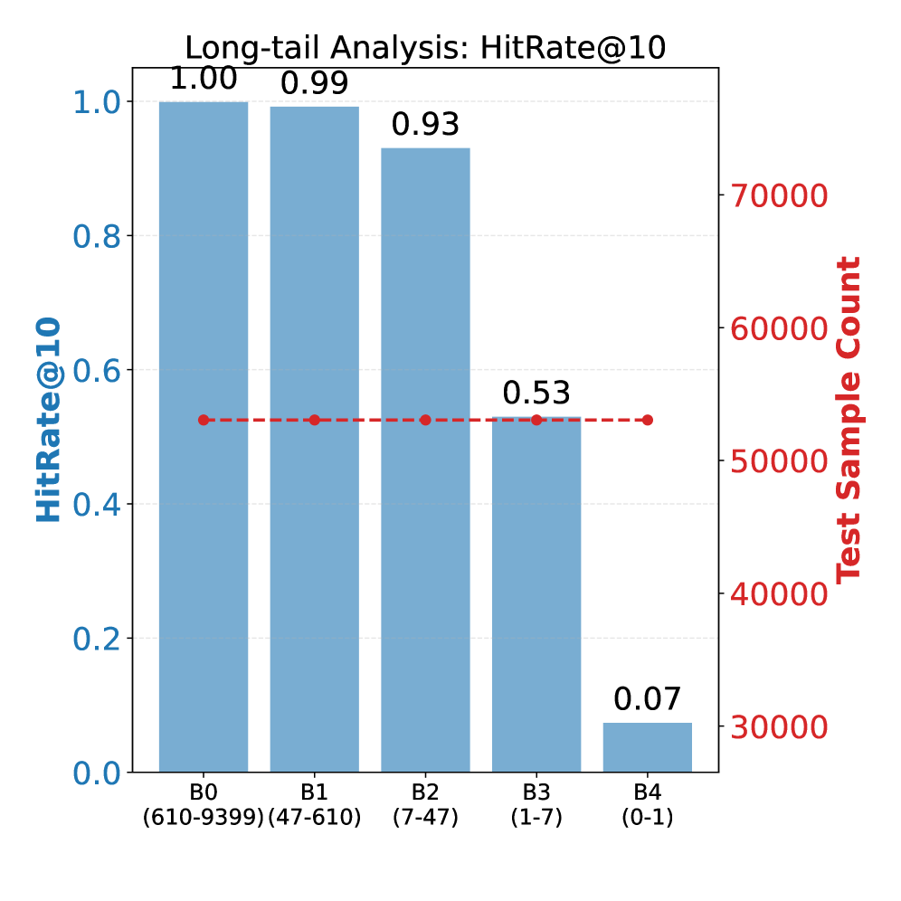
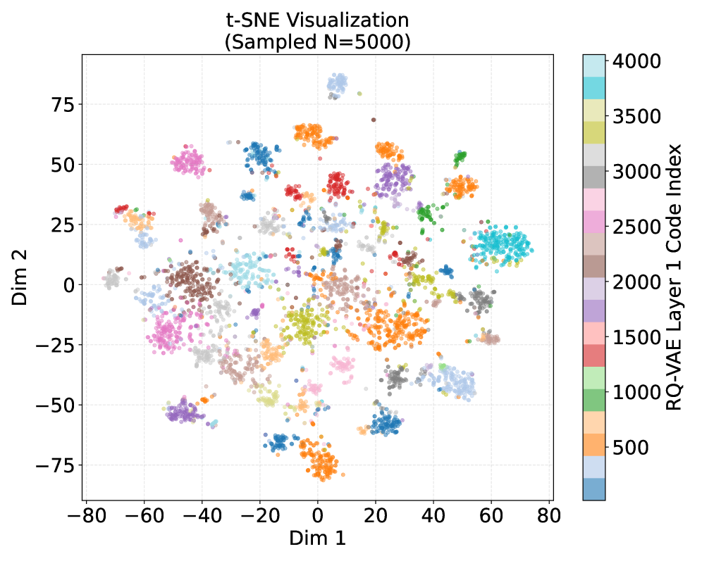
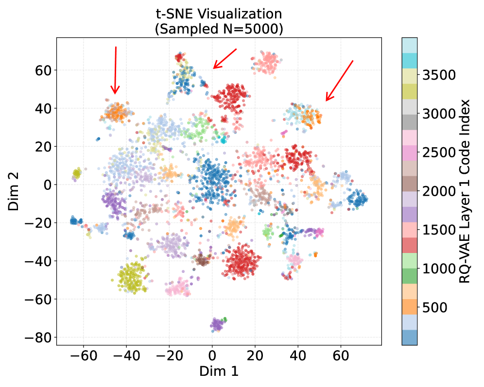
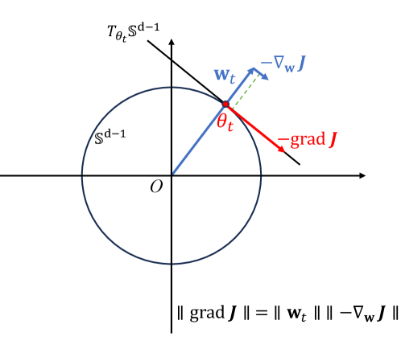

# Differentiable Geometric Indexing for End-to-End Generative Retrieval

> **arxiv**: https://arxiv.org/abs/2603.10409  
> **Authors**: Xujing Wang (Xidian University), Yufeng Chen (Alibaba), Boxuan Zhang (Alibaba), Jie Zhao (Xidian University), Chao Wei (Alibaba), Cai Xu (Alibaba / Xidian University), Ziyu Guan (Xidian University), Wei Zhao (Xidian University), Weiru Zhang (Alibaba), Xiaoyi Zeng (Alibaba)  
> **Venue**: ACM Conference (2026)

## Abstract

Generative Retrieval (GR) has emerged as a promising paradigm to unify indexing and search within a single probabilistic framework. However, existing approaches suffer from two intrinsic conflicts:

1. **Optimization Blockage**: The non-differentiable nature of discrete indexing creates a gradient blockage, decoupling index construction from the downstream retrieval objective.
2. **Geometric Conflict**: Standard unnormalized inner-product objectives induce norm-inflation instability, causing popular "hub" items to geometrically overshadow relevant long-tail items.

To systematically resolve these misalignments, we propose **Differentiable Geometric Indexing (DGI)** with two design pillars:
1. **Operational Unification**: Soft Teacher Forcing via Gumbel-Softmax + Symmetric Weight Sharing.
2. **Isotropic Geometric Optimization**: Scaled cosine similarity on the unit hypersphere.

Extensive experiments on large-scale industry search datasets and a **7-day online A/B test** yield **+1.27% CTR** and **+1.11% RPM** (p<0.001), validating its effectiveness in production environments.

> **Figure 1.** Illustration of the Structural Mismatch and Geometric Anisotropy in existing GR frameworks compared to our DGI.

## 1. Introduction

Large-scale industrial search systems serve as the information backbone of modern platforms. Traditional systems follow a multi-stage "retrieve-then-rank" architecture, suffering from **structural fragmentation**: the retrieval process relies on an external index (inverted lists or ANN graphs) for efficient lookup, creating a two-stage paradigm where the index is isolated from the model's gradient flow.

Recent advances in LLMs motivated **Generative Retrieval (GR)**, which casts retrieval as a unified sequence generation problem by predicting item IDs autoregressively:

$$P_\theta(i|q,H) = P_\theta(\mathbf{c}^{(i)}|q,H) = \prod_{j=1}^m P_\theta(c_j | q, H, \mathbf{c}_{<j}) \quad (1)$$

State-of-the-art methods like TIGER and OneSearch use **Learnable Semantic Identifiers (SIDs)** via residual quantization (RQ-VAE). However, current GR remains constrained by two fundamental issues:

**Optimization Blockage**: Prevailing works follow a two-stage paradigm — the indexer is independently trained, then frozen during retriever training. Discrete SIDs create a fundamental gradient blockage between optimizations of retriever and indexer. Joint-training attempts using Straight-Through Estimators (STE) yield biased gradients since STE directly copies gradients through the non-differentiable argmax.

**Geometric Conflict**: In real-world industrial retrieval with power-law distributions, standard cross-entropy optimization with unnormalized logits leads to norm-dominated ranking. Popular items acquire inflated norms that disproportionately influence similarity scores — a **"hubness" effect** where high-frequency items geometrically overshadow semantically relevant long-tail items.

**DGI resolves both via:**
1. **Operational Unification**: Fully differentiable training via Soft Teacher Forcing with Gumbel-Softmax + Symmetric Weight Sharing
2. **Isotropic Geometric Optimization**: Riemannian perspective replacing dot-product with Scaled Cosine objective on the unit hypersphere

## 2. Related Works

### 2.1. Retrieval Paradigms: From Static to Generative

**Traditional Retrieval**: Sparse (BM25, DocT5Query) and Dense (DSSM, DPR, Sentence-T5) methods both suffer from a separation constraint: the index structure is static and decoupled from the final retrieval objective.

**Generative Retrieval and Semantic Identifiers**: GR unifies the process as autoregressive generation. Two-Stage Optimization (TIGER, OneSearch) uses "Index-then-Freeze" strategy; Joint Optimization (UniSearch, ETEGRec) employs STE but yields biased gradients. In contrast, DGI uses Gumbel-Softmax relaxation for true end-to-end gradient flow.

### 2.2. Geometry in Representation Learning

In high-dimensional spaces with inner-product logits, models are prone to the **Hubness Problem** — frequent items acquire excessively large norms to minimize softmax loss. While spherical embeddings are standard in face recognition (ArcFace, CosFace) and contrastive learning, their application to discrete quantization in GR remains underexplored. DGI adopts a Riemannian perspective to enforce geometric isotropy.

## 3. Preliminaries

### 3.1. Generative Retrieval Task

Let $\mathcal{Q} = \{q_1, \ldots, q_M\}$ be queries and $\mathcal{I} = \{i_1, \ldots, i_N\}$ be the item corpus. Each item $i$ is represented as a sequence of discrete semantic tokens $\mathbf{c}^{(i)} = (c_1, c_2, \ldots, c_m)$ from a codebook $\mathcal{V}$. The retrieval probability is factorized autoregressively as in Eq. (1).

### 3.2. Optimization on Riemannian Manifolds

We model the embedding space as the **Unit Hypersphere** $\mathbb{S}^{d-1}$:

$$\mathbb{S}^{d-1} := \{\mathbf{x} \in \mathbb{R}^d : \|\mathbf{x}\|_2 = 1\} \quad (2)$$

**Tangent Space and Riemannian Gradient**: For any point $\mathbf{x} \in \mathbb{S}^{d-1}$:

$$T_\mathbf{x}\mathbb{S}^{d-1} := \{\mathbf{z} \in \mathbb{R}^d : \mathbf{x}^\top \mathbf{z} = 0\} \quad (3)$$

The Riemannian gradient $\operatorname{grad}f(\mathbf{x})$ is obtained by projecting the Euclidean gradient onto the tangent space:

$$\operatorname{grad}f(\mathbf{x}) := (\mathbf{I} - \mathbf{x}\mathbf{x}^\top) \nabla f(\mathbf{x}) \quad (4)$$

**Retraction** (projecting back onto $\mathbb{S}^{d-1}$ via normalization):

$$R_\mathbf{x}(\mathbf{v}) := \frac{\mathbf{x} + \mathbf{v}}{\|\mathbf{x} + \mathbf{v}\|_2} \quad (5)$$

## 4. Methodology

> **Figure 2.** Schematic Overview of the DGI Framework. (1) Operational Unification: Gumbel-Softmax generates soft quantized vectors fed into the decoder via Soft Teacher Forcing, enabling gradients (green dashed lines) to flow from $\mathcal{L}_{NTP}$ back to the item encoder. Symmetric Weight Sharing is enforced between quantization codebooks and the decoder's prediction head. (2) Geometric Optimization: Entire framework optimized under spherical constraints (Scaled Cosine) to mitigate hubness.

### 4.1. End-to-End Differentiable Architecture

#### 4.1.1. Operational Unification via Soft Gradient Flow

We replace the non-differentiable $\operatorname{argmax}$ with Gumbel-Softmax reparameterization. At each quantization depth $j$, the selection probability over codebook $\mathbf{E}_j \in \mathbb{R}^{K \times d}$ is:

$$p_{j,k} = \frac{\exp((s_{j,k} + g_{j,k}) / \tau_{GS})}{\sum_{l=1}^K \exp((s_{j,l} + g_{j,l}) / \tau_{GS})} \quad (6)$$

where $g_{j,k} \sim \operatorname{Gumbel}(0,1)$ and $\tau_{GS}$ is the temperature. The soft vector is computed as:

$$\tilde{\mathbf{z}}_j = \sum_{k=1}^K p_{j,k} \mathbf{e}_{j,k}, \quad \mathbf{r}_j = \mathbf{r}_{j-1} - \tilde{\mathbf{z}}_j \quad (7)$$

This enables **Soft Gradient Flow** — the gradient of $\mathcal{L}_{NTP}$ w.r.t. the item encoder output $\mathbf{z}_{base}$ is:

$$\frac{\partial \mathcal{L}_{NTP}}{\partial \mathbf{z}_{base}} = \sum_{j=1}^m \frac{\partial \mathcal{L}_{NTP}}{\partial \tilde{\mathbf{z}}_j} \cdot \mathbf{J}_{soft}^{(j)} \cdot \frac{\partial \mathbf{z}_{base}}{\partial \theta_{enc}} \quad (8)$$

where $\mathbf{J}_{soft}$ is the non-zero Jacobian of the Gumbel-Softmax operation.

#### 4.1.2. Representational Unification via Symmetric Weight Sharing

We discard the pre-trained `lm_head` and replace it with $M$ lightweight parallel classification heads (where $M = 3$ for RQ-VAE depth). The **Symmetric Weight Sharing** constraint is:

$$\mathbf{W}_{out}^{(m)} \equiv \mathbf{E}^{(m)}, \quad \text{where } \mathbf{E}^{(m)} \in \mathbb{R}^{K \times d} \quad (9)$$

The prediction logit for code $k$ in layer $m$ is a direct cosine similarity:

$$P(y_t^{(m)} = k | \mathbf{h}_t) = \text{Softmax}\left(\gamma \cdot \frac{\mathbf{h}_t \cdot (\mathbf{e}_k^{(m)})^\top}{\|\mathbf{h}_t\| \|\mathbf{e}_k^{(m)}\|}\right) \quad (10)$$

### 4.2. Isotropic Geometric Optimization

#### 4.2.1. The Hubness Problem

Standard dot product $s(q,i) = \mathbf{h}_q^\top \mathbf{e}_i$ decomposes as:

$$s(q,i) = \|\mathbf{h}_q\| \|\mathbf{e}_i\| \cos(\theta_{q,i}) \quad (11)$$

The gradient descent update on item embedding $\mathbf{e}_i$ for a positive pair $(q,i)$:

$$\mathbf{e}_i^{(t+1)} \leftarrow \mathbf{e}_i^{(t)} + \eta \cdot (1 - P(i|q)) \cdot \mathbf{z}_q \quad (12)$$

For high-frequency popular items, this positive update occurs significantly more often, causing $\|\mathbf{e}_i\|$ to grow with item frequency — creating **norm-dominated hubness**.

#### 4.2.2. Scaled Cosine Geometry

We enforce an isotropic distribution by constraining all representations to $\mathbb{S}^{d-1}$ and replacing dot product with **Scaled Cosine Similarity**:

$$P(c_l = k | \mathbf{z}_q, \mathbf{c}_{<l}) = \operatorname{Softmax}\left(\gamma \cdot \frac{\mathbf{h}_l}{\|\mathbf{h}_l\|_2} \cdot \frac{(\mathbf{e}_k^{(l)})^\top}{\|\mathbf{e}_k^{(l)}\|_2}\right) \quad (13)$$

where $\gamma$ is a learnable scaling parameter (initialized to 30.0). This ensures retrieval probability depends exclusively on semantic angle.

#### 4.2.3. Theoretical Insight: Riemannian Gradient Dynamics

Substituting our Scaled Cosine logit $s = \gamma \cos\theta$ (where $\cos\theta = \hat{\mathbf{h}}^\top \hat{\mathbf{e}}$), the Riemannian gradient update direction becomes:

$$\operatorname{grad}\mathcal{L}(\mathbf{e}) := (\mathbf{I} - \mathbf{e}\mathbf{e}^\top) \nabla\mathcal{L}(\mathbf{e}) \quad (14)$$

$$\operatorname{grad}\mathcal{L}(\mathbf{e}) \propto \frac{\gamma}{\|\mathbf{e}\|}(\hat{\mathbf{h}} - \cos\theta \cdot \hat{\mathbf{e}}) \quad (15)$$

The term $(\hat{\mathbf{h}} - \cos\theta \cdot \hat{\mathbf{e}})$ represents the component of query vector $\hat{\mathbf{h}}$ orthogonal to item embedding $\hat{\mathbf{e}}$. Unlike the dot product gradient $\nabla_{dot} \propto \hat{\mathbf{h}}$ which encourages norm inflation, our Riemannian update strictly removes the radial component — **mathematically guaranteeing** that gradient energy is dedicated solely to angular rotation.

### 4.3. Unified Training Objectives

#### 4.3.1. Generative and Reconstruction Tasks

Primary **NTP loss** (Next Token Prediction):

$$\mathcal{L}_{NTP} = -\frac{1}{|\mathcal{B}|} \sum_{(q,i) \in \mathcal{B}} \sum_{t=1}^m \log P(c_t^{(i)} | q, c_{<t}^{(i)}; \Theta) \quad (16)$$

**Global Reconstruction** using Cosine Distance (not MSE) to prevent norm-induced semantic drift:

$$\mathcal{L}_{Global} = \frac{1}{|\mathcal{B}|} \sum_{i \in \mathcal{B}} \left(1 - \frac{\mathbf{z}_{base}^{(i)} \cdot (\sum_{j=1}^m \tilde{\mathbf{z}}_j^{(i)})^\top}{\|\mathbf{z}_{base}^{(i)}\| \|\sum_{j=1}^m \tilde{\mathbf{z}}_j^{(i)}\|}\right) \quad (17)$$

**Local Codebook loss** to refine the quantization dictionary:

$$\mathcal{L}_{Local} = \frac{1}{|\mathcal{B}|} \sum_{i \in \mathcal{B}} \sum_{j=1}^m \left(\|\text{sg}[\mathbf{r}_{j-1}] - \mathbf{e}_{j,k}\|^2 + \beta \|\mathbf{r}_{j-1} - \text{sg}[\mathbf{e}_{j,k}]\|^2\right) \quad (18)$$

#### 4.3.2. Alignment Strategy

**InfoNCE** to maximize mutual information between query $\mathbf{z}_q$ and target item $\mathbf{z}_{base}$:

$$\mathcal{L}_{InfoNCE} = -\log \frac{\exp(\hat{\mathbf{z}}_q^\top \hat{\mathbf{z}}_{base}^{i^+}/\tau_{CL})}{\sum_{n \in \mathcal{B}} \exp(\hat{\mathbf{z}}_q^\top \hat{\mathbf{z}}_{base}^n / \tau_{CL})} \quad (19)$$

#### 4.3.3. Diversity Regularization

**Diversity loss** to prevent codebook collapse:

$$\mathcal{L}_{Div} = \sum_{j=1}^m \sum_{k=1}^K \bar{p}_{j,k} \log(\bar{p}_{j,k} + \epsilon) \quad (20)$$

**Total objective**: $\mathcal{L}_{Total} = \mathcal{L}_{NTP} + \mathcal{L}_{Global} + \mathcal{L}_{Local} + \mathcal{L}_{InfoNCE} + \mathcal{L}_{Div}$

## 5. Experiments

### 5.1. Experimental Setup

#### 5.1.1. Datasets

**Table 1.** Statistics of AOL4PS and AE-PV Datasets.

| Dataset | Domain | Train | Test | Items | Avg. Hist. |
|---------|--------|-------|------|-------|------------|
| AOL4PS | Web Search | 80% (time-based) | 20% | — | 10 clicked docs |
| AE-PV | E-commerce (Alibaba) | Day 1 | Day 2 | — | 10 clicked products |

- **AOL4PS** (Guo et al., 2021): Derived from AOL web query logs; 1.06M training samples. Input = current query + 10 clicked document titles history; global time-based split.
- **AE-PV**: Proprietary Alibaba e-commerce Page View logs; 12M training samples. High sparsity, strict semantic matching requirements.

#### 5.1.2. Baselines

**Sparse Retrieval**: BM25, DocT5Query  
**Dense Retrieval**: DSSM (T5 backbone), Sentence-T5  
**Generative Retrieval**: DSI, Two-Stage (TIGER-based), UniSearch

#### 5.1.3. Metrics

HitRate@K (H@K) and NDCG@K (N@K) for $K \in \{1, 5, 10, 20\}$.

#### 5.1.4. Implementation Details

- **Backbone**: T5-large
- **Indexing**: RQ-VAE with depth $m=3$, codebook sizes $\{4096, 1024, 256\}$, K-means initialization
- **Optimizer**: AdamW — $5 \times 10^{-5}$ (backbone), $5 \times 10^{-4}$ (quantizer)
- **Schedule**: Linear warmup 1000 steps → linear decay; global batch size 128
- **Hyperparameters**: $\gamma$ initialized to 30.0; $\tau$ annealed from 1.0 to 0.1
- **Inference**: Constrained Beam Search (beam 1–20) → Lexicographical Rule (beam score + geometric similarity)

### 5.2. Overall Performance (RQ1)

**Table 2.** Overall Performance Comparison (best in bold, second-best underlined).

DGI consistently outperforms all baselines across both datasets. Notably:
- **4.3× improvement** in H@10 on AE-PV vs. Two-Stage baseline
- **+8.3% NDCG@10** on AOL4PS vs. Sentence-T5 (strong dense retriever)
- **Decisively surpasses** joint-training method UniSearch

### 5.3. Ablation Studies (RQ2)

**Table 3.** Comprehensive Ablation Study.

| Model Variant | Soft Gradient | Weight Sharing | Scaled Cosine | AOL H@1 | AE-PV H@10 |
|---------------|---------------|----------------|---------------|---------|------------|
| DGI (Full) | ✓ | ✓ | ✓ | **0.5651** | **0.0915** |
| w/o Soft Gradient | ✗ | ✓ | ✓ | 0.5216 | 0.0524 |
| w/o Weight Sharing | ✓ | ✗ | ✓ | 0.5282 | 0.0573 |
| w/o Both (Decoupled) | ✗ | ✗ | ✓ | 0.5193 | 0.0426 |
| **w/o Scaled Cosine** | ✓ | ✓ | ✗ | **0.3768** | **0.0652** |
| w/o All | ✗ | ✗ | ✗ | 0.0531 | 0.0004 |

**Key finding**: Removing Scaled Cosine triggers a **precipitous 33.3% collapse** in H@1 (0.5651 → 0.3768), confirming that norm inflation severely distorts semantic ranking even within a differentiable architecture.

### 5.4. In-depth Mechanism Analysis (RQ3)

#### 5.4.1. Optimization Stability: Gradient Norm Analysis

 

> **Figure 3.** Analysis of Optimization Stability (Gradient Norms). (a) DGI exhibits smooth and consistent gradient flows. (b) The STE Baseline suffers from severe oscillation and high-variance spikes.

The STE baseline shows severe oscillation, confirming that the surrogate estimator introduces significant optimization noise. DGI exhibits smooth gradient flows throughout training.

#### 5.4.2. Geometric Isotropy: Long-tail Robustness

 

> **Figure 4.** Long-tail Robustness Analysis. Performance (HitRate) across item popularity deciles (B0: Head → B4: Tail). (a) DGI maintains a robust and uniform performance profile. (b) Two-Stage with Dot Product shows "rich-get-richer" collapse in tail buckets (B3-B4).

DGI maintains robust accuracy across all popularity buckets. The Two-Stage baseline suffers a steep collapse in tail buckets — classic "rich-get-richer" pattern from unconstrained norm inflation.

#### 5.4.3. Topological Visualization: t-SNE

 

> **Figure 5.** Topological Visualization (t-SNE). (a) DGI learns a highly isotropic distribution with well-separated clusters on the unit hypersphere. (b) Baseline exhibits Representation Collapse — embeddings crowd into a narrow, anisotropic cone.

### 5.5. Online Evaluation (RQ4)

**7-day online A/B test** on a leading global e-commerce platform (hundreds of millions of users), comparing against production hybrid system:

| Metric | Improvement | p-value |
|--------|-------------|---------|
| CTR | **+1.27%** | p < 0.001 |
| RPM | **+1.11%** | p < 0.001 |

As a supplementary recall channel, DGI yields statistically significant gains.

## 6. Conclusion

We identify two intrinsic bottlenecks in Generative Retrieval: **Optimization Gap** (non-differentiable indexing blocks gradient propagation) and **Geometric Conflict** (norm-dominated Hubness). DGI resolves these via Operational Unification and Isotropic Geometric Optimization. By establishing a fully differentiable pathway and enforcing spherical constraints, DGI transforms the index from a static artifact into a dynamic structure that co-evolves with retrieval intent.

## Appendix A: Theoretical Analysis

### A.1. Problem Formulation

We consider the continuous soft surrogate objective $J(\mathbf{w})$ defined by Gumbel-Softmax relaxation (with `hard=False`):

$$\min_{\mathbf{w} \in \mathbb{R}^d \setminus \{\mathbf{0}\}} J(\mathbf{w}) := \mathbb{E}_\xi [\mathcal{L}(\theta(\mathbf{w}); \xi)] \quad (21)$$

> **Figure 6.** Geometric interpretation of Weight Normalization. The Euclidean gradient $\nabla_\mathbf{w} J$ is orthogonal to the radial direction and strictly parallel to the Riemannian gradient $\operatorname{grad}J$ on the unit sphere $\mathbb{S}^{d-1}$, scaled by $1/\|\mathbf{w}\|_2$.

### A.2. Gradient Dynamics

The relationship between the Euclidean gradient $\nabla_\mathbf{w} J$ and the Riemannian gradient $\operatorname{grad}J$:

$$\nabla_\mathbf{w} J(\mathbf{w}) = \frac{1}{\|\mathbf{w}\|_2} (\mathbf{I} - \theta\theta^\top) \nabla_\theta J(\theta) = \frac{1}{\|\mathbf{w}\|_2} \operatorname{grad}_{\mathbb{S}^{d-1}} J(\theta) \quad (22)$$

Norm relationship:

$$\|\operatorname{grad}_{\mathbb{S}^{d-1}} J(\theta)\|_2 = \|\mathbf{w}\|_2 \cdot \|\nabla_\mathbf{w} J(\mathbf{w})\|_2 \quad (23)$$

### A.3. Convergence Analysis

**Theorem A.1**: Under assumptions A1-A4, with Robbins-Monro step sizes ($\sum\eta_t = \infty, \sum\eta_t^2 < \infty$), SGD on $\mathbf{w}$ guarantees:

$$\liminf_{t \to \infty} \|\operatorname{grad}_{\mathbb{S}^{d-1}} J(\theta_t)\| = 0 \quad \text{almost surely} \quad (25)$$

The proof proceeds via $L$-smoothness inequality (Eq. 26-29), showing that the squared gradient norm is summable (Eq. 29), hence $\liminf_{t\to\infty} \|\nabla_\mathbf{w} J(\mathbf{w}_t)\| = 0$ (Eq. 30), and finally bounding the Riemannian gradient norm (Eq. 31-32) to complete the convergence result.

## Appendix B: Baseline Adaptation for Session Context

All baselines are adapted to be context-aware by incorporating query and interaction history, ensuring fair comparison under the personalized retrieval setting.

## Appendix C: Inference Efficiency Analysis

DGI employs a Coarse-to-Fine inference strategy: (1) offline map quantized SIDs to inverted index and cache normalized item embeddings; (2) online identify candidate semantic clusters via Constrained Beam Search; (3) rank candidates using Lexicographical Rule (beam score + geometric similarity $\hat{\mathbf{z}}_q^\top \hat{\mathbf{z}}_{item}$).

## Appendix D: Limitations and Future Work

The current implementation is limited to text-based item representations. Future work includes extending DGI to multimodal items, exploring more sophisticated training curricula for the Gumbel-Softmax temperature annealing, and investigating its application to other structured prediction tasks beyond GR.

## References

- Bengio et al. (2013). Estimating or propagating gradients through stochastic neurons. arXiv:1308.3432.
- Bonnabel (2013). Stochastic gradient descent on Riemannian manifolds. IEEE Trans. Automatic Control.
- Chen et al. (2025a). OneSearch: unified end-to-end generative framework for e-commerce search. arXiv:2509.03236.
- Chen et al. (2025b). UniSearch: rethinking search with unified generative architecture. arXiv:2509.06887.
- Deng et al. (2019). ArcFace: additive angular margin loss for deep face recognition. CVPR.
- Guo et al. (2021). AOL4PS: a large-scale dataset for personalized search. Data Intelligence.
- Huang et al. (2013). Learning deep structured semantic models (DSSM). CIKM.
- Jang et al. (2016). Categorical reparameterization with Gumbel-Softmax. arXiv:1611.01144.
- Karpukhin et al. (2020). Dense passage retrieval for open-domain QA (DPR). EMNLP.
- Lee et al. (2022). Autoregressive image generation using residual quantization (RQ-VAE). CVPR.
- Liu et al. (2025a). Generative recommender with end-to-end learnable item tokenization (ETEGRec). SIGIR.
- Maddison et al. (2016). The concrete distribution. arXiv:1611.00712.
- Ni et al. (2022). Sentence-T5: scalable sentence encoders. ACL.
- Nogueira et al. (2019). DocT5Query. Online preprint.
- Radovanovic et al. (2010). Hubs in space: popular nearest neighbors in high-dimensional data. JMLR.
- Rajput et al. (2023). Recommender systems with generative retrieval (TIGER). NeurIPS.
- Robertson et al. (2009). The probabilistic relevance framework: BM25 and beyond. FTIR.
- Tang et al. (2023). Semantic-enhanced differentiable search index. KDD.
- Tay et al. (2022). Transformer memory as a differentiable search index (DSI). NeurIPS.
- Wang & Isola (2020). Understanding contrastive representation learning via alignment and uniformity. ICML.
- Wang et al. (2018). CosFace: large margin cosine loss for deep face recognition. CVPR.
- Wang et al. (2022). Neural corpus indexer for document retrieval (NCI). NeurIPS.
- Zheng et al. (2024). Full stage learning to rank. WWW.
- Zhu et al. (2025). Addressing representation collapse in vector quantized models. ICCV.
