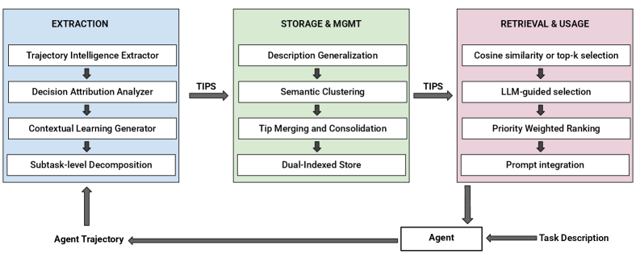

# Trajectory-Informed Memory Generation for Self-Improving Agent Systems

> **arxiv**: https://arxiv.org/abs/2603.10600  
> **Authors**: Gaodan Fang, Vatche Isahagian, K. R. Jayaram, Ritesh Kumar, Vinod Muthusamy, Punleuk Oum, Gegi Thomas (IBM Research)  
> **Venue**: IBM Technical Report 2026

## Abstract

LLM-powered agents face a persistent challenge: learning from execution experiences to improve future performance. Agents often repeat inefficient patterns, fail to recover from similar errors, and miss opportunities to apply successful strategies from past executions.

We present a novel framework for **automatically extracting actionable learnings from agent execution trajectories** and utilizing them through contextual memory retrieval. The framework comprises:
1. **Trajectory Intelligence Extractor**: semantic analysis of agent reasoning patterns
2. **Decision Attribution Analyzer**: identifies which decisions caused failures, recoveries, or inefficiencies
3. **Contextual Learning Generator**: produces 3 types of guidance (strategy tips, recovery tips, optimization tips)
4. **Adaptive Memory Retrieval System**: injects relevant learnings into agent prompts

**Results on AppWorld benchmark**: up to **+14.3 pp gains** in scenario goal completion (held-out tasks); **+28.5 pp SGC** on complex tasks (a 149% relative increase).

> **Figure 1.** Overview of our approach: three-phase pipeline from trajectory analysis → tip storage & management → runtime retrieval.

## 1. Introduction

*Agents have amnesia*: most LLMs are stateless. An agent that struggles with a particular API authentication flow today will struggle with the same flow tomorrow. An agent that discovers an efficient strategy cannot automatically apply it to similar future tasks.

**Example motivating scenarios:**
- Inefficient success: agent calls `amazon_remove_from_cart(item_id)` in a loop when `amazon_empty_cart()` exists
- Failure-then-recovery: checkout fails → agent recognizes missing payment method → adds payment info → retries
- Clean success: agent systematically verifies all prerequisites before checkout

Current approaches fall short:
- **Rule-based systems**: cannot adapt to unforeseen situations, require manual maintenance
- **Prompt engineering**: generic guidance, no automatic improvement from observed outcomes
- **Generic memory systems** (Mem0, Letta): store facts from conversations but lack execution pattern understanding, causal analysis, structured extraction, provenance tracking

**Our key insight**: Agent execution trajectories contain rich semantic information about *why* agents made decisions, *how* they reasoned, *which strategies succeeded*, and *where decision chains led to failures*.

## 2. Problem Statement

### 2.1. The Agent Learning Challenge

Valuable patterns exist across **diverse outcome categories**:
- Clean successes → strategy tips
- Inefficient successes → optimization tips
- Failure-then-recovery → recovery tips
- Complete failures → root cause analysis

**Five learning requirements**: (1) strategy extraction from successful patterns; (2) recovery extraction from failure handling; (3) optimization extraction from inefficient successes; (4) step-level decision attribution; (5) semantic reasoning analysis.

### 2.2. Learning Requirements

- **Strategy extraction**: Did the agent verify prerequisites before operations?
- **Recovery extraction**: What went wrong, how did the agent recognize the failure, how did it adjust?
- **Optimization extraction**: What more efficient alternative exists?
- **Step-level decision attribution**: Which specific reasoning steps led to the outcome?
- **Semantic reasoning analysis**: Classify reasoning modes (analytical, planning, validation, reflection, self-correction)

### 2.3. Limitations of Existing Approaches

Generic memory systems lack: understanding of execution patterns; causal analysis capability; structured learning extraction with categories; provenance tracking from learnings back to source trajectories.

## 3. Approach

Three-phase pipeline:

### 3.1. Phase 1: Trajectory Analysis and Tips Extraction

#### 3.1.1. Trajectory Intelligence Extractor

Transforms raw trajectories into structured intermediate representations capturing:
- **Thought categorization**: Analytical / Planning / Validation / Reflection thoughts
- **Cognitive pattern recognition**: Validation, reflection, self-correction, API discovery, efficiency awareness patterns
- **Outcome determination**: From ground-truth labels (when available) or inferred from self-reflective signals
- **Success analysis**: Clean success vs. inefficient success vs. recovery sequences

#### 3.1.2. Decision Attribution Analyzer

Causal analysis tracing backwards through reasoning steps:
- **Failure analysis**: immediate cause → proximate cause → root cause → contributing factors
- **Recovery analysis**: what enabled failure / how agent recognized it / corrective action
- **Inefficiency analysis**: what was suboptimal / what efficient alternative exists
- **Success analysis**: what strategies contributed to clean success

#### 3.1.3. Contextual Learning Generator

Three distinct tip types:

**Strategy Tip** (from clean success):
> "When performing checkout operations, systematically verify all prerequisites (cart, shipping, payment) before initiating the checkout sequence."
> Steps: 1. `get_cart_items()` → 2. `get_shipping_address()` → 3. `get_payment_methods()` → 4. Proceed if all satisfied.

**Recovery Tip** (from failure-then-recovery):
> "When checkout fails with 'payment method required' error, verify payment configuration and add payment method if missing before retrying."
> Negative Example: "Do not simply retry without addressing the missing payment method."

**Optimization Tip** (from inefficient success):
> "When emptying a shopping cart with multiple items, use `empty_cart()` instead of iterating `remove_from_cart(item_id)`."
> Negative Example: "Do not use `for i in items: remove_from_cart(i)` when emptying the entire cart."

System also generates both **domain-specific** and **generic** tips from the same trajectory.

#### 3.1.4. Task-Level vs. Subtask-Level Extraction

**Task-level**: treats entire trajectory as a unit. Simple but limited reusability.

**Subtask-level** (two-phase pipeline):
- **Phase A: Trajectory Segmentation** — LLM segments trajectory into logical subtasks (authentication, data retrieval, processing, task completion) with generalized descriptions
- **Phase B: Per-Subtask Tips Extraction** — 2–4 actionable tips per subtask

Example subtasks (common across diverse tasks):
- Authentication subtasks: retrieve credentials, login, store access token
- Data retrieval subtasks: paginated API calls, aggregate results
- Data processing subtasks: counting, filtering, aggregation
- Task completion subtasks: reporting results, marking tasks complete

Subtask-level tips enable **cross-task transfer** (authentication tips from Spotify help with Phone app tasks).

### 3.2. Phase 2: Tip Storage and Management

Three-step pipeline to address redundancy and inconsistency:

#### 3.2.1. Subtask Description Generalization
Three transformations: **Entity abstraction** → **Action normalization** → **Context removal**. E.g., "Retrieve Spotify password for john.doe@email.com" → "Retrieve service account credentials."

#### 3.2.2. Semantic Clustering
Hierarchical agglomerative clustering with cosine similarity threshold (~0.85). Groups semantically equivalent subtask descriptions.

#### 3.2.3. Tip Consolidation and Merging
LLM-based consolidation: deduplication → conflict resolution (tips from successful trajectories take precedence) → synthesis of complementary tips.

#### 3.2.4. Storage Representation
Each entry stored with:
- **Vector embedding**: dense vector from tip content + purpose for semantic search
- **Structured metadata**: tip category, priority level, application context, task category, source trajectory IDs, timestamp

### 3.3. Phase 3: Runtime Retrieval

Two strategies:

#### 3.3.1. Cosine Similarity Retrieval
Embed task description → cosine similarity against stored descriptions → threshold τ filter + top-k selection. Typical: τ∈[0.5, 0.7], k∈[5,10]. No LLM call at retrieval time.

#### 3.3.2. LLM-Guided Selection
LLM analyzes task description → detects application context and task category → constructs structured retrieval query with metadata filters + category awareness. More expressive but requires additional LLM call.

#### 3.3.3. Prompt Integration
Retrieved tips injected as a "guidelines" section in the agent's prompt, formatted with priority level, category, actionable content, steps, and trigger condition.

## 4. Evaluation

### 4.1. Experimental Setup

**Benchmark**: AppWorld — realistic task completion across diverse application domains (e-commerce, email, calendar, file management).

**Evaluation metrics:**
- **Task Goal Completion (TGC)**: % of individual tasks passing all programmatic unit tests
- **Scenario Goal Completion (SGC)**: % of scenarios where *all task variants* pass (stricter metric)

**Task difficulty levels:**
- Difficulty 1 (Easy): simple, single-domain tasks
- Difficulty 2 (Medium): multi-domain, conditional logic
- Difficulty 3 (Hard): complex multi-step, 50+ lines code, up to 26 APIs

**Agent**: GPT-4.1, simplified ReAct-style loop, max 30 steps. Both tip extraction and agent use GPT-4.1.

### 4.2. Held-Out Results (Test-Normal)

#### 4.2.1. Subtask-Level Tips with LLM-Guided Selection (Best Config)

**Table 1 & 2.** Subtask Tips + LLM Selection vs. Baseline (Test-Normal).

| Metric | Baseline | Memory-Enhanced | Improvement |
|--------|----------|-----------------|-------------|
| TGC (all) | 69.6% | **73.2%** | **+3.6 pp** |
| SGC (all) | 50.0% | **64.3%** | **+14.3 pp** |
| D3 TGC | ~50% | ~55% | ~+5 pp |
| D3 SGC | 19.1% | **47.6%** | **+28.5 pp (+149%)** |

The **SGC improvement scales with task complexity** — Difficulty 3 shows the most dramatic gains because complex tasks require sophisticated planning and robust error recovery.

#### 4.2.2. Task-Level Tips with Cosine Similarity Retrieval

**Tables 3-5.** Task-Level Tips + Cosine Similarity (various configurations).

| Config | TGC | SGC vs. Baseline |
|--------|-----|------------------|
| τ≥0.5, top-3 | 66.7% (-2.9 pp) | **BELOW baseline** |
| **τ≥0.6 (no top-k)** | **72.0% (+2.4 pp)** | **+12.5 pp** |
| τ≥0.5 (no top-k) | 70.2% (+0.6 pp) | +7.1 pp |

Key findings:
- **Top-k restriction hurts**: restricting to top-3 falls below baseline
- **τ=0.6 is the sweet spot**: tight enough to exclude unrelated tasks, loose enough to capture semantically equivalent phrasing
- **Difficulty 3 SGC**: 19.1% → 38.1% with τ≥0.6 (+19.0 pp, 99% relative increase)

#### 4.2.3. Subtask-Level Tips with Cosine Similarity Retrieval

**Table 6.** Subtask Tips + Cosine (τ≥0.6) achieves 63.2% SGC (+13.2 pp).

#### 4.2.4. Configuration Comparison

**Table 7.** Summary across configurations.

Subtask-level tips + LLM-guided selection achieves best SGC overall. The two approaches are complementary — subtask-level tips enable better cross-task generalization; LLM-guided selection provides richer context understanding.

### 4.3. Source Partition Results (Train and Dev)

**Tables 8-11.** Train and Dev partition results.

The memory-enhanced agent achieves stronger improvements on partitions from which tips were generated, confirming that stored learnings are most valuable when directly relevant historical trajectories exist. Importantly, **generalization to held-out tasks is also strong**, confirming that subtask-level tips transfer across different task descriptions.

### 4.4. Cross-Configuration Summary

**Table 12.** Summary of Aggregate Improvements: Subtask Tips + LLM Selection.

## 5. Related Work

### 5.1. Memory Taxonomies and Architectures
Episodic memory (storing past experiences), semantic memory (factual knowledge), procedural memory (learned skills).

### 5.2. Semantic Memory Systems
Mem0 (Chhikara et al., 2025), Letta (Packer et al., 2023). Store facts but lack execution pattern understanding.

### 5.3. Learning from Execution Trajectories
Recent work: workflows from successful executions (Wang et al., 2024), procedural instructions (Fang et al., 2025), reasoning strategies (Ouyang et al., 2025). Typically learn only from successes and lack causal attribution.

### 5.4. Empirical Foundations
Xiong et al. (2025) demonstrate that agents closely follow retrieved experiences — mismatched retrieval directly degrades performance. Naive experience accumulation leads to error propagation and misaligned replay.

## 6. Conclusions

We presented a trajectory-informed memory generation framework that automatically extracts actionable learnings from agent execution histories and uses them to improve future performance. Key contributions:

1. **Semantic trajectory analysis** beyond raw logging
2. **Automated decision attribution** distinguishing immediate, proximate, and root causes
3. **Three-category learning generation** (strategy, recovery, optimization tips)
4. **Adaptive memory retrieval** combining semantic similarity with metadata filtering

On AppWorld, memory-enhanced agents achieve up to **+14.3 pp SGC** on held-out tasks (+28.5 pp on complex tasks). The self-reinforcing cycle — better memory → better trajectories → better memory — provides a path toward genuinely self-improving agents.

## References

- Chhikara et al. (2025). Mem0: Memory for AI agents.
- DeChant (2025). Provenance tracking in AI systems.
- Du et al. (2025). Learning from agent trajectories.
- Fang et al. (2025). Procedural instructions from execution.
- Feng et al. (2025). Workflow extraction from agent experience.
- Ouyang et al. (2025). Reasoning strategy learning.
- Packer et al. (2023). Letta: memory for LLM agents.
- Pink et al. (2025). Execution trajectory patterns.
- Wang et al. (2024). Learning workflows from successful executions.
- Xiong et al. (2025). Empirical foundations of agent memory.
- Xu et al. (2025). Agent memory systems.
- Zhang et al. (2025a). Evolving context playbooks.
- Zhang et al. (2025b). Agent learning from experience.
