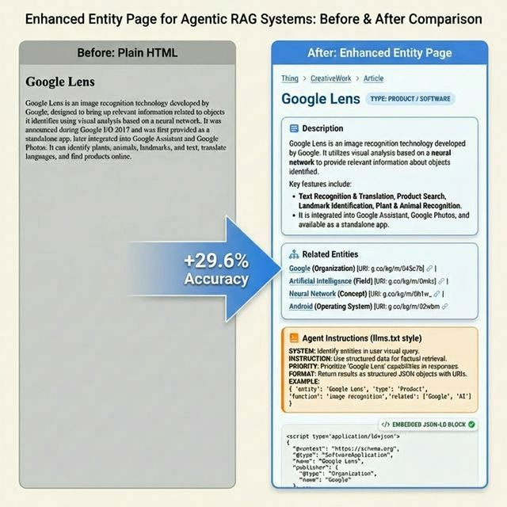
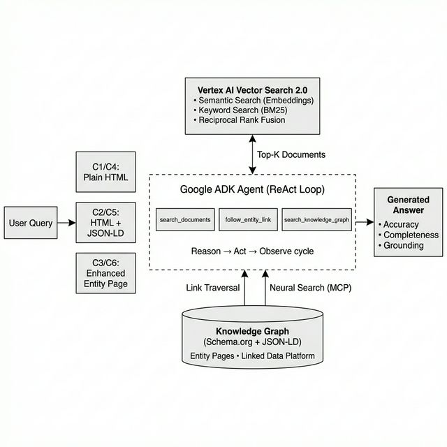
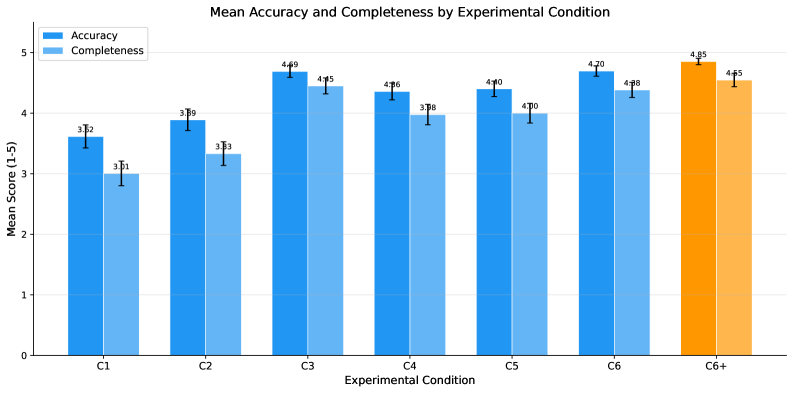
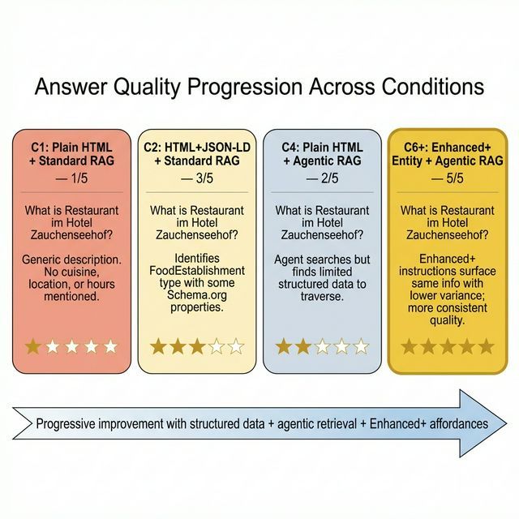
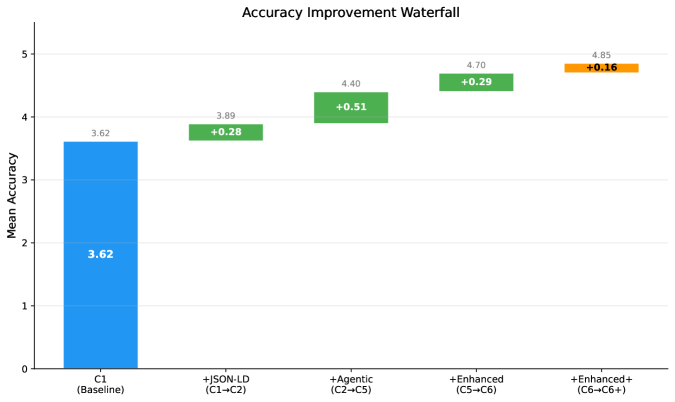
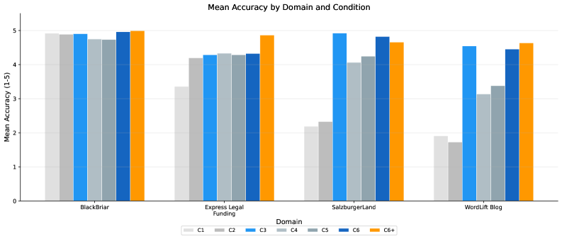
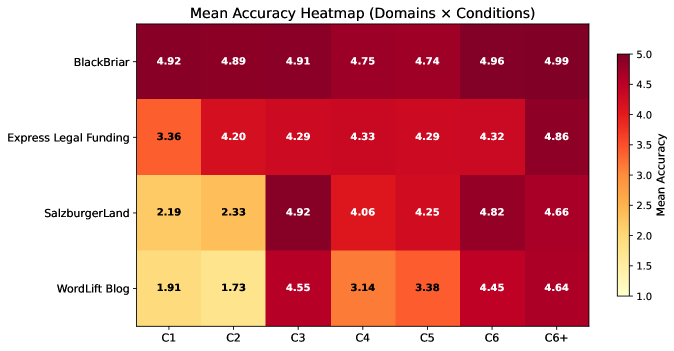

# Structured Linked Data as a Memory Layer for Agent-Orchestrated Retrieval

> **arxiv**: https://arxiv.org/abs/2603.10700  
> **Authors**: Andrea Volpini, Elie Raad, Beatrice Gamba, David Riccitelli (WordLift, Rome, Italy)  
> **Venue**: Preprint 2026

## Abstract

RAG systems typically treat documents as flat text, ignoring structured metadata and linked relationships that knowledge graphs provide. We investigate whether structured linked data — specifically **Schema.org markup** and **dereferenceable entity pages** served by a Linked Data Platform — can improve retrieval accuracy and answer quality in both standard and agentic RAG systems.

We conduct a controlled experiment across **4 domains** (editorial, legal, travel, e-commerce) using Vertex AI Vector Search 2.0 and Google ADK. Our **3×2 factorial experiment** tests 7 conditions: 3 document formats × 2 retrieval modes + Enhanced+ variant. Results: 2,439 valid evaluations.

**Key findings:**
- JSON-LD alone: only marginal improvement (Δ=+0.17, d=0.18)
- Enhanced entity pages: **+29.6% accuracy** in standard RAG (p<10⁻²¹, d=0.60)
- Full agentic pipeline: **+29.8%** (p<10⁻²¹, d=0.61)
- Enhanced+ achieves highest absolute scores (accuracy: 4.85/5, completeness: 4.55/5)

## 1. Introduction

The rise of Generative AI has changed how users access information. RAG has emerged as the dominant architecture for grounding LLM outputs, but most RAG implementations treat documents as unstructured text, discarding rich structured metadata.

**Core question**: Can structured linked data improve RAG performance, and does agentic link traversal unlock further gains?

**Contributions:**
- Controlled framework comparing 7 conditions across 4 industry verticals (2,443 individual query evaluations)
- Enhanced entity page format: llms.txt-style instructions + neural search capabilities + breadcrumbs
- Empirical evidence: enhanced entity pages yield **+29.6%/+29.8% accuracy** in standard/agentic RAG
- Dataset and evaluation harness released for reproducibility

## 2. Related Work

### 2.1. Generative Engine Optimization

Aggarwal et al. introduced GEO, demonstrating content optimization can boost visibility in generative search engines by up to 40%. Our work extends GEO from visibility optimization to **retrieval accuracy**, using structured data as the optimization lever.

### 2.2. Retrieval-Augmented Generation

RAG formalized by Lewis et al. (2020). Self-RAG introduced self-reflection mechanisms for adaptive retrieval. Trivedi et al. demonstrated interleaving retrieval with chain-of-thought reasoning significantly improves multi-step question answering.

### 2.3. Knowledge Graphs and Structured Data on the Web

Schema.org launched in 2011; over 40% of web pages include it. LightRAG builds a graph index from document-extracted entities and relations. HippoRAG models retrieval after hippocampal memory indexing. Both construct purpose-built graphs at indexing time — unlike our approach that leverages **existing structured data** already published on the web via Linked Data Platforms.

### 2.4. Agentic AI and Tool-Augmented LLMs

ReAct (Yao et al.) interleaves reasoning traces with action steps. Google ADK provides a production framework for multi-tool agents. MCP provides standardized interface for LLM–tool integration.

## 3. Methodology

### 3.1. System Architecture and AI Mode Parallel

Our system mirrors AI-powered search engines (e.g., Google AI Mode):

- **Vertex AI Vector Search 2.0**: Dense semantic search (text-embedding-005) + sparse keyword matching in hybrid query
- **Google ADK**: ReAct-style loop with tool-use capabilities
- **WordLift Knowledge Graph**: Independent Linked Data Platform with Schema.org-typed entities, dereferenceable URIs supporting content negotiation (application/ld+json, text/turtle, text/html)

The structured linked data functions as an **external memory layer**: the agent follows typed relationships (schema:about, schema:author, schema:relatedLink) to discover information invisible to embedding-based retrieval alone.

### 3.2. Research Design

3×2 factorial experiment: 3 document representations × 2 retrieval modes = 6 core conditions + Enhanced+ variant:

**Table 1.** Experimental conditions.

| Condition | Document Format | Retrieval Mode |
|-----------|-----------------|----------------|
| C1 | Plain HTML (Baseline) | Standard RAG |
| C2 | HTML + JSON-LD | Standard RAG |
| C3 | Enhanced Entity Page | Standard RAG |
| C4 | Plain HTML | Agentic RAG |
| C5 | HTML + JSON-LD | Agentic RAG |
| C6 | Enhanced Entity Page | Agentic RAG |
| C6+ | Enhanced+ Entity Page | Agentic RAG |

**Hypotheses:**
- H1: JSON-LD improves RAG accuracy (C2 vs. C1)
- H2: Agentic RAG outperforms standard RAG (C5 vs. C2)
- H3: Enhanced entity pages yield highest performance (C6 vs. all)
- H4: Enhanced+ further improves over base enhanced (C6+ vs. C6)

### 3.3. Document Representations

**Plain HTML (Baseline)**: Raw webpage content with all `<script type="application/ld+json">` blocks removed.

**HTML + JSON-LD**: Original webpage with embedded Schema.org JSON-LD.

**Enhanced Entity Page** (novel format for agentic discoverability):
- Natural language summary generated from structured data
- Embedded JSON-LD block with full Schema.org typing
- Visible linked entity navigation with dereferenceable URIs
- **llms.txt-style agent instructions** for explicit LLM guidance
- Neural search SKILL reference for cross-entity discovery
- Schema.org type breadcrumbs for hierarchical context

> **Figure 1.** Before and after: plain HTML (left) vs. enhanced entity page (right). The enhanced format adds structured breadcrumbs, related entity links with dereferenceable URIs, agent instructions in llms.txt style, and an embedded JSON-LD block — yielding +29.6% accuracy improvement in standard RAG and +29.8% in the agentic pipeline.

> **Figure 2.** System architecture. User queries processed by a Google ADK agent orchestrating three tools: vector search over Vertex AI, entity link traversal, and neural search via MCP. Documents indexed in three formats (C1–C6) and the agent generates grounded answers using a ReAct-style reasoning loop.

### 3.4. Retrieval Modes

**Standard RAG**: Documents indexed in Vertex AI Vector Search 2.0 using gemini-embedding-001 with hybrid search. Top-K (K=10) documents retrieved and passed to Gemini 2.5 Flash for answer generation.

**Agentic RAG**: Google ADK ReAct-style loop with 3 tools:
1. `search_documents`: Vector search over Vertex AI collection
2. `follow_entity_link`: Dereferences linked entity URI via HTTP content negotiation (JSON-LD)
3. `search_knowledge_graph`: Neural search across knowledge graph via domain-specific API

Agent follows links up to 2 hops deep; average 2.0 tool calls per query.

### 3.5. Dataset

4 industry verticals, 158 entities total, 349 test queries:
- **WordLift Blog** (editorial): 16 entities, 22 queries
- **Express Legal Funding** (legal): 32 entities, 111 queries
- **SalzburgerLand** (travel): 54 entities, 79 queries
- **BlackBriar** (e-commerce): 56 entities, 137 queries

Test queries generated using template-based generation for 3 query types: factual, relational, comparative. Ground truths derived from KG structured data.

### 3.6. Evaluation Metrics

LLM judge (Gemini 3.0 Flash) evaluates 3 metrics:
- **Accuracy** (1–5): Factual correctness
- **Completeness** (1–5): Coverage of all query aspects
- **Grounding** (binary): Faithfulness to retrieved documents (standard RAG only)

Statistical significance: paired t-tests with Bonferroni correction (α=0.05, 12 comparisons), effect sizes as Cohen's d.

## 4. Results

349 queries × 7 conditions = 2,443 evaluations → 2,439 valid.

> **Figure 3.** Mean accuracy and completeness scores by experimental condition. Enhanced entity pages (C3, C6, C6+) dramatically outperform plain HTML and JSON-LD conditions. C6+ achieves the highest scores.

**Table 2.** Main results across experimental conditions.

| Condition | Accuracy (mean±std) | Completeness (mean±std) |
|-----------|---------------------|-------------------------|
| C1 (Plain HTML, Standard) | 3.62 | 3.01 |
| C2 (JSON-LD, Standard) | 3.89 | 3.33 |
| C3 (Enhanced, Standard) | **4.69** | **4.45** |
| C4 (Plain HTML, Agentic) | 4.36 | — |
| C5 (JSON-LD, Agentic) | 4.40 | 4.00 |
| C6 (Enhanced, Agentic) | 4.70 | 4.38 |
| C6+ (Enhanced+, Agentic) | **4.85** | **4.55** |

### 4.1. Qualitative Comparison

**Table 3.** Qualitative comparison across conditions.

| Condition | Answer Summary | Accuracy |
|-----------|----------------|----------|
| C1 | Generic description without specifics | 1 |
| C2 | Identifies Schema.org properties | 3 |
| C4 | Agent finds limited structured data | 2 |
| C6 | Agent follows links to related entities; retrieves cuisine, address, coordinates | 5 |
| C6+ | Same quality with lower variance | 5 |

> **Figure 4.** Answer quality progression across conditions for the same factual query. C1 produces a generic answer (1/5); C6 and C6+ retrieve comprehensive structured data (5/5).

### 4.2. H1: JSON-LD Alone Does Not Significantly Help

- Accuracy: C2 (3.89) vs. C1 (3.62), Δ=+0.17, t=−3.12, p_adj=0.024, **d=0.18 (small)**
- Completeness: not significant after Bonferroni correction (p_adj=0.055)

While statistically significant for accuracy, the **tiny effect size (d=0.18)** confirms JSON-LD provides only marginal signal in flat-text RAG systems. Note: 88% of JSON-LD documents exceed the ~20k character truncation limit of Vertex AI; the JSON-LD block starts at median character 18,510.

### 4.3. H2: Agentic RAG Amplifies Structured Data Gains

C5 vs. C2 on HTML+JSON-LD:
- Accuracy: 4.40 vs. 3.89, **Δ=+0.50** (p_adj=4.0×10⁻⁶, d=0.30)
- Completeness: 4.00 vs. 3.33, **Δ=+0.74** (p_adj=9.1×10⁻¹⁰, d=0.38)

Agentic RAG improves accuracy by **+13.1%** and completeness by **+20.1%**.

### 4.4. H3: Enhanced Entity Pages Yield the Strongest Gains

**Standard RAG (C3 vs. C1):**
- Accuracy: 4.69 vs. 3.62, Δ=**+1.04**, p=2.7×10⁻²¹, d=0.60 (medium)
- Completeness: 4.45 vs. 3.01, Δ=**+1.42**, p=5.0×10⁻³⁰, d=0.74 (medium-large)

**Full pipeline (C6 vs. C1):**
- Accuracy: 4.70 vs. 3.62, Δ=**+1.04**, p=1.0×10⁻²¹, **d=0.61** (medium)

**Enhanced+ (C6+ vs. C1):**
- Accuracy: 4.85 vs. 3.62, Δ=**+1.10**, p=2.3×10⁻²⁴, d=0.65 (medium)

**The agent's role is complementary, not primary**: C3 (enhanced, standard RAG: 4.69) ≈ C6 (enhanced, agentic: 4.70). When document format is optimized, the agent adds negligible accuracy lift.

> **Figure 5.** Accuracy improvement waterfall. Largest gains come from link materialization in enhanced pages, not from adding structured data alone.

**Table 4.** Paired t-tests with Bonferroni correction (α=0.05, n_tests=12).

### 4.5. Analysis by Query Type

**Table 5.** Mean accuracy by condition and query type.

- **Factual queries** benefit most: C3 (4.57) vs. C1 (2.74), **+66.8% improvement**
- **Relational queries**: consistently high (C1: 4.48, C6+: 4.85); LLM's pre-trained knowledge handles this well
- **Comparative queries**: universally high (C1: 4.77, C6+: 4.95); near-perfect across all conditions

### 4.6. Analysis by Domain

**Table 6.** Mean accuracy by condition and domain.

> **Figure 6.** Mean accuracy by domain. Effect consistent across all 4 verticals; magnitude varies — largest where knowledge graph provides info beyond plain HTML (travel, editorial), near-zero where baseline is already fact-rich (e-commerce).

- **BlackBriar (e-commerce, n=137)**: Near-perfect baseline across all conditions (C1: 4.92, C6+: 4.99, Δ=+0.07). E-commerce already renders key properties in HTML.
- **SalzburgerLand (travel, n=79)**: Most dramatic improvement: C6+ vs. C1, **Δ=+2.47**. Travel entities store key properties (geo-coordinates, cuisine types, opening hours) primarily in the knowledge graph.
- **WordLift Blog (editorial, n=22)**: C6+ (4.64) vs. C1 (1.91), **Δ=+2.73**. Editorial content relies on entity relationships encoded in the KG but absent from article HTML.
- **Express Legal Funding (legal, n=111)**: C6+ (4.86) vs. C1 (3.36), **Δ=+1.50**.

### 4.7. Agentic Metrics

**Table 7.** Agentic-specific metrics.

> **Figure 7.** Heatmap of mean accuracy scores across domains and conditions. Enhanced entity pages (C3, C6) consistently outperform other conditions.

Key finding: Enhanced+ pages expose **2.4× more discoverable links** (102.2 vs. 41.9 for JSON-LD) yet agents follow **fewer** links in C6+ (0.4 vs. 1.0 in C4). Enhanced pages provide such rich context that agents need fewer exploration steps.

## 5. Discussion

### 5.1. Two Worlds of AI Search: Parsed vs. Flat Ingestion

Today's AI search systems fall into two categories:
- **Dedicated structured data pipelines** (Google, Bing): Extract JSON-LD as separate signal, validate and index in dedicated knowledge graph layer
- **Flat-text RAG pipelines** (LangChain, LlamaIndex, etc.): Ingest web pages as single text chunk. JSON-LD is just more text competing for limited embedding budget

**Our enhanced entity page bridges this gap** — makes structured knowledge visible and actionable regardless of how the search system ingests content.

### 5.2. From SEO to SEO 3.0: The Reasoning Web

Three eras of search optimization:
- **SEO 1.0** (1998–2011): Keyword matching + link-based authority
- **SEO 2.0** (2011–2024): Schema.org structured data for rich snippets
- **SEO 3.0** (2024–present): AI search synthesizes and reasons over retrieved information

**The AI visibility spectrum** (three progressive levels):
1. **Citations**: Is your content retrieved and attributed?
2. **Reasoning**: Can the AI reason correctly over your content? (+29.5% with enhanced pages)
3. **Actions**: Can the AI agent act on your content? (C6 enables traversal across KG boundaries)

### 5.3. Implications for Web Publishers and GEO

1. JSON-LD is necessary but not sufficient for RAG-based systems
2. Enhanced entity pages bridge both worlds (human + machine readable)
3. Dereferenceable URIs enable agent traversal

### 5.4. Implications for RAG System Design

1. **Link materialization** is the core value: enhanced page resolves URIs and renders connected entity data as natural language
2. **Navigational affordances** complement agentic capability
3. Enhanced pages enable **efficient retrieval**: agents make fewer tool calls yet achieve higher accuracy
4. **Recommendation**: RAG systems should extract and separately index structured data blocks

### 5.5. Limitations

- Information content vs. presentation format are bundled (can't isolate)
- Flat-text ingestion architecture (Vertex AI) truncates JSON-LD at ~20k chars
- Single retrieval system; LLM judge/pipeline bias (all Gemini-family)
- KG-derived ground truth creates potential circularity
- Scale: 349 queries across 4 domains

### 5.6. Ethical Considerations

Structured data consumed by AI agents = same data visible to human users. JSON-LD embedded = page content expressed in machine-readable form. This coupling creates stronger faithfulness guarantees than decoupled architectures.

### 5.7. Future Work

1. Structured-data-aware retrieval (dual-field: body text + structured data)
2. Entity-centric chunking to preserve structured data blocks
3. Cross-system replication with knowledge-graph-augmented retrievers
4. Production-scale validation on live websites
5. RLM-on-KG: iterative graph exploration replacing flat-context window

### 5.8. Practical Recommendations

1. Go beyond JSON-LD → invest in enhanced entity pages
2. Use dereferenceable URIs with content negotiation
3. Adopt the enhanced entity page pattern (breadcrumbs, llms.txt, navigable links)
4. Test with agentic workloads

## 6. Conclusion

Across 2,439 evaluations in 4 industry domains:

1. Schema.org JSON-LD: marginal gains (Δ=+0.17, d=0.18) in flat-text RAG
2. Enhanced entity pages: **+29.6% accuracy** in standard RAG (d=0.60)
3. Full agentic pipeline: **+29.8%** (d=0.61)
4. Enhanced+ achieves highest absolute scores (4.85/5 accuracy, 4.55/5 completeness)
5. Agentic RAG: +13.1% accuracy, +20.1% completeness over standard RAG
6. Effects generalize in direction across editorial, legal, travel, e-commerce

As generative AI increasingly mediates information access, structured linked data becomes not just an SEO signal, but a **fundamental enabler of accurate, complete, and well-grounded AI responses**.

## Appendix 0.A: Full Prompts and Templates

### 0.A.1. Standard RAG Generation Prompt
### 0.A.2. Agentic RAG System Instruction
### 0.A.3. LLM Judge Prompts
- Accuracy (1–5)
- Completeness (1–5)
- Grounding (binary)
### 0.A.4. Enhanced Entity Page Template
### 0.A.5. Enhanced+ Entity Page Template (C6+)

## References

- Aggarwal et al. (2024). GEO: generative engine optimization. ECIR. arXiv:2311.09735.
- Asai et al. (2024). Self-RAG. arXiv:2310.11511.
- Berners-Lee et al. (2001). The semantic web. Scientific American.
- Bizer et al. (2009). Linked data. IJSWIS.
- Guo et al. (2024). LightRAG. arXiv:2410.05779.
- Gutierrez et al. (2024). HippoRAG. NeurIPS.
- Guha et al. (2016). Schema.org. CACM.
- Lewis et al. (2020). RAG for knowledge-intensive NLP. NeurIPS.
- Pan et al. (2024). Unifying LLMs and knowledge graphs. IEEE TKDE.
- Peng et al. (2024). Graph RAG. arXiv.
- Trivedi et al. (2022). Interleaving retrieval with chain-of-thought. ACL.
- Yao et al. (2022). ReAct. arXiv.
