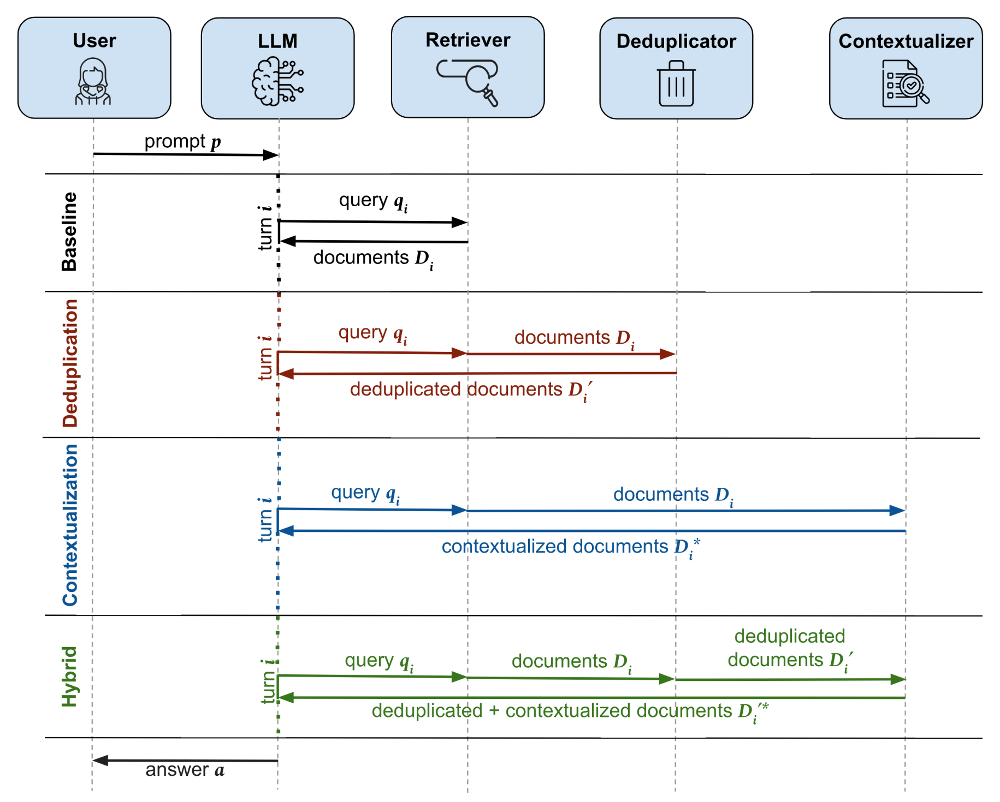
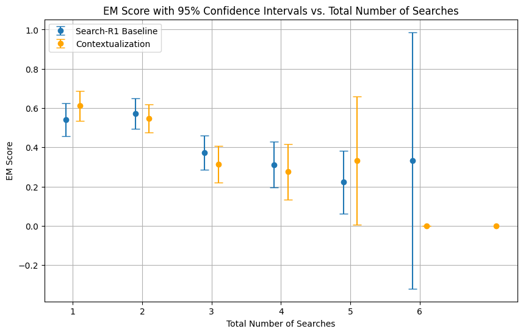

# Agentic RAG Test-Time: Test-Time Strategies for More Efficient and Accurate Agentic RAG

## 基本信息

| 字段 | 内容 |
|------|------|
| **ArXiv ID** | 2603.12396 |
| **标题** | Test-Time Strategies for More Efficient and Accurate Agentic RAG |
| **作者** | Brian Zhang, Deepti Guntur, Zhiyang Zuo, Abhinav Sharma, Shreyas Chaudhari, Wenlong Zhao, Franck Dernoncourt, Puneet Mathur, Ryan Rossi, Nedim Lipka |
| **机构** | University of Massachusetts Amherst + Adobe Research |
| **发布日期** | 2026-03-16 |
| **方向** | Agentic RAG / LLM Reasoning / Retrieval Efficiency |
| **PDF** | [2603.12396_AgenticRAGTestTime.pdf](2603.12396_AgenticRAGTestTime.pdf) |
| **arxiv** | https://arxiv.org/abs/2603.12396 |

---

## TL;DR

在 Search-R1 框架（Agentic RAG：LLM + 迭代检索 + RL 训练）的推理阶段，添加两个**零训练代价的 test-time 模块**：
1. **Contextualization**：用外部 LLM（GPT-4.1-mini）将检索文档提炼为结构化摘要并维护历史缓存
2. **De-duplication**：过滤已检索文档，强制模型检索新内容

最佳变体（Contextualization）实现：
- EM score **+5.6%**
- 平均检索轮次 **-10.5%**（从 2.392 降至 2.142）

---

## 问题背景

### Search-R1 框架

Search-R1 使用 RL（PPO/GRPO）训练 LLM，使其能在推理时自主决定是否检索，实现"交叉推理与检索"：

```
用户 prompt → LLM 推理 → 生成查询 q_i → 检索器（E5）→ 返回文档 D_i → LLM 继续推理 → ...直到输出答案
```

### 发现的两个核心缺陷

通过对 Qwen2.5-7b Search-R1 推理链的定性分析：

1. **Information Forgetting（信息遗忘）**：LLM 无法有效利用前几轮检索的信息，导致重复检索相同内容 → 不必要的轮次
2. **Ineffective Information Extraction（信息提取低效）**：LLM 无法从检索到的段落中有效提取最相关信息 → 推理质量低、答案不准确

---

## 方法详解

### 整体信息流



三种 test-time 方法对比 Search-R1 baseline 的信息流：

### Module 1：Contextualization（上下文化）

**核心**：在每次检索后，用外部 LLM 提取有用信息，维护一个跨轮次的持久记忆缓存。

**流程**：
1. 每轮检索后，外部 LLM（GPT-4.1-mini）从新文档 D_i 中提炼与用户问题 p 相关的信息 D_i*
2. 将 D_i* 追加到持久记忆缓存（缓存只增不减，已有信息保留）
3. LLM 在下一轮推理时可同时访问新文档和缓存

**解决的问题**：
- Information Forgetting → 缓存跨轮保留重要信息
- Ineffective Extraction → 专门的提炼步骤减少噪声

### Module 2：De-duplication（去重）

**核心**：维护已见文档 ID 集合，新检索如命中则替换为排名最高的未见文档。

**流程**：
- 每轮 k=3 篇文档，检查 ID 是否在历史集合中
- 重复文档用检索器全量排名中下一篇未见文档替代
- 结果集 D_i'（全为新文档）

**原假设**：重复检索是因为 LLM 认为现有信息不足 → 强制提供新内容应该有帮助。

**实际发现**：反而使平均检索轮次 **增加**（2.498 > baseline 2.392），因为 baseline 中看到重复文档会自然停止搜索同一目标，而去重版本促使 LLM 继续查询。

### Module 3：Hybrid（混合）

Contextualization + De-duplication 的顺序组合。

---

## 实验结果

### 实验设置

- **数据集**：HotpotQA + Natural Questions，从验证集各抽取 500 题
- **Base model**：Qwen2.5-7b Search-R1-base (PPO)
- **指标**：Exact Match (EM)、LLM Match（GPT-4.1-mini 语义判断）、平均检索轮次

### 主要结果（Table 1）

| Variant | Exact Match | LLM Match | avg. # searches |
|---------|-------------|-----------|-----------------|
| Qwen2.5-7b base (PPO) | 0.464 | 0.538 | 2.392 |
| + Contextualization (Ours) | **0.490** | **0.574** | **2.142** |
| + De-Duplication (Ours) | 0.478 | 0.560 | 2.498 |
| + Hybrid (Ours) | 0.480 | 0.568 | 2.154 |

**关键发现**：
- Contextualization 是最佳变体：EM +5.6%，LLM Match +6.7%，轮次 -10.5%
- De-duplication 反而增加检索轮次（但也提升了精度）
- Hybrid 在精度和效率上都有提升，但不如单独的 Contextualization

### 检索轮次 vs 难度分析



EM 分数随检索轮次增加而下降（需要更多轮次的题目本身更难），两条曲线差异在 95% 置信区间内不显著。

### 额外发现

LLM Match 比 EM 高 16-18%（数值格式不同、名字缩写等导致精确匹配失败但语义等价）。

---

## 关键局限性与讨论

1. **Contextualization 依赖外部 LLM 调用**：每次检索都需调用 GPT-4.1-mini，有 API 成本
2. **De-duplication 的反直觉结果**：减少重复信息并不必然提升效率，反而可能让 LLM 持续"旅游"不相关文档
3. **统计显著性有限**：500 题的评估集在置信区间上仍有重叠，改进不是压倒性的

---

## 与推荐系统的关联

此论文虽然主要针对问答（QA）场景的 Agentic RAG，但其 test-time 增强策略对工业 RAG-based 推荐有借鉴价值：
- **Contextualization 思路**可用于多轮召回/增强检索：每轮检索后提炼用户意图，避免重复召回
- **De-duplication 的教训**：在推荐去重中不要简单过滤，需结合上下文理解

---

## 标签分析

- **⭐⭐ 星级**：3/5 — 方法简洁，工程可复现性好；但效果提升有限，无实际工业部署验证
- **三维标签**：
  - 问题类型：Agentic RAG 效率与精度
  - 核心方法：Test-Time Enhancement (Contextualization + De-duplication)
  - 应用场景：多跳 QA；对工业 RAG-based 推荐有参考价值
- **线上 A/B**：❌ 无线上实验
