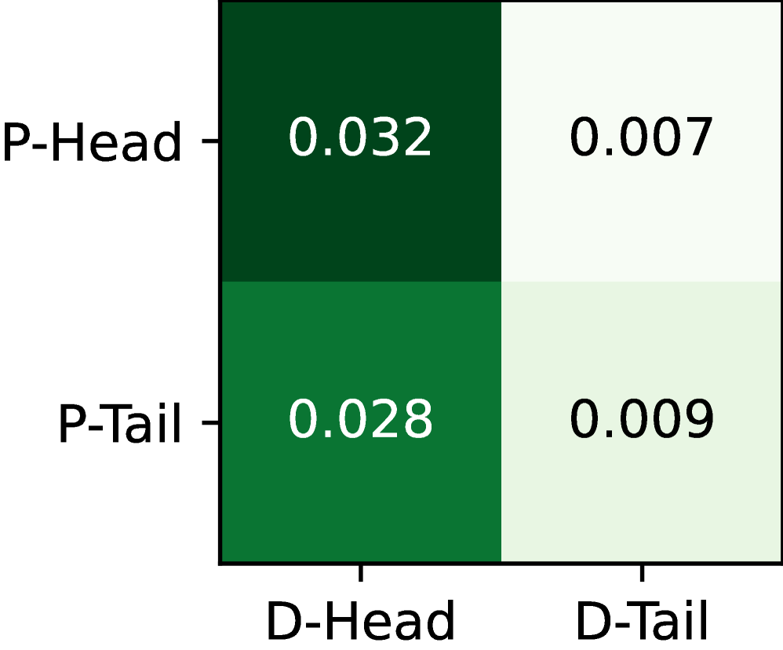
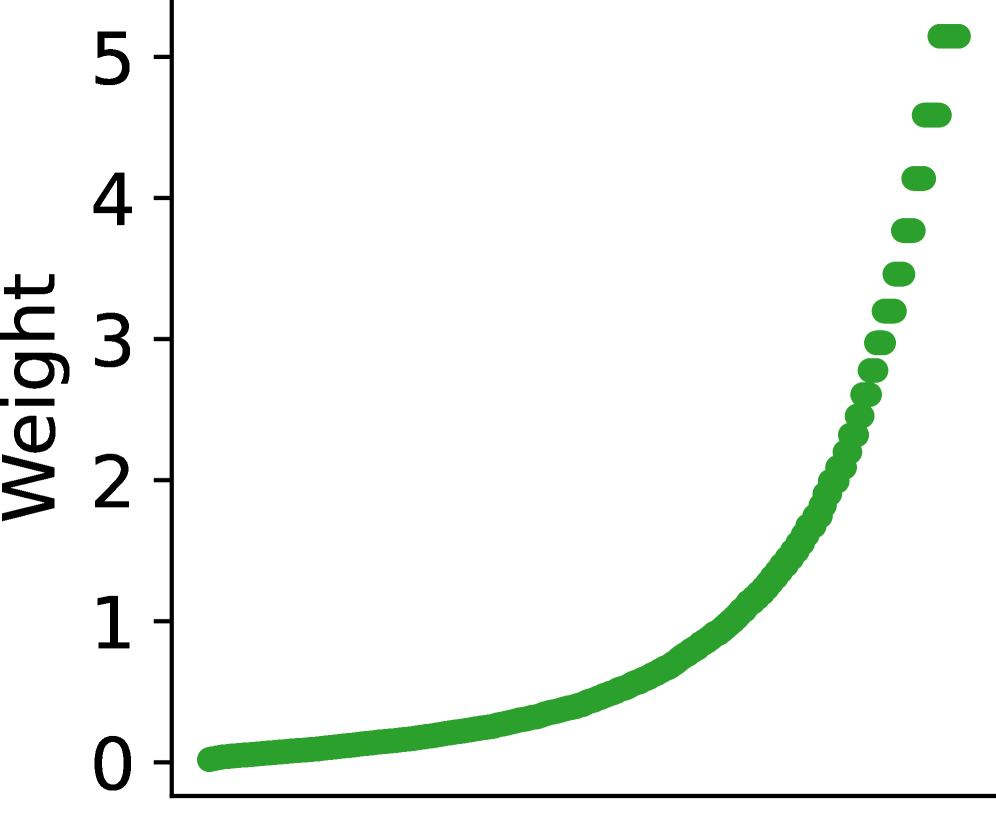
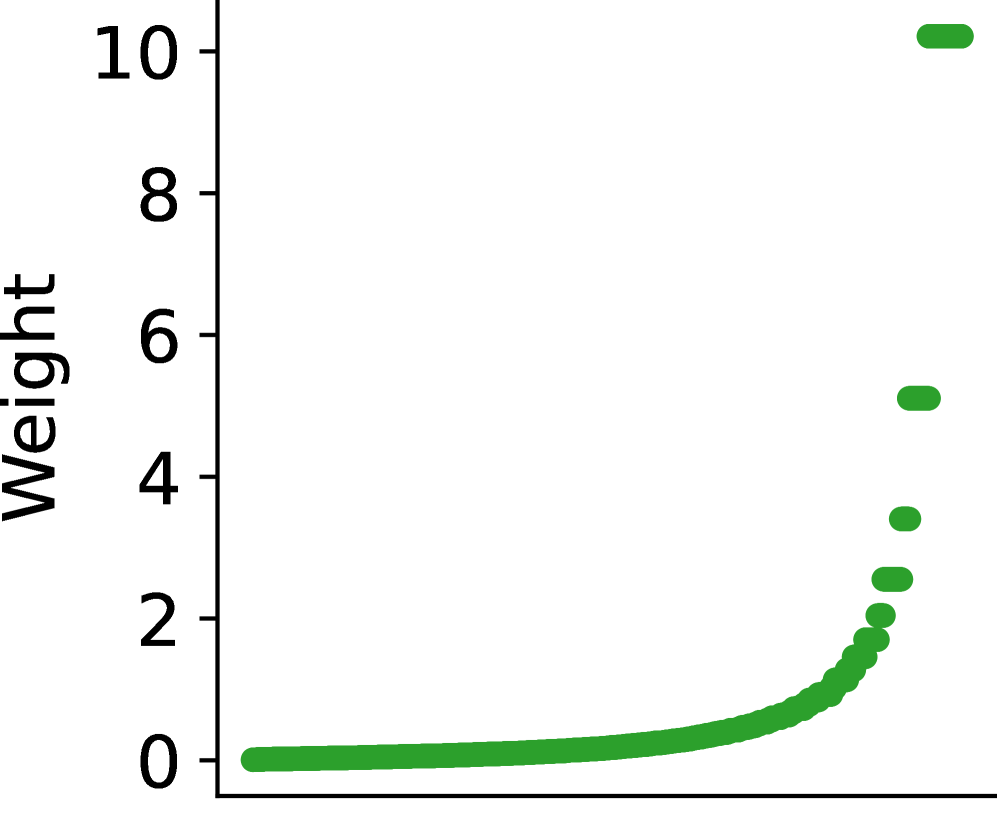

# Taming the Long Tail: Efficient Item-wise Sharpness-Aware Minimization for LLM-based Recommender Systems

> **arxiv**: https://arxiv.org/abs/2603.12752  
> **Authors**: (Zhejiang University, Ant Group)  
> **Venue**: Preprint 2026

## Abstract

Large Language Model-based Recommender Systems (LRSs) have recently emerged as a new paradigm in sequential recommendation by directly adopting LLMs as backbones. While LRSs demonstrate strong knowledge utilization and instruction-following abilities, they have not been systematically studied under the long-standing long-tail problem. In this paper, we conduct an empirical study and reveal that LRSs face two distinct types of long-tail: i) prior long-tail, inherited implicitly from pretraining corpora, and ii) data long-tail, originating from skewed recommendation datasets. Our analysis shows that both contribute to the performance disparity between head and tail items, with the intersection of the two heads exhibiting an even stronger head effect. Nevertheless, the overall performance distribution in LRSs, especially on the tail, remains dominated by the data long-tail. To address this challenge, we propose Efficient Item-wise Sharpness-Aware Minimization (EISAM), a novel optimization framework that improves tail-item performance by adaptively regularizing the loss landscape at the item level. EISAM introduces an efficient penalty design that captures fine-grained item-specific sharpness while maintaining computational scalability for LLMs. In addition, we derive a generalization bound for EISAM. Our theoretical analysis shows that the bound decreases at a faster rate under our item-wise regularization, offering theoretical support for its effectiveness. Extensive experiments on three real-world datasets demonstrate that EISAM significantly boosts tail-item recommendation performance while preserving overall quality, establishing the first systematic solution to the long-tail problem in LRSs.

## 1. Introduction

Recommender Systems (RSs) have been widely deployed in various domains, including news (Turcotte et al., 2015), videos (Zhou et al., 2010), and medications (Bao and Jiang, 2016). Traditional RSs rely heavily on limited interaction data and single-form inputs (Wang et al., 2025a). They lack broad world knowledge and instruction understanding ability, which limits further improvements in recommendation quality and personalization. Large Language Models (LLMs) (Achiam et al., 2023; Touvron et al., 2023; Lu et al.), with strong knowledge and instruction understanding, have recently been integrated into RSs (Xi et al., 2024; Sheng et al., 2025). Particularly in sequential recommendation, LLMs are directly used as new backbone models, referred to as LLM-based RSs (LRSs) (Bao et al., 2023, 2025).

However, this new LRS paradigm has not fully explored long-standing problems in traditional RSs, i.e., the long-tail problem. Real-world data usually follows a long-tail distribution, while recommendation data is often more skewed, where a very small number of popular items account for the majority of occurrences (Park and Tuzhilin, 2008; Yao et al., 2024). Thus, in traditional RSs, a small portion of popular items dominates exposure and accuracy, while tail items receive limited attention (Yin et al., 2012; Jang et al., 2020; Zhao et al., 2024). Although LLMs have the theoretical potential to enhance long-tail performance in traditional RSs via the additional auxiliary information (Liu et al., 2024a; Wu et al., 2024; Liu et al., 2025; Wang et al., 2024a), the long-tail problem in the LRS paradigm has not been explored.

LRSs are typically obtained by tuning pre-trained LLMs with recommendation data. Consequently, LRSs face two types of long-tail. The first is the long-tail in training data, referred to as **data long-tail**. The second comes from the prior LLM pretraining corpus, referred to as **prior long-tail**. Since pretraining data are inaccessible or extremely large, and cannot be directly aligned with recommendation data, prior long-tail can only be reflected implicitly through LLM parameters and ultimately manifested in model performance. Accordingly, the prior long-tail introduced by pretraining corpus can be inferred from the model's performance.

To systematically investigate both types of long-tail effects, we first estimate the prior long-tail based on model performance, and then evaluate the impact of the data long-tail through fine-tuned LRS models. Our empirical study shows that both the prior long-tail and the data long-tail affect the final recommendation performance, yet the data long-tail remains the dominant factor. In both cases, head items consistently outperform tail items, and the intersection of the two heads exhibits the strongest head effect, achieving the best overall performance. However, the data long-tail consistently yields the worst performance, regardless of whether it intersects with the prior head or tail. These observations demonstrate that the prior distribution mainly contributes to improving head performance, with little additional negative impact on the tail. This suggests that, to enhance recommendation quality for tail items, studying and addressing the data long-tail remains crucial.

Based on this understanding, we propose Efficient Item-wise Sharpness-Aware Minimization (EISAM) to improve long-tail performance in LRSs. Sharpness-Aware Minimization (SAM) is known to enhance generalization by flattening the loss landscape (Foret et al., 2021; Li et al., 2025, 2021a), but its naive adoption in recommendation has two major drawbacks. One is that directly applying SAM to the overall loss (Chen et al., 2023) neglects the distinction between head and tail groups and lacks fine-grained targeted optimization. While this may improve overall performance, it fails to address the inferior performance of tail items. The other is that fine-grained control usually incurs high computational overhead (Wang et al., 2024b), which is particularly problematic for LRSs with massive parameter scales. EISAM addresses both issues by introducing an efficient item-wise sharpness penalty that adaptively regularizes loss curvature per item. This design improves tail-item generalization while maintaining computational efficiency. We further provide a theoretical analysis, showing that EISAM admits a tighter generalization bound and decreases at a faster rate compared to other SAM methods.

Our main contributions are summarized as follows:

- To the best of our knowledge, we are the first to systematically investigate the long-tail problem in LRSs, distinguishing between the prior long-tail inherited from pretraining and the data long-tail in recommendation data.
- We conduct an empirical study and comprehensive analysis to examine the impacts of both prior and data long-tail effects within the LRS paradigm, revealing that data distribution remains the dominant factor shaping head and tail performance disparities.
- We introduce Efficient Item-wise Sharpness-Aware Minimization (EISAM), an efficient item-level optimization method that adaptively regularizes loss curvature to enhance tail-item generalization while maintaining computational efficiency.
- We provide both theoretical and empirical validations, showing that EISAM achieves consistent improvements on multiple real-world datasets, with significant gains on tail items without sacrificing overall recommendation accuracy.

## 2. Related Work

### 2.1. LLM-based Recommender Systems

Due to LLMs' powerful capabilities, the utilization of them as a novel backbone for RSs has recently emerged as a promising paradigm. LLM-based RSs directly leverage the generative capability of LLMs to produce recommendations, and this paradigm is particularly suitable for sequential recommendation scenarios since the recommendation process can be naturally formulated in a next-item prediction manner, which aligns well with the intrinsic training objective of LLMs. To adapt LLMs for this purpose, early studies focus on enhancing recommendation generation through the design of effective prompt templates or the incorporation of auxiliary information (Lyu et al., 2023; Sheng et al., 2025; Lin et al., 2025; Lu et al., 2025). Mainstream approaches then explore fine-tuning strategies on recommendation datasets (Bao et al., 2025; Zhou et al., 2024; Xu et al., 2025), while some works further introduce architectural modifications and special tokens tailored for recommendation tasks (Liao et al., 2024b; Qu et al., 2024). In addition, preference optimization, which is commonly applied to LLMs after supervised fine-tuning, has also been extended to RSs in both online and offline settings (Rafailov et al., 2024; Meng et al., 2024; Bai et al., 2024; Liao et al., 2024a). Beyond aligning LLMs with recommendation objectives, recent efforts further enhance factual accuracy and personalization by integrating techniques such as retrieval-augmented generation (Wang et al., 2025b; Tong et al., 2024), online feedback mechanisms (Sun et al., 2024; Xiao et al., 2025; Sun and Li, 2025), and multi-agent collaboration (Wang et al., 2024c; Chen et al., 2024).

Despite these advances in boosting recommendation performance, several traditional challenges remain underexplored in this new paradigm, such as the long-tail problem. It is worth noting that while some studies investigate fairness in LRSs (Jiang et al., 2024; Gao et al., 2025), their focus is primarily on reducing performance disparities across different groups rather than improving long-tail recommendation quality.

### 2.2. Long-tail in Recommender Systems

Despite the rapid development of RSs, the long-tail phenomenon remains a persistent challenge: a small portion of head items accumulates the majority of interactions, while the vast majority of tail items remain underrepresented, leading to issues in diversity, novelty, and fairness of exposure (Park and Tuzhilin, 2008; Zhou et al., 2025).

To mitigate this problem, prior research has explored two main directions. The first is **knowledge transfer and model design**, where information from popular items is propagated to sparse items through shared representations or specialized architectures. Examples include dual-level transfer frameworks linking model- and item-level signals (Zhang et al., 2021; Liu et al., 2023, 2026), decoupling-based networks that separately handle head and tail dynamics (Zhang et al., 2023b, a; Su et al., 2023), and domain transfer methods tailored for sequential recommendation (Wu et al., 2022; Chen et al., 2022; Wang et al., 2025c). The second is **debiasing through causal inference**, which disentangles genuine user preference from popularity-driven exposure via reweighting, counterfactual estimation, or deconfounded objectives (Xia et al., 2023; Liu et al., 2024b; Zhang et al., 2025).

However, these approaches are largely developed under conventional RS backbones, making them difficult to adapt in the emerging LLM-based paradigm. Techniques such as architectural decoupling or causal reweighting require direct control over model structures, training objectives, or interaction-level sampling, whereas LRSs typically operate in a generative manner with frozen backbones or lightweight tuning. This mismatch limits the applicability of existing long-tail solutions.

## 3. Problem Setup

In LRSs, the backbone relies solely on item information, and the recommendation task is formulated as sequential next-item prediction. Since user features are not explicitly modeled, we focus exclusively on the item long-tail problem.

Let the item space be $\mathcal{I} = \{i_1, i_2, \ldots, i_{|\mathcal{I}|}\}$. Each recommendation instance is an item sequence $s = \{i_1, i_2, \ldots, i_L\}$, where $L$ denotes the sequence length. Given a prefix sequence $s$, the task is to predict the next item from the item space:

$$\hat{i} = \arg\max_{i \in \mathcal{I}} P(i \mid s) \tag{1}$$

We denote the training dataset as $\mathcal{S} = \{(s_j, i_j)\}_{j=1}^N$, where $s_j$ is an input sequence and $i_j$ is the corresponding target item. The training loss is denoted as $\ell(\boldsymbol{\theta}; s, i)$, which in LRSs typically corresponds to the supervised fine-tuning (SFT) loss with model parameters $\boldsymbol{\theta}$. The empirical training loss over dataset $\mathcal{S}$ is then defined as

$$L_\mathcal{S}(\boldsymbol{\theta}) \triangleq \frac{1}{N} \sum_{j=1}^N \ell(\boldsymbol{\theta}; s_j, i_j)$$

In practice, the distribution of target items is highly imbalanced. For each item $i \in \mathcal{I}$, let $n_i$ denote the number of times $i$ appears as a prediction target in the training set, and define its empirical frequency as $q_i = n_i / N$, where $N = \sum_{i \in \mathcal{I}} n_i$. Ordering items such that $n_1 \geq n_2 \geq \cdots \geq n_{|\mathcal{I}|}$, the empirical distribution $\mathcal{D}$ reveals a long-tailed pattern in which the head items occupy the majority.

Following prior work in long-tailed recognition, we also define an ideal balanced distribution $\mathcal{D}_{bal}$, under which all items occur with equal probability. The long-tail challenge in LRSs is therefore to design learning strategies that reduce the gap between $L_\mathcal{D}(\boldsymbol{\theta})$ and $L_{\mathcal{D}_{bal}}(\boldsymbol{\theta})$, so that the RS maintains accuracy on head items while also improving performance on tail items that are severely underrepresented.

## 4. Empirical Study

To investigate the long-tail phenomenon in LRSs, we conduct an empirical analysis using the widely adopted BIGRec (Bao et al., 2025) model.

To examine the prior long-tail, we first utilize the base LLM to directly generate recommendation results. However, since the raw generation is not aligned with the sequential recommendation input format and lacks an explicit item list for reference, the generated outputs exhibit very low accuracy and extremely high redundancy. To address this issue, we first design prompts that explicitly instruct the base LLM to generate $k$ distinct recommendation items. To further align the outputs with the sequential recommendation format, we perform a lightweight fine-tuning using a small number of synthetic examples that directly provide $k$ non-redundant recommendations in the required format. Following the grounding strategy proposed in BIGRec, the generated $k$ outputs are then mapped to the closest items in the candidate set by comparing their representations with item embeddings obtained from feeding items into the LLM, and the most similar items are selected as the predicted targets.

> **Figure 1.** Performance across data/prior groups.

From the empirical results, we observe that both the prior long-tail (P) and the data long-tail (D) influence LRS performance, yet the data long-tail remains the dominant factor. The best performance occurs in the head–head intersection (P-Head $\cap$ D-Head), indicating that these items benefit simultaneously from training bias and the LLM's inherent tendency to answer head items correctly. However, the lowest accuracy does not appear in the tail–tail intersection, but rather in regions involving data-tail items, especially P-Head $\cap$ D-Tail. This shows that once items fall into the data-tail space, the model's ability to recommend them drops sharply, regardless of their prior classification.

In summary, we summarize our main findings as follows:

- Within the LRS paradigm, the performance gap between head and tail items is primarily determined by the data distribution.
- The prior head items, especially when interacting with data head items can further amplify head performance.
- The prior long-tail has only a minimal negative effect on tail items during training.

Therefore, to mitigate long-tail issues in LRSs, we should treat the data long-tail distribution as the primary target and improve the representation and performance of data-tail items.

## 5. Methodology

We propose Efficient Item-wise Sharpness-Aware Minimization (EISAM) to mitigate the item long-tail problem in LRSs. The key idea is to regularize the loss landscape at the item level in a frequency-aware manner, while retaining training efficiency. Our method consists of two parts: item-wise sharpness regularization and an efficient optimization procedure.

### 5.1. Item-wise Sharpness Regularization

For each item $i \in \mathcal{I}$, denote by $\mathcal{S}(i) = \{(s,i) \in \mathcal{S}\}$ the subset where $i$ is the target, and define its item-wise empirical loss:

$$L_\mathcal{S}^{(i)}(\boldsymbol{\theta}) \triangleq \frac{1}{|\mathcal{S}(i)|} \sum_{(s,i) \in \mathcal{S}(i)} \ell(\boldsymbol{\theta}; s, i) \tag{2}$$

We introduce item-wise sharpness to measure how sharp the loss landscape of item $i$ is around the current parameters. Given a perturbation $\epsilon$ with $\|\epsilon\| \leq \rho$, the item-wise sharpness is:

$$IS^{(i)}(\boldsymbol{\theta}, \epsilon) \triangleq L_\mathcal{S}^{(i)}(\boldsymbol{\theta} + \epsilon) - L_\mathcal{S}^{(i)}(\boldsymbol{\theta}) \tag{3}$$

To emphasize tail items, we introduce a frequency-dependent weighting function $f(\cdot)$ that assigns larger weights to less frequent items. By combining all item-wise sharpness terms with their weights and aggregating them inside the maximization, we obtain the overall item-wise sharpness regularization:

$$L_\mathcal{S}^{\text{SAM}}(\boldsymbol{\theta}) = \max_{\|\epsilon\| \leq \rho} \sum_{i \in \mathcal{I}} f(q_i) IS^{(i)}(\boldsymbol{\theta}, \epsilon) \tag{4}$$

EISAM then integrates the empirical risk with this regularization:

$$J(\boldsymbol{\theta}) = L_\mathcal{S}(\boldsymbol{\theta}) + \lambda L_\mathcal{S}^{\text{SAM}}(\boldsymbol{\theta}) \tag{5}$$

where $\lambda$ is a hyperparameter that controls the strength of the item-wise sharpness regularization. The weighting function $f(\cdot)$ provides fine-grained control. By selecting different functional forms or adjusting its hyperparameters, we can tune how strongly the regularization emphasizes tail items depending on the severity of the long-tail distribution.

### 5.2. Efficient Optimization Procedure

The definition of $L_\mathcal{S}^{\text{SAM}}(\boldsymbol{\theta})$ involves an inner maximization over the perturbation $\epsilon$, which cannot be solved exactly in practice. To make the problem tractable, we approximate the change in each item-wise loss under perturbation by its first-order Taylor expansion around $\boldsymbol{\theta}$:

$$L_\mathcal{S}^{(i)}(\boldsymbol{\theta} + \epsilon) \approx L_\mathcal{S}^{(i)}(\boldsymbol{\theta}) + \epsilon^\top \nabla_\boldsymbol{\theta} L_\mathcal{S}^{(i)}(\boldsymbol{\theta}) \tag{6}$$

Under the $\ell_2$ constraint, the closed-form solution for the worst-case perturbation is:

$$\hat{\epsilon}(\boldsymbol{\theta}) = \rho \frac{\sum_{i \in \mathcal{I}} f(q_i) \nabla_\boldsymbol{\theta} L_\mathcal{S}^{(i)}(\boldsymbol{\theta})}{\left\|\sum_{i \in \mathcal{I}} f(q_i) \nabla_\boldsymbol{\theta} L_\mathcal{S}^{(i)}(\boldsymbol{\theta})\right\|_2} \tag{8}$$

For simplicity, we denote the weighted item-wise loss as $L_\mathcal{S}^w(\boldsymbol{\theta}) = \sum_{i \in \mathcal{I}} f(q_i) L_\mathcal{S}^{(i)}(\boldsymbol{\theta})$. Treating $\hat{\epsilon}(\boldsymbol{\theta})$ as constant during backpropagation (dropping higher-order terms), the practical gradient approximation becomes:

$$\nabla_\boldsymbol{\theta} J(\boldsymbol{\theta}) \approx \left[\nabla_\boldsymbol{\theta} L_\mathcal{S}(\boldsymbol{\theta}) - \lambda \nabla_\boldsymbol{\theta} L_\mathcal{S}^w(\boldsymbol{\theta})\right]\bigg|_\boldsymbol{\theta} + \lambda \nabla_\boldsymbol{\theta} L_\mathcal{S}^w(\boldsymbol{\theta})\bigg|_{\boldsymbol{\theta} + \hat{\epsilon}(\boldsymbol{\theta})} \tag{11}$$

In practice, solving the EISAM objective requires three backpropagations per iteration:

1. **Perturbation construction**: compute $\nabla_\boldsymbol{\theta} L_\mathcal{S}^w(\boldsymbol{\theta})$ to form $\hat{\epsilon}(\boldsymbol{\theta})$.
2. **Unperturbed difference gradient**: compute $\nabla_\boldsymbol{\theta} L_\mathcal{S}(\boldsymbol{\theta}) - \lambda \nabla_\boldsymbol{\theta} L_\mathcal{S}^w(\boldsymbol{\theta})$ at $\boldsymbol{\theta}$.
3. **Perturbed SAM gradient**: compute $\nabla_\boldsymbol{\theta} L_\mathcal{S}^w(\boldsymbol{\theta})$ at $\boldsymbol{\theta} + \hat{\epsilon}(\boldsymbol{\theta})$.

Together, these steps provide the full gradient needed to update the parameters in $J(\boldsymbol{\theta})$, thus efficiently solving the EISAM optimization problem. While EISAM requires slightly more computation than standard training, it remains efficient and scalable, and it explicitly incorporates item-level sharpness information into optimization.

### 5.3. Theoretical Analysis

We provide theoretical guarantees for EISAM. Our analysis shows that the proposed item-wise sharpness regularization improves flatness on tail items and leads to a tighter generalization bound under the balanced test distribution.

**Theorem 5.4 (Generalization bound of EISAM).** Let $q_{\min} = \min_{i \in \mathcal{I}} q_i$. Assume the balanced test distribution places equal probability on each item. Then for any $\lambda \geq 0$ and any radius $\rho > 0$, with probability at least $1-\delta$ over the draw of $\mathcal{S} \sim \mathcal{D}$,

$$L_{\mathcal{D}_{\mathrm{bal}}}(\boldsymbol{\theta}) \leq \frac{2}{|\mathcal{I}| q_{\min}} J_\mathcal{S}(\boldsymbol{\theta}) - \frac{\lambda \rho^2}{2|\mathcal{I}| q_{\min}(\sqrt{d}+\sqrt{2\ln n})^2} \mathrm{tr}(H^w(\boldsymbol{\theta})) + \frac{1}{|\mathcal{I}| q_{\min}} \left[\frac{40(B+\lambda B^w)}{3n}\ln\frac{2}{\delta} + \frac{\lambda \mathcal{C}(\boldsymbol{\theta},\rho,d,n,\delta)}{n}\right]$$

Key remarks:

- **Complexity.** All distribution-dependent corrections scale as $O(1/n)$, making the bound sharper with more data.
- **Effect of item weights.** The quantity $B^w = \sum_{i \in \mathcal{I}} f(q_i) q_i B$ captures how the weighting emphasizes tail items. Choosing $f(\cdot)$ that increases the relative weight of tail items reduces imbalance-induced slack and tightens the balanced-distribution bound.
- **Choice of $\lambda$ and $\rho$.** Larger $\rho$ and $\lambda$ strengthen the curvature bonus but also enlarge the complexity terms; in practice they should be tuned to balance empirical fit and regularization.

## 6. Experiments

We conduct comprehensive experiments on the long-tailed recommendation scenario to evaluate the effectiveness of EISAM.

### 6.1. Experimental Settings

#### 6.1.1. Datasets

We conduct experiments on three widely used real-world datasets in recommendation research: **ML-1M** (MovieLens-1M), **Steam** (video game platform reviews and play histories), and **ADM** (Amazon Digital Music ratings). We remove items with fewer than five interaction records to alleviate sparsity. We set the maximum sequence length to 10 across all datasets. Based on the Pareto principle, we designate the top 20% most frequent items as head items and the remaining 80% as tail items.

#### 6.1.2. LRS Models

We select two representative LRS backbones: **BIGRec** (Bao et al., 2025) and **TALLRec** (Bao et al., 2023). For the base LLM, we adopt Llama2-7B.

#### 6.1.3. Baselines

We compare against: **RW** (Re-weighting), **SAM** (Sharpness-Aware Minimization), and **Group SAM** (Group-wise SAM).

#### 6.1.4. Evaluation Metrics

We adopt NDCG@10 and HR@10. We report Overall, Head, and Tail performance separately.

### 6.2. Implementation Details

Following prior work (Bao et al., 2025), we adopt consistent training configurations. For ML-1M and Steam, the number of training epochs is set to 3, while for ADM we train for 2 epochs. We use the Adam optimizer with a learning rate of $5 \times 10^{-4}$ and a batch size of 64. All models are fine-tuned with LoRA, where the rank $r$ is set to 8 and the LoRA scaling factor $\alpha$ is 16.

For the choice of the weighting function $f(\cdot)$, we consider three representative forms: (i) normalized sample frequency, (ii) effective number formulation, and (iii) smoothly attenuated exponential form $f_{\exp}(q_i) = (1-q_i)^\gamma$. We adopt the exponential weighting function as a balanced and stable choice.

> **Figure 2.** Weight distributions of different weighting functions on the ML-1M dataset, where the x-axis denotes item indices sorted by descending frequency.

### 6.3. Overall Performance (RQ1)

**Overall Performance.** EISAM consistently surpasses the baselines on both NDCG@10 and HR@10 metrics. Specifically, EISAM achieves an average improvement of **3.53% in overall NDCG@10** and **4.54% in HR@10** compared to the strongest baseline.

We observe that SAM consistently improves the overall performance compared with the original LRSs, while Reweight and GroupSAM do not necessarily yield positive gains and often introduce side effects. This is because SAM regularizes the model with respect to the global loss sharpness, thus enhancing the overall generalization capability. Our proposed EISAM, by introducing a fine-grained weighting mechanism combined with item-wise sharpness regularization, forms a new SAM variant that still optimizes the global loss while providing more flexible item-level control.

**Tail Item Performance.** EISAM achieves remarkable gains on tail items, with an average improvement of **8.90% in NDCG@10** and **8.44% in HR@10** over the best-performing baseline. Although SAM contributes to overall performance, it brings little improvement to tail items, indicating that the SAM framework itself still suffers from long-tail bias. In contrast, EISAM introduces a novel item-wise sharpness that mitigates these issues, delivering consistent tail improvements with far lower overhead.

### 6.4. Loss Landscape (RQ2)

> **Figure 3.** Visualizations of the loss landscapes of LRS on tail items. Darker colors indicate lower loss values.

From both 3D and 2D perspectives, SAM exhibits limited flatness on tail items, indicating restricted generalization in long-tailed scenarios. In contrast, across all three datasets, EISAM demonstrates a markedly flatter and smoother loss surface, suggesting that its item-wise sharpness regularization effectively mitigates sharp minima and stabilizes optimization.

### 6.5. Training Efficiency (RQ3)

EISAM exhibits comparable training efficiency to standard SAM, introducing only an average **5.3% overhead** per epoch. On the Steam and ADM datasets, the additional computational cost is as low as 0.01%. This efficiency is attributed to our optimized training procedure, which avoids the group-level looping required by GroupSAM.

### 6.6. Impact of Hyperparameter (RQ4)

> **Figure 4.** Hyperparameter sensitivity analysis.

**Impact of $\lambda$.** Increasing $\lambda$ initially improves model accuracy by promoting flatter minima but leads to degradation when $\lambda$ becomes overly large (around $\lambda > 1.0$). This reflects the trade-off between minimizing training loss and minimizing the sharpness of the loss landscape.

**Impact of $\gamma$.** As $\gamma$ increases, performance first improves, indicating that emphasizing the sharpness of tail items enhances generalization under long-tail distributions. However, when $\gamma$ exceeds a certain threshold (e.g., $\gamma > 100$), the performance begins to decline, suggesting that overemphasizing tail sharpness can lead to over-regularization.

## 7. Conclusion

In this work, we systematically investigated the long-tail problem in LRSs, distinguishing between the prior long-tail from pretraining and the data long-tail in recommendation data. Our empirical analysis shows that both of them affect performance, but the data long-tail remains the dominant factor shaping head and tail disparities. The prior long-tail mainly enhances the performance of head classes, while exerting limited influence on the tail. To mitigate this issue, we propose Efficient Item-wise Sharpness-Aware Minimization (EISAM). EISAM adjusts the loss curvature per item, enabling finer control over head and tail groups. Moreover, we design an efficient optimization procedure to alleviate the high computational overhead, ensuring that EISAM remains both effective and practical for LRSs. Experiments on real-world datasets show that our method improves overall performance, significantly enhances the recommendation quality for tail items, and maintains computational efficiency. Moreover, empirical evidence indicates that our approach successfully reduces the sharpness of tail items.

## References

- Achiam et al. (2023) GPT-4 technical report. arXiv:2303.08774.
- Bao et al. (2023) TALLRec: an effective and efficient tuning framework to align large language model with recommendation. RecSys '23.
- Bao et al. (2025) A bi-step grounding paradigm for large language models in recommendation systems. ACM TORS.
- Chen et al. (2023) Sharpness-aware graph collaborative filtering. SIGIR '23.
- Foret et al. (2021) Sharpness-aware minimization for efficiently improving generalization. ICLR '21.
- Gao et al. (2025) SPRec: self-play to debias LLM-based recommendation. WWW '25.
- Jiang et al. (2024) Item-side fairness of large language model-based recommendation system. WWW '24.
- Li et al. (2025) Focal-SAM: focal sharpness-aware minimization for long-tailed classification. arXiv:2505.01660.
- Liao et al. (2024b) LLaRA: large language-recommendation assistant. SIGIR '24.
- Liu et al. (2024a) LLM-ESR: large language models enhancement for long-tailed sequential recommendation. NeurIPS '24.
- Liu et al. (2025) LLMEmb: large language model can be a good embedding generator for sequential recommendation. AAAI '25.
- Park and Tuzhilin (2008) The long tail of recommender systems and how to leverage it. RecSys '08.
- Qu et al. (2024) TokenRec: learning to tokenize ID for LLM-based generative recommendation. arXiv:2406.10450.
- Sheng et al. (2025) Language representations can be what recommenders need: findings and potentials. ICLR '25.
- Touvron et al. (2023) Llama: open and efficient foundation language models. arXiv:2302.13971.
- Wang et al. (2024b) Group-wise SAM for disadvantaged group discovery. arXiv.
