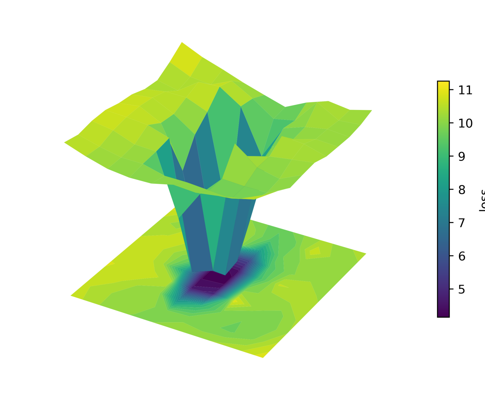
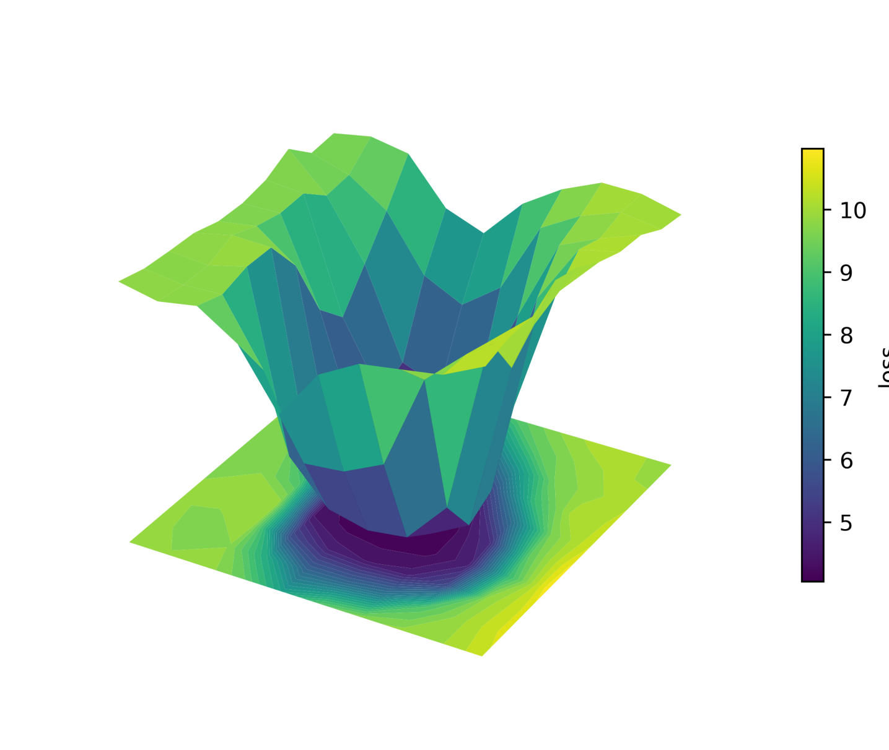
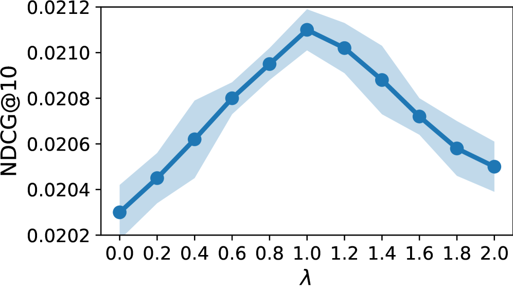

# EISAM: Taming the Long Tail — Efficient Item-wise Sharpness-Aware Minimization for LLM-based Recommender Systems

## 基本信息

| 字段 | 内容 |
|------|------|
| **ArXiv ID** | 2603.12752 |
| **标题** | Taming the Long Tail: Efficient Item-wise Sharpness-Aware Minimization for LLM-based Recommender Systems |
| **作者** | Jiaming Zhang 等 |
| **机构** | Zhejiang University + Ant Group |
| **发布日期** | 2026-03-16 |
| **方向** | LLM-based Recommendation / Long-tail / Optimization |
| **PDF** | [2603.12752_EISAMLongTailLLMRec.pdf](2603.12752_EISAMLongTailLLMRec.pdf) |
| **arxiv** | https://arxiv.org/abs/2603.12752 |
| **Code** | https://github.com/xiye7lai/samlrs |

---

## TL;DR

首次系统研究 **LLM-based 推荐系统（LRS）中的 long-tail 问题**，发现存在两类长尾效应：
- **Prior long-tail**：来自 LLM 预训练语料库（隐性影响）
- **Data long-tail**：来自推荐数据的偏斜分布（主导因素）

提出 **EISAM（Efficient Item-wise Sharpness-Aware Minimization）**：在优化目标中对每个 item 自适应地正则化损失曲率（loss landscape flatness），用频率感知的权重函数为 tail items 施加更大的 SAM 正则，同时保持计算效率。

实验结果：
- 整体 NDCG@10 **+3.53%**，HR@10 **+4.54%**（vs best baseline）
- Tail items 上：NDCG@10 **+8.90%**，HR@10 **+8.44%**（vs best baseline）
- 训练开销：相比标准 SAM 仅增加平均 **5.3%**

---

## 问题背景

### LLM-based Recommender Systems（LRS）

LRS 直接使用 LLM 作为 backbone 做序列推荐（next-item prediction），代表工作：
- **BIGRec**（Bao et al., 2025）：两阶段 grounding 策略
- **TALLRec**（Bao et al., 2023）：轻量 fine-tuning + 双阶段范式

LRS 通过 SFT 将 LLM 对齐到推荐领域，但其 long-tail 问题未被系统研究。

### 两类长尾效应

| 类型 | 来源 | 测量方法 |
|------|------|----------|
| **Prior long-tail (P)** | LLM 预训练语料的流行度分布 | 用 base LLM 直接生成 k 个推荐，统计 item 被推荐的频率分布 |
| **Data long-tail (D)** | 推荐数据集的偏斜分布 | 直接观察训练集 item 频率分布 |

---

## 实证分析（Section 4）

### 发现

分析"P-Head∩D-Head、P-Head∩D-Tail、P-Tail∩D-Head、P-Tail∩D-Tail"四个交叉组的性能（NDCG@10）：

**关键结论**：
1. P-Head ∩ D-Head 性能最好（双重利好）
2. **Data long-tail 是主导因素**：落入 D-Tail 的 item 无论 P 分类如何，性能都大幅下降
3. P-Head ∩ D-Tail 甚至出现最低精度——先验知识对推荐领域只是部分对齐
4. Prior long-tail 对 tail items 的额外负面影响**很小**

**结论**：解决 LRS 长尾问题的主要靶点是 **data long-tail distribution**。

---

## 方法详解

### 动机：为什么是 SAM？

Sharpness-Aware Minimization（SAM）通过平坦化损失曲面来提升泛化能力。但直接将 SAM 应用于整体损失有两个问题：
1. **无差异对待 head/tail items**，没有针对 tail 的专门优化
2. **计算开销大**，对 LLM 规模的参数尤其显著

### EISAM 的设计

#### Item-wise Sharpness Regularization

定义每个 item i 的独立 loss：
$$L_{\mathcal{S}}^{(i)}(\boldsymbol{\theta}) \triangleq \frac{1}{|\mathcal{S}(i)|} \sum_{(s,i) \in \mathcal{S}(i)} \ell(\boldsymbol{\theta}; s, i)$$

Item-wise sharpness（损失曲率）：
$$IS^{(i)}(\boldsymbol{\theta}, \epsilon) \triangleq L_{\mathcal{S}}^{(i)}(\boldsymbol{\theta}+\epsilon) - L_{\mathcal{S}}^{(i)}(\boldsymbol{\theta})$$

引入**频率感知权重函数** f(q_i)（对低频 item 赋予更大权重，如 f(q_i) = (1-q_i)^γ）：

$$L_{\mathcal{S}}^{\text{SAM}}(\boldsymbol{\theta}) = \max_{\|\epsilon\| \le \rho} \sum_{i \in \mathcal{I}} f(q_i) IS^{(i)}(\boldsymbol{\theta}, \epsilon)$$

总目标函数：
$$J(\boldsymbol{\theta}) = L_{\mathcal{S}}(\boldsymbol{\theta}) + \lambda L_{\mathcal{S}}^{\text{SAM}}(\boldsymbol{\theta})$$

#### Efficient Optimization

通过一阶 Taylor 展开近似 inner maximization：

最优扰动方向（closed-form）：
$$\hat{\epsilon}(\boldsymbol{\theta}) = \rho \frac{\sum_{i \in \mathcal{I}} f(q_i) \nabla_{\boldsymbol{\theta}} L_{\mathcal{S}}^{(i)}(\boldsymbol{\theta})}{\left\|\sum_{i \in \mathcal{I}} f(q_i) \nabla_{\boldsymbol{\theta}} L_{\mathcal{S}}^{(i)}(\boldsymbol{\theta})\right\|_2}$$

**关键**：最优扰动方向等价于对 item-wise 梯度的加权求和 → **不需要多次 forward pass**（GroupSAM 需要 group 次），只需 3 次 backward：
1. 计算 $\nabla L_{\mathcal{S}}^w$ 构建扰动
2. 计算无扰动差值梯度
3. 计算扰动后梯度

### 三种权重函数

| 函数 | 公式 | 特点 |
|------|------|------|
| Normalized | $f_{\text{norm}}(q_i) = 1/(q_i + \epsilon)$ | 激进，对极端 tail items 权重极大 |
| Effective Number | $f_{\text{eff}}(q_i) = (1-\beta)/(1-\beta^{q_i})$ | 渐进平滑 |
| **Exponential** (采用) | $f_{\text{exp}}(q_i) = (1-q_i)^\gamma$ | 平衡稳定，不过度强调极端 tail |

---

## 理论分析

提供了 EISAM 的泛化界（Generalization bound），定理表明在均衡测试分布下：
- EISAM 的界比标准 SAM 更紧（包含额外的曲率奖励项 tr(H^w(θ))）
- 随数据量 n 增加，界以 O(1/n) 速率收紧
- λ 和 ρ 增大可加强正则化但也增大复杂度项

---

## 实验结果

### 数据集

| 数据集 | 描述 |
|--------|------|
| ML-1M | MovieLens-1M，100万评分 |
| Steam | Steam 游戏平台评测与游戏历史 |
| ADM | Amazon Digital Music 评分 |

Pareto 原则划分：频率前 20% 为 head items，后 80% 为 tail items

### LRS Backbone

- **BIGRec**：两阶段 grounding（SFT + embedding 匹配）
- **TALLRec**：轻量 LoRA fine-tuning
- 基础 LLM：Llama2-7B，LoRA rank=8, α=16

### 整体性能（Table 2）

EISAM 在所有 dataset × backbone 组合上均达到最佳：
- 整体 NDCG@10 +3.53%，HR@10 +4.54%（vs best baseline）
- Tail items NDCG@10 +8.90%，HR@10 +8.44%（vs best baseline）

对比：SAM 改善整体但对 tail 帮助有限；GroupSAM 对 tail 有改善但整体不稳定、计算开销大

### Loss Landscape 可视化

EISAM 的 tail items 损失曲面更平坦（flat minima），SAM 的 tail 损失曲面更尖锐（sharp minima）

### 训练效率（Table 3）

- EISAM vs SAM：+5.3% 训练时间（Steam/ADM 仅 +0.01%）
- GroupSAM vs SAM：约 Group 倍时间开销

### 超参数分析

- **λ**：适中最佳（λ > 1.0 开始退化）
- **γ**：适中最佳（γ > 100 过度正则化）
- 整体表现鲁棒，宽范围内稳定

---

## 核心贡献与亮点

1. **首次系统研究 LRS 中的 long-tail 问题**，区分 prior/data 两类长尾
2. **实证揭示**：data long-tail 是主导因素，prior long-tail 对 tail items 影响有限
3. **EISAM 算法**：item-wise 粒度的 SAM 正则，通过一阶近似实现高效优化（仅需 3 次反传）
4. **理论保证**：tighter generalization bound，收紧速率比标准 SAM 更快
5. **全面实验**：3个数据集 × 2个 LRS backbone，tail items 性能 +8.90%（NDCG@10）

---

## 与相关工作的关系

| 工作 | 问题 | EISAM 改进 |
|------|------|------------|
| SAM | 全局损失曲率平坦化，无 item 区分 | Item-wise 细粒度，强调 tail items |
| GroupSAM | 组级 SAM | 跨组信息丢失，开销是 Group 倍 |
| Reweight | 按组流行度重加权 | 只有局部优化，无全局泛化保证 |
| LLM-ESR | 用 LLM 增强 long-tail 表示 | 修改架构/数据，EISAM 只改优化器 |

---

## 标签分析

- **⭐⭐⭐ 星级**：4/5 — 问题设置新颖（LRS × long-tail），有理论支撑，tail 性能提升显著
- **三维标签**：
  - 问题类型：Long-tail Recommendation in LRS
  - 核心方法：Item-wise SAM 正则化 + Frequency-aware Weighting + Efficient Optimization
  - 应用场景：LLM-based 序列推荐系统
- **线上 A/B**：❌ 无线上实验（学术论文，Ant Group 合作但未报告线上数据）
