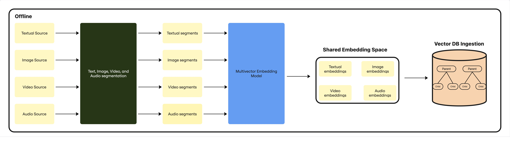
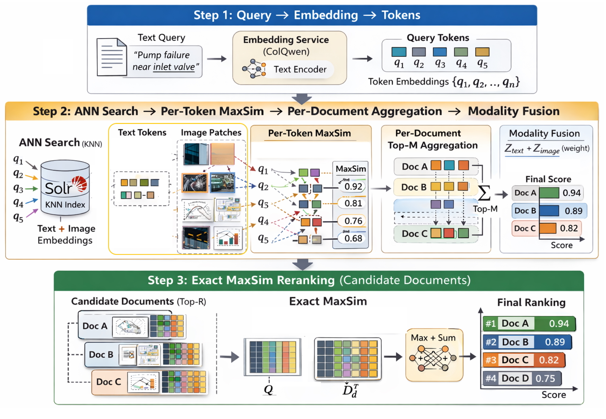

# AMES: Approximate Multi-modal Enterprise Search via Late Interaction Retrieval

> **arxiv**: https://arxiv.org/abs/2603.13537  
> **Authors**: (Apple, Cupertino, CA, USA)  
> **Venue**: Preprint 2026

## Abstract

We present AMES (Approximate Multimodal Enterprise Search), a backend-agnostic architecture for unified multimodal late-interaction retrieval deployed in production on Apache Solr. Traditional lexical retrieval and single-vector dense encoding fail to preserve fine-grained alignment between queries and local content regions. Existing multi-vector retrieval systems either rely on specialized ANN infrastructure or custom retrieval engines, creating barriers to enterprise adoption. AMES bridges this gap through a two-stage retrieval pipeline: (1) parallel token-level ANN search with Per-Document Top-M MaxSim approximation for high-recall candidate generation; (2) exact MaxSim re-ranking with GPU-accelerated PyTorch matrix operations for high-precision ranking. A parent-child document schema unifies text tokens, image patches, and video frames in a single embedding space. Experiments on the ViDoRe V3 Industrial benchmark achieve competitive ranking performance (nDCG@10: 58.1 with ColQwen3.0) under native Solr architecture without modifying embedding models or introducing specialized ANN infrastructure.

## 1. Introduction

Enterprise search increasingly requires retrieving heterogeneous content — text documents, product images, instructional videos, slide decks — in response to natural language queries. The dominant paradigm of lexical retrieval (BM25) fails to capture semantic relevance, while single-vector dense retrieval collapses multi-faceted document content into a single representation, losing fine-grained alignment between query tokens and specific regions of documents or images.

Late interaction models (e.g., ColBERT, ColPali, ColQwen) address this by retaining multiple embedding vectors per document and computing relevance via MaxSim: the sum of each query token's maximum similarity to any document token. This achieves strong retrieval quality but poses infrastructure challenges:
- **Multi-vector index size**: each document generates dozens to hundreds of vectors
- **Per-query aggregation**: MaxSim requires grouping token-level similarities back to the document level
- **Multimodal extension**: image patches, video frames need uniform treatment alongside text tokens

Existing systems (e.g., PLAID, Vespa with ColBERT support) introduce specialized ANN data structures not commonly available in enterprise search stacks. AMES demonstrates that these challenges can be addressed within standard enterprise infrastructure using a carefully designed parent-child schema.

### 1.1. Contributions

1. **Backend-agnostic unified architecture**: a two-stage late-interaction retrieval framework implementable on any ANN-capable search backend, with reference implementation in Apache Solr
2. **Per-Document Top-M aggregation**: reduces influence of weak-signal tokens while maintaining high recall
3. **Modality-aware fusion**: MAD (Median Absolute Deviation) normalization + weighted combination addresses score distribution differences across text/image/video modalities
4. **Production deployment**: complete implementation details for Solr parent-child schema, vector indexing, and GPU-accelerated re-ranking

## 2. Related Work

### 2.1. Late-Interaction Retrieval

ColBERT introduced multi-vector late interaction via MaxSim, achieving significantly better retrieval quality than bi-encoder models. PLAID optimized ColBERT for efficiency via centroid-based compression. ColPali extended the paradigm to document image retrieval by encoding page images as patch embeddings. ColQwen further improved multimodal capabilities with visual instruction tuning.

### 2.2. Multimodal Late-Interaction Retrieval

ViDoRe (Visual Document Retrieval) benchmarks evaluate multi-vector models on document-level image retrieval. ColPali demonstrated that treating PDF pages as images and encoding them with PaliGemma achieves strong retrieval without OCR. The ViDoRe V3 Industrial dataset specifically targets enterprise document retrieval scenarios.

### 2.3. Enterprise Search and Multimodal Retrieval

Enterprise search systems (Elasticsearch, Solr, OpenSearch) have added approximate nearest neighbor (ANN) support for dense retrieval. However, multi-vector retrieval requires per-document aggregation logic not natively supported in these systems. AMES fills this gap.

## 3. System Overview

### 3.1. Problem Definition and Notation

**Corpus structure**: A corpus $\mathcal{C}$ consists of parent documents $d_i$ (pages, images, video segments) containing metadata and child units $e_{i,j}$ (text tokens, image patches, video frames) with embeddings $\mathbf{v}_{i,j} \in \mathbb{R}^D$.

**Query representation**: A text query $q$ is encoded into token-level embeddings $\mathbf{Q} = \{q_1, \ldots, q_T\} \in \mathbb{R}^{T \times D}$.

**Late interaction scoring**:
$$\text{score}(q, d_i) = \sum_{t=1}^{T} \max_{j} \mathbf{q}_t \cdot \mathbf{v}_{i,j}$$

**Two-stage retrieval objective**: Stage 1 generates a candidate set with high recall at reduced computational cost; Stage 2 applies exact MaxSim over the candidates for precise re-ranking.

### 3.2. Indexing

Documents are segmented into retrieval units at multiple granularities:
- **Text**: token embeddings from the multi-vector encoder
- **Image**: patch embeddings (e.g., 14×14 ViT patches mapped to ColQwen token space)  
- **Video**: frame-level embeddings sampled at regular intervals

All embeddings are stored in a shared D-dimensional space. The parent document stores metadata (modality, source, timestamp). Each child document stores exactly one embedding vector.



> **Figure 1.** Offline indexing pipeline. Documents and media are segmented into retrieval units, encoded with a multi-vector model, and indexed using a parent-child or equivalent grouping schema for ANN candidate generation and Exact MaxSim re-ranking.

### 3.3. Retrieval

#### Stage 1: Parallel Token Level Candidate Generation

For each query token $q_t$, an ANN search retrieves the Top-K nearest child documents. The union of all parent documents across query tokens forms the candidate set.

**Per-Document Top-M Aggregation**: Rather than summing all token-level MaxSim scores, AMES retains only the top-M per-document scores to reduce the contribution of weak-signal tokens (e.g., stop words, padding tokens):

$$\text{score}^{approx}(q, d_i) = \sum_{t=1}^{T} \text{top-M-max}_{j} \mathbf{q}_t \cdot \mathbf{v}_{i,j}$$

This approximation provides better recall-efficiency tradeoffs than naive MaxSim computation across all retrieved token pairs.

**Modality-Aware Fusion**: When a document contains multiple modalities (e.g., a PDF page with text and embedded images), scores from different modalities exhibit different distribution characteristics. AMES applies MAD normalization per modality before combining:

$$s_{modal} = \frac{s - \text{median}(S)}{\text{MAD}(S)}$$

and then applies learned modality weights for final score combination.

#### Stage 2: Exact MaxSim Re-ranking

Over the Top-M candidates from Stage 1, exact MaxSim is computed using PyTorch batched matrix operations:

```python
# Batched MaxSim: [num_queries, K] → scalar score per candidate
scores = torch.einsum('qd,cd->qc', Q, V_candidates).max(dim=-1).values.sum(dim=0)
```

GPU acceleration (CUDA/MPS) and FP16 precision provide efficient throughput for re-ranking hundreds of candidates per query.

#### Stage 3: Video Handling

For video content, frame-level embeddings are treated as child documents under a parent video document. The temporal ordering is preserved in metadata but not required for retrieval. MaxSim naturally handles variable-length videos since it takes the maximum over all frames.



> **Figure 2.** Retrieval pipeline showing query embedding, approximate candidate generation (Stage 1), and exact MaxSim re-ranking (Stage 2).

## 4. Reference Implementation in Solr

### 4.1. Parent-Child Schema in Solr

AMES exploits Solr's block join feature for parent-child document relationships:
- **Parent fields**: `id`, `modality`, `content_type`, `metadata`, `parent_flag`
- **Child fields**: `embedding` (dense vector), `token_position`, `parent_id`

Parent documents are queryable for filtering/metadata operations; child documents contain the vector embeddings for ANN search.

### 4.2. Vector Indexing and Metadata Filtering

Child embeddings are indexed using Solr's `DenseVectorField` with HNSW indexing:
```xml
<field name="embedding" type="knn_vector_1024" indexed="true" stored="false"/>
```

Metadata filtering (e.g., retrieve only documents from a specific department) is applied at the parent level using standard Solr query syntax, enabling efficient pre-filtering before ANN search.

### 4.3. Parent-Level Aggregation Semantics

After retrieving top-K child documents via ANN, a block join query groups results back to parent level. AMES's Per-Document Top-M aggregation is implemented as a custom Solr re-ranking query component that:
1. Fetches all child embeddings for the retrieved parent documents
2. Computes per-document MaxSim scores via batched operations
3. Re-ranks parent documents by aggregated score

### 4.4. Enterprise Compatibility

AMES is compatible with standard enterprise Solr deployments without modifications to the core Solr binary. Exact MaxSim re-ranking is implemented as a Solr plugin using the existing `ReRankQParserPlugin` interface.

## 5. Retrieval Method

### 5.1. Stage 1: Parallel Token Level ANN Candidate Generation

For a query with T token embeddings, T parallel ANN searches are executed. Each search retrieves K nearest child vectors. The union of parent documents covers the relevant document space with high recall, since each query token independently probes the index.

**Key insight**: Even when the overall MaxSim score is dominated by a few highly-aligned query tokens, each token's ANN search contributes independent signal that increases recall coverage.

#### Per-Token MaxSim Approximation

For efficiency, rather than computing the full MaxSim sum, Stage 1 uses an approximation:

$$\tilde{s}(q_t, d_i) = \max_{j: e_{i,j} \in \text{retrieved}} \mathbf{q}_t \cdot \mathbf{v}_{i,j}$$

This may miss some child embeddings not retrieved by ANN, but the Stage 2 exact re-ranking corrects any ordering errors within the candidate set.

### 5.2. Stage 2: Exact MaxSim Reranking

Over the candidate set (typically 100-500 parent documents), all child embeddings are loaded and exact MaxSim is computed. The computational cost is:

$$O(T \cdot M_{avg} \cdot D)$$

where $M_{avg}$ is the average number of child embeddings per parent document, which is manageable given the small candidate set size.

## 6. Experiments

### 6.1. Experimental Setup

**Benchmark**: ViDoRe V3 Industrial Dataset — a realistic enterprise document retrieval benchmark with heterogeneous content types (PDFs, images, mixed media).

**Models evaluated**:
- ColQwen3.0 (latest generation visual multi-vector model)
- ColQwen2.5 (previous generation)

**Metrics**: nDCG@1, nDCG@10, SOTA@10

### 6.2. Results

**Table 1: English-only retrieval performance on ViDoRe V3 Industrial Dataset (NDCG).**

| Model | nDCG@1 | nDCG@10 | SOTA@10 |
|-------|--------|---------|---------|
| ColQwen3.0 | 62.5 | **58.1** | 54.1 |
| ColQwen2.5 | 53.7 | 52.4 | 49.4 |

AMES with ColQwen3.0 achieves competitive ranking performance under the Solr native architecture, matching or approaching SOTA systems that require specialized ANN infrastructure. The key result is that **fine-grained multimodal late interaction retrieval can be deployed in standard enterprise search infrastructure** without embedding model modifications.

### 6.3. Limitations and Future Work

- Current evaluation is limited to English-only queries; multilingual support is future work
- Video retrieval is evaluated on short segments; long-video understanding requires temporal modeling
- Formal analysis of the approximation error bounds for Per-Document Top-M aggregation is needed

## 7. Conclusion

AMES demonstrates that the multi-vector late interaction retrieval paradigm — previously confined to specialized research systems — can be effectively deployed within standard enterprise search infrastructure. The key design decisions (Per-Document Top-M aggregation, modality-aware fusion, parent-child schema) enable competitive retrieval performance with minimal engineering overhead. This bridges the gap between multi-vector retrieval research and production deployment, making high-quality multimodal search accessible to enterprises using standard Apache Solr infrastructure.

## References

- Khattab & Zaharia (2020) ColBERT: efficient and effective passage search via contextualized late interaction over BERT. SIGIR '20.
- Santhanam et al. (2022) ColBERTv2: effective and efficient retrieval via lightweight late interaction. NAACL '22.
- Faysse et al. (2024) ColPali: efficient document retrieval with vision language models. arXiv:2407.01449.
- SimAnek et al. (2024) ViDoRe: visual document retrieval benchmark. arXiv:2407.01449.
