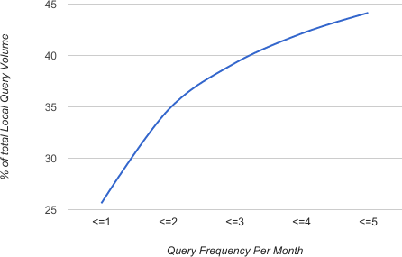
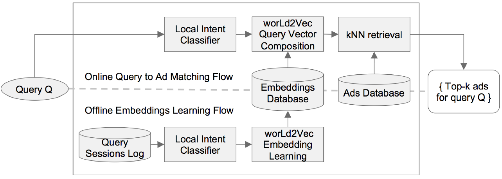
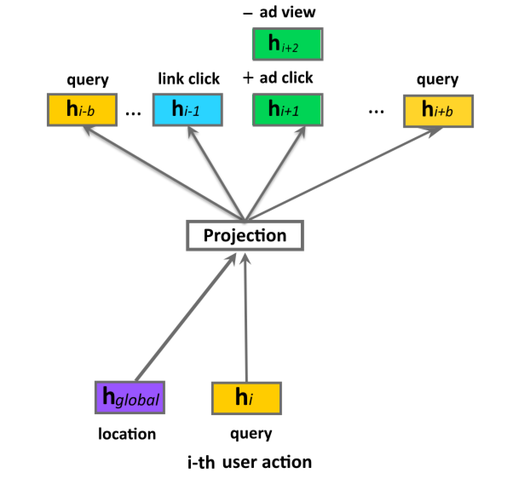
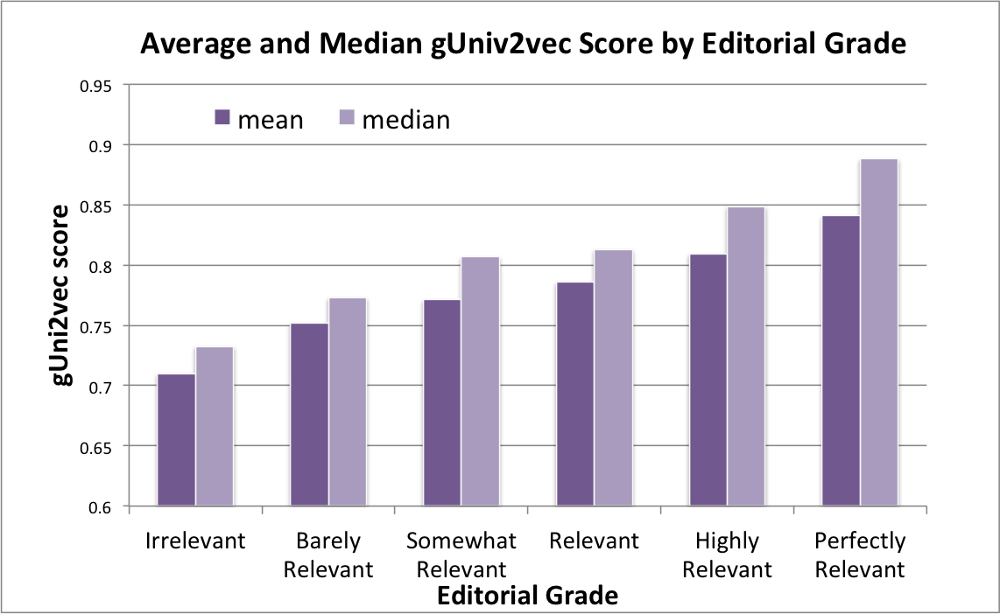
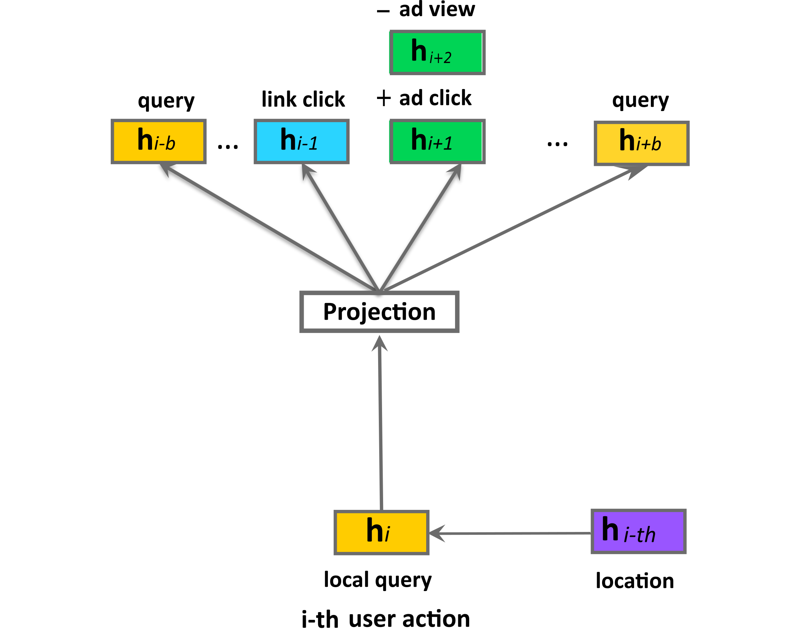
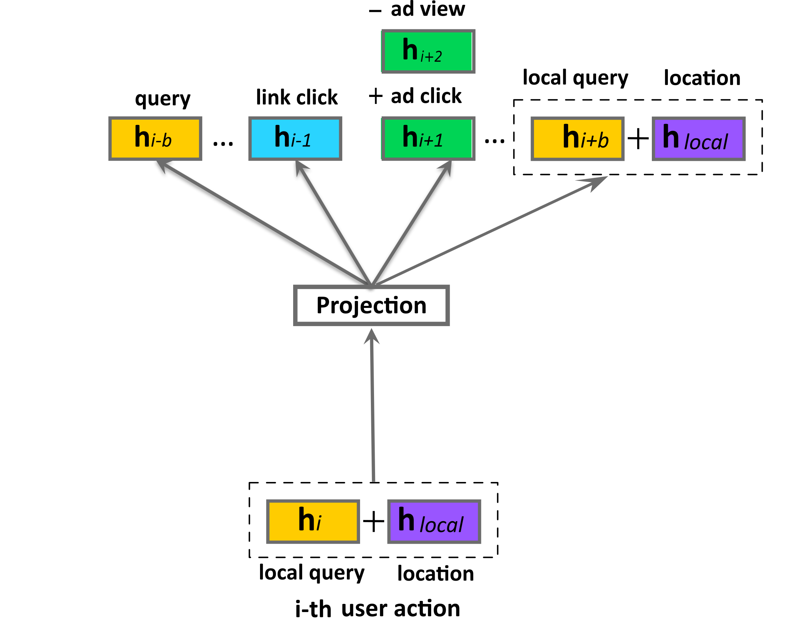
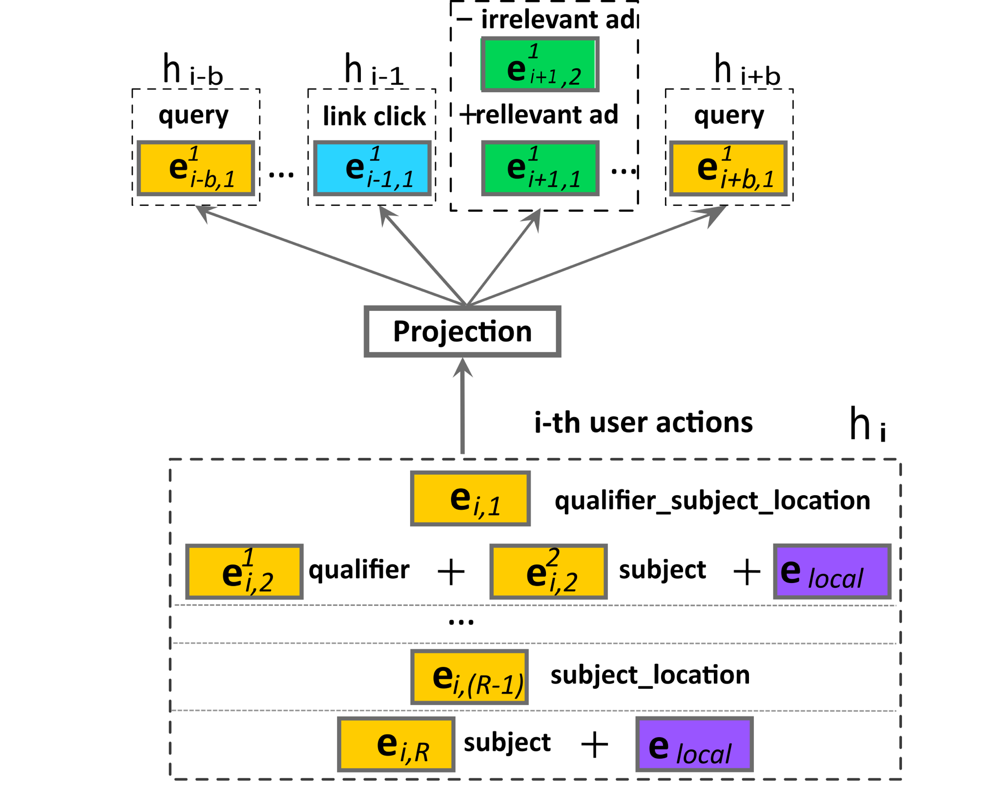
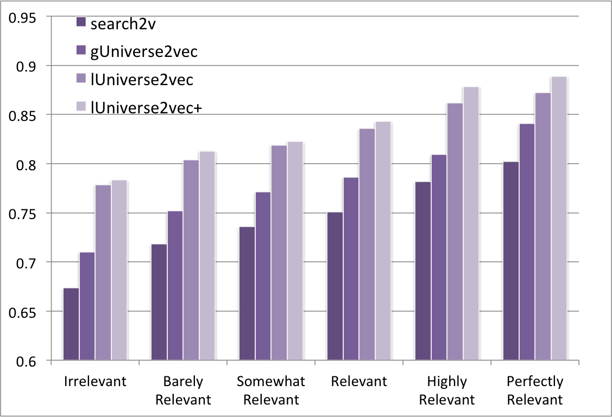

# Location Aware Embedding for Geotargeting in Sponsored Search Advertising

> **arxiv**: https://arxiv.org/abs/2603.13997  
> **Authors**: (Yahoo! Research)  
> **Venue**: Preprint 2026

## Abstract

Mobile search growth creates significant opportunities for geotargeting in sponsored search advertising. However, local intent queries present unique challenges: 45% of queries appear fewer than 5 times per month (long-tail), and they contain three complex components — query subject, interest location, and ranking signals. This paper introduces the **worLd2vec** model family, which learns joint embeddings of queries, locations, ads, and semantic fragments in a unified vector space. We propose five progressively sophisticated models: gw2v_woeid (location as global session context with physical representation), gw2v_poi (location as POI semantic representation), lw2v (location as local query context), lw2v+ (compositional query+location representation), and lw2vCRF+ (CRF-extracted semantic fragments + compositional representation). Experiments on Yahoo! production data demonstrate significant improvements in precision@K for ad retrieval and NDCG for ad ranking, with lw2vCRF+ achieving the best results on explicit local queries by solving the cold-start problem through semantic compositional retrieval.

## 1. Introduction

Mobile search creates a strong signal for geotargeting: when a user searches near Times Square, their intent for "coffee shop" differs from the same query issued from a suburban location. This location context is valuable for sponsored search — matching ads not just to the query text, but to the combination of query intent and user location.

> **Figure 1.** Tail is predominant in local intent queries — 45% of queries appear fewer than 5 times per month, making frequency-based approaches insufficient.

The long-tail distribution of local queries is the central challenge: traditional frequency-based retrieval (e.g., search2vec trained on high-frequency query-ad co-clicks) fails for rare queries. The solution requires **compositional generalization**: inferring the right ads for unseen "hotels in Denver" by combining semantic representations of "hotels" and "Denver" independently.

> **Figure 2.** System architecture for location-aware sponsored search. The worLd2vec models are deployed at the retrieval stage to improve recall and precision for local intent queries.

## 2. Problem Set-up

### 2.1. System Overview

The sponsored search system follows a standard cascade: query understanding → ad retrieval (worLd2vec operates here) → ad ranking → auction. worLd2vec improves the retrieval stage by learning location-aware embeddings that can match queries with location context to relevant ads.

### 2.2. Queries with Local Intent

Queries are classified into:
- **Explicit local queries**: contain location keywords (e.g., "pizza in Chicago")
- **Implicit local queries**: no location keyword but location-dependent intent (e.g., "airport parking" near an airport)

Both types benefit from location-aware embeddings, but with different challenges: explicit queries need accurate location matching while implicit queries need location-sensitive intent inference.

### 2.3. Location Enriched Sponsored Search Session

Each search session $S$ is enriched with location: $S = (q_1, q_2, \ldots, q_n, \ell)$ where $\ell$ is the user's current location, represented either as:
- **Physical location (WOEID)**: Yahoo!'s Where On Earth identifier — a geographic hierarchy ID
- **Semantic location (POI)**: the nearest Point of Interest, providing semantic meaning (e.g., "O'Hare Airport" instead of lat/lon)

### 2.4. Ad Retrieval Task Evaluation

**Precision@K**: Among top-K retrieved ads for a query, what fraction are relevant (clicked in historical logs)?

**NDCG via editorial judgments**: Human-annotated relevance grades for (query, location, ad) triplets, measuring ranking quality beyond click-based metrics.

## 3. Location Aware Embeddings for Sponsored Search

### 3.1. Distributed Representations for Web Search: s2v

The baseline **search2vec (s2v)** trains word2vec-style embeddings on query-ad click sessions, learning that queries which lead to similar ad clicks have similar representations. This works well for frequent queries but fails for the long tail.

### 3.2. Search Session Location as a Global Context: gw2v

#### 3.2.1. global-worLd2vec model (gw2v)

gw2v treats the user's location as a **global context** for the entire search session. The model extends word2vec's CBOW/Skip-gram to include location as an additional context word:

$$\text{Objective: } \max \sum_{q \in S} \log P(q | \text{context}(S), \ell)$$

where $\ell$ (WOEID or POI) is appended to the session context window.

> **Figure 3b.** gw2v model: location as global session context.

#### 3.2.2. Experiments with gw2v

| Model | Implicit Queries P@K | Explicit Queries P@K |
|-------|---------------------|---------------------|
| s2v (baseline) | — | — |
| gw2v_woeid | +6% to +20% | Limited improvement |
| gw2v_poi | **Best for implicit** | Limited improvement |

**Key finding**: gw2v_poi (POI representation) outperforms gw2v_woeid for implicit queries because POI names carry semantic meaning (e.g., "shopping mall" is semantically informative; a raw WOEID is not). However, POI coverage is only ~5% of sessions, limiting its reach.

> **Figure 4.** Average and Median gw2v Score by Editorial Grade, showing that gw2v captures semantic relevance beyond click-based signals.

### 3.3. Using Location Information Locally for Local Queries: lw2v

#### 3.3.1. lw2v model

While gw2v uses location as a global session-level context, lw2v uses location as a **local query-level context**: for each individual query $q$, the location $\ell$ is used as the direct context:

$$P(q_i | q_j, \ell) \text{ or } P(\ell | q_i)$$

> **Figure 3c.** lw2v model: location as local query context.

#### 3.3.2. Experiments with lw2v

lw2v shows the strongest improvement (+7%) on explicit queries compared to gw2v. This makes intuitive sense: explicit local queries have a tight coupling between query and location, which lw2v directly models.

### 3.4. Learning Compositional Representation of Query and Location: lw2v+

#### 3.4.1. lw2v+ model

lw2v+ extends lw2v by learning a **compositional representation** of query + location. Instead of treating them as separate context elements, lw2v+ computes a combined embedding:

$$\text{embedding}(q, \ell) = \text{embedding}(q) + \text{embedding}(\ell)$$

This vector addition in the embedding space enables **compositional retrieval**: a new query "hotels in Seattle" can be retrieved as the sum of the "hotels" embedding and the "Seattle" embedding, even if this exact combination was never observed in training.

> **Figure 3d.** lw2v+ model: compositional query + location representation.

**Table 5** shows nearest neighbors to the vector "hotels" + "New York": the model correctly retrieves hotel-related ads targeting New York, demonstrating learned compositional semantics.

#### 3.4.2. Experiments with lw2v+

lw2v+ provides +5-20% improvement on implicit queries where the location is used compositionally to disambiguate query intent.

### 3.5. Learning Compositional Representations with CRF: lw2vCRF+

#### 3.5.1. lw2vCRF+ model

The final model addresses a key limitation of lw2v+: raw queries are noisy and may contain extraneous words that dilute the compositional signal. lw2vCRF+ applies a **Conditional Random Field (CRF)** parser to extract semantic fragments:

| Fragment Type | Example |
|--------------|---------|
| Organization/Business name | "Starbucks" |
| Business category | "coffee shop" |
| Location | "downtown Seattle" |
| Qualifier | "24-hour" |

The compositional embedding is then computed over the *semantic fragments* rather than raw query tokens:

$$\text{embedding}(q_{\text{parsed}}, \ell) = \text{embedding}(\text{subject}) + \text{embedding}(\text{location})$$

> **Figure 7.** lw2vCRF+ model: CRF extracts semantic fragments (subject, location, qualifier), which are then combined compositionally for ad retrieval.

#### 3.5.2. Experiments with lw2vCRF+

**Table 3: Precision@K on various retrieval tasks.**

| Task | s2v | lw2v | lw2v+ | lw2vCRF+ |
|------|-----|------|-------|----------|
| query2ad | Base | +3% | +5% | **+7%** |
| (query+location)2ad | Base | +5% | +8% | **Best** |
| (subject+location)2ad | Base | — | — | **+15%** |
| qualifier_subject_location2ad | Base | — | — | **+20%** |

lw2vCRF+ is the best overall model, particularly for compositional retrieval tasks where the query can be decomposed into semantic fragments.

**Cold-start solution**: For unseen queries, lw2vCRF+ can retrieve ads via semantic fragment composition, providing a principled solution to the long-tail retrieval problem.

**Ad ranking quality:**

> **Figure 5.** Average NDCG results for s2v, gw2v, lw2v, and lw2v+ models across query types. Location-aware models consistently outperform the location-agnostic baseline.

## 4. Related Work

### 4.1. Retrieval and Ranking for Local Queries

Prior work on local search focuses on query-location feature engineering for ranking. worLd2vec differs by learning location representations jointly with query and ad representations, enabling end-to-end retrieval.

### 4.2. Location Representation

Geographic embeddings (GeoVec, Place2Vec) learn representations from geographic co-occurrence. worLd2vec integrates location into the search session embedding framework rather than learning geography in isolation.

### 4.3. Learning Vector Composition Models

Word2vec composition via vector addition is well-studied for word analogies ("king" - "man" + "woman" ≈ "queen"). worLd2vec applies this to the query+location composition for ad retrieval, adapting the analogy framework to a commercial retrieval task.

## 5. Conclusions

The worLd2vec model family demonstrates that location-aware embeddings substantially improve sponsored search ad retrieval for local intent queries. Key findings:
1. **POI representation** (semantic location) outperforms physical location IDs for implicit queries
2. **Compositional representations** (lw2v+, lw2vCRF+) are essential for handling the long-tail of rare local queries
3. **CRF-based semantic parsing** (lw2vCRF+) provides the best results by cleaning noisy query text before composition
4. Location-aware models consistently outperform location-agnostic baselines across both precision@K and NDCG metrics

## References

- Mikolov et al. (2013) Distributed representations of words and phrases and their compositionality. NeurIPS '13.
- Pennington et al. (2014) GloVe: global vectors for word representation. EMNLP '14.
- Lafferty et al. (2001) Conditional random fields: probabilistic models for segmenting and labeling sequence data. ICML '01.
- Grbovic et al. (2015) E-commerce in your inbox: product recommendations at scale. KDD '15.
- Levy & Goldberg (2014) Linguistic regularities in sparse and explicit word representations. CoNLL '14.
