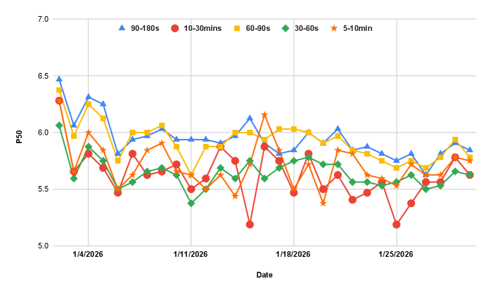
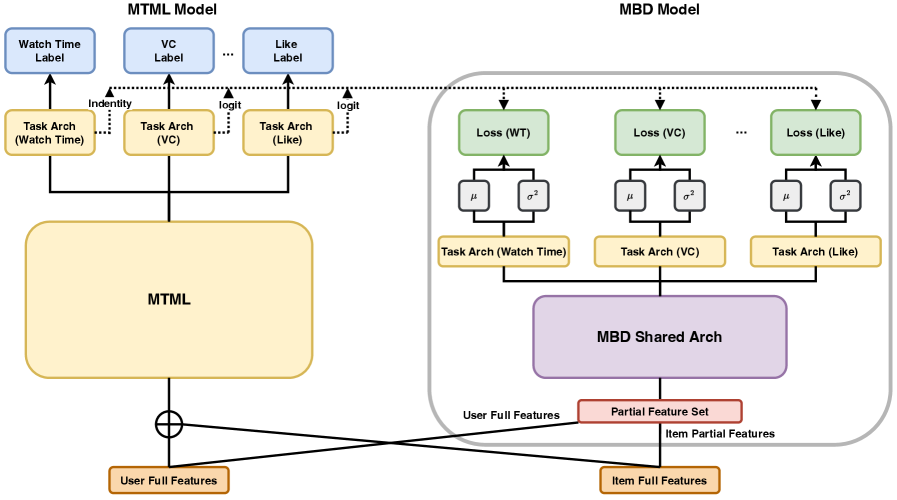
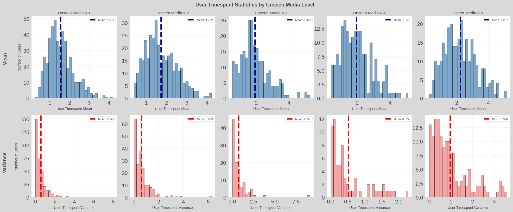
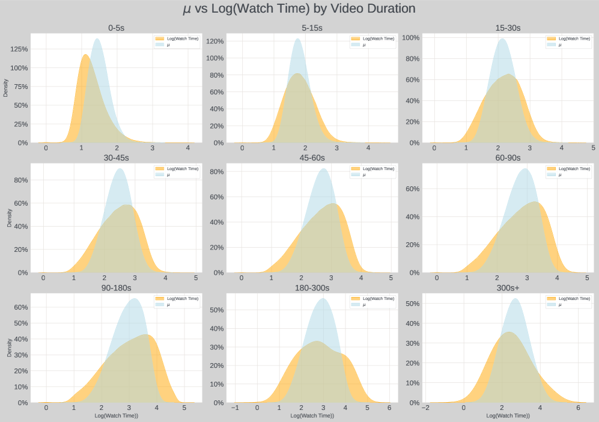
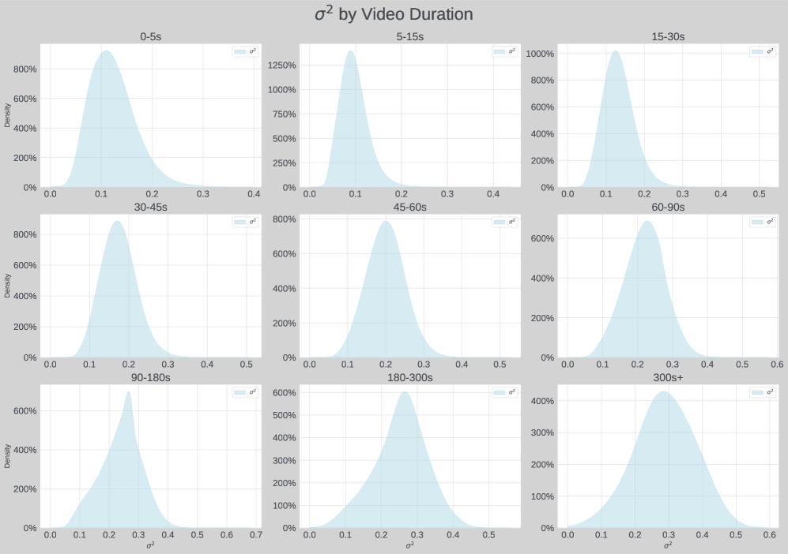

# MBD: A Model-Based Debiasing Framework Across User, Content, and Model Dimensions

> **arxiv**: https://arxiv.org/abs/2603.14422  
> **Authors**: (Meta AI)  
> **Venue**: Preprint 2026

## Abstract

Behavioral signals in modern recommendation systems are inherently biased. For instance, watch time signals favor longer videos, while loop rate signals favor shorter ones. These biases manifest in two key ways: (1) value model scores misalign with users' true preferences, and (2) changes in system rules cause dramatic ecosystem fluctuations. To address these challenges, we propose MBD (Model-Based Debiasing), a unified framework that models the contextual distribution of behavioral signals and constructs unbiased signals via z-score normalization or relative percentile scoring. Unlike traditional bucketized counting approaches, MBD jointly estimates contextual mean (μ) and variance (σ²) through supervised learning, integrates seamlessly into existing multi-task multi-label (MTML) models with less than 5% compute overhead, and eliminates stale statistics by adapting in real-time. Offline experiments confirm accurate distribution estimation and effective bias removal (correlation to video duration drops from 0.35 to 0.003). Online A/B tests on a billion-user short-video platform demonstrate consistent gains: duration debiasing yields +0.198% watch time and +0.173% likes; format debiasing yields +0.018% sessions and +0.034% watch time; cold-start debiasing yields +0.190% breakthrough rate and +0.135% impressions.

## 1. Introduction

Recommendation systems rely on behavioral signals such as watch time, like rate, and loop rate to model user preferences. However, these signals are inherently biased by item-level features (e.g., video duration), user-level features (e.g., user activity), and model-level feedback loops. A common form of bias is that watch time naturally correlates with video duration — longer videos tend to accumulate more watch time regardless of content quality. This misalignment causes value models to overestimate the quality of long videos and underestimate short ones, distorting the recommendation ecosystem.

Two primary impacts of such bias are: (1) **Value model score misalignment**: biased signals cause models to confound item length/format effects with actual user preference; (2) **Ecosystem fragility**: when business rules change (e.g., promoting a new content format), the biased signals cause over-correction or under-correction, leading to dramatic fluctuations in platform-level metrics.

Naive debiasing approaches, such as bucketized counting (dividing by mean within pre-defined bins), have several limitations: they require offline statistical tables that can become stale, they cannot capture distribution shape beyond the mean, and they cannot generalize to complex interaction patterns between multiple bias features.

MBD addresses these limitations by learning the contextual distribution of each behavioral signal end-to-end within the MTML framework.

## 2. Preliminary: Existing Systems

### 2.1. Signal Bias in Recommendation Systems

Bias sources are categorized along three dimensions:
- **Item bias**: Video duration, content format (short vs. long video)
- **User bias**: User activity level, historical engagement patterns
- **Model bias**: Feedback loops that amplify existing biases over time

For example, Figure 2 shows that the transformed watch time P50 exhibits a strong monotonic trend with video duration over one month of real production data, confirming the systematic nature of duration bias.

> **Figure 2.** Transformed watch time (P50) trend over one month bucketed by video length, demonstrating the systematic nature of duration bias.

### 2.2. Naive Debiasing Approaches via Bucketized Counting

The most straightforward approach divides raw signals by the bucket mean: $\tilde{r} = r / \mu_{bucket}$. This approach suffers from:
1. **Stale statistics**: Offline tables need periodic refresh and lag behind distribution shifts
2. **Mean-only normalization**: Does not account for variance across buckets
3. **Feature inflexibility**: Requires manually defining bucket boundaries for each bias feature

## 3. MBD: Model-Based Debiasing Framework

> **Figure 1.** The MBD framework augments the MTML model with an additional branch that estimates contextual distribution statistics (μ, σ²) through a partial feature set, then constructs unbiased signals via z-score or percentile normalization.

### 3.1. Specifying Bias

MBD requires specifying a **bias feature set** $\mathcal{B}$ — a flexible subset of features believed to induce bias (e.g., video duration + user activity level for watch-time debiasing). This design choice is the key differentiator: by decoupling the bias branch from the main recommendation branch, MBD can isolate and neutralize specific confounders while preserving the main model's learning capacity.

### 3.2. Contextual Mean and Variance Estimates via Supervised Learning

Given bias features $\mathcal{B}$, MBD learns to estimate both the conditional mean μ and variance σ² of the behavioral signal $r$:

$$\mu(\mathcal{B}) = \mathbb{E}[r | \mathcal{B}], \quad \sigma^2(\mathcal{B}) = \text{Var}[r | \mathcal{B}]$$

The learning is formulated as a moment estimation problem via **decoupled moment estimation**: the mean head minimizes MSE loss on raw signal values, while the variance head minimizes the NLL under a Gaussian or log-normal assumption. Crucially, gradient is stopped from flowing back through the bias branch into the main ranking model, preventing the debiasing branch from corrupting the representation learning of the main model.

> **Figure 3.** User-level transformed time spent mean and variance distribution stratified by video length, showing that both μ and σ² vary systematically with duration — validating the need for joint distribution modeling.

### 3.3. Unbiased Signal Construction

MBD constructs the **Relative Preference Score (RPS)** by normalizing the raw signal relative to its estimated contextual distribution:

$$\text{RPS}_{z\text{-score}} = \frac{r - \mu(\mathcal{B})}{\sigma(\mathcal{B})}$$

Alternatively, a percentile-based RPS can be used when the exact distribution form is unknown. Three downstream application strategies are supported:
1. **Additive boost**: use RPS as an additional feature for the main model
2. **Hard filtering**: threshold on RPS to filter low-quality content
3. **Multiplicative re-weighting**: rescale training sample weights by RPS

### 3.4. Special Handling for Binary Signals

For sparse binary signals (e.g., like rate, which is Bernoulli-distributed), direct z-score normalization in the probability space can be numerically unstable. MBD applies logit-space projection:

$$\text{logit}(p) = \log\frac{p}{1-p}$$

and performs distribution estimation in logit space, then maps back for downstream use.

## 4. Experiments

### 4.1. Offline Evaluation

**Table 1: Contextual distribution estimation quality.**

| Method | Bias (↓) | NLL (↓) | Correlation to Duration (↓) |
|--------|----------|---------|-----------------------------|
| No debiasing | — | — | 0.35 |
| Bucketized counting | — | — | 0.12 |
| MBD | ≈0 | Best | **0.003** |

MBD effectively eliminates the duration bias (correlation reduced from 0.35 to 0.003) while achieving the best distributional fit (NLL).

**Analysis of predicted μ and σ²:**

 

> **Figures 4a/4b.** Predicted mean μ_MBD and variance σ²_MBD across duration buckets. Both statistics are accurately captured, validating the model's distribution estimation capacity.

### 4.2. Applications: Three Case Studies

**Table 3: Online A/B testing results.**

| Case | Metric | Gain |
|------|--------|------|
| Case 1 – Duration Debias | Watch Time | **+0.198%** |
| Case 1 – Duration Debias | Likes | **+0.173%** |
| Case 2 – Format Debias | Sessions | **+0.018%** |
| Case 2 – Format Debias | Watch Time | **+0.034%** |
| Case 3 – Cold-start Debias | Breakthrough Rate | **+0.190%** |
| Case 3 – Cold-start Debias | Impressions | **+0.135%** |

All results are statistically significant (p < 5%).

#### Case 1 – Media Length Debias

The most direct application: debias watch time by conditioning on video duration. Using RPS replaces the raw watch-time signal in the ranking objective. Online A/B shows users receive more balanced content across different video lengths, with overall engagement improving.

#### Case 2 – Content Format Debias

With the proliferation of mixed content formats (short clips, stories, standard videos), format-level biases cause models to systematically over-recommend one format over others. MBD conditions on content format as the bias feature, enabling format-agnostic quality estimation. Online A/B shows improved session depth.

#### Case 3 – Content Cold-start Debias

New content suffers from cold-start bias: low historical exposure leads to systematically underestimated quality scores. MBD incorporates content age and exposure count into the bias feature set, enabling fair comparison between new and established content. Online A/B shows significant improvements in content breakthrough rate and impressions for new creators.

### 4.3. Engagement Efficiency Analysis

**Table 4: Engagement efficiency by video length buckets.** The Efficiency Ratio (%ΔWT / %ΔVV) quantifies the quality of traffic redistribution: ratio < 100% during pruning (↘) indicates removal of low-value views; ratio > 100% during promotion (↗) indicates surfacing of high-retention content.

| Duration Bucket | Traffic Change | Efficiency Ratio |
|-----------------|---------------|-----------------|
| Very Short (<20s) | ↘ Pruned | < 100% |
| Medium (1–3 min) | Stable | ~100% |
| Long (>5 min) | ↗ Promoted | > 200% |

This analysis confirms that MBD successfully reallocates traffic from low-retention short videos to high-retention long-form content, improving platform-level efficiency.

## 5. Related Work

### 5.1. Debiasing in Recommender Systems

Prior debiasing work largely focuses on exposure/popularity bias via propensity scoring (IPS), inverse propensity weighting, or causal inference. MBD differs by addressing *signal* bias (the bias in behavioral metrics used as training labels) rather than *exposure* bias.

### 5.2. Duration Bias and Watch Time Prediction

Watch time prediction methods (e.g., Duration-adjusted Learning, WatchNet) model duration effects explicitly but are application-specific and non-generalizable. MBD provides a unified framework applicable to any behavioral signal.

### 5.3. Uncertainty and Distributional Learning

Distribution-free approaches and Gaussian process regression have been used for uncertainty estimation in recommendation. MBD specifically targets distributional normalization for bias removal, distinguishing it from uncertainty quantification work.

## 6. Conclusion and Future Work

MBD presents a generalizable, lightweight, and production-ready framework for recommendation signal debiasing. Its key advantages over prior methods are:
- **Unified**: handles item, user, and model biases through a single framework
- **Lightweight**: <5% compute overhead, no separate service infrastructure
- **Real-time adaptive**: no stale offline statistics
- **Distribution-aware**: models both μ and σ², not just the mean

Future work includes extending MBD to more complex distribution families (e.g., mixture models), and exploring cross-signal debiasing where multiple signal biases interact.

## References

- Canamares et al. (2020) On offline evaluation of recommendation systems. RecSys '20.
- Joachims et al. (2017) Unbiased learning-to-rank with biased feedback. WSDM '17.
- Schnabel et al. (2016) Recommendations as treatments: debiasing learning and evaluation. ICML '16.
- Zhao et al. (2019) Recommending what video to watch next: a multitask ranking system. RecSys '19.
- Zhan et al. (2022) Deconfounding duration bias in watch-time prediction for video recommendation. CIKM '22.
