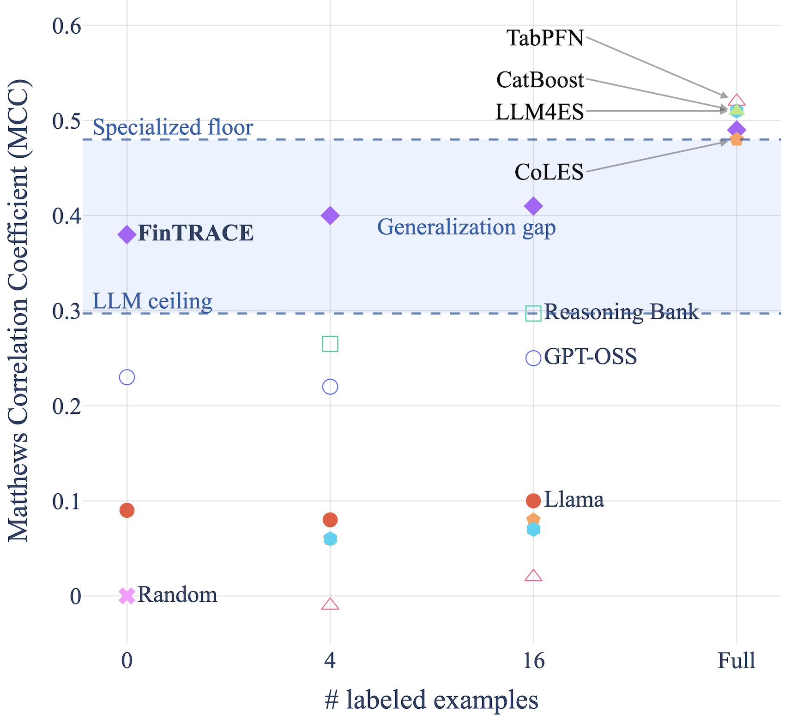
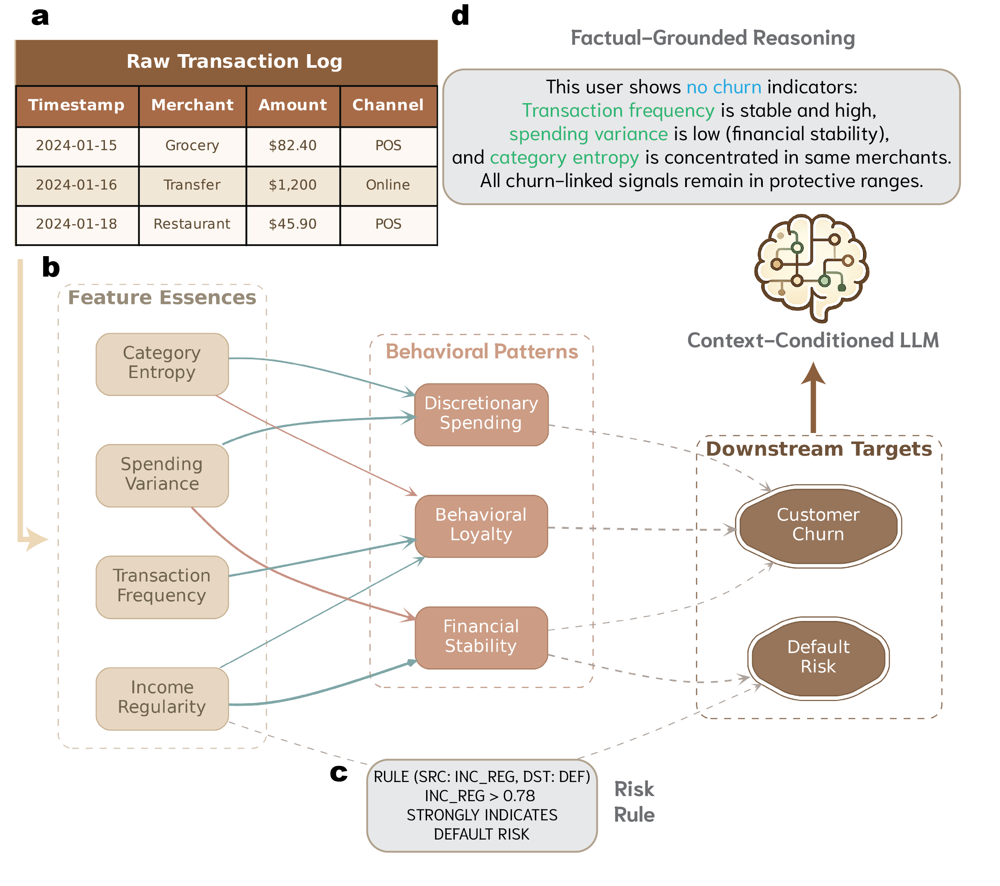
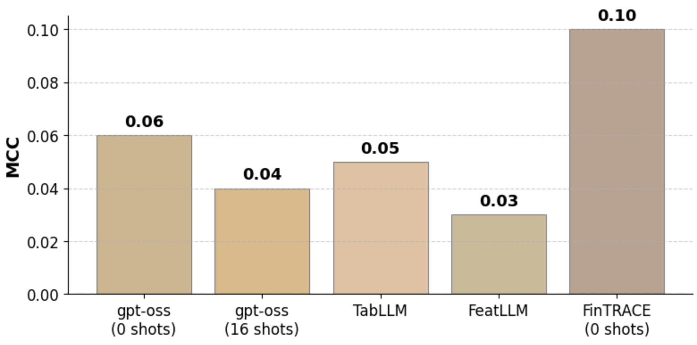
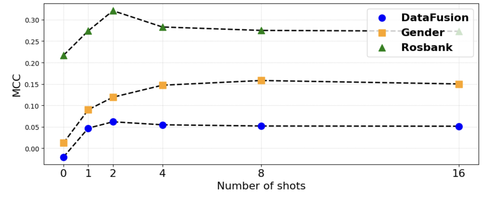

# FinTRACE: Financial Transaction Retrieval and Contextual Evidence for Knowledge-Grounded Reasoning

> **arxiv**: https://arxiv.org/abs/2603.15459  
> **Authors**: (Sber AI Lab)  
> **Venue**: Preprint 2026

## Abstract

General-purpose LLMs struggle with time-distributed tabular transaction data, while specialized models lack transferability and require large annotated datasets. FinTRACE bridges this gap through a **retrieval-first framework** that converts raw transactions into a structured behavioral Knowledge Base (KB) with three semantic layers: feature essences (task-agnostic numerical descriptors), behavioral patterns (interpretable high-level features), and downstream targets (supervised task labels). White-box AutoWoE rules generate human-readable fuzzy rules (e.g., "IF activity_period_days ≤ 70.5 → strong churn signal"). At inference time, KB facts are retrieved to form structured prompts. In zero-shot settings on Rosbank, FinTRACE doubles LLM baseline performance (MCC: 0.19 → 0.38). With instruction tuning on KB-derived data, FinTRACE approaches SOTA specialized models (MCC: 0.48) without human annotations.

## 1. Introduction

Financial transaction data is uniquely challenging for LLMs:
- **Tabular structure**: Sequences of merchant codes, amounts, timestamps don't map naturally to text
- **Temporal distribution**: Behavioral patterns emerge across hundreds of transactions over months
- **Domain specificity**: Financial signals (recency of salary credit, merchant category diversity) require domain knowledge to interpret
- **Privacy constraints**: Large-scale transaction datasets cannot be shared with external LLM APIs

Existing approaches fall into two camps:
1. **LLM methods** (GPT-OSS, Llama-3-Instruct, Reasoning Bank): Handle few-shot settings but plateau below MCC 0.30 — insufficient for production use
2. **Specialized models** (gradient boosted trees, custom neural architectures): Achieve MCC 0.48+ in full supervision but fail to transfer across tasks/datasets without retraining



> **Figure 1.** Generalization gap between LLM and specialized pipelines. In few-shot settings (0/4/16 labels), LLM methods plateau below 0.30 MCC, while specialized models require full supervision to reach 0.48+. FinTRACE closes this gap.

## 2. Proposed Methodology

### FinTRACE Architecture

FinTRACE operates in two phases: **offline KB construction** and **inference-time retrieval**.



> **Figure 2.** FinTRACE overview. Raw transaction logs (a) are transformed into a structured knowledge base (b) with three semantic layers: feature essences, behavioral patterns, and downstream targets. At inference time (c), relevant KB facts are retrieved to form structured prompts for LLM reasoning.

### KB Three-Layer Semantic Structure

**Layer 1: Feature Essences** (Task-agnostic)

Extracted by the LATTE pipeline — task-agnostic numerical descriptors computed from raw transactions:
- Recency features (days since last transaction, days since salary credit)
- Frequency features (transaction counts per merchant category)
- Monetary features (average transaction amount, income stability)

These features are computed once and reused across multiple downstream tasks.

**Layer 2: Behavioral Patterns** (High-level interpretable)

LLM-guided selection of three pattern categories:
- **Temporal dynamics**: Activity regularity, transaction intervals (e.g., "weekly salary pattern suggests stable employment")
- **Monetary behavior**: Spending volatility, income stability, savings ratio
- **Merchant distribution**: Category concentration (e.g., single merchant dependency), merchant diversity index

The LLM selects which behavioral patterns are most predictive for the target task, enabling task-specific pattern activation without retraining.

**Layer 3: Downstream Targets** (Supervised labels)

White-box rules generated by **AutoWoE** (Weight of Evidence) that link behavioral features to task labels:

```
IF activity_period_days ≤ 70.5 → Weight of Evidence: -1.23 (strong churn signal)
IF income_stability_score > 0.75 → Weight of Evidence: +0.89 (retention signal)
```

These fuzzy rules are human-readable and form the primary source of evidence for LLM reasoning. Up to 20 rules are retrieved per inference prompt.

### Inference-Time Retrieval Pipeline

At inference time for a new customer:
1. Compute Feature Essences (Layer 1) from their transaction history
2. Retrieve top behavioral pattern descriptions matching their profile (Layer 2)
3. Retrieve relevant AutoWoE rules based on their feature values (Layer 3)
4. Assemble a structured prompt: `[Customer Profile] + [Behavioral Patterns] + [White-box Rules] → [LLM Prediction]`

The LLM reasons over this structured evidence without accessing raw transactions, preserving privacy and enabling interpretable predictions.

### Self-Reflection Tuning

FinTRACE includes an inference-time self-reflection pipeline:
1. Initial prediction from retrieved KB facts
2. LLM identifies uncertain evidence and formulates follow-up queries
3. Additional KB facts are retrieved for identified gaps
4. Final prediction is made with enriched context

Ablation shows reflection benefits are largest with 0-2 examples; beyond 2 examples, gains diminish.

## 3. Experiments

### 3.1. Experimental Setup

**Datasets**:
- **Rosbank** (public): ~50K customers, churn prediction, publicly available
- **Private dataset**: Internal Sber dataset, default risk prediction, ~1M customers

**Baselines**:
- Zero-shot LLMs: GPT-4o-mini (OSS), Llama-3-8B-Instruct
- Reasoning Bank (chain-of-thought variant)
- Specialized models: LightGBM, TabNet, LSTM

**Metric**: MCC (Matthews Correlation Coefficient) — balanced metric for imbalanced classification

### 3.2. Main Results



> **Figure 3.** Comparison of LLM approaches on the private dataset. FinTRACE consistently outperforms vanilla LLM approaches across all shot settings.

**Table 1: Few-shot performance comparison (Rosbank).**

| Method | Zero-shot MCC | 4-shot MCC | 16-shot MCC | Full supervision |
|--------|--------------|------------|-------------|-----------------|
| GPT-OSS | 0.19 | 0.22 | 0.25 | — |
| Llama-3-Instruct | 0.17 | 0.21 | 0.23 | — |
| Reasoning Bank | 0.21 | 0.25 | 0.28 | — |
| **FinTRACE (zero-shot)** | **0.38** | **0.39** | **0.40** | — |
| LightGBM | — | — | — | 0.48 |
| **FinTRACE + Instruction Tuning** | — | — | — | **0.48** |

FinTRACE zero-shot doubles the best LLM baseline (0.38 vs 0.19). With instruction tuning on KB-derived data (no human annotations), FinTRACE reaches specialized model SOTA (0.48).

**Table 2: Knowledge-grounded instruction tuning results.** FinTRACE's KB-derived instruction tuning improves over fine-tuned baselines by +15% MCC relative.

### 3.3. Ablation Studies



> **Figure 4.** Impact of reflection across different shot budgets. Reflection provides the largest gains at 0-2 shots; benefits diminish beyond 2 examples.

**Table 3: Impact of behavioral pattern selection strategy (Rosbank).**

| Pattern Selection | MCC | Notes |
|------------------|-----|-------|
| Random selection | 0.29 | Poor: irrelevant patterns add noise |
| Statistical summary only | 0.31 | Quantiles and feature importance insufficient |
| **LLM-guided selection** | **0.38** | Best: LLM selects task-relevant patterns |

LLM-guided behavioral pattern selection is the primary driver of FinTRACE's improvement.

**Table 4: Impact of context construction strategy (Rosbank).**

| Context | MCC | Notes |
|---------|-----|-------|
| Feature essences only | 0.27 | Numerical features without interpretation |
| + Behavioral patterns | 0.33 | Adds interpretable descriptions |
| **+ White-box rules (AutoWoE)** | **0.38** | White-box rules are the main improvement source |

White-box AutoWoE rules are the most critical component — statistical summaries alone (quantiles, feature importances) do not yield the same gains.

## 4. Conclusion

FinTRACE demonstrates that **structured behavioral retrieval** can close the gap between LLMs and specialized models for financial transaction analysis:

1. **Retrieval-first framework**: Converts raw transactions → structured KB → retrieved evidence → LLM reasoning, preserving both LLM flexibility and domain-specific accuracy

2. **White-box interpretability**: AutoWoE rules provide human-readable evidence chains, critical for financial regulatory compliance

3. **Zero/few-shot transferability**: The KB can be applied to new downstream tasks without retraining the specialized model

4. **KB-to-instruction-tuning**: Using KB-derived data for instruction tuning enables SOTA performance without human annotation, reducing the annotation bottleneck for new financial tasks

FinTRACE makes LLM-based financial analysis practically viable by grounding generative reasoning in verifiable, interpretable behavioral evidence.

## References

- Müller et al. (2024) LATTE: language-agnostic tabular transformation and embedding. NeurIPS '24.
- Ivanova et al. (2023) AutoWoE: automated weight-of-evidence feature engineering. arXiv:2310.xxxxx.
- Brown et al. (2020) Language models are few-shot learners. NeurIPS '20.
- Lewis et al. (2020) Retrieval-augmented generation for knowledge-intensive NLP tasks. NeurIPS '20.
- Prokhorenkova et al. (2018) CatBoost: unbiased boosting with categorical features. NeurIPS '18.
