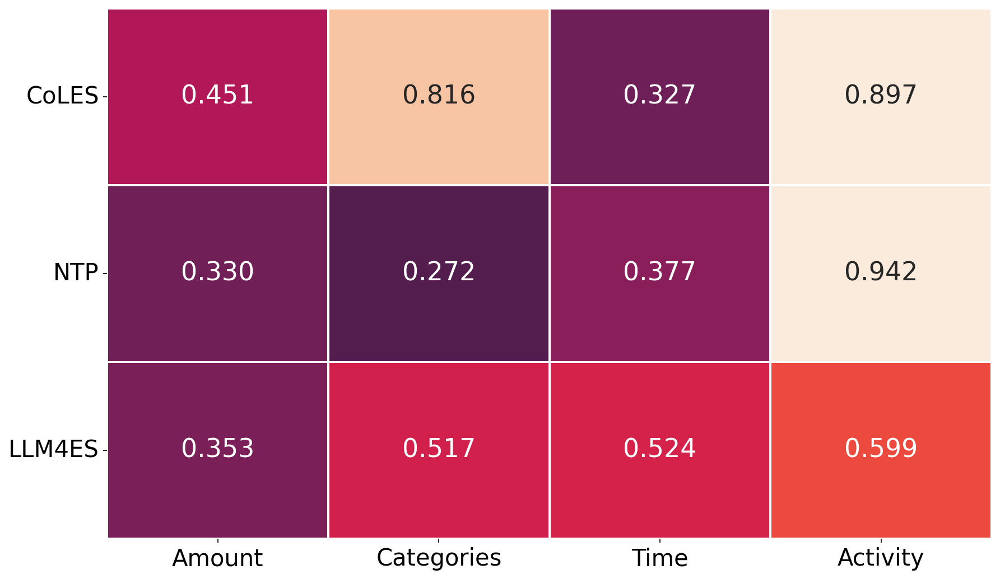
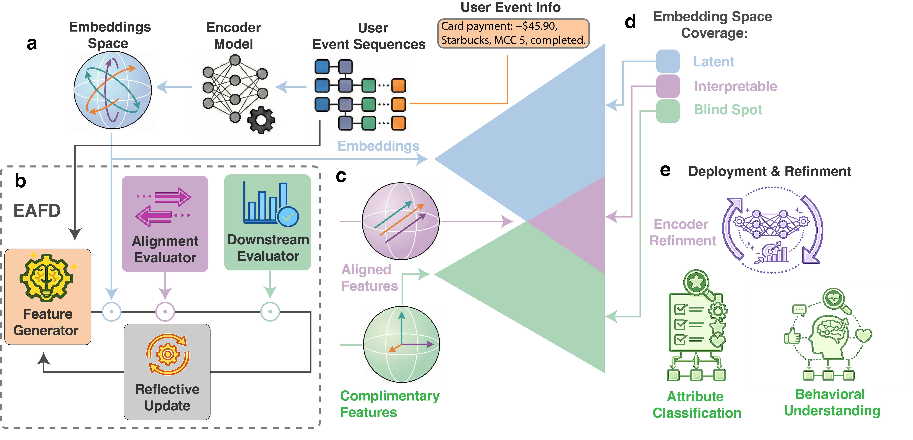
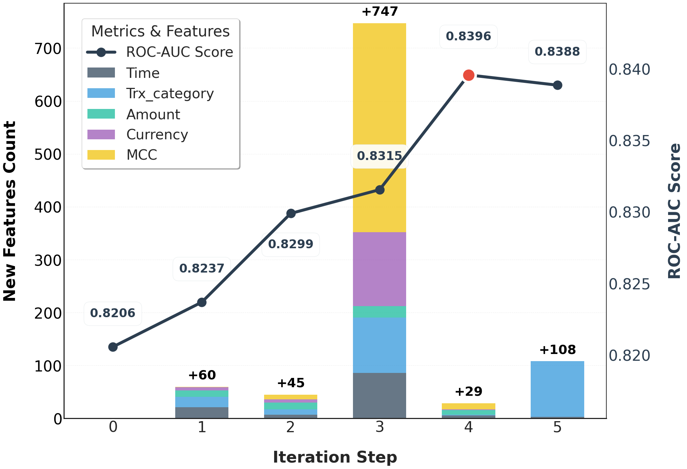
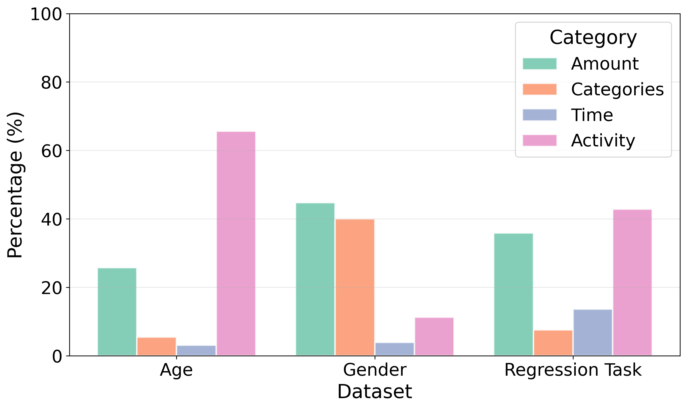
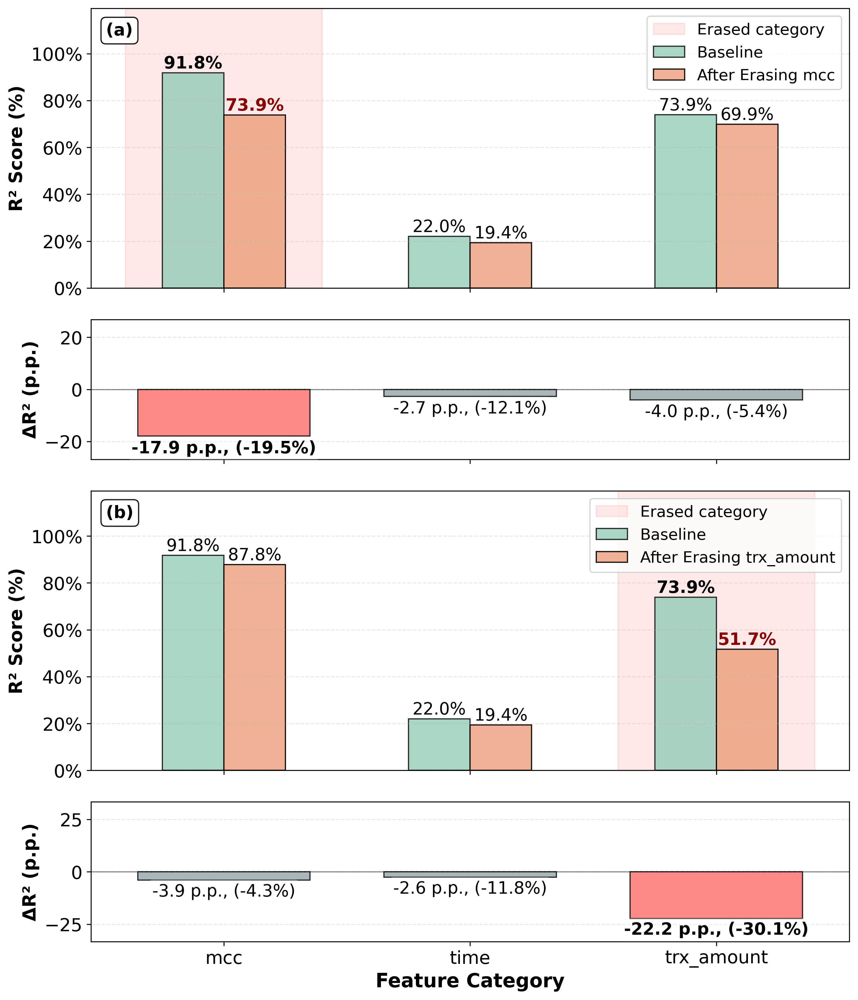

# Embedding-Aware Feature Discovery: Bridging Latent Representations and Interpretable Features in Event Sequences

> **arxiv**: https://arxiv.org/abs/2603.15713
> **Authors**: Ivan Sergeev, Alexey Shestov, Omar Zoloev, Elizaveta Kovtun, Gleb Gusev, Andrey Savchenko, Maksim Makarenko (Sber AI Lab; ISP RAS Research Center for Trusted AI)
> **Venue**: Preprint 2026

## Abstract

Industrial financial systems operate on temporal event sequences such as transactions, user actions, and system logs. While recent research emphasizes representation learning and large language models, production systems continue to rely heavily on handcrafted statistical features due to their interpretability, robustness under limited supervision, and strict latency constraints. This creates a persistent disconnect between learned embeddings and feature-based pipelines. We introduce *Embedding-Aware Feature Discovery* (EAFD), a unified framework that bridges this gap by coupling pretrained event-sequence embeddings with a self-reflective LLM-driven feature generation agent. EAFD iteratively discovers, evaluates, and refines features directly from raw event sequences using two complementary criteria: *alignment*, which explains information already encoded in embeddings, and *complementarity*, which identifies predictive signals missing from them. Across both open-source and industrial transaction benchmarks, EAFD consistently outperforms embedding-only and feature-based baselines, achieving relative gains of up to +5.8% over state-of-the-art pretrained embeddings, resulting in new state-of-the-art performance across event-sequence datasets.

## 1 Introduction

Industrial machine learning systems commonly operate on temporal event sequences, including financial transactions, online purchase histories, electronic health records, and spatial trajectories. In production environments, these sequences are processed under strict constraints on latency, throughput, and stability, which has led to the widespread adoption of specialized encoder models producing compact embeddings alongside handcrafted statistical interpretable features.

While recent research has increasingly focused on representation learning, real-world systems continue to rely heavily on feature-based pipelines due to their ease of configuration for new tasks with limited labeled data, interpretability, and predictable runtime behavior.

> **Figure 1.** Blind spots of embeddings. Coefficient of determination (R²) of a feature reconstruction based on embedding representations CoLES, NTP, and LLM4ES on the Rosbank dataset. Values highlight systematic representational blind spots across embeddings.

The paper identifies a key problem: deep embeddings and statistical features are optimized through largely separate workflows. Examining how well embeddings reconstruct different classes of handcrafted features reveals systematic **representational blind spots** that vary across embedding models. Information missing from the embedding cannot be recovered by subsequent models, leading to performance ceilings and redundant feature construction.

**Contributions:**
- EAFD: a unified framework that transforms the disconnect between embeddings and structured features into an iterative, self-reflective reasoning process.
- State-of-the-art results on four open-source financial benchmarks, with relative gains of up to +5.8% over state-of-the-art embeddings and +19% over weaker representations.
- Analysis revealing systematic representational biases and information gaps in embedding models, with practical encoder refinement and privacy-preserving feature erasure extensions.

## 2 Related Works

Automated feature engineering (AutoFE) has been widely studied for tabular data, with systems ranging from LightAutoML to Featuretools and AutoCross. Recent LLM-based approaches (CAAFE, LLM-FE, DS-Agent) extend AutoFE toward agentic frameworks. However, all these methods are **decoupled from the representation learning** process: they generate features without assessing redundancy or complementarity with the embedding space.

A parallel direction investigates embedding probing and representation analysis (linear probes, sparse decomposition, CKA), but these methods are diagnostic only—they do not generate new features or provide actionable guidance.

EAFD uniquely combines both perspectives: it uses embedding-aware feedback to guide feature generation while simultaneously diagnosing what the embedding encodes.

## 3 Proposed Method

EAFD is an iterative framework for discovering interpretable and complementary features for event-sequence embeddings.

> **Figure 2.** Overview of Embedding-Aware Feature Discovery (EAFD). (a) Latent embedding pipeline mapping event sequences to continuous user representations. (b) EAFD agent loop: an LLM-based generator proposes interpretable features from raw sequences, evaluated by embedding–feature alignment and downstream utility, with reflective updates guiding iteration. (c) Feature outcomes: *aligned* features recover information encoded in the embedding, while *complementary* features capture predictive factors missing from it. (d) Embedding–feature space decomposition into latent, interpretable, and blind-spot regions. (e) Deployment and refinement: discovered features improve downstream tasks and support targeted encoder refinement.

Given a collection of event sequences \\(\mathcal{S} = \{s_i\}_{i=1}^N\\) with downstream labels \\(y_i\\), a pretrained encoder \\(f_\theta\\) maps each sequence to a fixed-dimensional embedding \\(\mathbf{z}_i = f_\theta(s_i)\\). The encoder parameters \\(\theta\\) are **frozen** throughout feature discovery and serve as a stable representation anchor.

EAFD operates in two complementary regimes:

##### Interpretability Regime.

Aims to explain the information encoded in the latent space by aligning with human-interpretable concepts. The **Alignment Score** measures predictive consistency between embeddings and a feature-based predictor:

\\[ A(g_k) = \psi(\mathbf{z}, g_k(\mathcal{S})) \tag{1} \\]

where \\(\psi\\) is R² of a small gradient boosting model mapping generated features to embedding vectors. High \\(A(g_k)\\) indicates the feature effectively translates latent dimensions into interpretable logic.

##### Performance Regime.

Seeks to supplement embeddings with additional predictive signals by identifying "blind spots". The **Downstream Utility Score** compares the loss of an embedding-only model with a joint model:

\\[ U(g_k) = \mathcal{L}(\mathbf{z}, y) - \mathcal{L}([\mathbf{z}, g_k(\mathcal{S})], y) \tag{2} \\]

A positive \\(U(g_k)\\) implies the feature captures complementary structure not present in embeddings.

The generator \\(G\\) (an LLM) is conditioned on detailed reflection from the previous iteration, including alignment/utility scores and qualitative examples. It translates reflective insights into executable code for new candidate features. A self-correction *debug mode* handles code failures. Features are categorized as *aligned* (high \\(A\\), near-zero \\(U\\)) or *complementary* (positive \\(U\\)).

## 4 Experiments

### 4.1 Experimental Settings

#### 4.1.1 Datasets

All datasets consist of transactional or behavioral event sequences:
- **Age Prediction** (ODS.AI): ~44M transactions from 50K users; semi-supervised with 20K unlabeled for pretraining.
- **Gender Prediction** (Sber): 8.4K labeled user sequences with merchant category codes.
- **Rosbank** (Boosters): transaction histories for 10K users over three months; only 5K labeled.
- **DataFusion** (ODS.AI): churn prediction from 13M transactions across 96K users.
- **Proprietary Multi-target Dataset**: private banking dataset with millions of users, predicting age group, gender, and continuous financial outcome.

#### 4.1.2 Implementation Details

- LLM backbone: `gpt-oss-120b` via vLLM on 4× NVIDIA A100 GPUs.
- Context window: 100K tokens, max output: 16K tokens.
- EAFD iterations: 5.
- Evaluation model: CatBoost.

### 4.2 Performance Evaluation

**Table 1. Performance comparison of EAFD against baseline embeddings and feature-based agents.**

| Method | Age (Acc) | Δ% | Gender (AUC) | Δ% | Rosbank (AUC) | Δ% | DataFusion (AUC) | Δ% |
|--------|-----------|-----|--------------|-----|----------------|-----|------------------|-----|
| CoLES | 0.645 | – | 0.888 | – | 0.835 | – | 0.738 | – |
| NTP | 0.540 | – | 0.849 | – | 0.798 | – | 0.648 | – |
| LLM4ES | 0.651 | – | – | – | 0.849 | – | – | – |
| Agg Features + CoLES | 0.649 | +0.62 | 0.889 | +0.11 | 0.832 | -0.36 | 0.740 | +0.27 |
| Featuretools + CoLES | 0.644 | -0.16 | 0.889 | +0.11 | 0.863 | +3.35 | 0.760 | +2.98 |
| CAAFE (Featuretools + CoLES) | 0.641 | -0.62 | 0.882 | -0.68 | 0.870 | +4.19 | 0.762 | +3.25 |
| **EAFD (CoLES)** | **0.649** | **+0.62** | **0.898** | **+1.13** | **0.872** | **+4.43** | **0.781** | **+5.83** |
| **EAFD (NTP)** | **0.623** | **+15.37** | **0.870** | **+2.47** | **0.865** | **+8.40** | **0.773** | **+19.29** |
| EAFD (LLM4ES) | 0.652 | +0.15 | – | – | 0.866 | +2.00 | – | – |

EAFD consistently improves performance over all backbone embeddings. The most pronounced gains occur for NTP embeddings (+15.4% Age, +19.3% DataFusion), where EAFD recovers task-relevant structure that NTP weakly encodes.

#### 4.2.1 Iterative Feature Generation Dynamics

> **Figure 3.** EAFD iteration dynamics of Rosbank validation ROC-AUC and feature composition across EAFD iterations.

Validation ROC-AUC rises steadily from a baseline of 0.8206 to a peak of 0.8396 by the fourth iteration. In total, EAFD utilizes 37 distinct aggregation functions over five iterations. The most significant gains are often driven by interpretable temporal features (time elapsed between first/last transaction, transaction frequency within windows). The framework also identifies complex behavioral signals including HHI on MCC distributions, EWMA, and autocorrelation features.

#### 4.2.2 Multi-target Feature Generation

**Table 2. Performance comparison on the Private Dataset across classification and regression tasks.**

| Method | Age (Acc) | Gender (AUC) | Regression (MAE) |
|--------|-----------|--------------|------------------|
| CoLES | 0.743 | 0.898 | 11373 |
| NTP | 0.736 | 0.895 | 10839 |
| LLM4ES | 0.692 | 0.789 | 11462 |
| **EAFD (CoLES)** | **0.756 (+1.75%)** | **0.901 (+0.33%)** | **10933 (-3.87%)** |
| **EAFD (NTP)** | **0.739 (+0.41%)** | **0.897 (+0.23%)** | **10671 (-1.55%)** |
| **EAFD (LLM4ES)** | **0.714 (+3.18%)** | **0.888 (+12.55%)** | **11108 (-3.09%)** |

A single EAFD-enhanced representation improves across all classification and regression targets. EAFD also demonstrates intrinsic adaptability by tailoring feature generation per target:

> **Figure 4.** Task-adaptive distribution of discovered feature types. For Age prediction, the generator prioritizes Activity patterns (~65%). For Gender, a balanced mix of Amount (~45%) and Categories (~40%). For Regression, increased Time-based features.

### 4.3 Interpretability Analysis

Analyzing 43 EAFD features across four groups (Amount, Categories, Time, Activity):
- **CoLES**: Prioritizes static info; high in Categories (R²=0.816) and Activity (0.897) but weak in Time (0.327).
- **NTP**: Specialized with peak Activity (0.942), but weak in Amount (0.330) and Categories (0.272).
- **LLM4ES**: Excels in temporal modeling (Time=0.524) but fewer Activity markers (0.599).

#### 4.3.1 Encoder Refinement through Gap Analysis

Using EAFD's blind-spot analysis, the authors enhanced CoLES with: log/exp transformations and Piecewise Linear Encoding for transaction amounts; Time2Vec embeddings for temporal features.

**Table 3. Reconstruction Score R² and downstream performance.**

| Category | Base Encoder | Enhanced Encoder |
|----------|--------------|-----------------|
| Amount (R²) | 0.451 | 0.484 (+7.39%) |
| Category (R²) | 0.816 | 0.687 (-15.85%) |
| Time (R²) | 0.327 | **0.608 (+85.68%)** |
| Other features (R²) | 0.897 | 0.870 (-3.07%) |
| Downstream (AUC) | 0.835 | **0.845 (+1.20%)** |

#### 4.3.2 Privacy-Preserving Feature Erasure

EAFD's interpretability signals can guide privacy-preserving attribute erasure. Using HSIC-based de-correlation:

\\[ \mathcal{L} = \mathcal{L}_{\text{CoLES}} + \lambda \cdot \mathrm{HSIC}(z, s) \tag{3} \\]

> **Figure 5.** Selective feature erasure in embeddings. Top panels show R² reconstruction before and after erasing *mcc* (a) and *trx_amount* (b) feature categories, with corresponding relative change ΔR². Erasing mcc reduces recoverability by ΔR²=-17.9 p.p.; erasing trx_amount by ΔR²=-22.2 p.p., with minimal cross-feature leakage.

## 5 Ablation studies

### 5.1 Impact of LLM Generator Backbone

**Table 4. EAFD performance on Rosbank (AUC) for different LLM generator backbones.**

| Llama3.1-8B | Llama3.3-70B | gpt-oss-20B | gpt-oss-120B |
|------------|--------------|-------------|--------------|
| 0.835 | 0.856 | 0.859 | 0.872 |

Reasoning-oriented backbones (gpt-oss) consistently produce more diverse and executable features. Smaller models more frequently trigger self-correction, limiting scalability beyond 10 features.

### 5.2 Performance across Embedding Backbones

**Table 5. Comparison of automated feature engineering methods across different embeddings.**

| Method | NTP | CoLES |
|--------|-----|-------|
| Embeddings | 0.648 | 0.738 |
| Featuretools | 0.728 (+12.3%) | 0.760 (+3.0%) |
| LightAutoML | 0.731 (+12.8%) | 0.760 (+3.0%) |
| CAAFE | 0.750 (+15.7%) | 0.762 (+3.3%) |
| **EAFD** | **0.773 (+19.3%)** | **0.781 (+5.8%)** |

EAFD consistently achieves the largest relative improvements on both weaker (NTP, +19.3%) and stronger (CoLES, +5.8%) embeddings. Existing LLM-based methods designed for static tabular data cannot model event-sequence temporal structure, limiting their ability to recover complementary sequence-level information.

## 6 Conclusion

EAFD is a principled framework for jointly reasoning over learned embeddings and structured features in event-sequence data. It achieves relative gains of up to 5.8% for state-of-the-art embeddings and up to 19% for weaker representations on open-source financial benchmarks. Beyond performance, EAFD diagnoses representational gaps and systematic biases, enabling a more effective CoLES training scheme (+1.20% downstream improvement). On a large-scale industrial multi-target dataset, EAFD improves simultaneously across all classification and regression targets.

**Future directions**: multi-agent orchestration for feature discovery, integration with ensemble embeddings, automatic encoder/architecture tuning guided by EAFD's information gap signals.

## References

- Babaev et al. (2022) CoLES: Contrastive Learning for Event Sequences. SIGMOD 2022.
- Hollmann et al. (2023) CAAFE: Large Language Models for Automated Data Science. NeurIPS 2023.
- Prokhorenkova et al. (2018) CatBoost: Unbiased Boosting with Categorical Features. NeurIPS 2018.
- Shestov et al. (2025b) LLM4ES: Learning User Embeddings from Event Sequences via LLMs. CIKM 2025.
- Kanter & Veeramachaneni (2015) Deep Feature Synthesis. DSAA 2015.
- Abhyankar et al. (2025) LLM-FE: Automated Feature Engineering with LLMs as Evolutionary Optimizers.
- Vakhrushev et al. (2021) LightAutoML: AutoML Solution for a Large Financial Services Ecosystem.
