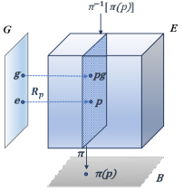
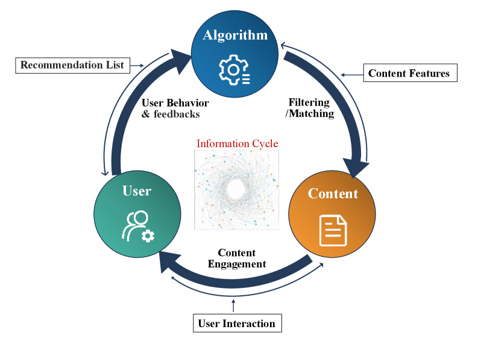
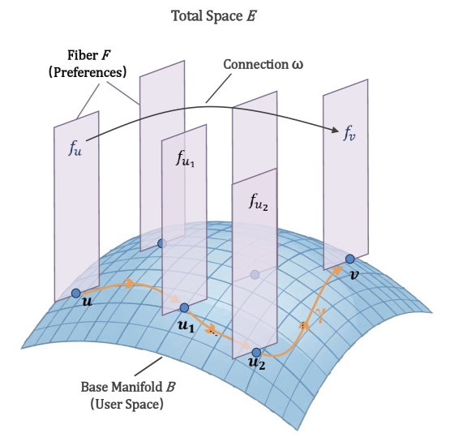
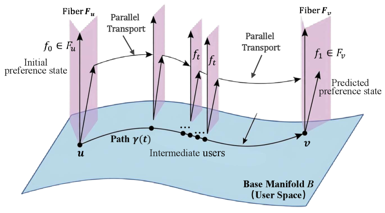
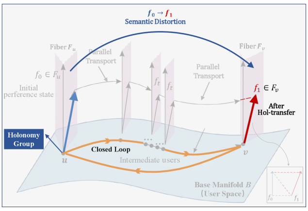
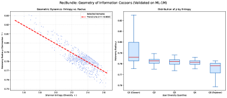

# RecBundle: A Next-Generation Geometric Paradigm for Explainable Recommender Systems

> **arxiv**: https://arxiv.org/abs/2603.16088
> **Authors**: Hui Wang, Tianzhu Hu, Mingming Li, Xi Zhou (Institute of Information Engineering, Chinese Academy of Sciences); Chun Gan (JD.com); Jiao Dai, Jizhong Han, Songlin Hu, Tao Guo (IIE, CAS)
> **Venue**: Preprint 2026

## Abstract

Recommender systems are inherently dynamic feedback loops where prolonged local interactions accumulate into macroscopic structural degradation such as information cocoons. Existing representation learning paradigms are universally constrained by the assumption of a single flat space, forcing topologically grounded user associations and semantically driven historical interactions to be fitted within the same vector space. This excessive coupling of heterogeneous information renders it impossible for researchers to mechanistically distinguish and identify the sources of systemic bias. To overcome this theoretical bottleneck, we introduce Fiber Bundle from modern differential geometry and propose a novel geometric analysis paradigm for recommender systems. This theory naturally decouples the system space into two hierarchical layers: the base manifold formed by user interaction networks, and the fibers attached to individual user nodes that carry their dynamic preferences. Building upon this, we construct RecBundle, a framework oriented toward next-generation recommender systems that formalizes user collaboration as geometric connection and parallel transport on the base manifold, while mapping content evolution to holonomy transformations on fibers. From this foundation, we identify future application directions encompassing quantitative mechanisms for information cocoons and evolutionary bias, geometric meta-theory for adaptive recommendation, and novel inference architectures integrating large language models (LLMs). Empirical analysis on real-world MovieLens and Amazon Beauty datasets validates the effectiveness of this geometric framework.

## 1. Introduction

With the deep integration of mobile internet and artificial intelligence, recommender systems have evolved into critical nexuses connecting massive data with individual users. Yet these systems constitute dynamic feedback loops where user behaviors, content attributes, and algorithmic strategies interact and co-evolve over time. The accumulation of micro-level local decisions through these loops ultimately confronts systems with deep-rooted challenges including interpretability deficits and structural fragility, which macroscopically manifest as information cocoons.

A fundamental limitation underlies existing paradigms. Whether employing Euclidean spaces or recent hyperbolic and Riemannian geometries, they invariably force user preferences and item features into a single global metric space. This inherently couples two heterogeneous mechanisms that drive information flow in recommender systems:
1. **Population-level collaboration**: horizontal information diffusion through user connection structures.
2. **Individual-level evolution**: vertical accumulation of dynamic preferences via semantic continuity of historical interactions.

By forcing these heterogeneous signals into identical representation spaces for joint optimization, mainstream approaches make it theoretically impossible to pinpoint the origin of systemic biases when they emerge.

To resolve this, the authors turn to Fiber Bundle theory from differential geometry, widely adopted in gauge theory and computer vision. The framework models the system as a composite object: a base manifold formed by the discrete user interaction graph encodes topological distances and collective collaborative relationships, while fibers attached to individual user nodes carry continuous preference evolution.

**Contributions:**
- A quantifiable framework for information evolution, translating phenomena like information cocoons into geometric anomalies: local curvature distortion and holonomy-induced dimensional contraction.
- A geometric meta-theory for adaptive recommendation, reconceptualizing personalization as geometric construction.
- A novel reasoning architecture integrating LLMs, mapping fast-and-slow thinking onto Fiber Bundle geometry.

## 2. Preliminaries

### 2.1. Topological Structure

Mathematically, a fiber bundle \\((E, B, F, \pi)\\) decouples a complex state space into:
- **Base manifold** \\(B\\): the topological skeleton whose points represent distinct entities.
- **Fibers** \\(F\\): independent state spaces characterizing internal dynamics.
- **Projection map** \\(\pi: E \rightarrow B\\): anchors high-dimensional states in the total space \\(E\\) to specific entities on \\(B\\), thereby orthogonally decoupling an entity's physical topology from its internal semantics.

> **Figure 1.** Simple Diagram of a Principal Fiber Bundle.

When the fiber itself is a Lie group \\(G\\), this structure constitutes a principal bundle, rigorously characterized by a free and smooth right group action on the total space, a surjective projection mapping, and equivariant local trivializations that ensure global structural consistency.

### 2.2. Evolution Operators

Since fibers at different manifold points are mutually independent vector spaces, direct cross-node algebraic operations are geometrically invalid. To enable cross-node information passing, a **connection** \\(\omega\\) must be introduced, which defines how a fiber state at one point can be parallel transported along a path on the base manifold to the fiber of an adjacent point.

When the base manifold is non-flat (possessing non-zero curvature \\(\Omega\\)), parallel transport exhibits strong path dependence. If a state vector is parallel transported along a closed loop \\(\gamma\\) on the base manifold back to its starting point, an irreversible linear transformation occurs: the **holonomy transformation** \\(Hol(\gamma)\\). This geometric projection and dimensionality reduction effect induced by closed-loop paths provides a precise mathematical tool for quantifying state contraction in the long-term evolution of complex systems.

## 3. RecBundle: A Geometric Analysis Framework

### 3.1. Geometric Mapping of the Dual Collaborative Mechanisms

The RecBundle framework bridges the macroscopic information cycle of recommender systems with rigorous mathematical constructs. It formalizes the correspondence between core system elements and the geometric objects of Fiber Bundle.

> **Figure 2(a).** Information Flow (Macro)

> **Figure 2(b).** Fiber Bundle Formalization. Paradigm Shift in Recommender Systems Modeling.

**Table 1. Correspondence between Recommender System Concepts and Fiber Bundle Theory**

| Recommender System Concept | Fiber Bundle Object |
|---------------------------|-------------------|
| User interaction graph | Base manifold \\(B\\) |
| User node | Point on \\(B\\) |
| User preference state | Fiber \\(F_u\\) attached to user \\(u\\) |
| All user preference states | Total space \\(E\\) |
| Preference projection | Projection map \\(\pi\\) |
| Collaborative aggregation | Parallel transport \\(P_{v \rightarrow u}\\) |
| Sequential preference evolution | Closed-loop path \\(\gamma\\) on \\(B\\) |
| Long-term preference contraction | Holonomy transformation \\(Hol(\gamma)\\) |
| Local interaction misalignment | Local curvature \\(\Omega\\) |

This geometric mapping mathematically decouples the recommendation process. The base manifold captures the collaborative user topology, while the attached fibers model dynamic preference updates.

### 3.2. Parallel Transport

Horizontal collaboration in recommender systems aims to leverage similar users to supplement target user information (e.g., neighborhood aggregation in GNNs). From the fiber bundle perspective, since the preference features of users \\(v\\) and \\(u\\) reside in mutually independent fiber spaces \\(F_v\\) and \\(F_u\\), direct operations in Euclidean space are geometrically ill-posed.

The aggregation process is equivalent to utilizing a parallel transport operator \\(P_{v \rightarrow u}\\) to transport the preference state \\(F_v\\) of neighbor \\(v\\) along the base manifold and project it into the tangent space of the target user \\(u\\):

\\[ P_{v \rightarrow u}(f_v) \approx \alpha_{uv} \mathbf{W} f_v \tag{1} \\]

In this discretized representation, the weight matrix \\(\mathbf{W}\\) corresponds to the directional component of the connection (transforming feature bases), while the attention coefficient \\(\alpha_{uv}\\) corresponds to the intensity component.

> **Figure 3(a).** Collaborative aggregation (parallel transport)

> **Figure 3(b).** Preference evolution (holonomy transformation). Core geometric operators in RecBundle.

When local interactions are sparse or user heterogeneity is strong, the local connection curvature \\(\Omega\\) of the base manifold is typically high. This perspective provides a geometric explanation for why GNNs are prone to over-smoothing on tail users.

### 3.3. Holonomy Transformations

The other core mechanism of recommender systems is the dynamic closed loop involving interaction–recommendation–feedback. In RecBundle, a user's sequential interaction history is viewed as a path \\(\gamma\\) on the base manifold \\(B\\). After experiencing feedback loops \\(\gamma\\), the initial preference state \\(f_{init}\\) transforms:

\\[ f_{end} = Hol(\gamma) \cdot f_{init} \\]

In an ideal setting, \\(Hol(\gamma)\\) should approximate a volume-preserving orthogonal transformation. However, under existing algorithms, the holonomy operator manifests as a contraction mapping: spectral decomposition reveals that non-dominant interest components are progressively suppressed. This **volume contraction** provides a fundamental mathematical characterization of information dynamics in recommender systems.

**Table 2. Geometric Interpretations of Mainstream Recommendation Paradigms**

| Paradigm | Base Manifold | Fiber Space | Connection Type | Holonomy Behavior |
|----------|--------------|-------------|----------------|-------------------|
| CF (Matrix Factorization) | Flat Euclidean | Euclidean vector | Trivial (zero curvature) | Identity (no contraction) |
| GNN-based CF | User graph | Euclidean vector | Graph Laplacian | Implicit, propagation-induced |
| Sequential Rec (SASRec, BERT4Rec) | Temporal path | Attention-weighted | Attention-learned | Contraction via causal masking |
| Cross-domain Rec | Multi-graph manifold | Domain-specific fiber | Cross-domain transport | Domain-gap–induced distortion |
| LLM-based Rec | Semantic space | Token probability manifold | Transformer attention | Hallucination via semantic drift |

## 4. Evolution Blueprint

### 4.1. An Explainable Framework for Information Evolution

RecBundle introduces a process-oriented explainability paradigm that unifies three progressively severe phenomena of information degradation: recommendation bias, filter bubbles, and rumor propagation. These phenomena are mapped onto directional shifts and volumetric contraction in the representation manifold.

**Curvature estimation** for information cocoons:

\\[ \hat{\Omega}_u = \frac{1}{\mathcal{N}(u)} \sum_{v \in \mathcal{N}(u)} \alpha_{uv} \cdot \|\mathbf{f_u} - \mathbf{W}\mathbf{f}_v\|_2 \tag{2} \\]

This computation relies solely on the model's native latent states, so \\(\Omega\\) is strictly differentiable. A high \\(\Omega\\) value indicates approximation errors when modeling discrete preference transitions.

The **Geometric Bias Index (GBI)** captures global volume loss:

\\[ GBI = 1 - \frac{1}{d} \sum_{k=1}^{L} |\lambda_k(\mathbf{H}_\gamma)| \tag{3} \\]

where \\(\lambda_k\\) represents the k-th eigenvalue of the holonomy matrix, and \\(d\\) is the feature dimension. As GBI approaches 1, numerous orthogonal feature dimensions have been compressed during evolution, leading to severe degradation of the semantic space.

> **Figure 4.** The correlation between Shannon Entropy and spectral radius. GBI exhibits a strong negative correlation with Shannon entropy, confirming the consistency between the geometric framework and traditional diversity metrics.

**Table 3. Geometric features across real world datasets**

| Dataset | Sparsity | Avg Curvature \\(\hat{\Omega}\\) | Spectral Radius \\(\rho\\) | Architecture | GBI |
|---------|----------|--------------------------|------------------------|--------------|-----|
| MovieLens | Low | Low | Low | SASRec | Low |
| MovieLens | Low | Low | Low | BERT4Rec | Medium |
| Amazon Beauty | High | High | High | SASRec | Medium |
| Amazon Beauty | High | **Very High** | **Very High** | BERT4Rec | **High** |

Key findings: At the data level, sparsity (Amazon Beauty) serves as a primary catalyst for structural contraction. At the model level, architectures with bidirectional dependencies (BERT4Rec) demonstrate significantly higher curvature \\(\Omega\\) compared to unidirectional models (SASRec) under sparse conditions.

**Future optimization directions:**
1. **Curvature regularization**: \\(\mathcal{L}_{total} = \mathcal{L}_{task} + \lambda \cdot \frac{1}{|U|} \sum_{u \in U} \hat{\Omega}_u\\), suppressing high-curvature regions at their source.
2. **Holonomy constraints**: regularize sequence encoders by imposing volume preservation conditions \\(|\det(\mathbf{J}_t)| \approx 1\\) or spectral penalties.

### 4.2. Metatheory for Adaptive Recommendation

The Fiber Bundle framework provides a unifying geometric language for adaptive learning systems. A broad class of meta-learning algorithms (MAML, iMAML, HSML, etc.) can be understood as special cases of this structure:
- The base manifold encodes the space of meta-parameters.
- Each fiber attached to a base point contains task-specific parameters reachable via adaptation.
- The inner-loop update process is geometrically interpreted as parallel transport along the fiber.
- Different meta-learning methods correspond to distinct choices of the connection governing this transport.

For example:
- Standard MAML with full differentiation implicitly learns a connection capturing second-order curvature.
- First-order approximations assume a trivial connection.
- iMAML imposes a Levi-Civita-like connection through explicit regularization.

### 4.3. A Novel Inference Architecture with LLMs

The hierarchical geometry of RecBundle provides a natural framework for integrating LLMs reasoning:
- **Cross-node routing on the base manifold** \\(B\\) → **System 1 fast retrieval**: using the user-item topological network to bound information extraction.
- **Transitions along a user fiber** \\(F_u\\) → **System 2 deep chain-of-thought reasoning**: each autoregressive generation step formalized as local parallel transport along the fiber.

Translating geometric invariants into decoding constraints (incorporating curvature as regularization in attention mechanisms, constraining transformation matrices to maintain local smoothness) mechanistically guides the reasoning trajectory, ensuring semantic consistency across multi-step iterations.

## 5. Conclusion

Grounded in the physical and mathematical boundaries of information flow in recommender systems, this work introduced RecBundle, the first geometric paradigm to provide a unified mathematical language for understanding information evolution in complex environments. Three future directions are identified:
1. Geometric priors as differentiable constraints during training to improve generalization for long-tail users and cold-start items.
2. Smooth mappings between heterogeneous manifolds for knowledge transfer across domains and modalities.
3. Structure-aware agents combining local perception with reinforcement learning to dynamically adjust exploration-exploitation trade-offs.

## References

- Piao et al. (2023) Human–AI adaptive dynamics drives the emergence of information cocoons. *Nature Machine Intelligence* 5(11).
- Liang & Zhou (2023) Differential geometry and general relativity: volume 1. Springer Nature.
- Courts & Kvinge (2022) Bundle networks: fiber bundles, local trivializations, and a generative approach. ICLR 2022.
- Finn et al. (2017) Model-agnostic meta-learning for fast adaptation of deep networks. ICML 2017.
- Rajeswaran et al. (2019) Meta-learning with implicit gradients. NeurIPS 2019.
- Chen et al. (2020) Measuring and relieving the over-smoothing problem for GNNs. AAAI 2020.
- Zhu (2023) Fiber bundles: the principle of everything. *Chinese Journal of Nature* 45(03).
