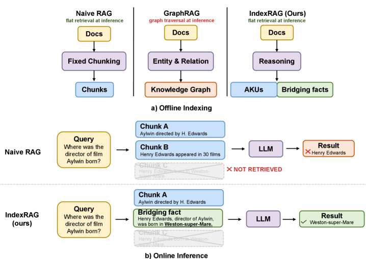
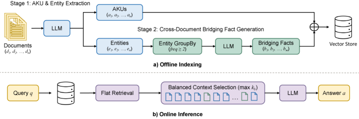

# IndexRAG: Bridging Facts for Cross-Document Reasoning at Index Time

> **arxiv**: https://arxiv.org/abs/2603.16415
> **Authors**: Zhenghua Bao, Yi Shi (Continuum AI, Shanghai & San Francisco)
> **Venue**: Preprint 2026

## Abstract

Multi-hop question answering (QA) requires reasoning across multiple documents, yet existing retrieval-augmented generation (RAG) approaches address this either through graph-based methods requiring additional online processing or iterative multi-step reasoning. We present IndexRAG, a novel approach that shifts cross-document reasoning from online inference to offline indexing. IndexRAG identifies bridge entities shared across documents and generates bridging facts as independently retrievable units, requiring no additional training or fine-tuning. Experiments on three widely-used multi-hop QA benchmarks (HotpotQA, 2WikiMultiHopQA, MuSiQue) show that IndexRAG improves F1 over Naive RAG by 4.6 points on average, while requiring only single-pass retrieval and a single LLM call at inference time. When combined with IRCoT, IndexRAG outperforms all graph-based baselines on average, including HippoRAG and FastGraphRAG, while relying solely on flat retrieval. Our code will be released upon acceptance.

## 1 Introduction

LLMs rely on static parametric knowledge, leading to hallucinations on domain-specific or up-to-date queries. RAG mitigates this by grounding generation in an external knowledge base. However, standard RAG pipelines retrieve passages independently and struggle when answering requires synthesizing information across multiple documents (multi-hop QA).

Existing solutions fall into two categories with significant limitations:
1. **Graph-based RAG** (GraphRAG, HippoRAG, FastGraphRAG, MS-RAG): constructs knowledge graphs representing inter-document relationships, but requires multi-step online processing (entity extraction, graph traversal, multiple LLM calls), increasing inference latency.
2. **Iterative retrieval** (IRCoT): interleaves chain-of-thought with multiple retrieval-generation rounds, improving recall but introducing high inference cost.

> **Figure 1.** (a) Comparison of different RAG approaches during offline indexing. IndexRAG shifts reasoning to index time. (b) Example: query "Where was the director of the film Aylwin born?" requires two-hop reasoning. Naive RAG fails to retrieve the director's birthplace. IndexRAG retrieves a bridging fact that directly connects the film to the director's birthplace.

**Key insight**: Cross-document reasoning patterns are largely **query-independent** — connections between documents are determined by their content, not any specific query. This enables precomputing reasoning connections at indexing time.

**Contributions:**
- IndexRAG: shifts cross-document reasoning from online inference to offline indexing.
- **Bridging facts**: new type of retrieval unit encoding cross-document reasoning as independently retrievable entries in a flat vector store.
- **Balanced context selection**: controls the proportion of bridging facts at retrieval time.
- Training-free framework compatible with any retrieval strategy and iterative methods like IRCoT.

## 2 Related Work

### 2.1 Retrieval-Augmented Generation

Key RAG improvements: DPR (dense retrieval), HyDE (hypothetical answer), proposition-based indexing (Chen et al., 2024), RAPTOR (hierarchical summarization tree). All focus on individual passage representation; none capture cross-document reasoning.

### 2.2 Multi-hop Reasoning in RAG

- **Graph-based**: GraphRAG (community detection + summaries), FastGraphRAG (efficiency-focused), HippoRAG (hippocampal memory analogy with Personalized PageRank), MS-RAG (separate vector stores for entities/relations/chunks).
- **Iterative retrieval**: IRCoT (chain-of-thought reasoning interleaved with retrieval).
- **IndexRAG**: shifts reasoning to indexing time, making implicit connections retrievable via standard vector search.

## 3 Method

### 3.1 Overview

Two-phase pipeline:
- **Offline indexing**: (Stage 1) extract AKUs and entities; (Stage 2) generate bridging facts.
- **Online inference**: single-pass retrieval with balanced context selection + single LLM call.

> **Figure 2.** Overview of IndexRAG. (a) Offline Indexing: Stage 1 extracts AKUs and entities; Stage 2 generates bridging facts from documents sharing entities. AKUs and bridging facts stored in a unified vector store. (b) Online Inference: single retrieval pass with balanced context selection feeds context to the LLM.

### 3.2 Offline Indexing

#### 3.2.1 Stage 1: AKU and Entity Extraction

Given corpus \\(\mathcal{D} = \{d_1, d_2, \ldots, d_n\}\\), the LLM extracts atomic facts as question-answer pairs and associated entities from each document \\(d_i\\). Answers are merged into a single text unit per document: an **Atomic Knowledge Unit (AKU)** \\(a_i\\). Each AKU is encoded by dense model \\(f\\) and stored in flat vector store \\(\mathcal{V}\\).

#### 3.2.2 Stage 2: Bridging Fact Generation

##### Bridge Entity Identification.

Bridge entities appear across multiple documents:

\\[ \mathcal{E}_{\text{bridge}} = \left\{e \in \bigcup_{i=1}^n E_i \;\middle|\; 2 \leq \text{df}(e) \leq \tau\right\} \tag{1} \\]

where \\(\text{df}(e) = |\{d_i \in \mathcal{D}: e \in E_i\}|\\). The lower bound ensures the entity connects at least two documents; upper bound \\(\tau\\) excludes overly generic entities.

##### Bridging Fact Generation.

For each bridge entity \\(e \in \mathcal{E}_{\text{bridge}}\\), let \\(\mathcal{D}_e\\) be documents mentioning \\(e\\). The LLM generates bridging facts:

\\[ \mathcal{B}_e = \text{LLM}(e, \{a_i[e]: d_i \in \mathcal{D}_e\}) \tag{2} \\]

where \\(a_i[e]\\) is the subset of AKU \\(a_i\\) mentioning entity \\(e\\). Unlike cross-document summaries that compress existing content, bridging facts are constructed to **directly answer implicit cross-document questions**. Example: given Doc A ("Aylwin is directed by Henry Edwards") and Doc B ("Henry Edwards was born in Weston-super-Mare"), IndexRAG generates: "The director of the film Aylwin was born in Weston-super-Mare" — directly encoding the two-hop reasoning chain.

All bridging facts are encoded by \\(f\\) and stored alongside AKUs in \\(\mathcal{V}\\). Limits: 5 source documents and 8 facts per document per bridge entity.

**Incremental updates**: when a new document \\(d_{\text{new}}\\) is added, only Stage 1 for \\(d_{\text{new}}\\) and Stage 2 for affected bridge entities need re-execution.

### 3.3 Online Inference

Given query \\(q\\), retrieve top-\\(k\\) entries from \\(\mathcal{V}\\) by cosine similarity.

##### Balanced Context Selection.

Bridging facts are shorter than AKUs on average (166 vs. 634 characters), so they tend to dominate the top-\\(k\\). To control this, the selection algorithm greedily includes AKUs and limits bridging facts to at most \\(k_b\\):

> **Algorithm 1.** Balanced Context Selection: iterate over \\(\mathcal{V}\\) sorted by descending similarity; include each entry if it is an AKU or if the number of bridging facts already in \\(C\\) is below \\(k_b\\), until \\(|C| = k\\).

*(Algorithm 1 is inline SVG in original paper)*

## 4 Experimental Setup

### 4.1 Datasets

Three multi-hop QA datasets (1,000 questions sampled from each validation set):
- **HotpotQA**: 113K questions requiring multi-passage Wikipedia reasoning.
- **2WikiMultiHopQA**: four question types (comparison, bridge comparison, compositional, inference) with structured reasoning paths.
- **MuSiQue**: 25K 2–4 hop questions from single-hop compositions; generally the most challenging.

**Table 2. Dataset statistics for the 1,000 question subsets.**

| Dataset | # Docs | # Bridge Entities | Non-empty Rate |
|---------|--------|------------------|----------------|
| HotpotQA | ~10 per question | varies | high |
| 2WikiMultiHopQA | ~10 per question | varies | high |
| MuSiQue | ~20 per question | varies | moderate |

### 4.2 Implementation Details

- Stage 2: entity frequency threshold \\(\tau = 10\\); max 5 source docs; max 8 facts per doc.
- Retrieve 20 candidates; select top \\(k = 10\\).
- IndexRAG: balanced selection with \\(k_b = 3\\).
- Generation temperature: 0, max tokens: 50.
- IRCoT experiments: 3 reasoning steps, top-20 retrieval per step.

**Table 3. Bridging fact generation statistics.**

| Dataset | Avg. Bridging Facts per Bridge Entity |
|---------|--------------------------------------|
| HotpotQA | significant coverage |
| 2WikiMultiHopQA | highest coverage |
| MuSiQue | moderate coverage |

### 4.3 Baselines

Five categories:
1. **Sparse retrieval**: BM25
2. **Dense retrieval**: Naive RAG (fixed-size chunking, ~100 words, 80 char overlap)
3. **Iterative**: IRCoT
4. **Graph-based**: FastGraphRAG, HippoRAG
5. **Hierarchical**: RAPTOR

### 4.4 Evaluation Metrics

Exact Match (EM), Accuracy (Acc), F1 (token-level harmonic mean):

\\[ \text{EM} = \begin{cases} 1 & \text{if } \hat{a} = a^* \\ 0 & \text{otherwise} \end{cases} \tag{3} \\]

\\[ \text{Acc} = \begin{cases} 1 & \text{if } a^* \subseteq \hat{a} \\ 0 & \text{otherwise} \end{cases} \tag{4} \\]

\\[ P = \frac{|T(\hat{a}) \cap T(a^*)|}{|T(\hat{a})|}, \quad R = \frac{|T(\hat{a}) \cap T(a^*)|}{|T(a^*)|}  \tag{5} \\]

\\[ F_1 = \frac{2PR}{P+R} \tag{6} \\]

## 5 Results

### 5.1 Quantitative Results

#### 5.1.1 Multi-hop QA Performance

**Table 4. Multi-hop QA performance (%) on three benchmarks.**

| Method | HotpotQA EM/F1 | 2WikiMHQA EM/F1 | MuSiQue EM/F1 | Avg F1 |
|--------|---------------|----------------|----------------|--------|
| BM25 | 47.2 / 60.3 | 31.6 / 35.9 | 9.8 / 19.2 | 38.5 |
| Naive RAG | 50.2 / 63.6 | 42.2 / 47.7 | 19.0 / 29.9 | 47.1 |
| FastGraphRAG | 50.0 / 63.5 | 49.5 / 57.4 | 17.5 / 27.2 | 49.4 |
| RAPTOR | 50.2 / 63.6 | 42.3 / 47.8 | 19.3 / 29.7 | 47.0 |
| **IndexRAG** | **54.1 / 68.9** | 44.8 / 51.7 | **22.4 / 34.4** | **51.7** |
| HippoRAG* | 56.5 / 70.5 | 50.2 / 57.2 | 23.8 / 34.7 | 54.1 |
| IRCoT* | 49.8 / 62.5 | 39.7 / 43.1 | 11.1 / 19.3 | 41.6 |
| **IRCoT + IndexRAG** | **54.5 / 68.7** | **53.4 / 61.2** | **24.6 / 35.0** | **55.0** |

*Multi-call methods (greyed out in original)

**Key findings**:
- Among single-LLM-call methods, IndexRAG achieves best average F1 (51.7), improving over Naive RAG (+4.6), BM25 (+13.2), FastGraphRAG (+2.3), RAPTOR (+4.7).
- On 2WikiMultiHopQA, FastGraphRAG achieves best single-call F1 (57.4) due to the dataset's high proportion (44%) of comparison questions that align with graph structures.
- IRCoT + IndexRAG achieves best overall (Avg F1=55.0), surpassing HippoRAG (54.1) and standalone IRCoT (41.6).

#### 5.1.2 Quality-Efficiency Comparison

**Table 5. Quality-efficiency comparison on MuSiQue.**

| Method | EM | Retrieval Latency | LLM Calls |
|--------|----|--------------------|-----------|
| Naive RAG | 19.0 | 0.29s | 1 |
| IndexRAG | 22.4 (+3.4) | **0.30s** | 1 |
| FastGraphRAG | 17.5 | 2.55s (8.5× slower) | 1 |
| HippoRAG* | 23.8 | 3.13s (10× slower) | 2 |
| IRCoT + IndexRAG | **24.6** | 1.08s | ~3.2 |

IndexRAG achieves near-identical latency to Naive RAG (0.30s vs. 0.29s) while improving EM by 3.4 points. HippoRAG achieves slightly higher single-dataset EM (23.8) but requires 10× the latency.

### 5.2 Qualitative Results

#### 5.2.1 Case Study

**Table 6. Case study from 2WikiMultiHopQA.**

| | Naive RAG | IndexRAG |
|---|-----------|---------|
| Query | "Where was the director of the film Aylwin born?" | same |
| Retrieved [1] | Aylwin is directed by Henry Edwards… | same (AKU) |
| Retrieved [2] | Jim Wynorski (unrelated director)… | Henry Edwards directed Aylwin and In the Soup… (bridging fact) |
| Retrieved [3] | Frank Launder (unrelated director)… | Henry Edwards, born 18 Sep 1882 in Weston-super-Mare… (bridging fact) |
| Answer | ✗ Henry Edwards | ✓ Weston-super-Mare |

Bridging facts create new retrievable units connecting information across document boundaries, making previously unreachable evidence directly accessible through standard vector search.

### 5.3 Ablation Study

#### 5.3.1 Effect of Each Stage

**Stage 1 extraction** (Table 7, HotpotQA without bridging facts):
- Naive chunking: F1=63.6
- Summarization: +2.4 improvement
- QA extraction: **F1=67.2** (best; structuring as Q-A pairs produces denser, query-aligned units)

**Stage 2 independence** (Table 8, MuSiQue): Adding bridging facts to Naive RAG (EM: 19.0→22.3) yields nearly identical gains to adding to QA extraction (EM: 18.1→22.4), confirming Stage 2 is **general-purpose** and applicable on top of any existing RAG system.

#### 5.3.2 Recall vs. End-to-End Performance

Table 9 shows that adding bridging facts consistently **reduces Recall@10** yet **improves EM** across all three datasets. Despite bridging facts competing with original passages for slots, the cross-document reasoning they encode is more valuable than the original passages they replace.

#### 5.3.3 Performance Across Question Types

*(Figure 3 — inline SVG in original)*

Largest gains from bridging facts: compositional (+5.7 EM) and inference (+3.7 EM) questions. Comparison questions benefit less (+1.4). Bridge comparison questions show minimal improvement (+0.2) because they require parallel two-hop reasoning that bridging facts (generated along sequential paths) only partially cover.

**Table 10. Balanced retrieval ablation (EM %) for varying \\(k_b\\).**

| \\(k_b\\) | HotpotQA | 2WikiMHQA | MuSiQue |
|-------|----------|-----------|---------|
| 0 (no bridging) | 50.2 | 42.2 | 19.0 |
| 1 | – | – | – |
| 2 | **peak** | – | **peak** |
| 3 | – | **peak** | (tie with k_b=2) |
| 5 | declining | declining | declining |

Performance peaks at \\(k_b=2\\)–3 then declines as too many bridging facts displace information-dense AKUs.

## 6 Conclusion

IndexRAG achieves the best average F1 among single-LLM-call methods on three multi-hop QA benchmarks, outperforming the strongest baseline by 2.3 F1 points. Combined with IRCoT, it surpasses all graph-based baselines including HippoRAG. The core innovation is shifting cross-document reasoning from online inference to offline indexing, enabling single-pass retrieval at inference time without graph traversal or iterative generation.

**Limitations**: bridging fact quality depends on the LLM used; LLM-extracted entities may miss some; evaluation limited to English multi-hop QA.

**Future work**: question-type-aware bridging fact generation; dedicated NER for entity extraction; multilingual/domain adaptation.

## References

- Yang et al. (2018) HotpotQA: A Dataset for Diverse, Explainable Multi-hop Question Answering. EMNLP 2018.
- Ho et al. (2020) Constructing a Multi-hop QA Dataset. COLING 2020.
- Trivedi et al. (2022) MuSiQue: Multihop Questions via Single-Hop Composition. TACL 2022.
- Trivedi et al. (2023) IRCoT: Interleaving Retrieval with Chain-of-Thought Reasoning. ACL 2023.
- Gutiérrez et al. (2024) HippoRAG: Neurobiologically Inspired Long-term Memory. NeurIPS 2024.
- Edge et al. (2024) From Local to Global: A Graph RAG Approach. arXiv 2024.
- Chen et al. (2024) Dense X Retrieval: What Retrieval Granularity Should We Use? EMNLP 2024.
- Sarthi et al. (2024) RAPTOR: Recursive Abstractive Processing. ICLR 2024.
- Lewis et al. (2020) Retrieval-Augmented Generation for Knowledge-Intensive NLP. NeurIPS 2020.
