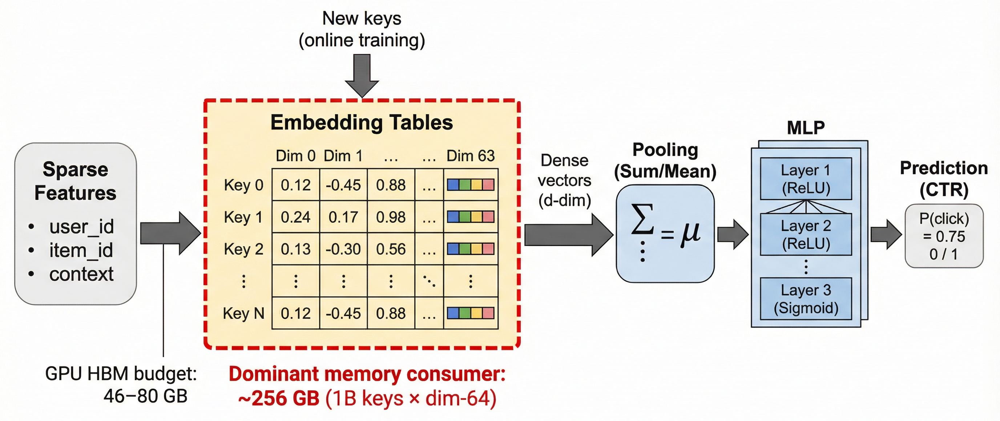
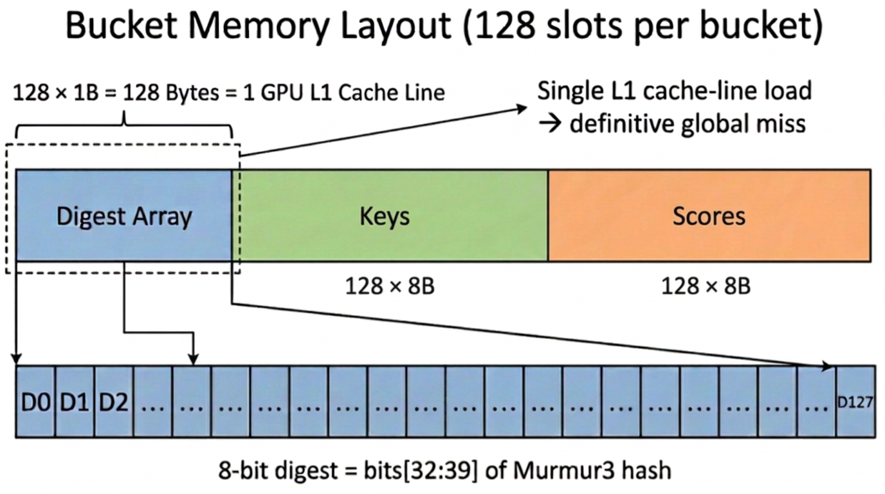
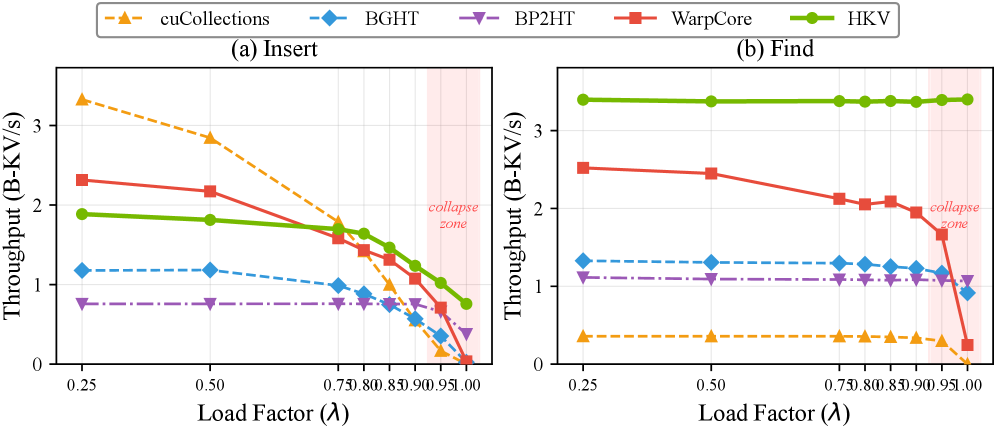
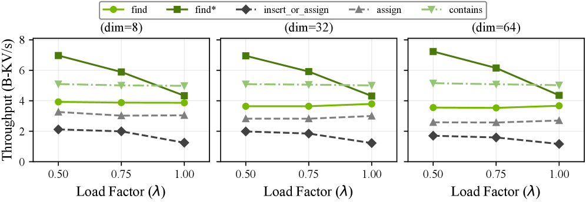

# HierarchicalKV: A GPU Hash Table with Cache Semantics for Continuous Online Embedding Storage

**ArXiv ID:** [2603.17168](https://arxiv.org/abs/2603.17168)  
**Submitted:** 2026-03-19  
**Authors:** Jiashu Yao, Matthias Langer, Shijie Liu (NVIDIA); Li Fan (Tencent); Dongxin Wang (Vipshop); Jia He, Jinglin Chen (BOSS Zhipin); Jiaheng Rang (ByteDance); Julian Qian (Snap); Mengyao Xu, Fan Yu, Minseok Lee, Zehuan Wang, Even Oldridge (NVIDIA)  
**Affiliation:** NVIDIA, Tencent, Vipshop, BOSS Zhipin, ByteDance, Snap  
**Venue:** SIGMOD 2027

---

## 摘要 / Abstract

传统 GPU 哈希表保存每一个插入的键（字典语义），当嵌入表规模常超出单 GPU HBM 容量时，这种假设浪费宝贵的高带宽内存（HBM）。本文挑战这一假设，引入**缓存语义（Cache Semantics）**——策略驱动的驱逐（eviction）是一类一等操作。

**HierarchicalKV（HKV）** 是首个通用 GPU 哈希表库，其正常满容操作合约为**缓存语义**：每次满桶 upsert（update-or-insert）通过就地驱逐或拒绝准入解决，**而非** rehashing 或容量失败。

在 NVIDIA H100 NVL GPU 上：
- **查找吞吐量**：最高 **3.9 B-KV/s**，负载因子 0.50~1.00 内变化 **<5%**
- **vs WarpCore**（最强字典语义 baseline）：**1.4×** 更高查找吞吐
- **vs 间接寻址 GPU baseline**：**2.6~9.4×** 更高查找吞吐
- 已集成入 NVIDIA Merlin HugeCTR、TFRA、NVIDIA RecSys Examples

---

## 1. 背景与动机 / Background & Motivation

### 嵌入表在推荐系统中的压力

推荐/搜索/广告系统依赖深度学习模型，其**嵌入表**（映射稀疏特征到稠密向量）是主要内存消耗者：
- 10 亿 × 64-dim float32 键 ≈ **256 GB**，远超 H100 NVL 的 94 GB HBM
- 持续在线训练要求在硬内存预算下持续摄入新键



*图1：推荐模型中的嵌入查找管道。稀疏特征通过嵌入表映射，构成模型最大的内存消耗。在线训练在硬内存预算下持续摄入新键。*

### 字典语义的问题

所有现有 GPU 哈希表（cuCollections、WarpCore、BGHT、WarpSpeed、Hive）均采用**字典语义**：
- 每个插入的键必须保存
- 负载因子接近 1.0 时，探测链变长，吞吐量下降
- 从 λ=0.25 到 λ=1.00，WarpCore 查找吞吐下降 **90%**，BGHT **31%**，cuCollections **100%（崩溃）**

**核心观察**：嵌入存储更适合建模为**缓存**而非字典——幂律访问模式意味着保留高价值条目、驱逐低价值条目可维护模型质量，同时硬内存预算使驱逐成为不可避免的周期性事件。

---

## 2. 挑战 / Challenges

HKV 需解决四个具体挑战：

| 挑战 | 描述 |
|------|------|
| **C1: 固定工作量查找** | 字典语义在 λ→1.0 时吞吐下降 31-100%，而嵌入缓存必须持续在高 λ 下运行 |
| **C2: 就地满容 upsert** | 持续到达的新嵌入需要满桶插入能就地解决，无需 rehashing |
| **C3: 有界关联度下的保留** | 热门嵌入的驱逐需重计算或远程获取；需最大化高价值条目的保留 |
| **C4: 混合工作负载并发** | 推理和训练内核同时发起读/写请求，粗粒度锁是第一性能瓶颈 |

---

## 3. 系统设计 / System Design

### 3.1 架构概览


*图3：HKV 架构。键、摘要和分数常驻 HBM；溢出值通过位置寻址放置在 pinned 主机内存（HMEM）。*

四个核心机制（相互协同设计）：

### 3.2 单桶约束 + 缓存行对齐桶设计

**核心原则**：将每个键的全部候选空间折叠为**单个 GPU L1 缓存行对齐的单元**。

- 每个桶有 **128 个槽**
- 摘要数组：128 个 8-bit 摘要 = **一个 128B GPU L1 缓存行**，一次内存事务覆盖所有候选
- 单个 SIMD `__vcmpeq4` 比较，一次 miss 只需 **1 次缓存行加载**（定论 per-bucket miss）



*图4：单个 HKV 桶的内存布局（128 个槽）。摘要数组占一个 GPU L1 缓存行（128B），支持单次缓存行加载完成完整的 per-bucket 负向查找。值通过桶+槽索引位置寻址，无需存储每条目指针。*

**命题3.1（定论 Per-Bucket Miss）**：在单桶模式（128 槽/桶）下，对任何不在表中的键 $k$，`Find(k)` 在精确一次内存事务后返回 `NotFound`，进行 128 次摘要比较，预期只有 $S/256 = 0.5$ 次完整键比较（误报率 1/256）。

**为何缓存语义使单桶约束成为可能**：在字典语义下，满桶无溢出链导致插入失败。缓存语义通过分数驱动驱逐确定性地替换最低分条目，消除溢出链、rehashing 和容量失败，使 λ=1.0 时的约束成为可行。

### 3.3 分数驱动内联驱逐（解决 C2）

HKV 是**首个将驱逐直接融合进插入路径**的 GPU 哈希表：

当桶满时，内核：
1. 扫描所有 128 个分数，识别最低分槽
2. 通过 `CAS` 原子地替换该条目

```
// Algorithm 2: Upsert with Bucket-Local Admission and Eviction
if bucket full:
    m = argmin(scores[b])
    if s < scores[b][m]:
        return Rejected  // 准入控制
    CAS(keys[b][m], k_old, Locked) → write (k,v,s,d) → return Evicted(k_old)
```

**分数策略**：编译期 `ScoreFunctor` 抽象支持 LRU、LFU、Epoch-aware、自定义评分——**无需第二个驱逐数据结构**。

**与 FBGEMM TBE 对比**：
- FBGEMM：多内核管道（分离的缓存 miss 解析、受害者选择、替换内核）；支持 2 种固定策略
- HKV：单次内联 upsert 路径 + CAS 提交；支持 5 种内置评分 + 自定义路径

### 3.4 分数驱动动态双桶选择（解决 C3）

单桶约束引入问题：生日悖论在 λ≈0.66 时触发第一次驱逐，导致 **~34% HBM 浪费**。

HKV 扩展 **Power-of-Two-Choices（P2C）** 范式，从负载均衡推广到**驱逐质量优化**：

```
// Algorithm 3: Score-Based Dual-Bucket Upsert
Phase D1 (warm-up): 插入负载较低的桶（延迟第一次驱逐至 λ>0.97）
Phase D2 (steady state): 在最小分数较低的桶中驱逐
    b* = argmin(min-score(b1), min-score(b2))
```


*图5：双桶两阶段策略。Phase D1（左）按负载平衡插入提升内存利用率；Phase D2（右，λ≈1.0）在最小分数较低的桶中驱逐，提升驱逐正确性。*

**命题3.3（分数驱动选择优势）**：在 i.i.d. 均匀分数下（桶大小 n=128），选择最小分数更低的桶将预期被驱逐分数从 $1/(n+1) \approx 0.0078$ 降低至 $1/(2n+1) \approx 0.0039$（减半）。实测（Zipfian 工作负载）：双桶模式实现 **99.4%** top-N 分数保留率，vs 单桶 **95.4%**（提升 4.05pp）。

### 3.5 三组并发控制（解决 C4）

HKV 引入**三组并发协议**，区分操作是否修改桶结构：

| 角色 | 操作 | 结构修改 | 可并发 |
|------|------|---------|--------|
| **Readers** | find, contains, size | 否 | 多 reader 并行 |
| **Updaters** | assign, assign_scores | 否（就地改值/分数） | 多 updater 并行 |
| **Inserters** | insert_or_assign, find_or_insert, erase | **是** | 独占 |

```
Table 4. 兼容性矩阵：
           Reader  Updater  Inserter
Reader      ✓       ×        ×
Updater     ×       ✓        ×
Inserter    ×       ×        ×
```

**关键设计**：由于驱逐融合进插入路径，所有结构修改都限制在 Inserter 角色，Reader 和 Updater 内核**无需 CAS 或驱逐逻辑**。

**CPU-GPU 双层锁**：GPU 内核无法直接观察 host 端原子变量，需 host-device 桥接机制：
- Host 层：`std::atomic` 计数器跟踪活跃 readers/updaters/inserters
- Device 层：轻量级同步内核传播已提交角色状态到设备内存

实测：相比 R/W 锁，三组并发实现高达 **4.80×** 吞吐提升。

### 3.6 分层键值分离（HBM 超容量扩展）

嵌入表常超出单 GPU HBM 容量。HKV 通过**基于位置的分层 KV 分离**扩展：
- **键、摘要、分数** → 常驻 HBM
- **值** → 溢出到 pinned 主机内存（HMEM），通过零拷贝映射指针访问
- 位置寻址：值地址由桶+槽索引算术计算，**无每条目指针**（节省 8 B/条目 = 128M 容量时节省 1 GB）

实测：混合 HBM+HMEM 模式下，指针返回 `find*` 保留 **96.0%** 纯 HBM 吞吐（6.949 vs 7.242 B-KV/s）。

---

## 4. 评估 / Evaluation

### 4.1 实验设置

- **硬件**：NVIDIA H100 NVL（94 GB HBM3，Hopper，CC 9.0）
- **软件**：Ubuntu 24.04，CUDA 12.9，GCC 13.3
- **工作负载**：uint64_t 键，float32×dim 值，批大小 100 万 KV/op，LRU 驱逐

四种配置：A（dim=8，128M），B（dim=32，128M），C（dim=64，64M），D（dim=64，128M HBM+HMEM）

Baseline：WarpCore v1.3.1，BGHT v0.1，cuCollections v0.1.0-ea，BP2HT（均使用字典语义）

### 4.2 负载因子分析（图6，表6）



*图6：插入（a）和查找（b）吞吐量 vs 负载因子（λ=0.25~1.00，dim=32）。HKV（LRU 驱逐，缓存语义）在全范围内保持近恒定吞吐，字典语义 baseline 在 λ≈0.95 后的阴影区域崩溃。*

| 系统 | λ=0.50 | λ=0.75 | λ=1.00 | 驱逐 |
|------|--------|--------|--------|------|
| **HKV** | **3.37** | **3.38** | **3.40** | ✅ |
| WarpCore | 2.45 | 2.12 | 0.25（崩溃） | ❌ |
| BGHT† | 1.31 | 1.30 | 0.92 | ❌ |
| cuColl.† | 0.36 | 0.36 | ≈0（崩溃） | ❌ |
| BP2HT† | 1.09 | 1.09 | 1.07 | ❌ |

（单位：B-KV/s，dim=32，H100 NVL）

λ=0.50 时，HKV 查找吞吐为所有 baseline 的 **1.38~9.43×**，差距随 λ 升高持续扩大。

### 4.3 端到端吞吐（图8）



*图7：HKV 核心 API 端到端吞吐（纯 HBM，λ=0.50，批大小=100 万）。*

- `find`：3.61~3.89 B-KV/s（dim=8 最高）
- `find*`（指针返回）：~7.05 B-KV/s（维度无关，值复制是瓶颈）
- `insert_or_assign`：1.72~2.13 B-KV/s
- `assign`：2.59~3.26 B-KV/s

### 4.4 组件消融（表7-9）

**摘要过滤贡献**：
- λ=0.50：1.65~1.87× 提升
- λ=1.00：2.60~2.61× 提升（无摘要时所有 miss 比较全部 128 键）

**驱逐开销**：满桶 vs 空桶插入开销 32~41%，且有界（每次驱逐恰好扫描一个 128 槽桶）。

**缓存命中率（Zipfian α 扫描，表8）**：

| 策略 | α=0.50 | α=0.75 | α=0.99 | α=1.25 |
|------|--------|--------|--------|--------|
| kLRU | 18.6% | 43.0% | 83.9% | 99.4% |
| kLFU | 31.4% | 55.7% | **88.3%** | 99.7% |

生产典型 α≈0.99，LFU 实现 88.3%（比 LRU +4.4pp）；α≥1.25 时所有策略趋于 ~99.4%。

**双桶 vs 单桶（表11）**：双桶将第一次驱逐延迟至 λ>0.97（单桶为 λ≈0.66），top-N 分数保留率从 95.4% 提升至 **99.4%**（+4.05pp）。

### 4.5 并发控制（表10）

| 锁类型 | 吞吐（相对值） |
|--------|-------------|
| R/W 锁 | 1× |
| **三组并发（多 updater 并行）** | **最高 4.80×** |

---

## 5. 相关工作 / Related Work

| 系统 | 语义 | 驱逐 | 固定 Miss 开销 | 并发 R/U/I |
|------|------|------|--------------|-----------|
| WarpCore / BGHT / cuColl. | 字典 | ❌ | ❌ | ❌ |
| FBGEMM TBE（Meta） | 缓存 | ✅（多内核） | ❌ | ❌ |
| MemcachedGPU | 缓存 | ✅（固定 LRU） | ❌ | ❌ |
| **HKV** | **缓存** | **✅（单次 CAS 内联）** | **✅** | **✅（R/U/I 三组）** |

---

## 6. 结论 / Conclusion

HKV 提出**缓存语义**作为大规模推荐系统嵌入存储的正确设计范式：
- **单桶约束 + 缓存行对齐**：单次内存事务确定性 miss，负载因子无关
- **内联分数驱动 upsert**：消除外部驱逐数据结构和多内核管道
- **双桶 P2C 变种**：恢复生日悖论浪费的 ~34% HBM，提升驱逐质量
- **三组并发（R/U/I）**：区分结构/非结构写，多 updater 并行 4.80×
- **分层 KV 分离**：key-side 吞吐保留 96%，value 溢出至 HMEM 扩展容量

开源（2022年10月），已集成进 HugeCTR、TFRA、NVIDIA RecSys Examples。

---

## 标签 / Tags

**Star Tags:** 系统效率 (System Efficiency), NVIDIA  
**场景:** 推荐系统基础设施 (RecSys Infrastructure), 广告系统 (Ad System)  
**技术:** GPU 哈希表 (GPU Hash Table), 嵌入存储 (Embedding Storage), 缓存语义 (Cache Semantics), KV Store, 并发控制 (Concurrency Control), HBM 优化 (HBM Optimization)  
**问题:** 嵌入内存管理 (Embedding Memory), 在线训练 (Online Training), 存储效率 (Storage Efficiency), 吞吐量 (Throughput)  
**Online A/B:** 否 / No（系统基准测试）
