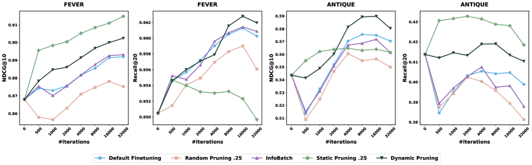
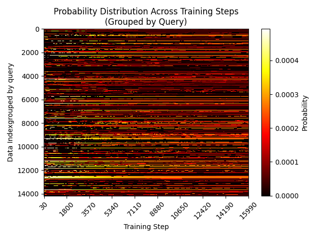
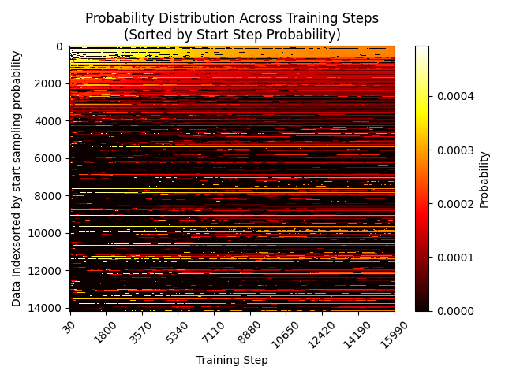

# OPERA: Online Data Pruning for Efficient Retrieval Model Adaptation

**ArXiv ID:** [2603.17205](https://arxiv.org/abs/2603.17205)  
**Submitted:** 2026-03-19  
**Authors:** Haoyang Fang, Shuai Zhang, Yifei Ma, Hengyi Wang, Cuixiong Hu, Katrin Kirchhoff, Bernie Wang, George Karypis  
**Affiliation:** Amazon Web Services  
**Venue:** (SIGIR / ACL 2026 submission)

---

## 摘要 / Abstract

域特定微调对稠密检索器至关重要，但并非所有训练样本对学习都有相同贡献。**OPERA** 是一个数据剪枝框架，通过利用训练数据的异质性质量来同时提升检索模型域适应的效果和效率。

核心发现——**质量-覆盖率权衡（quality-coverage tradeoff）**：
- **静态剪枝（SP）**：仅保留高相似度 query-document 对，NDCG 提升但 Recall 可能下降
- **动态剪枝（DP）**：两阶段自适应采样调节，在排序和召回上均取得最优

在跨 8 个数据集、6 个领域的评估上：
- SP：NDCG@10 +0.5%（vs 标准微调）
- DP：NDCG@10 +1.9%，Recall@20 +0.7%，平均排名 **1.38**（最优）
- DP 以**不足 50% 的训练时间**达到相当性能

---

## 1. 背景与动机 / Background & Motivation

### 稠密检索器的两阶段采样结构

标准微调（FT）使用两阶段对比学习采样：
1. 从 $n$ 个查询中均匀采样 query $q$
2. 为每个 query 随机选一个正 document $d$（+ hard negative）

采样概率：
$$P_t(q) = 1/n, \quad P_t(d|q) = 1/m_q$$

**数据剪枝的独特挑战**：现有方法（如 InfoBatch）为分类/生成任务设计，视样本为 i.i.d.。稠密检索的层次结构（query 级 + document 级质量）带来不同于分类的剪枝挑战，**本文是首个专门研究稠密检索器微调数据剪枝的工作**。

---

## 2. 方法 / Methodology

### 2.1 静态剪枝（Static Pruning, SP）

用预训练模型计算 query-document 对的 cosine 相似度，仅保留 Top-$k$ 比例的高相似度对：

$$I = \begin{cases} 1, & \text{if kept} \\ 0, & \text{if pruned} \end{cases}$$

$$P(q) = \frac{\sum_d I_d}{\sum_q \sum_d I_d}, \quad P(d|q) = \frac{I_d}{\sum I_d}$$

**发现**：质量过滤改善 NDCG（focusing on well-matched pairs），但破坏均匀 query 采样 → 覆盖率少的 query 被移除 → **Recall 下降**。

### 2.2 动态剪枝（Dynamic Pruning, DP）

*图1：ANTIQUE（unseen）和 FEVER（seen）上的训练效率分析。DP 一致优于所有 baseline，在所有迭代次数下均表现稳健。*

用**软采样调节**替代硬剪枝，高质量样本获得更高采样概率，低质量样本保持非零概率：

**Query 采样（SampleQuery）**：
$$\alpha(t) = \alpha_e + \frac{(1 + \cos(\frac{t}{t_{\max}}\pi)) \cdot (\alpha_s - \alpha_e)}{2}$$

- 前 $r$ 个 top-scoring query 以 $\alpha$ 倍更高概率被采样
- 剩余 $n_0 - r$ 个 query 从 lower-scoring 中随机补充，**保持多样性**

**Document 采样（SampleDocument）**：
$$\beta(t) = \beta_e + \frac{(1 + \cos(\frac{t}{t_{\max}}\pi)) \cdot (\beta_s - \beta_e)}{2}$$

- 高质量 document 的采样权重为 $\beta$ 倍
- 所有 document 保持非零采样概率

采样概率：
$$P(q) = \begin{cases} \frac{1}{(1+\alpha)n - n_0}, & \text{低质量} \\ \frac{\alpha}{(1+\alpha)n - n_0}, & \text{高质量} \end{cases}$$

$$P(d|q) = \begin{cases} \frac{1}{[1-(1-\beta)r_q]m_q}, & \text{低质量} \\ \frac{\beta}{[1-(1-\beta)r_q]m_q}, & \text{高质量} \end{cases}$$

**cosine 调度**：$\alpha(t)$ 和 $\beta(t)$ 随训练进行逐渐增强（前期温和，后期锐化）。

**更新间隔优化**：query score 每 $I_u$ 步更新一次，实测 $I_u=100$ 时额外计算开销仅 **1.64%**。

### 2.3 理论分析

**定理1**：设 $m_q^+$ 为 query $q$ 正确标注文档数，$m_q$ 为总标注文档数。

$$E^{SP} > E^{FT} \Leftrightarrow \gamma > \frac{m_q^+}{m_q}$$

即：**当剪枝方法识别真正样本的比率高于数据集基础率时，剪枝优于标准微调**。在识别质量相同时 $E^{SP} > E^{DP}$（SP 完全排除噪声），但动态调度使 DP 在训练后期可超过 SP。

---

## 3. 实验 / Experiments

### 3.1 主结果（BGE-large-en-v1.5，Table 1）

在 8 个数据集、6 个领域评估：

| 方法 | NDCG@10 平均排名 | Recall@20 平均排名 |
|------|----------------|-----------------|
| 预训练（无 FT） | 高 | 高 |
| 标准 FT | 中 | 中 |
| InfoBatch | 略低于 SP | — |
| **SP (k=0.25)** | **2.63** | 3.88（召回下降） |
| **DP** | **1.38（最优）** | **1.63（最优）** |

- SP 在 NDCG@10 上优于 FT 和 InfoBatch，但 Recall@20 排名下降（验证质量-覆盖率权衡）
- DP 同时优化 NDCG@10 和 Recall@20，8 个数据集中 6 个 NDCG@10 最优，5 个 Recall@20 最优

### 3.2 可扩展至 LLM-based 检索器（Qwen3-Embedding-0.6B，Table 2）

| 方法 | 平均 NDCG@10 | 平均 Recall@20 |
|------|-------------|--------------|
| FT | baseline | baseline |
| **SP** | **最优** | 次优 |
| **DP** | 次优 | **最优** |

在仅 2000 次迭代、更高学习率（不利于 DP 的设置）下，OPERA 方法在架构无关的 LLM-based 检索器上仍保持有效性。

### 3.3 收敛速度（图1）

*图1：DP 在所有迭代次数下均优于 baseline，且达到相当性能仅需不足 50% 的迭代次数。*

- **FEVER**：FT 和 InfoBatch 需 16000 迭代达最优 NDCG@10；DP 在不足 8000 迭代达到；SP 在不足 500 迭代内达到
- DP 引入约 4.5% 每迭代额外开销，但总体效率更高

### 3.4 去噪能力（Table 5）

在 ANTIQUE 引入 Level-2 文档（"不回答问题"）作为噪声正样本：

| 方法 | NDCG@10 | Recall@20 |
|------|---------|-----------|
| FT（有噪声） | 0.570 | 0.395（下降） |
| SP | 0.570 | **0.430** |
| DP | **0.587** | 0.411 |
| **SP + DP 两阶段** | 0.582 | **0.433（最优）** |

结论：SP 先过滤噪声，DP 再精细化，两阶段组合在噪声环境下最优。

### 3.5 层级 Query-Document 剪枝消融（Table 3）

仅 query 剪枝 vs 仅 document 剪枝 vs 两者组合（FiQA 数据集）：

| 配置 | NDCG@10 | Recall@10 |
|------|---------|-----------|
| FT | 0.514 | 0.547 |
| 仅 Query | 0.517 | 0.556 |
| 仅 Document | 0.516 | 0.549 |
| **两者组合** | **0.524** | **0.559** |

两个粒度提供互补信号，组合最优，验证了层级剪枝设计的必要性。

### 3.6 采样权重可视化（图2）

*图2：DP 采样概率演化。几乎所有 query 始终保持非零采样概率（与 SP 不同），DP 动态重分配注意力——初始高权重样本可能降低重要性，初始低权重样本可能升高。*

---

## 4. 理论：剪枝何时有效 / When Does Pruning Help?

**引理1**：对单位向量 $u, v$，函数 $f(k) = \frac{(ku+(1-k)v)^T u}{\|ku+(1-k)v\|}$ 关于 $k$ 单调递增。

**定理1**：在存在噪声标注（false-positive documents）的设置下：
$$E^{SP} > E^{FT} \Leftrightarrow \gamma > \frac{m_q^+}{m_q}$$

含义：任何能以**高于数据集基础率**识别真正样本的评分函数都能改善学习到的 query 表示。

---

## 5. 实践建议 / Practical Guidelines

| 场景 | 推荐方法 |
|------|---------|
| 主要关注排序（NDCG），训练速度优先 | **SP** |
| 排序和召回同等重要 | **DP** |
| 训练数据存在已知标注噪声 | **SP + DP 两阶段** |

---

## 6. 结论 / Conclusion

OPERA 识别了稠密检索微调中内在的**质量-覆盖率权衡**，并提出：
- **静态剪枝（SP）**：简单高效，专注质量提升 NDCG，但损失召回覆盖
- **动态剪枝（DP）**：通过 cosine 调度的软采样调节，同时优化 NDCG 和 Recall，收敛时间减半
- **两阶段组合**：噪声环境下最优

架构无关性在 BGE-large（encoder-only）和 Qwen3-Embedding（decoder-based LLM）上均验证。

---

## 标签 / Tags

**Star Tags:** 检索优化 (Retrieval Opt.)  
**场景:** 信息检索 (IR), 企业知识库 (Enterprise KB)  
**技术:** 数据剪枝 (Data Pruning), 稠密检索 (Dense Retrieval), 对比学习 (Contrastive Learning), 课程学习 (Curriculum Learning), 动态采样 (Dynamic Sampling), BGE, Qwen3-Embedding  
**问题:** 训练效率 (Training Efficiency), 域适应 (Domain Adaptation), 数据噪声 (Noisy Labels), 质量-覆盖权衡 (Quality-Coverage Tradeoff)  
**Online A/B:** 否 / No（Amazon AWS 离线评估）
