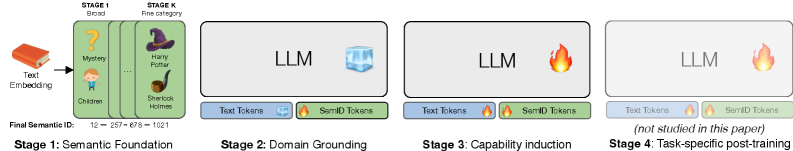
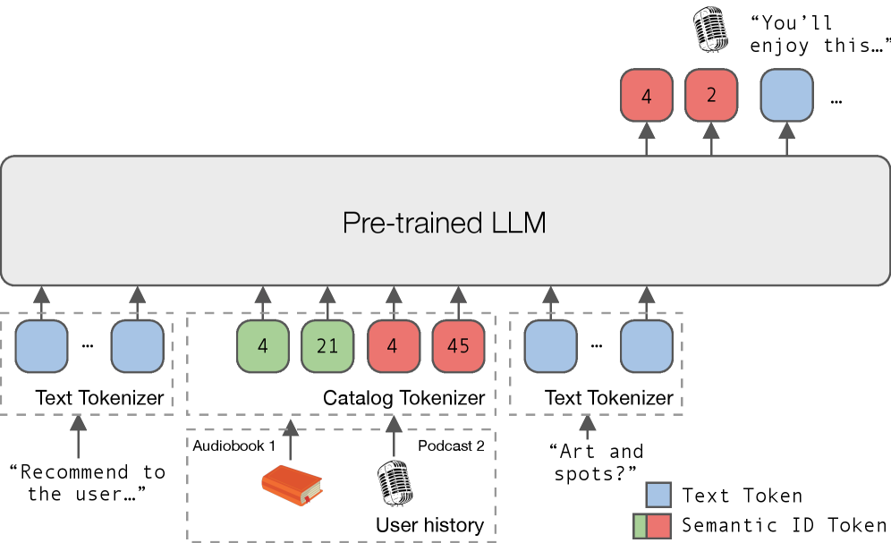

# NEO: A Unified Language Model for Large Scale Search, Recommendation, and Reasoning

**ArXiv ID:** [2603.17533](https://arxiv.org/abs/2603.17533)  
**Submitted:** 2026-03-19  
**Authors:** Marco De Nadai, Edoardo D'Amico, Max Lefarov, Alexandre Tamborrino, Divita Vohra, Mark VanMiddlesworth, et al.  
**Affiliation:** Spotify (Denmark, Spain, Germany, France, United States, United Kingdom)  
**Venue:** (RecSys / ACL 2026 submission)

---

## 摘要 / Abstract

大语言模型（LLMs）被越来越多地应用于推荐、检索和推理任务，但在大规模异构目录上部署一个能联合支持所有这些能力的端到端模型仍是挑战。**NEO** 框架将预训练的仅解码器 LLM 适配为**无工具、目录接地**的生成器。NEO 使用语义标识符（SIDs）表示物品，并训练单一模型在共享序列中**交织自然语言和类型化物品标识符**，同时通过**约束解码**保证生成的标识符对应目录中的真实物品。

在包含超过 **1000 万个物品**、跨多个媒体类型（episodes、shows、audiobooks、artists）的大规模目录上评估：
- 一致地**优于强任务特定 baseline**
- 展现**正向跨任务迁移**（multi-task 比 mono-task 表现更好）
- 同时支持推荐、文本检索、用户兴趣分析和推荐解释（Recsplanation）

---

## 1. 动机 / Motivation

当前挑战：
- **纯文本物品表示**（如标题）在大规模目录下存在歧义和不稳定
- **嵌入序列**需要架构改动，长历史带来带宽/内存开销
- **工具增强管道**引入编排复杂度，限制端到端优化
- **传统生成式推荐（SASRec, TIGER）**仅操作 ID 序列，无法与语言交织

NEO 目标：**单一模型**，支持推荐+检索+文本生成，语言可控，推理时无外部工具。

---

## 2. 方法 / Methodology

### 2.1 四阶段通用框架

*图2：通用四阶段管线。NEO 实例化前三阶段：Stage 1 SID 学习，Stage 2 域接地，Stage 3 多任务指令调优。*

NEO 实例化前三个阶段：

| 阶段 | 目标 | 可训练参数 |
|------|------|-----------|
| Stage 1：语义基础 | 构建 SIDs 作为离散物品表示 | — (预处理) |
| Stage 2：域接地 | 将 SID token 与 LLM 语言空间对齐 | 仅 SID token embedding + head |
| Stage 3：能力诱导 | 多任务指令调优 | 全参数（或 LoRA） |

### 2.2 Semantic IDs（Stage 1）

使用**残差 K-Means（R-KMeans，M=4，K=256/1024）**将内容 embedding 量化为离散 SID token 序列：

- Episodes / Shows / Audiobooks：用 **Qwen3 (8B)** 编码 title+description，$K=256$
- Artists：编码音频 track spectrogram 的平均 embedding，$K=1024$（音频 embedding 复杂度更高）
- **每类物品类型使用独立量化器**（不同类型 embedding 空间差异显著）
- 使用 Matryoshka 特性将 embedding 降维至 1024 维

物品在 LLM 序列中以分隔符封装：
$$\langle\text{text}\rangle\ \texttt{[SID]}\ \langle c_1\ \ldots\ c_M\rangle\ \texttt{[/SID]}\ \langle\text{text}\rangle$$

LLM 词汇表扩充 $M \times K + 2$（SID token + 分隔符），合计约 7168+2 个新 token。

### 2.3 域接地——SID-语言对齐（Stage 2）

*图1：NEO 将 SID 视为独立模态（类似多模态 LLM），通过分阶段对齐进行整合。*

**双向对齐目标**（类比多模态对齐）：
1. **SID → 文本（Verbalization）**：给定 SID 序列，生成物品自然语言描述
2. **文本 → SID（Grounded Retrieval）**：给定自然语言查询，生成对应 SID span
3. **SID → 类型（Type Disambiguation）**：给定 SID，预测物品类型

**稳定化策略**：冻结预训练主干参数，仅优化：
- 新增 SID token 的 input embedding
- LLM head 中 SID-specific 的 output logits

### 2.4 能力诱导——多任务指令调优（Stage 3）

解冻全部参数（或 LoRA），在四类任务上混合训练：

| 任务 | 输入 | 输出 |
|------|------|------|
| **Next-item 推荐** | 指令 + 用户上下文 + SID 历史 | SID（单个物品类型） |
| **文本检索** | 自然语言查询 (+ 用户上下文) | 最相关物品的 SID |
| **Recsplanation** | 用户 SID 历史 + 推荐物品 SID | 推荐物品 SID + 自然语言解释 |
| **用户兴趣分析** | 用户 SID 历史 | 自然语言兴趣摘要 |

提示模板显式指定：(i) 任务类型，(ii) 目标物品类型，(iii) 输出格式（SID-only / text-only / 混合）。

**合成监督数据（蒸馏）**：
- Recsplanation：用大 LLM (32B) 生成推荐理由，替换文本物品引用为 SID 后训练 NEO
- 用户兴趣分析：同样通过蒸馏获得训练目标

### 2.5 推理——约束解码

目录 SID 空间巨大（$256^4 \approx 4\text{B}$ 种可能）。推理时：
- **前缀字典树（prefix trie）** 存储所有合法 SID 元组
- 仅在 `[SID]...[/SID]` span 内进行字典树约束解码
- 文本部分保持自由生成
- SID 碰撞（多物品共享同一 SID）通过**热度选择**解决

对比实验（Table 3）：即使无约束解码，98% 生成的 SID 也是合法的；添加约束仅有微小延迟开销但增加部署灵活性（如限制仅生成新内容）。

---

## 3. 实验 / Experiments

### 3.1 实验设置

- **目录规模**：超过 **1000 万物品**（episodes、shows、audiobooks、artists）
- **用户规模**：约 1500 万用户
- **训练数据**：Stage 2 约 500 万样本；Stage 3 约 1000 万训练样本，10 万测试样本
- **骨干模型**：**Qwen3-0.6B**（主要）；**Llama 3.2 1B**（泛化性验证）
- **评估指标**：HR@K, NDCG@K（K ∈ {10, 30}），全局时序分割

**Baseline**：
- 推荐：GNN + Two-tower（多年线上迭代，融合多类型 cross-item 协同信号）
- 文本检索：稠密检索系统（query encoder + entity encoder，训练于历史搜索日志）

### 3.2 设计分析：语义基础（Stage 1）

**A. SID vs. 原子 ID（Table 2）**：语义结构化 SID 一致优于随机打乱的"原子 ID"，验证语义邻居结构的重要性。

**B. R-KMeans vs. LSH**：R-KMeans（数据自适应量化）显著优于 LSH（随机投影），证明学习的分布自适应量化更有效。

**C. 元数据质量敏感性**：原始元数据（部分描述缺失/重复）比增强元数据导致 **2.91% 性能下降**，强调内容质量对 SID 语义分离度的影响。

**D. 内容 SID vs. 协同过滤 SID**：CF-based artist SID 显著差于 content-based SID，且随时间不稳定。框架内 CF SID 不适合生成式语言交织建模。

**E. 碰撞解决策略**：热度选择 vs. 随机选择无显著差异，说明推理时碰撞率低。

### 3.3 设计分析：域接地（Stage 2）

**Table 4 三阶段 vs. 消融对比**：

| 变体 | 推荐 HR@30 | 文本检索 HR@30 | MMLU-Redux |
|------|-----------|--------------|-----------|
| NEO（三阶段） | best | best | **0.46**（原始水平） |
| 无 Stage 2（跳过接地） | 下降 | 明显下降 | — |
| Stage 2+3 合并 | 下降 | 下降 | — |
| 从零训练（无预训练） | 大幅下降 | 大幅下降 | — |
| CPT（PLUM风格） | 稍低 | 稍低 | **0.03（崩溃）** |

**关键发现**：CPT（持续预训练）在 ID 级检索上接近 NEO，但 **MMLU-Redux 从 0.46 崩溃至 0.03**，通用语言能力严重损失。NEO 的分阶段方法在物品接地和语言能力保留之间取得更好平衡。

### 3.4 多任务性能（Stage 3）

**Table 5**：多任务训练在 HR@K 和 NDCG@K 上一致优于单任务，展示正向跨任务迁移。文本检索性能因物品类型而异（episode 检索最难，因粒度细、词汇歧义高）。

NEO 仅使用生产 baseline **约 50% 的历史日志**，体现样本效率。

### 3.5 文本生成质量（LLM-as-Judge）

**Table 6**：GPT-4o-mini 作为评判者，5 分制：

| 任务 | 评估维度 | 分数 |
|------|---------|------|
| **用户兴趣分析** | 覆盖度（Coverage） | 较高 |
|  | 接地性（Groundedness） | 较高 |
|  | 忠实度（Faithfulness） | 较高 |
| **Recsplanation** | 物品忠实度 | 较高 |
|  | 历史忠实度 | 较高 |
|  | 欺骗性（低为好） | 较低 |

模型能从 SID 历史直接生成接地的自然语言用户兴趣和推荐解释。

### 3.6 语言可控性验证

将提示中 `Target Item Type` 从 episodes 切换到 shows/audiobooks，关闭约束解码后，所有 30 个 beam 均自动引导到目标类型的 SID——验证了语言可控性。

---

## 4. 相关工作 / Related Work

| 类别 | 代表工作 | 局限 |
|------|---------|------|
| 生成式推荐 | SASRec, TIGER, P5, PLUM | 单任务/单类型，无语言可控 |
| LLM 个性化 | P5, LLM-Rec, STAR | 原子 ID 或纯文本，大规模有歧义 |
| 工具增强推荐 | TalkPlay, RecMind | 非端到端，推理延迟高 |
| SID 作为新模态 | TalkPlay (Doh 2025) | 单类型，依赖外部检索器 |
| **NEO** | 本文 | 首个支持类型化混合文本-SID、语言可控、多任务、工具无依赖的大规模框架 |

---

## 5. 结论 / Conclusion

NEO 证明了可以将开源 LLM 适配为**无工具、目录接地、语言可控的多任务发现模型**：
- SID 作为离散物品模态，保留语义邻居结构
- 分阶段对齐（类比多模态 LLM）在物品接地与语言能力间取得平衡
- 多任务指令调优实现推荐、检索、解释、用户理解的统一
- 1000 万物品规模验证，跨多媒体类型（episodes、shows、audiobooks、artists）

两大核心原则：
1. **高质量语义结构化标识符** > 原子 ID
2. **分阶段对齐** > CPT（保留通用语言能力是混合输出任务的关键）

---

## 标签 / Tags

**Star Tags:** 生成式推荐 (Generative Rec), 大模型推荐 (LLM&Rec), Spotify  
**场景:** 流媒体 (Streaming), 多媒体搜索 (Multimodal Search), 播客发现 (Podcast Discovery)  
**技术:** Semantic ID (SID), 生成式检索 (Generative Retrieval), 指令调优 (Instruction Tuning), 约束解码 (Constrained Decoding), 多任务学习 (Multi-task), LLM微调 (LLM Fine-tuning), Qwen3  
**问题:** 统一搜索推荐 (Unified Search&Rec), 语言可控 (Controllable Rec), 内容理解 (Content Understanding), 多类型物品 (Heterogeneous Items)  
**Online A/B:** 否 / No（离线评估）
