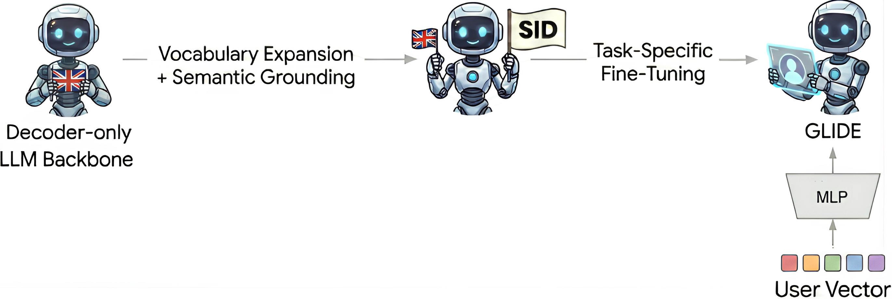
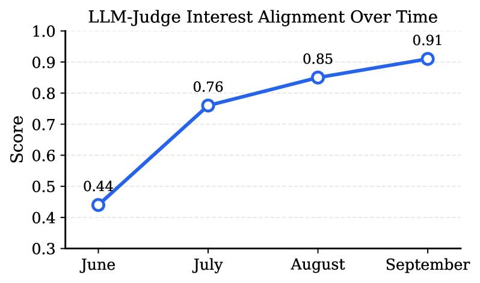

# GLIDE: Deploying Semantic ID-based Generative Retrieval for Large-Scale Podcast Discovery at Spotify

**ArXiv ID:** [2603.17540](https://arxiv.org/abs/2603.17540)  
**Submitted:** 2026-03-19  
**Authors:** Edoardo D'Amico, Marco De Nadai, Praveen Chandar, Divita Vohra, Shawn Lin, Max Lefarov, Paul Gigioli, Gustavo Penha, et al.  
**Affiliation:** Spotify (Spain, Denmark, United States, Germany, France, United Kingdom)  
**Venue:** (RecSys / KDD 2026 submission)

---

## 摘要 / Abstract

播客收听通常围绕固定喜好展开，但用户意图随时间不断演化。传统推荐系统侧重长期交互历史，难以整合丰富上下文信号或灵活的意图感知探索目标。本文提出 **GLIDE（Grounded LLM for Interest Discovery rEcommendations）**，一个用于 Spotify 播客发现的生产级生成式推荐系统。GLIDE 将推荐任务形式化为对离散化目录的指令跟随任务，使用 **Semantic IDs（SIDs）** 实现目录基底生成，注入长期用户嵌入作为软提示（soft prompt）用于个性化，并支持"熟悉/陌生"的可控探索。

线上 A/B 测试（21 天，约 2000 万展示）：
- **非习惯性流媒体（Non-habitual streams）+5.4%**（α<0.01）
- **新节目发现（New-show non-habitual streams）+14.3%**（α<0.01）

---

## 1. 问题定义 / Problem Formulation

### 习惯/非习惯收听划分

对用户 $u$ 和节目 $s$，定义过去 28 天总收听时长 $T_{u,s}$：

- **习惯节目（Habitual）**：$T_{u,s} \geq 10$ 分钟
- **非习惯节目（Non-habitual）**：$T_{u,s} < 10$ 分钟，进一步分为：
  1. **非习惯且陌生（Unfamiliar）**：从未收听过
  2. **非习惯但熟悉（Familiar）**：有过少量收听但未养成习惯

GLIDE 的目标是为用户生成来自**非习惯节目**的排序候选列表：

$$p(\text{SID}(e) \mid \text{prompt}(u, \mathcal{H}_u, \text{instruction}))$$

其中 $\mathcal{H}_u = \{(e_1,t_1), \ldots, (e_n,t_n)\}$ 为近期收听历史。

---

## 2. 方法 / Methodology

### 2.1 总体架构



*图1：GLIDE 两阶段训练流程。第一阶段在 LLM 词汇表中扩充 SID Token 并进行语义接地；第二阶段注入软提示用户向量，训练语言可控的播客推荐。*

GLIDE 的四类输入：
1. **近期收听上下文**（按时序 SID 序列）
2. **轻量用户上下文**（locale、高层兴趣主题等自然语言 token）
3. **长期用户偏好**（稠密协同过滤 embedding，注入为软提示）
4. **任务指令**（指定推荐目标，如"熟悉"或"陌生"）

### 2.2 Semantic IDs 与用户表示

#### 残差 K-Means 量化（R-KMeans）

对 episode embedding $x_e \in \mathbb{R}^d$，使用残差量化编码为长度 $M$ 的离散索引序列：

$$r_0 = x_e$$
$$c_m = \arg\min_{j \in [1..K]} \|r_{m-1} - \mu_{m,j}\|_2$$
$$r_m = r_{m-1} - \mu_{m,c_m}$$

最终 SID 为元组 $(c_1, \ldots, c_M)$。配置：$K=256$，$M=4$，共 $M \times K = 1024$ 个 SID token，每个 episode 用 4 个 token 表示。

示例：$\langle\text{SID}_1{=}13\rangle\,\langle\text{SID}_2{=}65\rangle\,\langle\text{SID}_3{=}188\rangle\,\langle\text{SID}_4{=}7\rangle$

使用**内容基础的 episode embedding**（编码 title + description，使用 multilingual BGE-M3 架构的私有编码器）而非协同过滤信号，理由：
- **冷启动覆盖**：新 episode 即刻可推荐
- **稳定性**：不随用户行为演化导致训练-服务不匹配

#### 软提示用户个性化

对用户 embedding $v_u$，通过两层 MLP 投影到 LLM 隐维度：

$$\tilde{V}_u = \text{Proj}(v_u) \in \mathbb{R}^{1 \times d_{\text{LLM}}}$$

软提示 token 插入在用户上下文开头（系统指令之后），使 LLM 在不扩展提示长度的前提下获取高维用户状态。

### 2.3 语义接地训练（Semantic Grounding）

SID token 在预训练 LLM 中缺乏语义意义，需通过**双向翻译目标**接地：

- **SID → 文本（Verbalization）**：给定 SID 序列生成 episode 描述
- **文本 → SID（Grounded Retrieval）**：给定描述生成对应 SID

两阶段训练策略：
1. **冻结 Transformer 主干**，仅优化新初始化的 SID token embedding
2. **冻结所有参数（含 embedding）**，用 LoRA 适配 Transformer 层

### 2.4 指令调优（Instruction Tuning）

```
[System Instruction] 定义角色（Recommender）和输出格式（Semantic IDs）
[User Context]       <Soft Prompt Vector> ⊕ <Textual Metadata>
[Interaction History] <Sequence of Recent Episode SIDs>
[Task Instruction]   "Recommend a {{ familiarity_mode }} episode aligned with user interests."
```


*图2：GLIDE Prompt 结构。模型以混合的连续软提示和离散 token 为条件进行推荐。*

#### 多任务可控学习

训练示例按目标 episode 与用户历史的关系，设置 control token：
- **Familiar Mode**：目标属于用户曾听过但非习惯的节目
- **Unfamiliar Mode**：目标属于用户从未听过的节目

推理时仅切换 control token 即可调整生成分布，无需重新训练。

去偏训练策略：
- **跨 surface 采样**：减少反馈循环
- **探索上加权**：为来自随机/探索性展示位置的交互赋更高采样权重
- **热度封顶**：限制单个 episode 的训练样本数量

### 2.5 模型服务

#### 碰撞解决

量化可能导致多个 episode 共享同一 SID（碰撞）。推理时使用**基于热度的确定性决策器**（tiebreaker），每日更新。

#### Beam Search 优化

使用 **Beam Search（30 beams）** 每次请求生成 30 个候选：
- 初始宽束解码导致 CPU 侧请求编排成为瓶颈，GPU 利用率低
- 通过扩展请求编排层 + 调优服务配置，吞吐量提升 **8×**
- 在相同延迟目标下，beam width 从 14 提升至 30

---

## 3. 实验 / Experiments

### 3.1 评估框架

**三阶段互补评估：**

1. **检索指标**：Recall@30, HitRate@30, NDCG@30，分 Familiar / Unfamiliar 两段
2. **人工评估**：Spotify 内部员工注解，评估兴趣对齐、新鲜度、多样性、熟悉度
3. **LLM 评判（LLM-as-judge）**：用 LLM 评判逐点/列表级兴趣对齐，补充离线指标

### 3.2 离线实验结果

#### Episode 推荐（表1）

| 模型 | Recall@30 | NDCG@30 | Recall@30 (Unfamiliar) | NDCG@30 (Unfamiliar) |
|------|-----------|---------|------------------------|----------------------|
| SID-only | baseline | baseline | baseline | baseline |
| SID + Text | +中等提升 | +中等提升 | +14.7% | +14.7% |
| **GLIDE** | **+29.9%** | **+31.2%** | **+35.4%** | **+35.4%** |

GLIDE 在陌生内容发现上提升最为显著（+35.4% vs +14.7%），验证了完整训练方案在兴趣交互信号最弱时尤为有效。

#### SID 量化方案对比（表2）

| 方法 | HitRate@30 | 同 SID 内 cosine sim |
|------|-----------|---------------------|
| RQ-VAE | baseline | 0.657 |
| R-LFQ | +相对RQ-VAE低 | — |
| **R-KMeans** | **+9.52%** vs RQ-VAE | **0.856** |

R-KMeans 实现最高检索准确率和最高语义一致性。其工程复杂度远低于 RQ-VAE（无需端到端训练，避免 codebook 崩溃问题），已作为生产量化器。

#### 多任务可控学习消融（表3）

| 模型 | Non-Habitual Unfamiliar Recall@30 | Non-Habitual Familiar Recall@30 |
|------|----------------------------------|--------------------------------|
| Single-Task | baseline | baseline |
| **Multi-Task GLIDE** | **+11.8%** | **+4.9%** |

#### 语义接地消融

语义接地使 Recall@5 提升 **+8.34%**，验证了 SID token 预先接地的必要性。

#### Beam Search vs. Greedy Decoding（表3）

| 解码策略 | Recall@30 | Prefix Ceiling (2 tokens) |
|---------|-----------|---------------------------|
| Beam Search | 100% | 100% |
| Greedy | **-27.07%** | -12.53% |

Greedy 解码在前 2 个 token（粗粒度语义区域）捕获率尚可，但精细标识符选择失败，说明 Beam Search 是高质量 SID 导航的必要条件。

#### LLM-judge 迭代改进



*图3：多次模型迭代中 LLM-judge 兴趣对齐分数的稳步提升。*

在一轮评估中，LLM-judge 和人工评估均偏好另一变体，而离线指标倾向热度偏置模型——揭示了 LLM-judge 在检测人工指标遗漏的质量差异方面的互补价值。

### 3.3 线上 A/B 测试

**实验设置：** 21 天随机用户级在线实验，英语市场，最近 30 天活跃的播客用户，约 **2000 万次展示**。

GLIDE 候选添加到现有候选池，由下游排序器统一排序。

| 指标 | 提升 | 显著性 |
|------|------|--------|
| **非习惯性流媒体（per user）** | **+5.4%** | α<0.01 |
| **新节目非习惯性流媒体** | **+14.3%** | α<0.01 |

- GLIDE 候选占治疗组推荐的 **~34%**
- 满足生产成本和延迟约束
- 总体参与度和用户满意度无回退

---

## 4. 相关工作 / Related Work

- **播客推荐**：Tsagkias et al. 2009, Benton et al. 2020, De Nadai et al. 2024（GNN 有声书推荐）
- **生成式推荐**：SASRec, TIGER（Rajput et al. 2024），Singh et al. 2024（语义 ID 泛化）
- **LLM for Rec + Catalog Grounding**：P5, PLUM（He et al. 2025，YouTube 视频 SID-based 推荐），TIGER
- **软提示**：Huber et al. 2025（Embedding-to-Prefix）, Lester et al. 2021, Mu et al. 2023

---

## 5. 结论 / Conclusion

GLIDE 将播客推荐任务形式化为**目录接地的指令跟随序列生成**，通过：
- **R-KMeans SID** 实现高质量、稳定的 episode 离散表示
- **两阶段训练**（语义接地 + 指令调优）融合语义、序列和个性化信号
- **软提示用户嵌入**在不扩展提示长度的前提下注入长期偏好
- **多任务可控探索**（Familiar / Unfamiliar 模式切换）
- **Beam Search 优化**将吞吐量提升 8×，实现生产延迟内 30 beam

线上验证：非习惯流媒体 +5.4%，新节目发现 +14.3%，无总体指标回退。

---

## 标签 / Tags

**Star Tags:** 生成式推荐 (Generative Rec), 大模型推荐 (LLM&Rec), Spotify  
**场景:** 流媒体 (Streaming), 播客发现 (Podcast Discovery)  
**技术:** Semantic ID (SID), 生成式检索 (Generative Retrieval), 软提示个性化 (Soft Prompt), Beam Search, 指令调优 (Instruction Tuning), 协同过滤 (CF), LLM微调 (LLM Fine-tuning)  
**问题:** 内容发现 (Discovery), 冷启动 (Cold-start), 长尾 (Long-tail), 可控推荐 (Controllable Rec)  
**Online A/B:** ✅ Non-habitual streams +5.4%, New-show non-habitual +14.3% (21天, Spotify Home)
