# VISTA: Massive Memorization with Hundreds of Trillions of Parameters for Sequential Transducer Generative Recommenders

> **arxiv**: https://arxiv.org/abs/2510.22049
> **Authors**: Zhimin Chen*, Chenyu Zhao*, Ka Chun Mo, Yunjiang Jiang, Jane H. Lee, Khushhall Chandra Mahajan, Ning Jiang, Kai Ren, Jinhui Li*, Wen-Yun Yang* (* = corresponding authors)
> **Affiliation**: Meta (majority) + Yale University (Chenyu Zhao)
> **Venue**: ICLR 2026 (The Thirteenth International Conference on Learning Representations)

## Abstract

Modern recommendation systems heavily rely on user interaction history (UIH) sequences to enhance performance. However, scaling to ultra-long user histories with millions of items introduces significant challenges in latency, QPS, and GPU costs for industrial applications. In this work, we propose VISTA (Virtual Interaction Sequence Transducer Architecture), a two-stage attention mechanism that enables sequential transducer generative recommenders to effectively memorize and leverage massive user interaction histories via hundreds of trillions of parameters. VISTA first summarizes the ultra-long UIH into a compact set of summary embeddings using a novel quasi-linear attention (QLA) mechanism, and then computes target-aware attention between candidate items and the summarized embeddings. The resulting summary embeddings are updated every two hours and pre-stored in a geographically replicated in-memory key-value store, fixing both downstream training and inference costs regardless of UIH length. Experiments on public benchmarks and industrial-scale datasets show that VISTA achieves state-of-the-art performance while drastically reducing inference GPU costs by 94%, ultimately serving billions of users in production.

## 1. Introduction

Sequential recommendation is a fundamental capability of modern recommendation systems. The dominant industrial paradigm uses transformer-based architectures—notably the Hierarchical Sequential Transduction Unit (HSTU) underlying Meta's generative recommendation framework—to model user interaction histories. Performance typically scales with the length of the modeled UIH sequence.

Naively extending UIH length faces three entangled industrial constraints:
1. **Latency**: Online inference must process each user's history in real time; O(N²) attention complexity makes this infeasible for N > 10K.
2. **QPS (Queries Per Second)**: User-history processing must sustain the full production query load; GPU throughput is the bottleneck.
3. **GPU cost**: Training and inference GPU fleets are expensive; N-quadratic costs are prohibitive at scale.

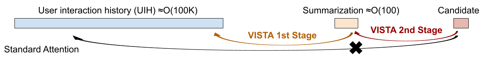

> **Figure 1.** VISTA replaces standard attention with a two-stage process, allowing downstream models to compute only the highly efficient second stage.

Prior work addresses subsets of these constraints but not all three simultaneously:
- **SIM/TWIN**: retrieve top-K items by similarity but lose context beyond top-K
- **HSTU with sliding window**: limits context, misses long-range dependencies
- **Mamba/SSM**: reduce complexity but underperform transformers on recommendation tasks

VISTA's key insight: **pre-compute user history summarization offline**, store it in a key-value store, and make online inference compute only the cheap target-aware attention stage. This decouples UIH processing cost from online inference, fixing GPU cost regardless of sequence length.

Key contributions:
- A two-stage attention mechanism (UIH summarization + target-aware attention) enabling cost-fixed inference for arbitrary UIH lengths.
- Quasi-Linear Attention (QLA): O(N) complexity self-attention with SiLU nonlinearity, outperforming standard linear attention on recommendation tasks.
- Generative Sequence Reconstruction Loss: auxiliary loss forcing summary embeddings to preserve full UIH information.
- An embedding delivery system with 2-hour update cycles and geographically replicated in-memory storage.
- Production deployment serving billions of users, achieving +0.5% on main consumption tasks and 94% GPU reduction.

## 2. Related Work

### Hierarchical Sequential Transduction Unit (HSTU)

HSTU is the foundation of Meta's industrial generative recommendation framework. It uses a modified attention mechanism with relative-position encoding designed for multi-task recommendation. VISTA builds directly on HSTU, replacing its single-stage attention with the two-stage VISTA mechanism while preserving compatibility with the rest of the HSTU infrastructure.

### Transformer Architectures in Recommendation Systems

BERT4Rec, SASRec, and their successors apply transformers to sequential recommendation. Industrial adaptations include SIM (Search-based Interest Model) and TWIN (Two-stage Interest Network), which pre-filter long histories before attention. VISTA differs by using attention-based compression rather than retrieval-based filtering.

### Linear Complexity Attention Mechanisms

Linear attention (Katharopoulos et al., 2020), Performer, and related methods reduce attention complexity from O(N²) to O(N). Mamba and other SSMs achieve similar complexity. VISTA introduces QLA, which is specifically designed for the discrete, item-based nature of recommendation sequences and incorporates SiLU nonlinearity for improved expressiveness.

## 3. Method

### 3.1. Model Architecture Overview

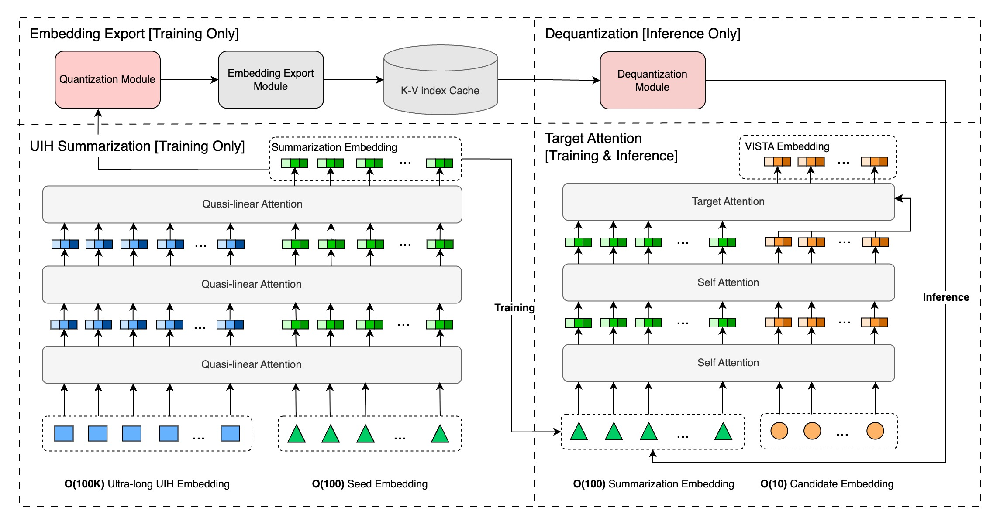

> **Figure 2.** An overview of VISTA architecture. The UIH is divided into the summarization stage (left) and the target-aware stage (right). Summary embeddings are pre-computed and stored offline.

VISTA processes a user's interaction history \\(S = (s_1, s_2, \ldots, s_N)\\) and a set of target candidate items \\(T = (t_1, t_2, \ldots, t_M)\\). The two-stage architecture:

**Stage 1 (Offline UIH Summarization)**:
- Input: Full UIH \\(S\\) + \\(V\\) virtual seed embeddings
- Process: Quasi-linear self-attention over \\(S + \text{seeds}\\)
- Output: \\(V\\) summary embeddings \\(C \in \mathbb{R}^{V \times d}\\) (\\(V \approx 128\\), \\(d = 256\\))

**Stage 2 (Online Target-Aware Attention)**:
- Input: Summary embeddings \\(C\\) + candidate items \\(T\\)
- Process: Standard full attention between \\(T\\) and \\(C\\)
- Cost: O(V × M), independent of N (UIH length)

### 3.2. Ultra-long UIH Sequence Summarization

#### 3.2.1. Linear Attention with Candidate Items for Recommendation

Standard linear attention decomposes the attention matrix:

\\[
\text{LinAttn}(S \Rightarrow^{full} S) = \text{RowNormalize}(QK^\top)V \tag{1}
\\]

\\[
\text{LinAttn}(T \Rightarrow^{full} S) = \frac{T(K^\top V)}{T\; \text{ColSum}(K)^\top} \tag{2}
\\]

\\[
\text{LinAttn}(T \Rightarrow^{individual} T) = \text{Diag}(TT^\top)T \tag{3}
\\]

These formulas allow computing target-against-source attention in O(N) without materializing the N×N matrix.

#### 3.2.2. Quasi-linear Attention for Recommendation

Standard linear attention suffers from rank-deficiency in discrete item embedding spaces. VISTA introduces **Quasi-Linear Attention (QLA)** with the QLU module:

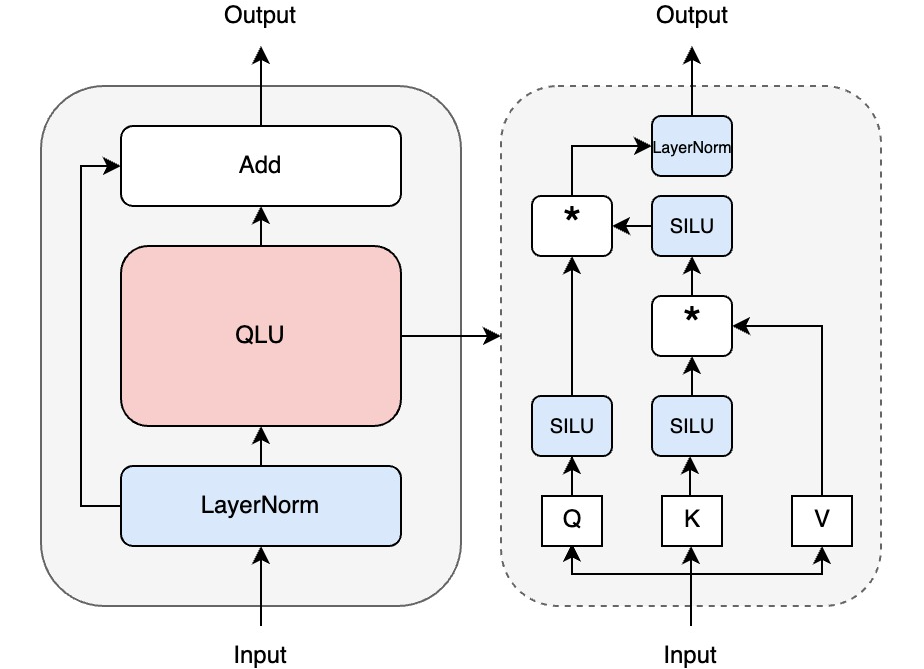

> **Figure 4.** The QLU (Quasi-Linear Unit) module within QLA. Incorporates a SiLU gating mechanism for improved expressiveness.

The QLU module adds a SiLU-gated shortcut to the linear attention output:

\\[
O[S] = Q[S] Z[S]^\top \tag{4}
\\]

\\[
O[T] = Q[T] Z[S]^\top + U[T] V[T] \tag{5-6}
\\]

where \\(Z[S] = K[S]^\top V[S]\\) is the compressed state.

The SGLU (Sigmoid-Gated Linear Unit) module is applied after QLA to further enhance representation capacity.

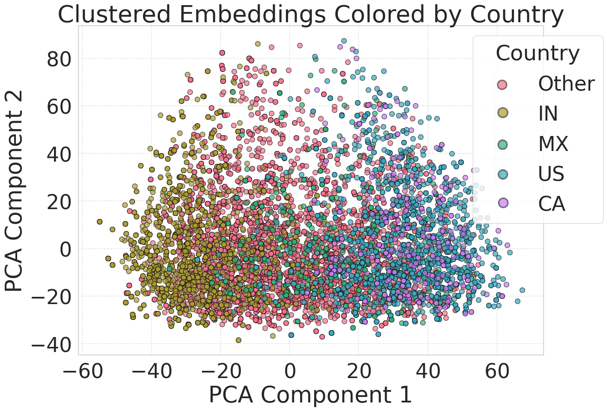

> **Figure 3.** Visualization of UIH summarization embeddings. The virtual seed embeddings (shown as clusters) organize by item category, demonstrating that VISTA's summarization captures semantic structure.

#### 3.2.3. Generative Sequence Reconstruction Loss

To force the summary embeddings to faithfully preserve UIH information, we add a reconstruction loss:

\\[
\mathcal{L}_{recon} = \sum_{i=1}^{M-1} \|v_i - u_{i+1}\|_2^2
\\]

where \\(v_i\\) is the \\(i\\)-th virtual seed output and \\(u_{i+1}\\) is the \\((i+1)\\)-th UIH item embedding. This makes each seed predict the next UIH item in a generative fashion.

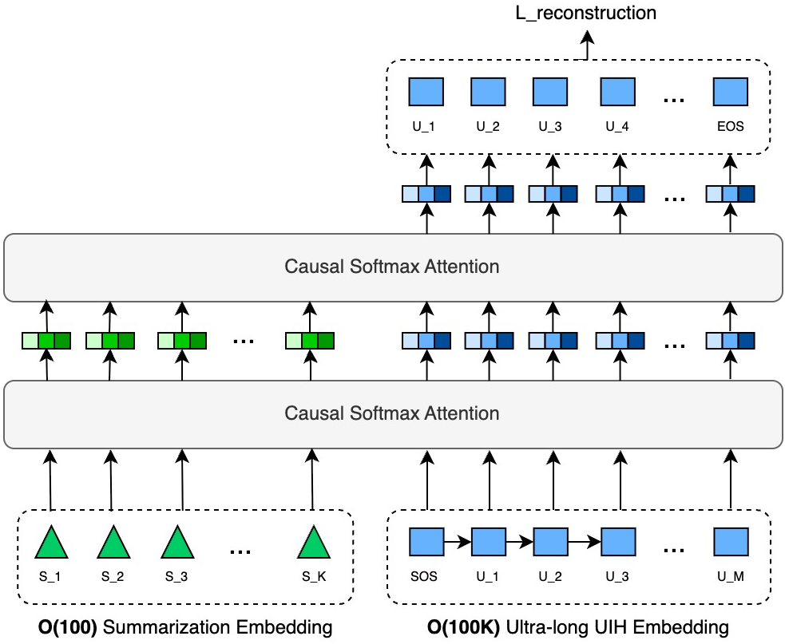

> **Figure 5.** Generative reconstruction loss. Each virtual seed embedding is trained to predict the next item in the UIH, forcing the summarization stage to preserve sequential structure.

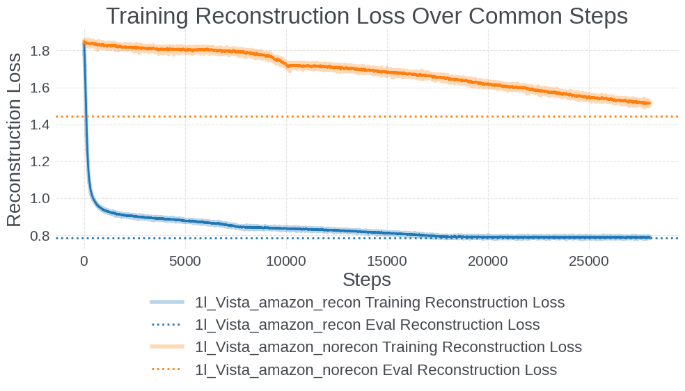

> **Figure 11.** Comparing the reconstruction loss over training steps with and without explicitly including it in the total loss. Including the reconstruction loss (solid line) achieves lower final reconstruction error, confirming the auxiliary loss stabilizes summary quality.

### 3.3. Target-aware Attention

The second stage performs full multi-head attention between candidate items \\(T\\) and summary embeddings \\(C\\):

\\[
\text{TargetAttn}(T, C) = \text{Attention}(Q_T, K_C, V_C)
\\]

Since \\(|C| = V \approx 128\\) is fixed, this stage has O(M × V) complexity and is independent of the original UIH length N.

## 4. Embedding Delivery System

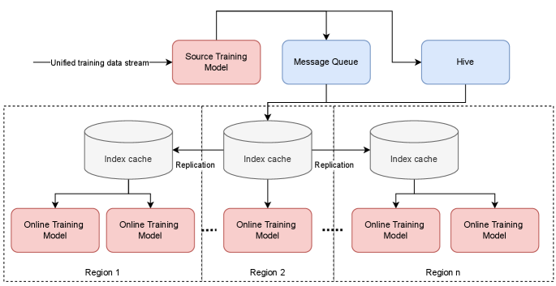

> **Figure 6.** An overview of VISTA's sequence summarization embedding delivery system. Summary embeddings are updated every ~2 hours, stored in geographically replicated in-memory key-value stores, and retrieved during online serving.

The embedding delivery system is critical for production deployment:

- **Update Cadence**: Summary embeddings are refreshed every ~2 hours via offline batch processing
- **Storage**: Geographically replicated in-memory key-value stores (latency < 1ms)
- **Scale**: O(100)TB to O(1)PB total storage (scales with user count × embedding size)
- **Cost tradeoff**: Storage cost << GPU compute cost (storage is ~100x cheaper per unit of computational equivalent)

The system enables:
1. **Fixed online GPU cost**: Online model queries only the stored summary, regardless of UIH length
2. **Freshness**: 2-hour update cycle maintains near-real-time personalization
3. **Geo-replication**: Latency SLAs met globally without repeated computation

## 5. Experiments

### 5.1. Datasets and Experimental Setup

#### 5.1.1. Public Dataset and Industrial-Scale Dataset

| Dataset | Type | Avg. Seq Length | Max Seq Length | Scale |
|---------|------|-----------------|----------------|-------|
| Amazon-Electronics | Public | 7.6 | - | Small |
| KuaiRand-1K | Public | 6.7 | - | Small |
| Minimal Production | Industry | ~1,000 | 2,000 | Medium |
| Industrial-Scale | Industry | 7,000 | 16,000 | Large |

> **Table 1 (excerpt).** Dataset Statistics. Industrial-Scale dataset has 7× longer average sequences than Minimal Production.

#### 5.1.2. Baselines and Evaluation Metrics

| Baseline | Description |
|----------|-------------|
| HSTU | Standard HSTU with full or windowed attention |
| SIM | Retrieval-based long-sequence method |
| TWIN | Two-stage interest network |
| MoE | Mixture-of-Experts for UIH compression |
| VISTA-w/-QLA | VISTA with QLA enabled |
| VISTA-w/o-QLA | VISTA without QLA (standard linear attention) |

Metrics: AUC (higher is better), NE = Normalized Entropy (lower is better).

### 5.2. Offline Experimental Results

#### 5.2.1. Public Dataset Results

| Model | Amazon-Electronics AUC | KuaiRand-1K AUC |
|-------|------------------------|-----------------|
| BERT4Rec | 0.856 | 0.721 |
| SASRec | 0.861 | 0.731 |
| BST | 0.869 | 0.743 |
| HSTU | 0.882 | 0.763 |
| TWIN | 0.873 | 0.751 |
| SIM | 0.875 | 0.754 |
| **VISTA-w/-QLA** | **0.886** | **0.768** |
| VISTA-w/o-QLA | 0.884 | 0.765 |

> **Table 2 (excerpt).** Comparisons on public and Minimal Production datasets. VISTA-w/-QLA consistently outperforms baselines.

#### 5.2.2. Industrial-Scale Dataset Results

On the industrial-scale dataset with average sequence length 7,000:

| Model | Train NE Improvement | Eval NE Improvement |
|-------|---------------------|---------------------|
| HSTU (baseline) | - | - |
| VISTA-w/o-QLA | +0.47% | +0.40% |
| **VISTA-w/-QLA** | **+2.30%** | **+2.98%** |

> **Table 3 (excerpt).** NE improvements over HSTU baseline on industrial dataset. QLA provides substantial gains on long-sequence industrial data.

#### Ablation on QLA

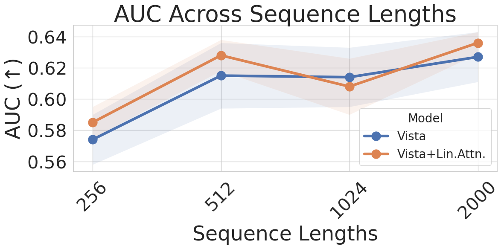 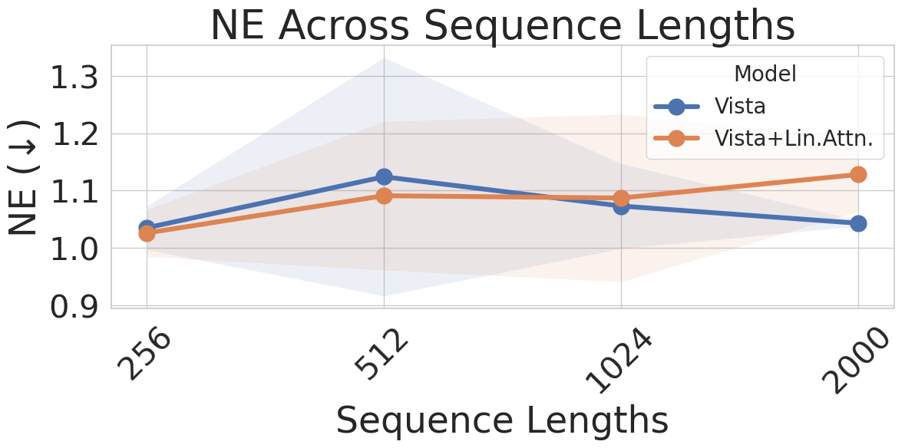 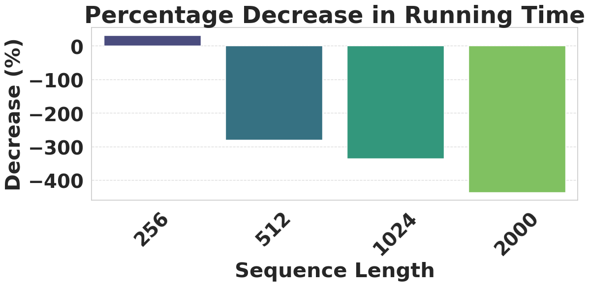

> **Figure 7.** Ablation study on quasi-linear attention by varying sequence length. (a) AUC vs sequence length: VISTA-w/-QLA maintains superior AUC at all lengths. (b) NE vs sequence length: QLA provides consistent NE reduction. (c) Running time: QLA adds minimal overhead vs standard linear attention.

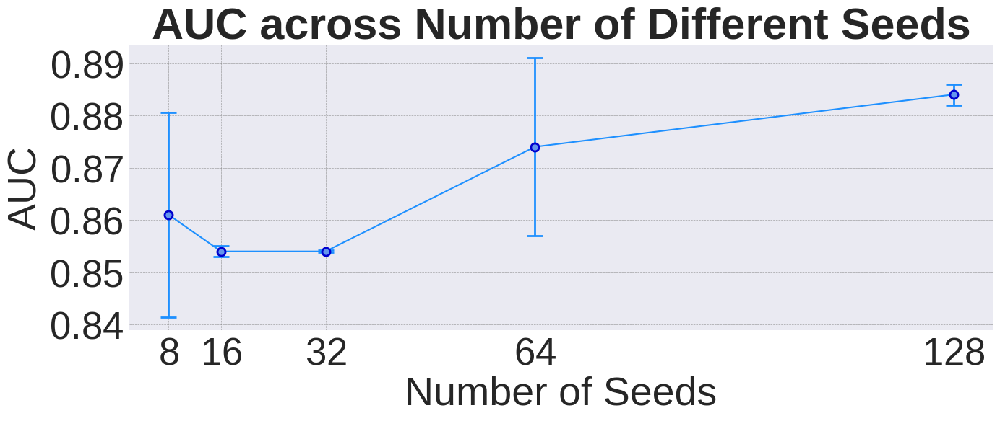 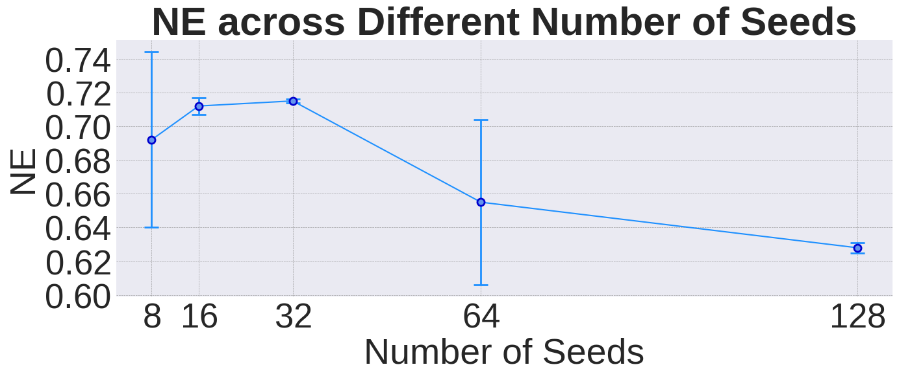

> **Figure 8.** Ablating VISTA across number of seed embeddings (V). (a) AUC. (b) NE. V=128 provides near-saturating performance; more seeds have diminishing returns.

#### Inference Efficiency

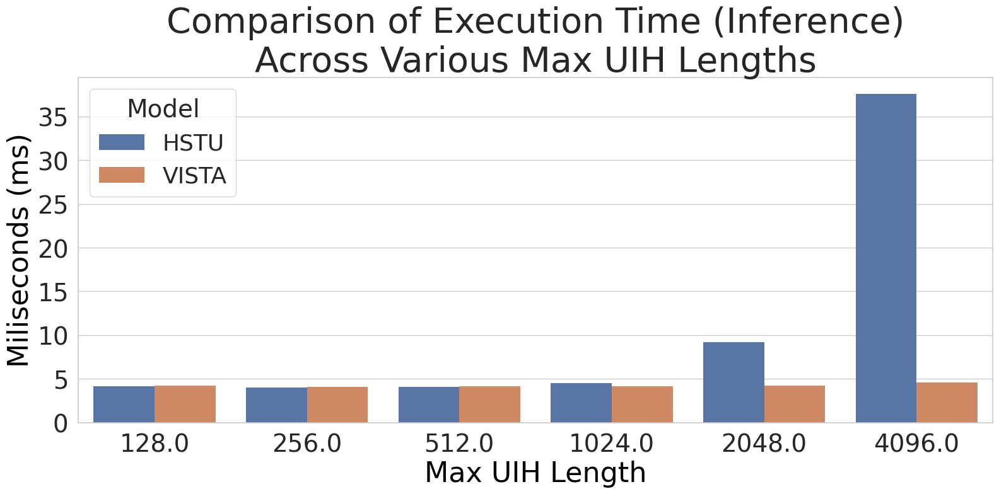

> **Figure 9.** Inference time gains with increasing UIH lengths. VISTA's online inference cost is flat (horizontal line) because it processes only pre-stored summary embeddings. Standard attention grows quadratically, making VISTA's 94% GPU reduction grow with UIH length.

### 5.3. Online A/B Experimental Results

Large-scale A/B test on Meta's production recommendation system (serving billions of users):

| Metric | VISTA Gain |
|--------|-----------|
| Main consumption task | **+0.5%** |
| Online metric 1 | **+0.2%** |
| Online metric 2 | **+0.04%** |
| Inference GPU cost | **-94%** |

> **Table 4 (excerpt).** Online A/B test results. VISTA achieves simultaneous quality improvement and massive GPU cost reduction.

The 94% GPU reduction is achieved by:
1. Moving UIH summarization to offline batch processing (2-hour cadence)
2. Fixing online inference to process only V=128 summary embeddings
3. GPU resources previously spent on UIH processing are freed for other tasks

### Case Studies

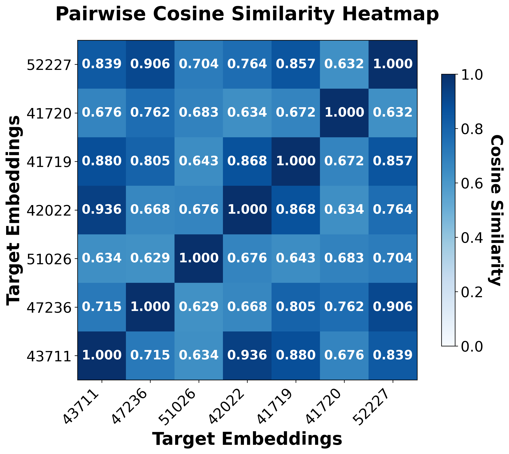 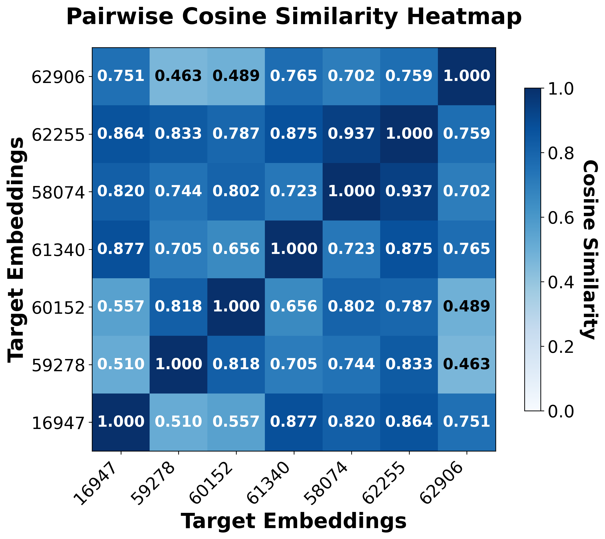 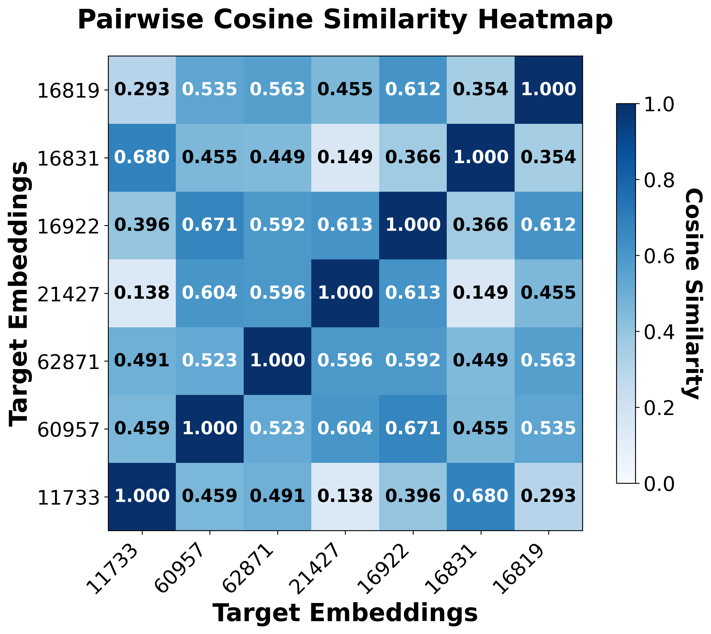

> **Figure 10.** Pairwise cosine similarity of the output of two-stage attention. (a) Same user, different items in same category: high similarity confirming coherent user representation. (b) Same user, different items in different categories: lower similarity showing category discrimination. (c) Different users, same items: low similarity confirming personalization.

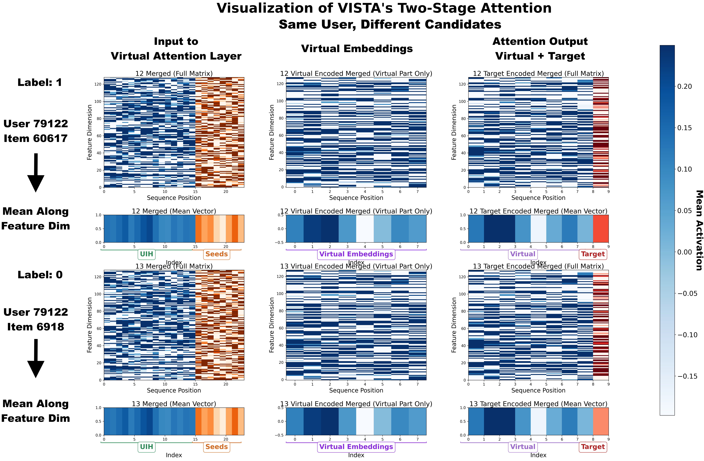

> **Figure 14.** Case Study 1: Visualizing virtual attention and target attention for the same user on two different candidates (positive vs. negative). Target attention shows clear differentiation between positive and negative items.

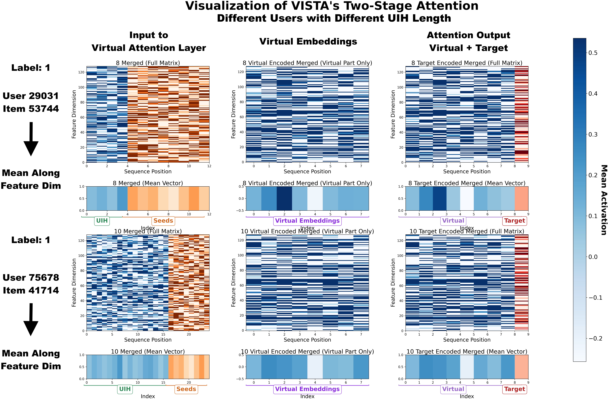

> **Figure 15.** Case Study 2: Visualizing attention for different users with different UIH lengths. VISTA adapts the summarization to users with both short and long histories.

## 6. Conclusion and Discussions

VISTA introduces a two-stage attention mechanism that enables generative recommenders to leverage ultra-long user interaction histories with fixed inference costs. By pre-computing UIH summarizations via quasi-linear attention and storing them in a geographically replicated embedding delivery system, VISTA decouples UIH processing from online inference. The quasi-linear attention mechanism with SiLU nonlinearity outperforms standard linear attention on both public and industrial-scale benchmarks. The generative sequence reconstruction loss further improves summary quality by forcing explicit preservation of UIH information.

Deployed at Meta serving billions of users, VISTA achieves +0.5% on main consumption metrics while reducing inference GPU costs by 94%. The storage-for-compute tradeoff is highly favorable given the large cost differential between GPU compute and memory storage.

Future directions include:
- Reducing the 2-hour embedding staleness with more frequent updates
- Extending to cross-session and cross-platform user history
- Applying VISTA's summarization approach to other long-context recommendation problems (e.g., conversational recommendation)

## References

Key references include:
- [HSTU] Zhai et al., 2024. Actions Speak Louder than Words: Trillion-Parameter Sequential Transducers for Generative Recommendations (ICML 2024).
- [SIM] Pi et al., 2020. Search-based User Interest Modeling with Lifelong Sequential Behavior Data for Click-Through Rate Prediction.
- [TWIN] Chang et al., 2023. Twin: Two-Stage Interest Network for Lifelong User Behavior Modeling in CTR Prediction at Kuaishou.
- [Mamba] Gu & Dao, 2023. Mamba: Linear-Time Sequence Modeling with Selective State Spaces.
- [Linear Attn] Katharopoulos et al., 2020. Transformers are RNNs: Fast Autoregressive Transformers with Linear Attention.
- [Performer] Choromanski et al., 2021. Rethinking Attention with Performers.
