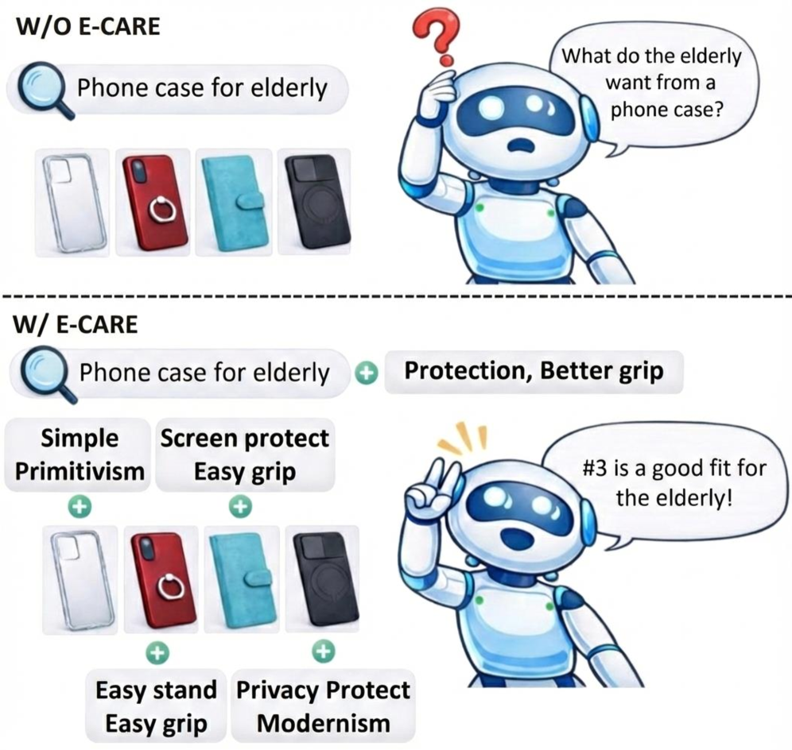
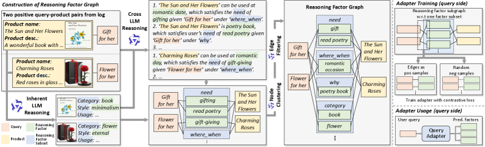
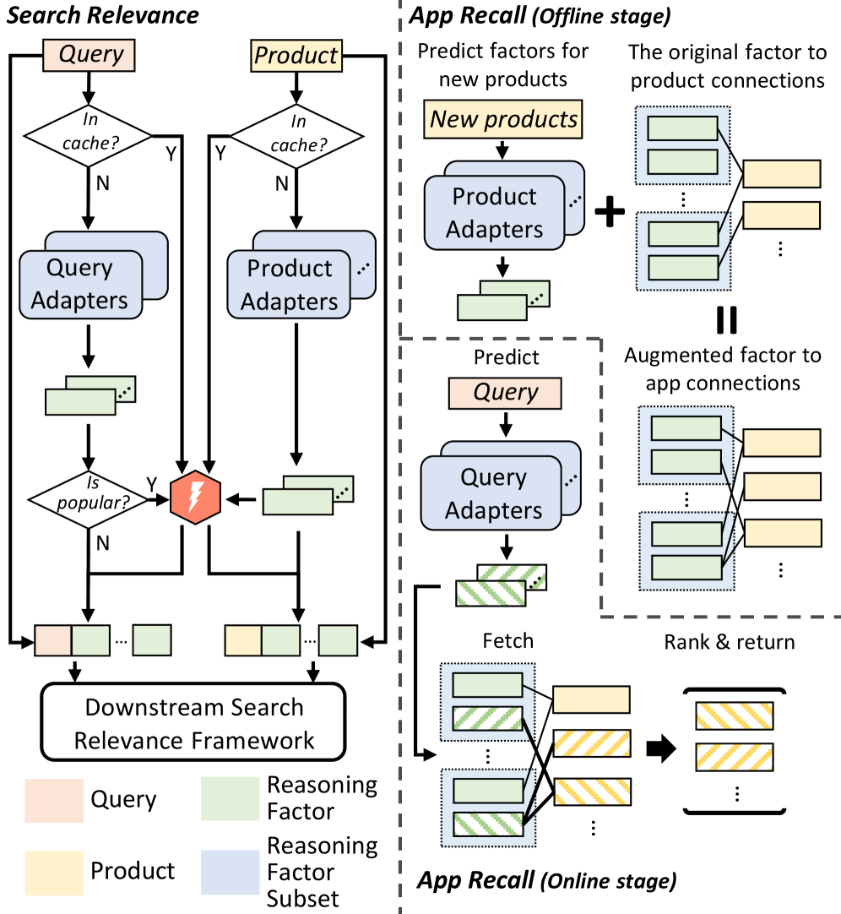

# E-CARE: An Efficient LLM-based Commonsense-Augmented Framework for E-Commerce

**ArXiv ID**: 2511.04087  
**Submitted**: 2025-11-06  
**Authors**: (Huawei Noah's Ark Lab)  
**PDF**: [2511.04087](https://arxiv.org/abs/2511.04087)  
**HTML**: [2511.04087v1](https://arxiv.org/html/2511.04087v1)  

---

## Abstract

Finding relevant products given a user query plays a pivotal role in an e-commerce platform. The challenge lies in accurately predicting the correlation between queries and products. Recently, mining cross-features between queries and products based on the **commonsense reasoning capacity of LLMs** has shown promising performance. However, such methods suffer from:
- High costs due to intensive **real-time LLM inference** during serving
- Human annotations and potential Supervised Fine-Tuning (SFT)

We propose **E-CARE** (Efficient Commonsense-Augmented Recommendation Enhancer). During inference, models augmented with E-CARE can access commonsense reasoning with **only a single LLM forward pass per query** by utilizing a **commonsense reasoning factor graph** that encodes most of the reasoning schema from powerful LLMs.

The experiments on 2 downstream tasks show an improvement of **up to 12.1% on Precision@5** and **12.79% on Macro F1**.

---

## 1. Introduction

**Problem**: User queries can be vague — e.g., "shoes for the elderly" implies slip-resistant shoes to prevent falls. Fulfilling such implicit expectations requires not only lexical/semantic features but also **commonsense reasoning over cross-features**.

**Limitation of prior methods** (FolkScope, COSMO):
- Call an LLM for each query-product pair in real-time → not scalable
- Require human annotation and SFT

**E-CARE's key innovation**:
1. Construct a **reasoning factor graph** from historical interactions enriched by LLM reasoning (offline)
2. Train **adapters** to map queries onto the graph
3. During inference: **only 1 LLM forward pass** per query → leverages precomputed graph structure

**3-stage pipeline (no SFT or human annotation)**:
1. **LLM Reasoning**: mine commonsense factors from query-product pairs
2. **Node Clustering**: cluster and aggregate similar factors
3. **Edge Filtering**: remove uncertain edges via LLM self-evaluation

**Contributions**:
1. Novel paradigm: extract domain-specific reasoning factors → distill into reasoning factor graph → single LLM forward pass at inference
2. 3-stage LLM-based pipeline without SFT or human annotation
3. Empirical improvements: +12.79% Macro F1 and +12.1% Recall@5 on 2 tasks

---

## 2. Related Work

### 2.1. Conventional Retrieval Methods

- **Bi-encoders** (BERT, T5): two-tower structure, efficient offline computation, but limited cross-interaction
- **Cross-encoders**: concatenate query and product, higher accuracy but slow for real-time retrieval
- **Late interaction** (ColBERT): hybrid between bi/cross, retains token-level interactions

### 2.2. LLMs Directly as Classifier or Ranker

- RankGPT, RankVicuna: zero-shot/few-shot listwise ranking
- RaCT, Rank-R1: CoT-guided ranking, GRPO training
- Limitation: real-time LLM calls → latency issues; no explicit commonsense reasoning

### 2.3. LLMs as Reasoner

- **FolkScope**: manually annotated intention knowledge graph for e-commerce
- **COSMO**: instruction-tuned model generates commonsense knowledge graph
- Limitation: require high-quality instruction data + SFT + multiple LLM calls at inference

**E-CARE** avoids all these: no SFT, single LLM call per query at inference.

---

## 3. The Design of E-CARE

### 3.1. Generating the Reasoning Factor Graph

Given historical interactions $\mathbb{D}$ (query-product pairs $(q, p)$), construct reasoning factor graph:

$$\mathcal{G} = (\mathbb{Q}, \mathbb{P}, \mathbb{A}, \mathbb{E})$$

- $\mathbb{Q}$: query nodes
- $\mathbb{P}$: product nodes  
- $\mathbb{A}$: text-based reasoning factor nodes (needs, utilities, features)
- $\mathbb{E}$: edges connecting $\mathbb{Q}$ and $\mathbb{P}$ to $\mathbb{A}$

*Figure 1. E-CARE pipeline: LLM reasoning → Node clustering → Edge filtering.*

#### 3.1.1. LLM Reasoning

**Product feature extraction** (using DSPy framework):
- Feature types $\mathbb{F} = \{f_i\}_{i=1}^{N}$: "category", "style", "usage", etc.
- For each product $p$: extract tuple $(t_p^{f_1}, \ldots, t_p^{f_N})$

**Query-product commonsense reasoning**:
- For each $(q, p) \in \mathbb{D}$ and scope $w \in \mathbb{W}$ (e.g., 'where_when', 'why', 'who'):
  - Extract **need** $n^w$ behind query $q$
  - Extract **utility** $u^w$ provided by product $p$
  - Yield tuple $(q, n^w, u^w, p)$

Collect all $t_p^{f_i}$, $n^w$ and $u^w$ into $\mathbb{A}$ as factor nodes → initial graph $\mathcal{G}_0$.

#### 3.1.2. Node Clustering

Partition factors $\mathbb{A}$ into subsets $\mathbb{T}$ (by factor type). Within each subset $\mathbb{S} \in \mathbb{T}$:
1. Embed all factors using **gte-Qwen2-7b-Instruct**
2. Cluster similar factors
3. LLM summarizes each cluster as a single new factor

Result: condensed graph $\mathcal{G}$ with reduced semantic redundancy.

#### 3.1.3. Edge Filtering via Contrastive Probability

LLM self-evaluation confidence score for each edge $e$:

$$c_{e} = p(``YES"|s(e)) - p(``NO"|s(e))$$

where $s(e)$ is the prompt for edge $e$. Only keep edges above pre-defined threshold. Also regularize maximum edges per (query/product, factor subset) pair by keeping top-$k$.

### 3.2. Building Adapters

#### 3.2.1. Model of Adapter

For each subset $\mathbb{S} \in \mathbb{T}$, separate encoder:

$$\text{enc}_{\mathbb{S}}(q) = \text{MLP}(\text{LLM}(q))$$

$$\text{enc}_{\mathbb{S}}(f) = \text{MLP}(\text{LLM}(f))$$

Similarity:

$$\text{sim}(q, f) = \frac{\langle \text{enc}_{\mathbb{S}}(q), \text{enc}_{\mathbb{S}}(f) \rangle}{\|\text{enc}_{\mathbb{S}}(q)\|_2 \cdot \|\text{enc}_{\mathbb{S}}(f)\|_2}$$

Take top-$k$ factors within $\mathbb{S}$ as predicted factors. Merge all subsets → $a(q)$ (full linked factors).

#### 3.2.2. Training the Adapter

Positive labels: $P^+_{\mathbb{S}}(q) = \{n \in \mathbb{S} \mid (q, n) \in \mathbb{E}\}$

InfoNCE loss:

$$\mathcal{L}_{\mathbb{S}} = \frac{1}{|\mathbb{Q}|} \sum_{q \in \mathbb{Q}} \frac{1}{|P^+_{\mathbb{S}}(q)|} \sum_{n \in P^+_{\mathbb{S}}(q)} \left[-\log \frac{\exp(\text{sim}(q, n))}{\sum_{m \in P^-_{\mathbb{S}}(q) \cup \{n\}} \exp(\text{sim}(q, m))}\right]$$

#### 3.2.3. Extension to Product Adapter

For cold-start products with few interactions: train adapters to predict connected factors based on product text descriptions alone.

---

## 4. Applications

*Figure 2. Overview of two downstream applications: Search Relevance (SR) and App Recall (AR).*

### 4.1. Search Relevance

#### 4.1.2. Datasets

- **ESCI** (Amazon KDD Cup 2022): manually labeled relevance judgments (Exact/Substitute/Complement/Irrelevant); 1,393,063 train samples, 425,762 test samples
- **WANDs** (Wayfair): Exact/Partial/Irrelevant; 140,068 train, 46,690 test

#### 4.1.3. Baselines

- Bi-Encoder (BERT-large, DeBERTa-v3-large, gte-Qwen2-7B)
- Cross-Encoder (BERT-large, DeBERTa-v3-large)
- LLM Inference (Llama-3.1-8B-Instruct)
- Ensemble (DeBERTa-v3-base + BigBird-base + CoCoLM-base)

#### 4.1.5. Experiment Results

**ESCI dataset improvements (w/ E-CARE):**

| Framework | Backbone | Macro F1 (↑) | Micro F1 (↑) |
|-----------|----------|-------------|-------------|
| BE | gte-Qwen2-7B | 42.95 → **44.66** | 67.81 → 68.37 |
| BE | BERT-large | 48.98 → **49.71** | 69.77 → 68.57 |
| BE | DeBERTa-v3-large | 46.87 → **48.70** | 67.25 → 68.27 |
| CE | BERT-large | 55.82 → **57.61** | 73.36 → 74.01 |
| CE | DeBERTa-v3-large | 59.01 → **61.03** | 75.37 → 75.92 |
| LLM | Llama-3.1-8B | 35.25 → **36.26** | 59.83 → 61.68 |
| Ensemble | - | 56.96 → **58.27** | 75.26 → 75.65 |

**Key insight**: E-CARE is most impactful on challenging diverse environments (ESCI) vs. homogeneous datasets (WANDS), where ambiguity and semantic variability are prevalent.

#### 4.1.6. Statistical Analysis

Throughout the E-CARE pipeline, both graph size and in-group similarity of factors decrease progressively → factors become less redundant and more distinguishable.

*Figure 3. Statistics of the reasoning factor graph for ESCI along the E-CARE pipeline.*

#### 4.1.7. Case Studies

**Example 1**: Query "100% all natural male enhancement without caffeine" + Product "Rise Up, Red Edition Natural Energy supplement"
- Without E-CARE: predicted Irrelevant
- With E-CARE: discovered shared purpose (energy supplement) and user profile (health-conscious) → correctly predicted Exact

**Example 2**: Vague query "100% organic, pure without any mix" + Product "Garden of Life Raw Organic Protein"
- Without E-CARE: predicted Irrelevant
- With E-CARE: discovered similarity in natural care intention, plant-based style, and health-conscious user profile → correctly predicted Exact

### 4.2. App Recall

#### 4.2.1. Problem Statement

Given user query $q$ and app set $\mathbb{P}$, retrieve relevant apps. Key challenge: large $|\mathbb{P}|$, efficient real-time computation needed.

#### 4.2.4. Methodology

Retrieve with factor overlap count:

$$\text{sim}(q, p) = |\{(n, p) \mid n \in a(q), (n, p) \in \mathbb{E}\}|$$

**Scalability**: only need to count apps connecting to nodes in $a(q)$ — size is limited and **independent of $|\mathbb{P}|$**.

#### 4.2.5. Experiment Results

| Metric | Baseline (online) | E-CARE |
|--------|------------------|--------|
| Recall@5 | 51.3 | **62.4** (+11.1) |
| Precision@5 | 41.0 | **53.1** (+12.1) |

---

## 5. Conclusion

E-CARE:
- Constructs reasoning factor graph from historical query-product interactions (no SFT, no human annotation)
- Provides LLM-level commonsense reasoning with single forward pass at inference
- Enhances search relevance (ESCI, WANDs) and app recall significantly
- Scalable and efficient for practical deployment

---

## References

- Yu et al. (2023) FolkScope: intention knowledge graph for e-commerce. arXiv
- Yu et al. (2024) COSMO: large-scale e-commerce commonsense knowledge. arXiv
- Khattab et al. (2023) DSPy: compiling declarative language model calls. arXiv
- Li et al. (2023) gte-Qwen2-7b-Instruct: general text embeddings
- Reddy et al. (2022) ESCI: Amazon Shopping Queries Dataset. KDD Cup 2022
- Chen et al. (2022) WANDs: Wayfair annotation dataset
- Sun et al. (2023) RankGPT. arXiv
- Zhuang et al. (2025) Rank-R1. arXiv
- Ren et al. (2023) LLM self-evaluation. arXiv
- Devlin et al. (2019) BERT. NAACL 2019
- He et al. (2021) DeBERTa-v3. arXiv
