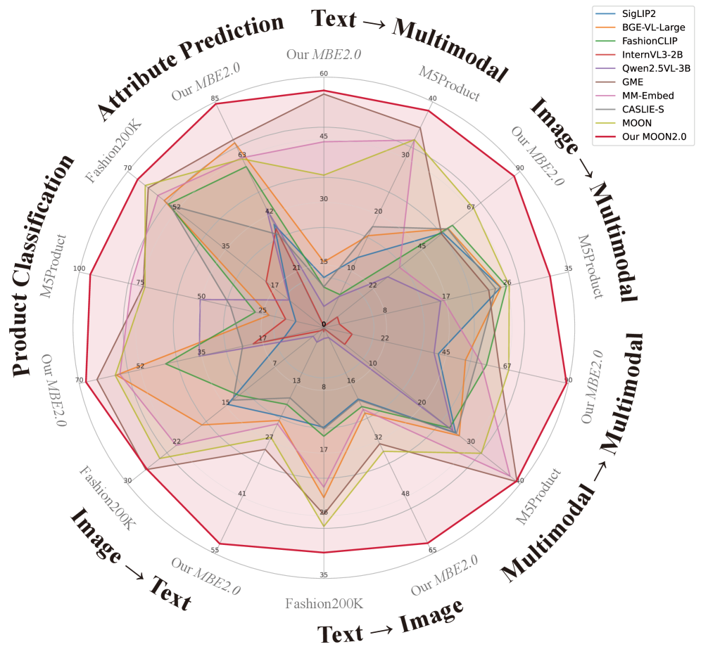
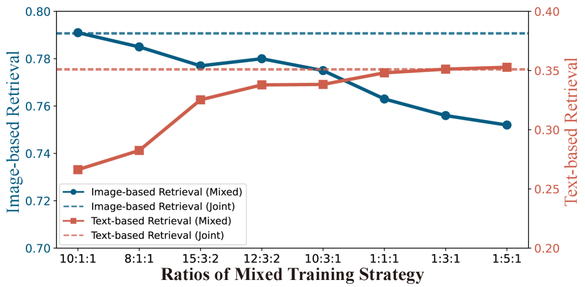
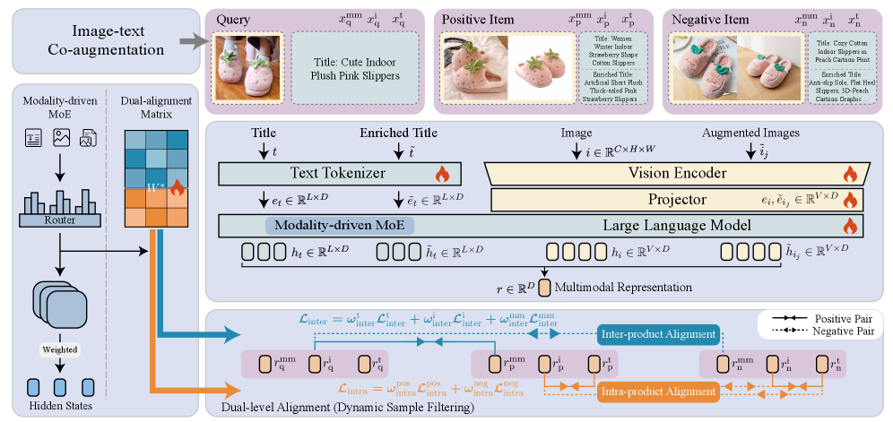
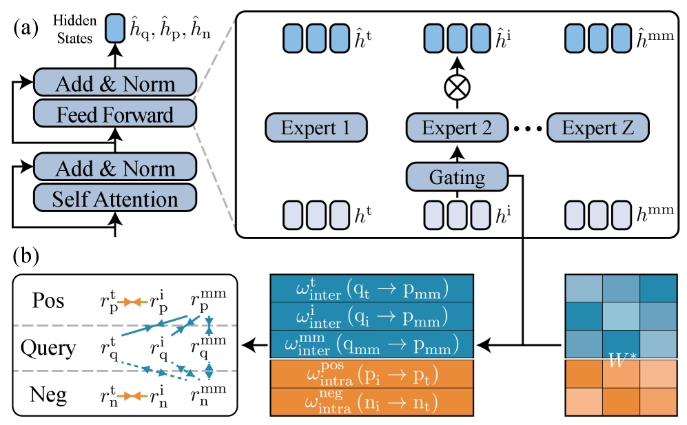
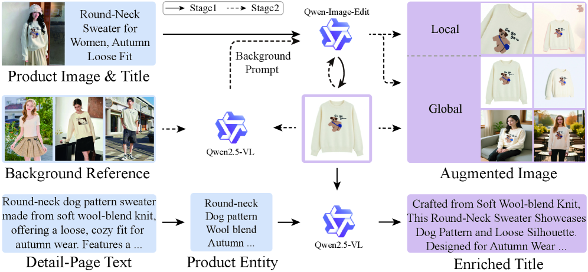
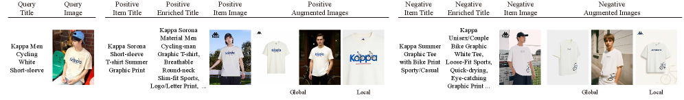
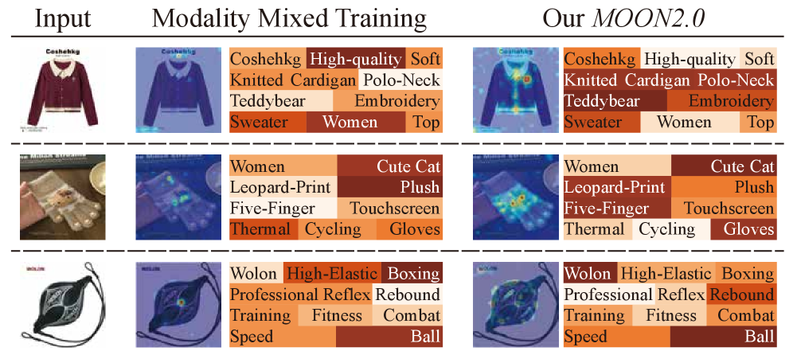

# MOON2.0: Dynamic Modality-balanced Multimodal Representation Learning for E-commerce Product Understanding

**ArXiv ID**: 2511.12449  
**Submitted**: 2025-11-19 (updated)  
**Authors**: Zhanheng Nie, Chenghan Fu, Daoze Zhang, Junxian Wu, Wanxian Guan, Pengjie Wang, Jian Xu, Bo Zheng (Alibaba Group)  
**PDF**: [2511.12449](https://arxiv.org/abs/2511.12449)  
**HTML**: [2511.12449v2](https://arxiv.org/html/2511.12449v2)  
**Benchmark**: [MBE2.0 on HuggingFace](https://huggingface.co/datasets/ZHNie/MBE2.0)  

---

## Abstract

Recent Multimodal Large Language Models (MLLMs) have significantly advanced e-commerce product understanding. However, they still face three challenges:
1. The **modality imbalance** induced by modality mixed training
2. **Underutilization** of the intrinsic alignment relationships among visual and textual information within a product
3. **Limited handling of noise** in e-commerce multimodal data

To address these, we propose **MOON2.0**, a dynamic modality-balanced MultimOdal representation learning framework for e-commerce prOduct uNderstanding. It comprises:
1. A **Modality-driven Mixture-of-Experts (MoE)** that adaptively processes input samples by their modality composition, enabling Multimodal Joint Learning to mitigate modality imbalance
2. A **Dual-level Alignment** method to better leverage semantic alignment properties inside individual products
3. An **MLLM-based Image-text Co-augmentation** strategy that integrates textual enrichment with visual expansion, coupled with **Dynamic Sample Filtering**

We further release **MBE2.0**, a co-augmented Multimodal representation Benchmark for E-commerce (6.4M real-world samples). Experiments show that MOON2.0 delivers state-of-the-art zero-shot performance on MBE2.0 and multiple public datasets.

---

## 1. Introduction

E-commerce representation learning has adopted dual-flow architectures (separate visual and textual encoders), but they struggle with many-to-one product relationships (multiple images per product title).

Inspired by MLLMs' ability to project heterogeneous inputs into a unified embedding space, MOON2.0 builds on generative-model-based MLLMs. Three main challenges addressed:

1. **Modality imbalance**: MOON adopts a fixed 12:3:2 mix of image-only, text-only, and multimodal queries; this mismatch between fixed training mixture and modality distribution of downstream tasks causes uneven degradation

2. **Limited intra-product modeling**: existing methods focus on inter-product relationships, neglecting image-text coherence within each product

3. **Data quality**: texts often include redundant/noisy content; images can be cluttered or lacking viewpoint diversity

*Figure 1: Overall results on all the downstream tasks.*

---

## 2. Related Work

### 2.1. E-commerce Representation Learning

Early systems rely on dual-flow architectures aligned via similarity or retrieval objectives. Unified contrastive frameworks and gated fusion methods improved on large-scale backbones. MOON2.0 aims to mitigate modality imbalance through Multimodal Joint Learning.

### 2.2. Multimodal Representation Learning

Early approaches include dual-flow models and fusion architectures achieving strong cross-modal alignment via contrastive learning. Recent MLLMs unify heterogeneous inputs but often lack domain-specific knowledge for e-commerce.

---

## 3. Method

### 3.1. Formulation and Overview

**Multimodal Retrieval:** Given queries $\mathcal{Q} = \{q | q \in \{q^{\text{text}}, q^{\text{image}}, q^{\text{multimodal}}\}\}$ and candidates $\mathcal{C}$:

$$\dot{c} = \operatorname*{\arg\max}_{c \in \mathcal{C}} \text{sim}(F(q), F(c))$$

This covers image-to-multimodal, text-to-multimodal, and multimodal-to-multimodal retrieval.

**Framework Overview (Fig 3):**
1. MLLM-based Image-text Co-augmentation enhances data diversity/robustness
2. Multimodal Joint Learning + Modality-driven MoE routes inputs to specialized experts
3. Dual-level Alignment + Dynamic Sample Filtering ensures training robustness

*Figure 2: Modality imbalance under the training set of mixed training strategy.*

### 3.2. Multimodal Joint Learning

**Modality-driven MoE.** Unlike conventional token-level routing, MoE integrates token-wise activation with modality-aware objective optimization. Given hidden states $h$:

$$\hat{h} = \sum_{z=1}^{Z} \tilde{G}_{z} \cdot f_{z}(h)$$

A learnable Dual-alignment Matrix $W^* \in \mathbb{R}^{Z \times M}$ quantifies expert preference for each objective $m$:

$$p_{z,m} = \frac{\exp(W^*_{z,m})}{\sum_{k=1}^{M} \exp(W^*_{z,k})}$$

Objective-specific weight $\omega_m$:

$$\omega_{m} = \frac{1}{|\mathcal{B}_{m}|} \sum_{b \in \mathcal{B}_{m}} \sum_{z=1}^{Z} p_{z,m} \cdot \tilde{G}_{z,b}$$

Sparsity regularization to compel expert specialization:

$$\mathcal{L}_{\text{sparsity}} = \frac{1}{Z} \sum_{z=1}^{Z} \left(-\sum_{m=1}^{M} p_{z,m} \log p_{z,m}\right)$$

**Dual-level Alignment.**

*Inter-product alignment:* Contrastive objective for related products:

$$\mathcal{L}_{\text{inter}}^{\varphi} = -\log \frac{\exp\left(r_{\text{q}}^{\varphi} \cdot r_{\text{p}}^{\text{mm}}/\tau\right)}{\exp\left(r_{\text{q}}^{\varphi} \cdot r_{\text{p}}^{\text{mm}}/\tau\right) + \sum_{\mathcal{N}_{\text{q}}} \exp\left(r_{\text{q}}^{\varphi} \cdot r_{\text{n}}^{\text{mm}}/\tau\right)}$$

*Intra-product alignment:* Image-text coherence within each product:

$$\mathcal{L}_{\text{intra}}^{\psi} = -\log \frac{\exp\left(r^{\text{i}}_{\psi} \cdot r^{\text{t}}_{\psi}/\tilde{\tau}\right)}{\exp\left(r^{\text{i}}_{\psi} \cdot r^{\text{t}}_{\psi}/\tilde{\tau}\right) + \sum_{\text{t}^{\psi^{-1}}} \exp\left(r^{\text{i}}_{\psi} \cdot r^{\text{t}}_{\psi^{-1}}/\tilde{\tau}\right)}$$

**Holistic Optimization:**

$$\mathcal{L}_{\text{total}} = \mathcal{L}_{\text{inter}} + \mathcal{L}_{\text{intra}} + \alpha \mathcal{L}_{\text{aux}} + \beta \mathcal{L}_{\text{sparsity}}$$

*Figure 3: Pipeline of MOON2.0.*

*Figure 4: (a) Modality-driven MoE. (b) Dual-level Alignment.*

### 3.3. MLLM-based Image-text Co-augmentation

**Textual Enrichment.** Given item title $T$, description $D$, and image $I$:

$$T^+ = \text{MLLM}_{\text{text}}(T, I, \mathcal{E})$$

where $\mathcal{E}$ are extracted salient entity candidates.

**Visual Expansion.** Two-stage visual augmentation:
1. Extract main subject image $I^m$
2. Synthesize diverse variants with different backgrounds/viewpoints:

$$I^c_k = \text{MLLM}_{\text{edit}}(I^m, T, \text{prompt}_k), \quad k \in \{1, \ldots, n\}$$

**Dynamic Sample Filtering.** Reliability weight for each triplet $(r_{\text{q}}, r_{\text{p}}, r_{\text{n}})$:

$$\phi = \sigma\!\left(\kappa((r_{\text{q}} \cdot r_{\text{p}}) - (r_{\text{q}} \cdot r_{\text{n}}) - \bar{\Delta})\right)$$

Triplets with $\phi < \delta = 0.6$ are down-weighted. $\bar{\Delta}$ decays over training.

---

## 4. The MBE2.0 Benchmark

- **Source**: Taobao platform (Jan 2023 - Jun 2025)
- **Training**: 5,751,594 samples (co-augmented)
- **Test**: 636,241 samples
- **Tasks**: Product retrieval, classification, attribute prediction
- **Positive**: purchases following a query
- **Negative**: skipped exposures with low relevance scores

---

## 5. Experiment

### 5.1. Experimental Setup

- **Training**: Single-stage supervised fine-tuning on in-house MLLM, 18 hours on 64 NVIDIA A100 GPUs, batch size 4 per GPU, LR 1×10⁻⁵
- **Baselines**: SigLIP2, BGE-VL-Large, FashionCLIP, InternVL3-2B, Qwen2.5-VL-3B, GME, MM-Embed, CASLIE-S, MOON

### 5.2. Experimental Results

**MBE2.0 Results (Table 1):** MOON2.0 attains leading results on most retrieval settings.

**Key findings:**
1. MOON2.0 outperforms dual-flow architectures (SigLIP2, FashionCLIP) significantly
2. MOON2.0 outperforms MOON and CASILE, highlighting Modality-driven MoE benefits
3. MOON2.0 delivers larger improvements on non-traditional cross-modal settings ($q^{\text{t}} \to c^{\text{i}}$ and $q^{\text{i}} \to c^{\text{t}}$) attributed to Dual-level Alignment

**M5Product and Fashion200K:** MOON2.0 achieves competitive SOTA performance on both cross-domain benchmarks.

### 5.3. Ablation Study

All 4 components contribute to performance:
- Removing Modality-driven MoE: degradation across settings, less suited to heterogeneous query-target pairs
- Without Dual-level Alignment: performance drops on tasks probing multimodal alignment
- Without MLLM-based Co-augmentation: inputs are less informative
- Without Dynamic Sample Filtering: training more sensitive to raw e-commerce data noise

### 5.4. Heatmap Visualization

Attention shifts from non-critical regions ("high quality", "women") to key attributes ("knitted cardigan", "polo-neck", "Teddybear"), while also highlighting brand names.

*Figure 5: MLLM-based Image-text Co-augmentation pipeline.*

*Figure 6: Illustration of one MBE2.0 training sample.*

*Figure 7: Heatmap visualization of MOON2.0.*

---

## 6. Conclusion

MOON2.0 successfully achieves dynamic modality-balanced multimodal representation learning in e-commerce by:
- **Modality-driven MoE**: adaptively routes inputs to specialized experts by modality composition
- **Dual-level Alignment**: jointly models inter- and intra-product relationships
- **MLLM-based Image-text Co-augmentation + Dynamic Sample Filtering**: improves data quality and diversity

---

## References

- Zhang et al. (2026) MOON. WSDM 2026 (pp. 924-933)
- Lin et al. (2025) MM-EMBED. ICLR 2025
- Zhang et al. (2025) GME (Bridging modalities). CVPR 2025
- Chia et al. (2022) FashionCLIP. Scientific Reports
- Dong et al. (2022) M5Product. CVPR 2022
- Fedus et al. (2022) Switch Transformers. JMLR
- Radford et al. (2021) CLIP. ICML 2021
- Bai et al. (2025) Qwen2.5-VL. arXiv:2502.13923
