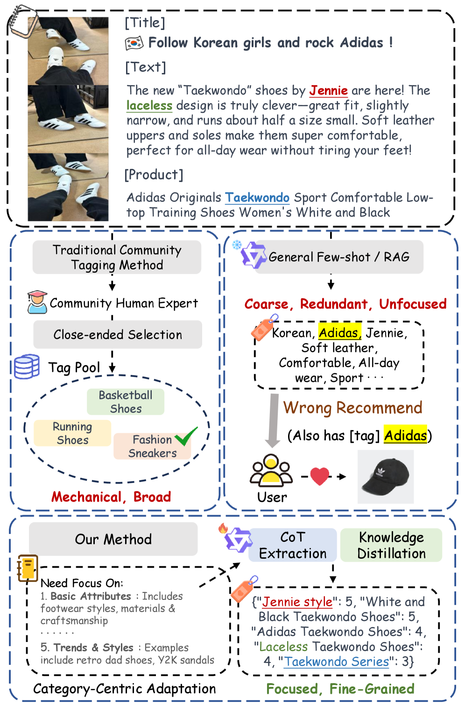
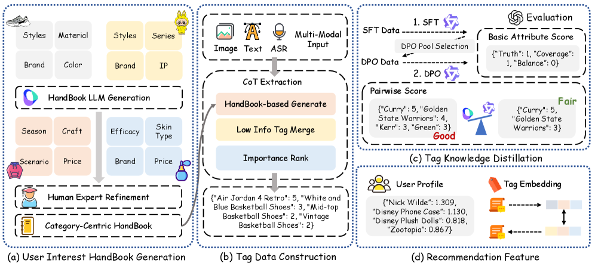
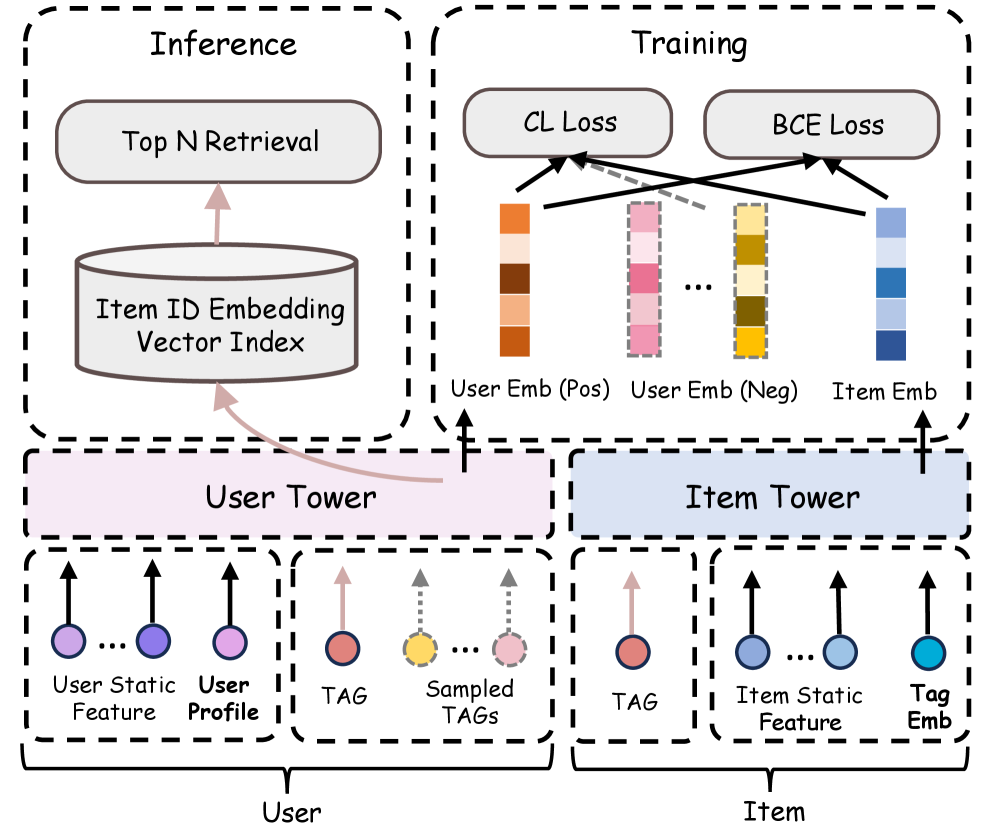

# TagLLM: A Fine-Grained Tag Generation Approach for Note Recommendation

> **arxiv**: https://arxiv.org/abs/2603.21481  
> **Authors**: Zhijian Chen, Likai Wang, Lei Chen, Yaguang Dou, Jialiang Shi, Tian Qi, Dongdong Hao, Mengying Lu, Cheng Ye, Chao Wei  
> **Affiliations**: Tongji University; Shanghai Dewu Information Group Co. Ltd.; Tsinghua University SIGS  
> **Venue**: Preprint 2026

## Abstract
TagLLM 提出在电商社区推荐场景中使用可解释细粒度标签替代黑盒 embedding 作为核心推荐特征。方法通过用户兴趣手册（按品类定义关注维度）约束标签生成，再利用多模态 CoT 提取流水线（生成→低信息合并→重要性排序）构建训练数据，并通过两阶段蒸馏（SFT + DPO）把能力压缩到小模型。在线 A/B 显示 AVDU +0.31%、AIU +0.96%、冷启动 PVCTR +32.37%。

## 1 Introduction
论文指出当前 LLM/MLLM 在社区推荐中多用作编码器生成隐式向量，缺乏可解释性和稳定监督。TagLLM 目标是生成可控、可解释、与用户兴趣维度对齐的细粒度标签，直接服务推荐特征构建与冷启动召回。

\
> **Figure 1.** Motivation of TagLLM.

## 2 Related Work
### 2.1 LLMs for Recommendation
回顾了数据增强、直接推荐、向量编码三类 LLM 推荐路线，指出前两者在工业部署和上下文长度上存在困难，第三类存在可解释性不足。

### 2.2 Tag Generation
将标签生成分为抽取式、分类式和生成式。TagLLM 强调开放式生成并与推荐目标强耦合。

\
> **Figure 2.** Overall pipeline.

## 3 Method
### 3.1 User Interest HandBook Generation
先由 LLM 扩展兴趣维度，再由专家筛选形成按品类生效的用户兴趣手册。

### 3.2 Tag Data Construction
通过多模态输入（图像、文本、ASR）和 CoT 三步法构建高质量标签数据。

### 3.3 Tag Knowledge Distillation
采用 MLLM-as-a-judge 进行基础属性评分与 pairwise 比较，完成 SFT + DPO 两阶段蒸馏。

### 3.4 Recommendation Feature
将标签转为用户画像特征与标签 embedding 特征，接入双塔召回。

## 4 Experiment
### 4.1 Dataset and Experiment Setting
使用得物大规模真实笔记数据，18 类目，包含 SFT/DPO/Eval 三套不重叠数据。

### 4.2 Distillation Performance
蒸馏后 2B/4B 模型均显著提升，Qwen3-VL-4B-Instruct 表现最佳。

### 4.3 Ablation Study
文本模态最关键；图像与商品描述在不同类目有互补贡献。

### 4.4 Evaluation Strategy Selection
对比多评审模型与人工对齐度，选择 doubao-1.6-thinking 作为 judge。

### 4.5 Failure Case Study
失败主要来自推理幻觉与用户内容误导。

### 4.6 Online A/B Test
线上指标显著提升，尤其冷启动场景。

\
> **Figure 6.** Online serving model.

## 5 Conclusion
TagLLM 通过“兴趣手册约束 + CoT 标签构建 + 蒸馏落地”实现了可解释且有效的工业推荐增强方案。

## Tables (Summary)
| Table | Description |
|---|---|
| Table 1 | Experimental dataset statistics |
| Table 2 | Distillation performance |
| Table 3 | Judge-human alignment |
| Table 4 | Online A/B overall gains |
| Table 5 | Cold-start improvements |
| Table 6 | Pairwise comparison details |

## Numbered Equations
\[ 	ext{MAE}=rac{1}{n}\sum_{i=1}^{n}|\mathcal{J}_i-\mathcal{P}_i| 	ag{1} \]
\[ 	ext{Consistency}=rac{1}{n}\sum_{i=1}^{n}\mathbf{1}(|\mathcal{J}_i-\mathcal{P}_i|\le1) 	ag{2} \]
\[ U(z,f^u)=\mathrm{FC}(\mathrm{FC}(\mathrm{concat}(f^u,z))) 	ag{3} \]
\[ V(z,f^v)=\mathrm{FC}(\mathrm{FC}(\mathrm{concat}(f^v,z))) 	ag{4} \]
\[ \mathcal{L}_{\mathrm{BCE}}=-[y\log\hat y+(1-y)\log(1-\hat y)] 	ag{5} \]
\[ \mathcal{L}_{\mathrm{CL}}=rac{e^{\langle U(z,f^u),V(z,f^v)
angle}}{e^{\langle U(z,f^u),V(z,f^v)
angle}+\sum_{z'\in\mathbb Z}e^{\langle U(z',f^u),V(z,f^v)
angle}} 	ag{6} \]
\[ \mathcal{L}=\mathcal{L}_{\mathrm{BCE}}+\lambda_1\mathcal{L}_{\mathrm{CL}}+\lambda_2\|\Theta\|^2 	ag{7} \]

## References
- Refer to the original paper references at arXiv.
