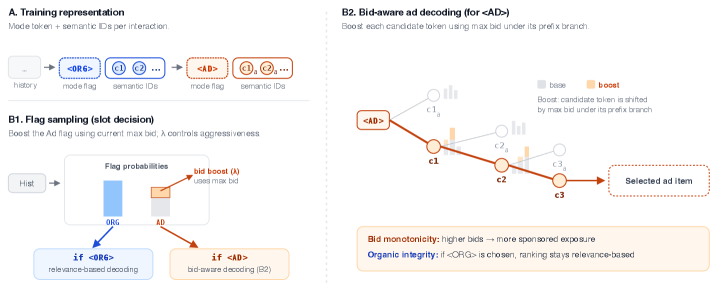

# One Model, Two Markets: Bid-Aware Generative Recommendation

> **arxiv**: https://arxiv.org/abs/2603.22231  
> **Authors**: Yanchen Jiang, Zhe Feng, Christopher P. Mah, Aranyak Mehta, Di Wang  
> **Affiliations**: Google (correspondence: zhef@google.com), Harvard and collaborators  
> **Venue**: Preprint 2026

## Abstract
论文提出 GEM-Rec，把有机推荐与广告推荐统一到同一个生成式推荐框架。核心做法是：在语义ID序列前加入控制 token（<ORG>/<AD>）决定槽位类型，再在推理时通过 bid-aware decoding 把实时出价注入生成过程，实现“相关性+收益”联合优化且无需重训。论文给出分配单调性与有机排序完整性的理论性质，并在多个数据集展示可控的收益-质量前沿。

## 1 Introduction
现有语义ID生成式推荐主要优化偏好相关性，缺少面向商业化场景的实时竞价感知能力。GEM-Rec 旨在解决“是否投放广告”和“投放哪个广告”两级决策问题。

## 2 Problem Setup
在交互序列中显式建模展示模式（Organic/Sponsored）与 item 的联合生成。

## 3 The GEM-Rec Framework
### 3.1 Preliminaries: Semantic IDs
基于层级语义ID表示 item，保留 coarse-to-fine 可解释结构。

### 3.2 Unified Sequence Construction
通过控制 token 把展示模式嵌入序列，先决策模式再生成内容。

### 3.3 The Factorized Generative Objective
把目标分解为 slot 决策与模式条件下 item 生成。

## 4 Inference-Time Bid Modulation
### 4.1 Two-Level Logit Modulation
在槽位级与 item 级同时注入出价信息。

### 4.2 Pricing Mechanism
实验使用 first-price 计价。

### 4.3 Theoretical Properties
给出 allocative monotonicity 与 structural consistency。

### 4.4 Hierarchical Decoding Strategy
先采样展示标记，再条件 beam search 生成语义ID。

\
> **Figure 1.** GEM-Rec unified architecture.

## 5 Experimental Setup
构造合成市场并评估 NDCG、收益、广告率、相关性等指标，展示随着 \(\lambda\) 增大可平滑提升收益并保持可控质量折中。

## 6 Conclusion
GEM-Rec 在生成式推荐中引入了可部署的商业化控制能力，兼顾推荐体验与平台收益。

## Tables (Summary)
| Table | Description |
|---|---|
| Table 1 | Main marketplace performance |
| Table 2 | Volatility/bid shock response |
| Table 3-9 | Extended results, validity, ablations |

## Numbered Equations
\[ \mathbf{x}_t=[f_t]\oplus[c_{t,1},\dots,c_{t,D}] 	ag{1} \]
\[ P_	heta(\mathbf{x}_t|H_{<t})=P_	heta(f_t|H_{<t})\prod_{k=1}^{D}P_	heta(c_{t,k}|H_{<t},f_t,c_{t,<k}) 	ag{2} \]
\[ 	ilde z_{\langle AD
angle}=z_{\langle AD
angle}+\lambda\log(1+b_{max}) 	ag{3} \]
\[ 	ilde z_c=z_c+\lambda\log(1+\mathcal{B}(c)) 	ag{4} \]
\[ x_i(b)=P_\lambda(f=\langle AD
angle|H,b)\cdot\mathbb{I}[\mathcal D_K(H,b)=i] 	ag{5} \]
\[ \mathcal{L}_{	ext{strict}}\;	ext{(see paper)} 	ag{6} \]
\[ \mathcal{L}_{	ext{organic}}\;	ext{(see paper)} 	ag{7} \]
\[ 	ext{Revenue}=\sum 	ext{winning bids} 	ag{8} \]

## References
- Refer to the original paper references at arXiv.
