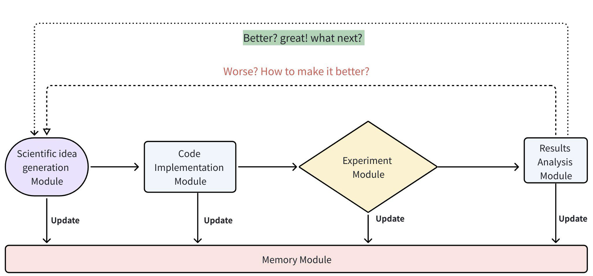
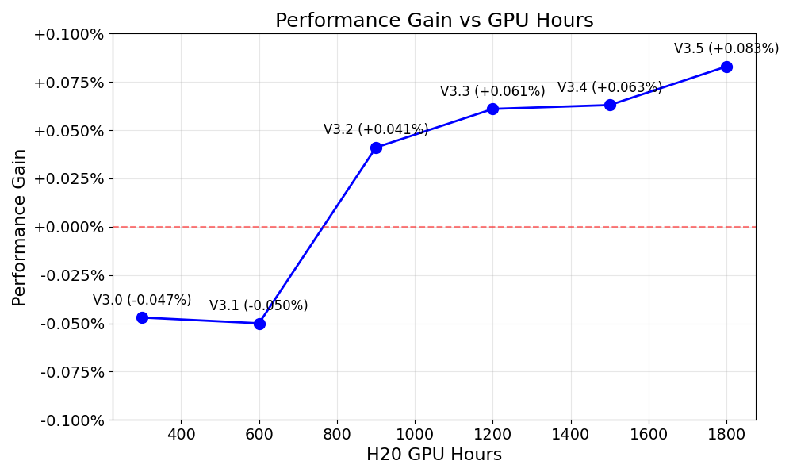
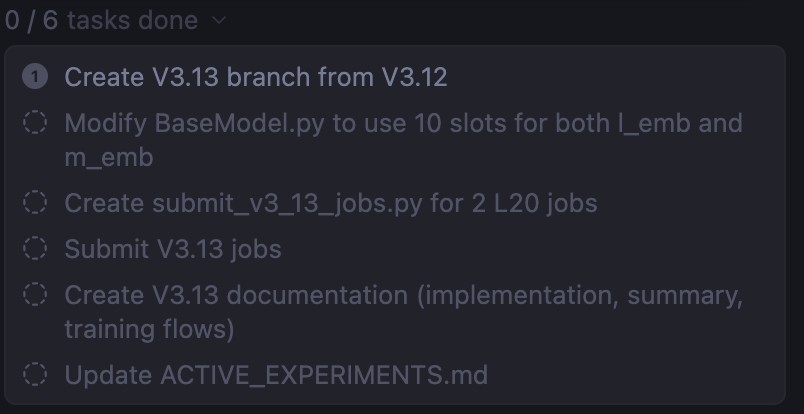

# AI Co-Scientist for Ranking: Discovering Novel Search Ranking Models alongside LLM-based AI Agents with Cloud Computing Access

**ArXiv ID**: 2603.22376  
**Submitted**: 2026-03-25  
**Authors**: Liwei Wu (Trip.com Group), Cho-Jui Hsieh (UCLA)  
**PDF**: [2603.22376](https://arxiv.org/abs/2603.22376)  
**HTML**: [2603.22376v1](https://arxiv.org/html/2603.22376v1)  

---

## Abstract

Recent advances in AI agents for software engineering and scientific discovery have demonstrated remarkable capabilities, yet their application to developing novel ranking models in commercial search engines remains unexplored. In this paper, we present an **AI Co-Scientist framework** that automates the full search ranking research pipeline—from idea generation to code implementation and GPU training job scheduling with expert in the loop. Our approach strategically employs single-LLM agents for routine tasks while leveraging **multi-LLM consensus agents** (GPT-5.2, Gemini Pro 3, and Claude Opus 4.5) for challenging phases such as results analysis and idea generation. To our knowledge, this is the first study in the ranking community to utilize an AI Co-Scientist framework for algorithmic research. We demonstrate that this framework discovered a novel technique for handling sequence features, with all model enhancements produced automatically, yielding substantial offline performance improvements. Our findings suggest that AI systems can discover ranking architectures comparable to those developed by human experts while significantly reducing routine research workloads.

---

## 1. Introduction

Recent years have seen remarkable progress in AI agents for software engineering and scientific discovery, particularly in drug discovery and materials science. However, applying these general-purpose agents to commercial search ranking remains largely overlooked.

This paper explores the feasibility of an AI Co-Scientist framework for ranking model research. By granting LLM-based agents access to cloud computing infrastructure, we fully automate the research pipeline from idea generation to code implementation and GPU training job scheduling with expert in the loop as shown in Fig 1.

Key design choice: single-LLM agents for routine tasks (code implementation), while **multi-LLM consensus agents** (GPT-5.2, Gemini Pro 3, and Claude Opus 4.5) for challenging tasks including results analysis and idea generation.

This is the first study in the ranking community to use an AI Co-Scientist framework for algorithmic research. The framework discovered a new technique for handling sequence features: all model enhancements from V2 to V3.5 in Table 1 were produced automatically.

*Figure 1: AI agent scientific discovery workflow*

*Figure 2: AI Co-Scientist Performance Gain against H20 GPU Hours, where 0.1% gain in this eval metric is statistically significant and usually translates into 0.1% lift in Conversion Rate and millions of dollars in online experiments based on previous experiences.*

---

## 2. Related Work

### 2.1. AI Agents for Scientific Discovery

- **AI Scientist** (Lu et al., 2024): end-to-end framework for autonomous paper generation (~$15/paper)
- **AI Co-Scientist** (Gottweis et al., 2025): Gemini 2.0-based multi-agent for biomedical discovery
- **AlphaEvolve** (Novikov et al., 2025): evolutionary coding agent
- **MLE-bench** (Chan et al., 2024): evaluates AI agents via Kaggle performance

### 2.2. Scalable Transformer Architecture for Ranking

Traditional methods (FM, DCN) widely used; optimal transformer design for ranking with sequence features remains open. Recent works include Climber (5.15× throughput) and OneTrans (5.68% GMV increase). **All these works are human-designed**, making AI co-scientist approach the first of its kind.

---

## 3. Methodology

### 3.1. Search Ranking Problem Formulation

Given a user text query $q$ within scene $s$:
- Dense features: $D$-dimensional vector $c = (c_1, c_2, \ldots, c_D)$
- Sparse feature sequences: $f_1, f_2, \ldots, f_S$, each $f_k = (f_{k,1}, \ldots, f_{k,L})$
- User behavior signals: $J$-dimensional vector $V = (V_1, \ldots, V_J)$ where $J = 10$

Goal: learn a function mapping feature space to behavior signals (click, conversion probabilities).

### 3.2. AI Co-Scientist for Ranking

Five modules:

#### 3.2.1. Memory Module

Two-layer memory system:
- **Layer 1**: JOURNEY.md (research ideas, results, lessons), EXPERIMENTS.md, FLOWS.md
- **Layer 2**: Per-version detailed implementation files (Vx.y_IMPLEMENTATION.md)

#### 3.2.2. Idea Generation Module

Multi-LLM consensus for idea generation. Starting hypothesis: gains from transformer-based ranking models come from scaling the transformer module rather than generative next-item loss. AI Co-Scientist follows the example of code changes in V2 and proposes novel improvements.

#### 3.2.3. Code Implementation Module

Single-LLM agent implements code changes. Bugs typically resolved at second attempt after reading debug logging error messages.

#### 3.2.4. Experimentation Module

AI Co-Scientist schedules experiments on GPUs with tunable training parameters after committing code changes to a new git branch.

#### 3.2.5. Results Analysis Module

Aggregated metric $\mathcal{M}$: average of 6 AUC metrics across three user behavior types (click, conversion, grouped conversion) and two search scenes (point-of-interest, popularity-based) over 7 days' unseen data. 

Decision rule: if $\mathcal{M} > 0$, create new branch; if $\mathcal{M} < 0$, fix or revert. Multiple LLMs reach consensus on this decision.

---

## 4. Experiments and Findings

### 4.1. Discovering Novel Search Ranking Model

| Version | Key Innovations | Seq Len | LR | $\mathcal{M}$ (%) vs V2 | Status |
|---------|----------------|---------|-----|------------------------|--------|
| V1 | MeanPooling + DCN + MOE | – | 5e⁻⁵ | −0.118 | Baseline |
| V2 | Transformer + Separate Sequences (Fig 3a) | 40 | 5e⁻⁵ | 0.000 | New Baseline |
| V3.0 | V2 + Positional Encoding + Attention Pooling | 40 | 5e⁻⁵ | −0.047 | Failed |
| V3.1 | Transformer + Unified Sequence (Fig 3b) | 200 | 5e⁻⁵ | −0.050 | Failed |
| V3.2 | V3.1 + Reduced LR | 200 | 1e⁻⁵ | +0.041 | Success |
| V3.3 | V3.2 + Slot Type Embeddings | 200 | 1e⁻⁵ | +0.061 | Success |
| V3.4 | V3.3 + Temporal Embeddings | 200 | 1e⁻⁵ | +0.063 | Success |
| V3.5 | V3.4 + Four-phase LR optimization | 200 | Adaptive | **+0.083** | **New Best** |

*Table 1: Transformer Model Evolution: Architecture and Performance Summary*

*Figure 3: Comparison of Transformer designs — (a) V2: Separate Sequences; (b) V3: Unified Sequence*

Key observations:
- AI first tried positional encodings and attention pooling on V2, no improvement
- V3.1 concatenates separate sequences into a single long sequence — initially a drop (overly large learning rate)
- V3.2 reduces LR to 1/5 after training on half of data → +0.041% lift over V2
- V3.5 achieves +0.083% over V2, +0.201% over V1

### 4.2. Designing Training Dynamics Tricks

AI Co-Scientist designed best training LR schedule (four-phase):
- V3.5: train 16 days → reduce LR to 1/5 → increase LR → final reduction for fine-tuning
- V3.5 achieves +0.133% over V3.1, +0.083% over V2, +0.201% over V1

---

## 5. Conclusion

For certain research fields within computer science (search ranking), AI can discover novel architectures comparable to human experts. The framework significantly reduces routine workloads, freeing researchers to focus on higher-level activities.

### Limitations

1. **Code reliability and silent bugs**: AI sometimes introduces undetected bugs; human supervision required
2. **Role of research taste**: human guidance toward principled ideas still important
3. **Inefficient idea generation**: leads to GPU resource waste
4. **Myopic feedback loop**: may focus on short-term improvements over promising long-term directions

### Appendix

*Figure 4: AI Co-Scientist planning more routine tasks*

---

## References

- Gottweis et al. (2025) Towards an ai co-scientist. arXiv:2502.18864
- Lu et al. (2024) The ai scientist. arXiv:2408.06292
- Novikov et al. (2025) AlphaEvolve. arXiv:2506.13131
- Chan et al. (2024) MLE-bench. arXiv:2410.07095
- Wang et al. (2021) DCN v2. WebConf 2021
- Xu et al. (2025) Climber. CIKM 2025
- Zhang et al. (2025) OneTrans. arXiv:2510.26104
- Tang et al. (2023) Improving training stability for multitask ranking. KDD 2023
