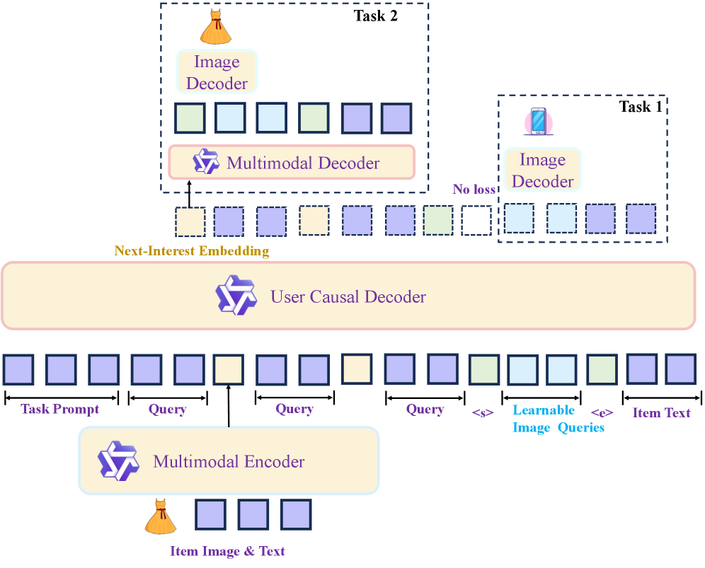
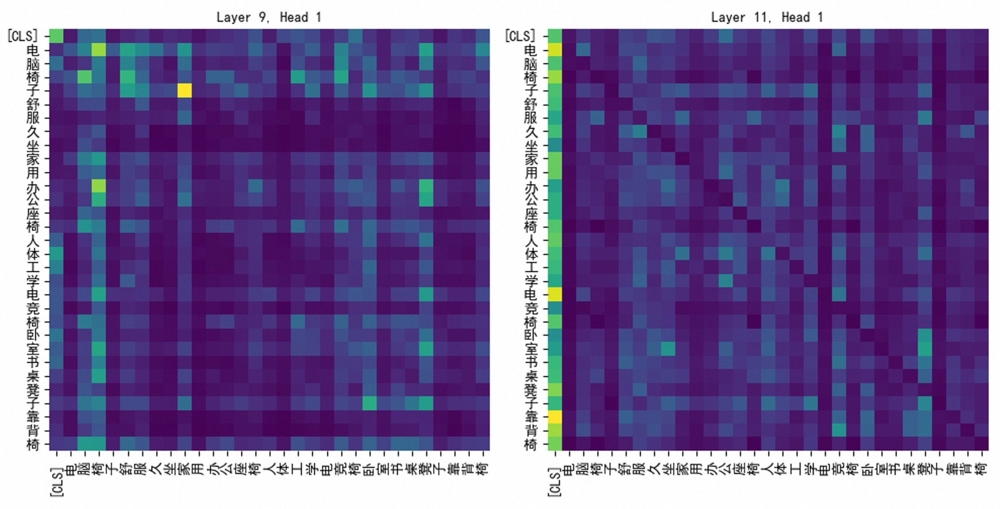
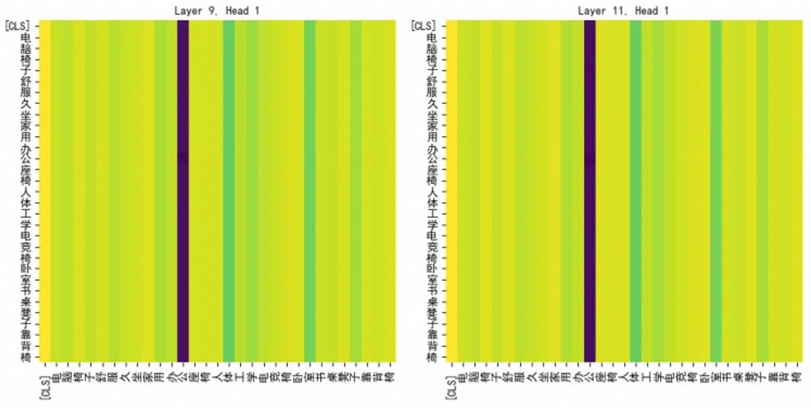
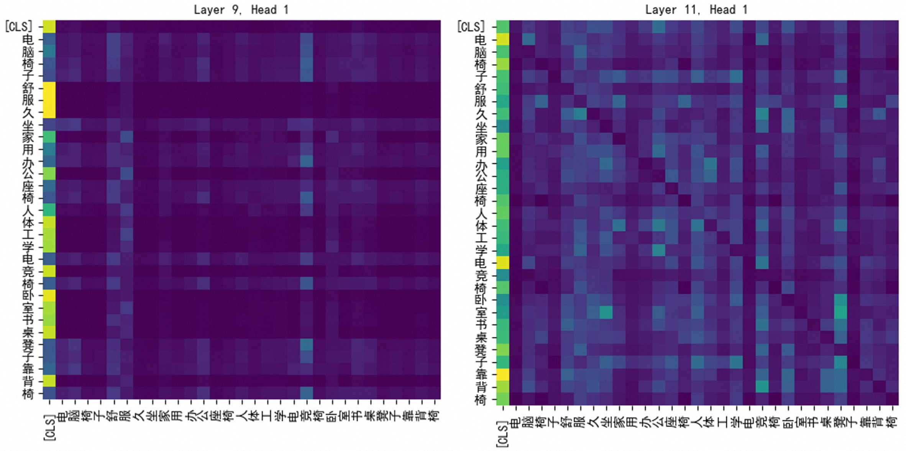

# KARMA: Knowledge-Action Regularized Multimodal Alignment for Personalized Search at Taobao

**ArXiv ID**: 2603.22779  
**Submitted**: 2026-03-25  
**Authors**: (Taobao & Tmall Group of Alibaba)  
**PDF**: [2603.22779](https://arxiv.org/abs/2603.22779)  
**HTML**: [2603.22779v1](https://arxiv.org/html/2603.22779v1)  

---

## Abstract

Large Language Models (LLMs) are equipped with profound semantic knowledge, making them a natural choice for injecting semantic generalization into personalized search systems. However, in practice we find that directly fine-tuning LLMs on industrial personalized tasks (e.g. next item prediction) often yields suboptimal results. We attribute this bottleneck to a critical **Knowledge–Action Gap**: the inherent conflict between preserving pre-trained semantic knowledge and aligning with specific personalized actions by discriminative objectives. Empirically, action-only training objectives induce **Semantic Collapse**, such as attention "sinks". This degradation severely cripples the LLM's generalization, failing to bring improvements to personalized search systems.

We propose **KARMA** (Knowledge–Action Regularized Multimodal Alignment), a unified framework that treats semantic reconstruction as a train-only regularizer. KARMA optimizes a next-interest embedding for retrieval (Action) while enforcing semantic decodability (Knowledge) through two complementary objectives: (i) history-conditioned semantic generation, which anchors optimization to the LLM's native next-token distribution, and (ii) embedding-conditioned semantic reconstruction, which constrains the interest embedding to remain semantically recoverable.

On Taobao search system, KARMA mitigates semantic collapse (attention-sink analysis) and improves both action metrics and semantic fidelity. In ablations, semantic decodability yields up to **+22.5 HR@200**. With KARMA, we achieve **+0.25 CTR AUC** in ranking, **+1.86 HR** in pre-ranking and **+2.51 HR** in recalling. Deployed online with low inference overhead at ranking stage, KARMA drives **+0.5% increase in Item Click**.

---

## 1. Introduction

In personalized search systems, ranking models are predominantly optimized using post-hoc user feedback (e.g. CTR prediction). This optimization paradigm inevitably privileges post-hoc memorization features (item IDs, co-occurrence statistics, etc.) over semantic generalization features. While memorization features precisely capture user preferences for popular items, yielding excellent performance on head traffic, they expose a critical vulnerability: when faced with sparse feedback scenarios, such as long-tail queries or cold-start items, this lack of semantic generalization leads to a sharp decline in ranking quality.

Although integrating LLMs is intuitively appealing, directly fine-tuning LLMs for personalized ranking often yields limited performance gains. We attribute this empirical bottleneck to a critical **Knowledge-Action Gap**: the inherent conflict between rich pre-trained semantics (Knowledge) and user behavioral patterns driven by discriminative feedback (Action).

Constrained by latency, industrial systems typically compress historical items (text and image) into single embeddings for the next-item prediction task. However, this embedding-only adaptation triggers **Semantic Collapse**. We observe that attention maps degenerate into "barcode-like" patterns, acting as a destructive attention sink.

This paper proposes a principle for continuous-token personalization: **semantic decodability should be enforced as a train-only regularizer**, rather than treated as an auxiliary generation capability.

**Contributions:**
1. We identify Semantic Collapse as a key failure mode of LLM personalization under continuous-token interfaces, supported by attention-sink analysis and semantic metrics.
2. We propose KARMA, which bridges the Knowledge–Action Gap by enforcing semantic decodability as a train-only regularizer for action-aligned retrieval embeddings.
3. We demonstrate substantial offline and online gains in a large-scale search engine with zero inference overhead.

---

## 2. Methodology

### 2.1. Continuous-Token Personalized Search

At impression time $t$, user $u$ issues query $q_t$ with a chronological sequence of positive interactions:

$$\mathcal{H}_{t}=\{(q_{1},i_{1}),\ldots,(q_{t-1},i_{t-1})\}$$

where each item $i$ contains multimodal content $\mathbf{x}_{i}=(\mathbf{x}_{i}^{\text{text}},\mathbf{x}_{i}^{\text{img}})$. Our goal is to compute a dense next-interest representation $\mathbf{h}_{t}\in\mathbb{R}^{d}$ for retrieval and ranking.

**Efficiency constraint.** An item encoder compresses each item into a single embedding token:

$$\mathbf{e}_{i}=E_{\phi}(\mathbf{x}_{i})\in\mathbb{R}^{d}$$

and a decoder-only Transformer $D_{\theta}$ performs causal modeling over the history token sequence:

$$\mathbf{S}_{t-1}=D_{\theta}([\mathbf{e}_{i_{1}},\ldots,\mathbf{e}_{i_{t-1}}]),\qquad\mathbf{h}_{t}=\mathbf{S}_{t-1}[-1]$$

### 2.2. KARMA: Knowledge–Action Regularization via Decodability

KARMA is built on one requirement: the representation $\mathbf{h}_{t}$ should be action-aligned for ranking, while remaining semantically decodable back to the target item's original semantics.

$$\mathcal{L}_{\text{KARMA}}=\mathcal{L}_{\text{act}}+\lambda_{\text{dec}}\mathcal{L}_{\text{dec}}$$

where $\mathcal{L}_{\text{act}}$ injects behavioral supervision (Action), and $\mathcal{L}_{\text{dec}}$ regularizes the solution space by enforcing decodability (Knowledge).

**Two decodability paths:**
- (i) **History-conditioned semantic generation**: decodes the target semantics directly from the behavioral history
- (ii) **Embedding-conditioned semantic reconstruction**: decodes the same semantics conditioned explicitly on the model-produced next-interest embedding $\mathbf{h}_{t}$

**Train-only regularization.** Decoding heads are attached only during training and removed at inference, yielding **zero additional online latency**.

*Figure 1. KARMA architecture: A train-only regularizer that bridges the Knowledge–Action Gap.*

### 2.3. Action Alignment Objective

Given the ground-truth next clicked item $i_{t}$, we rank its embedding $\mathbf{e}_{i_{t}}$ above negatives $\{\mathbf{e}_{j}\}_{j\in\mathcal{N}_{t}}$, where $\mathcal{N}_{t}$ contains exposed-but-unclicked items (hard negatives) and in-batch negatives. We use a pairwise cross-entropy objective:

$$\mathcal{L}_{\text{act}}=\sum_{t}\sum_{j\in\mathcal{N}_{t}}-\log\sigma\!\left(\mathbf{h}_{t}^{\top}\mathbf{e}_{i_{t}}-\mathbf{h}_{t}^{\top}\mathbf{e}_{j}\right)$$

### 2.4. Knowledge Regularization: Multimodal Decodability

#### Task 1: History-Conditioned Semantic Generation

$$\mathcal{L}_{\text{gen}}=-\sum_{l=1}^{L}\log p_{\theta}\!\left(w_{l}\mid w_{<l},\mathcal{H}_{t}\right)$$

This term anchors training to the LLM's native token-level objective, mitigating catastrophic forgetting.

#### Task 2: Embedding-Conditioned Semantic Reconstruction

$$\mathcal{L}_{\text{recon}}=-\sum_{l=1}^{L}\log p_{\theta}\!\left(w_{l}\mid w_{<l},\mathbf{h}_{t}\right)$$

By enforcing an explicit embedding bottleneck, shortcut solutions that treat continuous item embeddings as opaque identifiers become suboptimal.

#### Task 3: Visual Decodability as a Shared Modality Decoder

When multimodal supervision is available, we reconstruct a frozen visual semantic feature $\mathbf{v}_{i_{t}}$ with a conditional diffusion/flow-matching head $g_{\psi}$:

$$\mathcal{L}_{\text{img}}=\mathbb{E}_{\tau}\big[\ell_{\text{diff}}(g_{\psi};\mathbf{v}_{i_{t}},\mathbf{c}_{t},\tau)\big]$$

#### Final Decodability Regularizer

$$\mathcal{L}_{\text{dec}}=\mathcal{L}_{\text{gen}}+\mathcal{L}_{\text{recon}} \qquad \mathcal{L}_{\text{dec}}^{\text{mm}}=\mathcal{L}_{\text{gen}}+\mathcal{L}_{\text{recon}}+\lambda_{\text{img}}\mathcal{L}_{\text{img}}$$

### 2.5. Bridging the Modality Gap with Staged Alignment

We adopt a two-stage schedule:
1. **Semantic warm-up**: teaches the decoder to decode item semantics from isolated $\mathbf{e}_{i}$
2. **Joint training**: on behavioral sequences with $\mathcal{L}_{\text{KARMA}}$

### 2.6. Inference: Train-Heavy, Infer-Light

At inference, KARMA uses only the efficient embedding path. All decoding heads are disabled, incurring **zero additional online latency**.

---

## 3. Experiments

### 3.1. Experimental Setup

- **Data**: Anonymized Taobao search logs with chronological splits
- **Metrics**: gAUC (ranking), HR@K (retrieval), JS@50 (semantic fidelity probe)
- **Implementation**: Qwen3-0.6B as user decoder; item encoders are Qwen3-1.7B (text) or Qwen3-VL-2B (multimodal)

### 3.2. Main Results: Decodability Regularization Mitigates Semantic Collapse

**Table 1.** Impact of decodability regularization (Δ over action-only Pairwise-CE).

| Variant | ΔgAUC | ΔHR@200 | ΔHR@1000 | ΔJS@50 |
|---------|--------|---------|----------|--------|
| **Text-only decodability** | | | | |
| + Task 1: History→Text generation | +0.43 | +4.81 | +3.46 | -0.87 |
| + Task 2: h_t→Text reconstruction | +0.43 | +19.19 | +19.31 | +2.65 |
| **KARMA: Task 1 + Task 2** | **+0.97** | **+22.57** | **+21.19** | **+2.26** |
| **Multimodal extension** (over best text-only KARMA) | | | | |
| + Visual semantic reconstruction | +1.38 | +10.83 | +8.41 | +0.40 |

Key observations:
1. **Action-only training is prone to shortcut learning**: Optimizing only $\mathcal{L}_{\text{act}}$ yields reasonable action metrics but comparatively weak semantic fidelity (JS@50)
2. **Embedding-conditioned decodability is the primary anti-collapse constraint**: Task 2 enforces that $\mathbf{h}_{t}$ remains semantically recoverable, leading to substantially larger retrieval improvements

### 3.3. Diagnosing Collapse: Attention Sinks as Qualitative Evidence

Action-only training produces sparse, barcode-like attention patterns. With KARMA, attention becomes more distributed, suggesting that decodability regularization encourages representations that remain grounded in recoverable item semantics.

*Figure 2(a). Frozen pretrained item encoder (no task training).*

*Figure 2(b). Action-only training with L_act exhibits attention sinks (barcode-like patterns).*

*Figure 2(c). KARMA reduces attention sinks and restores more distributed attention.*

### 3.4. Multimodal Grounding and the Mode–Mean Dilemma

**Negative result: diffusion is a poor generator for retrieval embeddings.**

**Table 2.** Generating retrieval embeddings with diffusion (Δ over best text-only KARMA).

| Embedding Generator | ΔgAUC | ΔHR@200 | ΔHR@1000 | ΔJS@50 |
|--------------------|--------|---------|----------|--------|
| AR + MSE | +0.63 | +4.21 | +1.70 | +0.85 |
| AR + DDPM | +0.17 | +0.80 | -1.01 | +0.37 |
| AR + EDM | -0.12 | -2.95 | -3.30 | -0.33 |
| AR + FlowMatching | +0.02 | -0.83 | -2.68 | +0.26 |

**Insight: mode-seeking vs. mean-seeking.** Diffusion objectives are naturally *mode-seeking*—aiming to sample high-fidelity instances. In contrast, retrieval embeddings are *mean-seeking*—they should act as a stable centroid that aggregates multiple plausible future intents. Consequently, diffusion is effective as a semantic reconstruction regularizer, but suboptimal as the generator of retrieval embeddings.

### 3.5. Online Deployment: Funnel-Wide Gains with Zero Inference Overhead

KARMA was applied across three stages of the Taobao search system:

| Stage | Metric | Gain |
|-------|--------|------|
| Ranking | CTR AUC | +0.25 |
| Pre-ranking | HR@500 | +1.86 |
| Recalling | HR@5000 | +2.51 |

**Online A/B test (14 days):** KARMA drives **+0.5% increase in Item Click**.

---

## 4. Conclusions

KARMA shows that action-only discriminative training can trigger Semantic Collapse (e.g., attention sinks) and degrade semantic fidelity, limiting generalization. KARMA enforces *train-only* semantic decodability via history-conditioned generation and embedding-conditioned reconstruction (optionally with visual feature reconstruction), preventing ID-like shortcut solutions while keeping the inference path unchanged.

Key finding: diffusion is better used as a multimodal semantic regularizer than as a mean-seeking retrieval-embedding generator.

---

## References

- Bai et al. (2025) Qwen3-vl technical report. arXiv:2511.21631
- Chen et al. (2024) Hllm: enhancing sequential recommendations via hierarchical large language models. arXiv:2409.12740
- Cheng et al. (2016) Wide & deep learning for recommender systems. DL4RecSys Workshop
- Yang et al. (2025a) Qwen3 technical report. arXiv:2505.09388
- Yang et al. (2025b) Sparse meets dense: unified generative recommendations. arXiv:2503.02453
- Zhou et al. (2018) Deep interest network for click-through rate prediction. KDD
