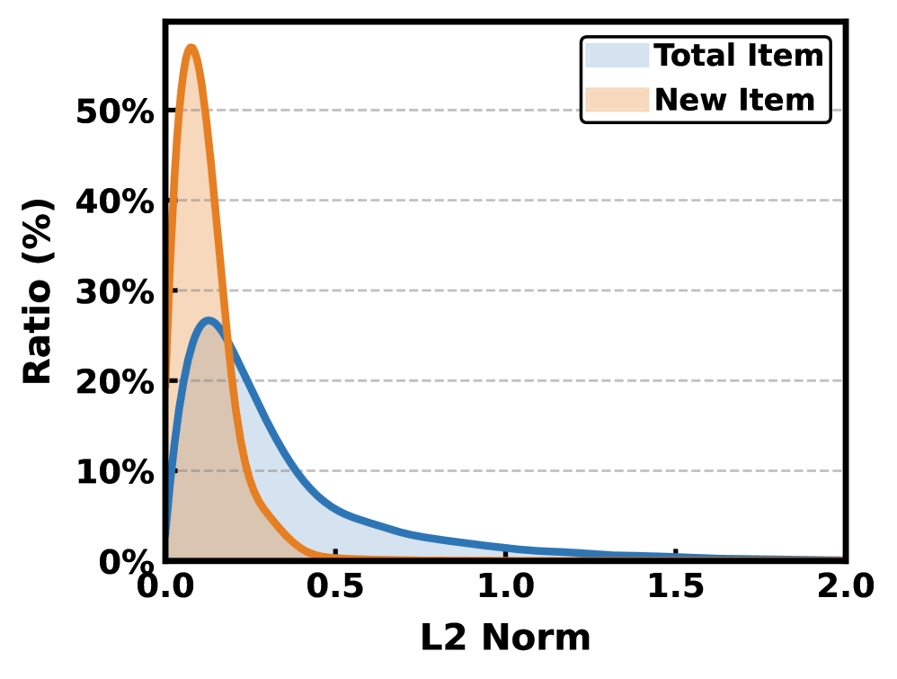
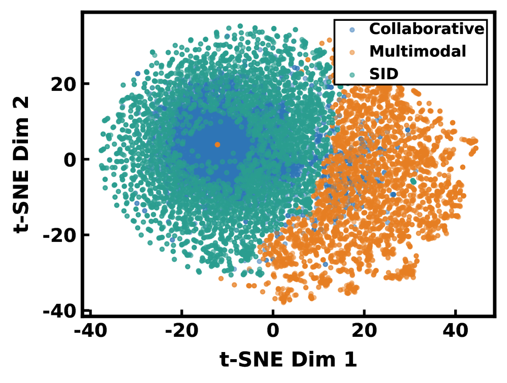
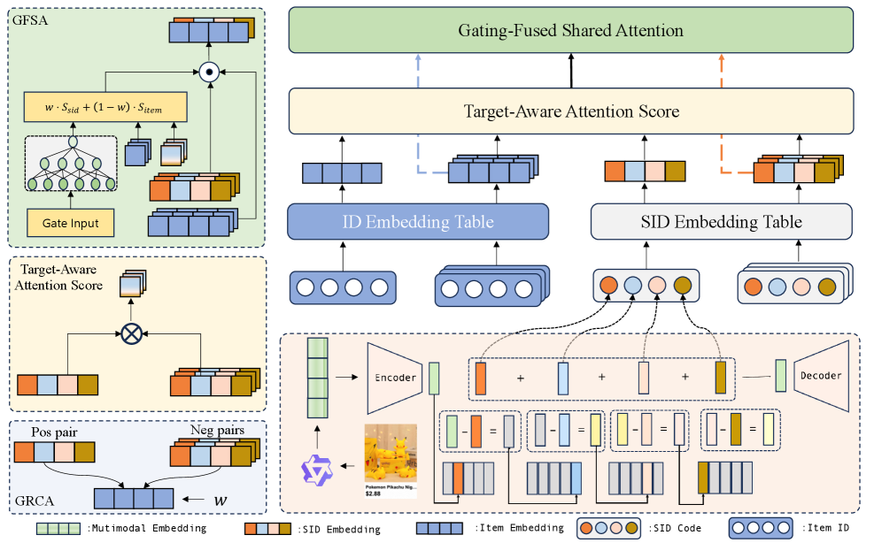
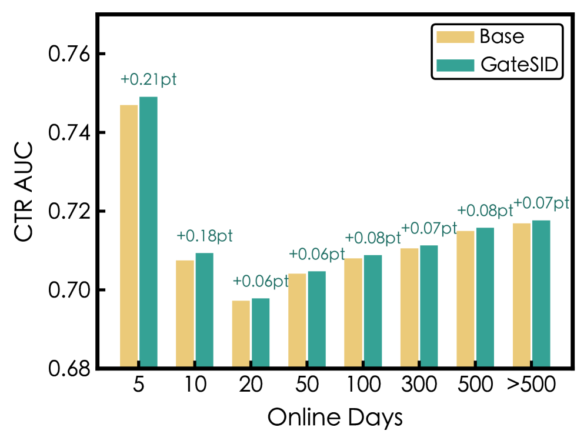

# GateSID: Adaptive Gating for Semantic-Collaborative Alignment in Cold-Start Recommendation

**ArXiv ID**: 2603.22916  
**Submitted**: 2026-03-25  
**Authors**: (Alibaba International Digital Commerce)  
**PDF**: [2603.22916](https://arxiv.org/abs/2603.22916)  
**HTML**: [2603.22916v1](https://arxiv.org/html/2603.22916v1)  

---

## Abstract

In cold-start scenarios, the scarcity of collaborative signals for new items exacerbates the Matthew effect. This not only undermines platform diversity, but also poses a persistent challenge in practice. Existing methods typically augment collaborative signals with semantic information. However, they often face a **collaborative–semantic trade-off**: collaborative signals work well for popular items but degrade on cold-start items, while excessive reliance on semantics will ignore collaborative differences. To address these limitations, we propose **GateSID**, a framework that introduces an adaptive gating network to dynamically balance semantic and collaborative signals based on item maturity. First, we discretize multimodal features into hierarchical **Semantic ID** via Residual Quantized VAE. Then we propose two components: (1) **Gating-Fused Shared Attention**, which fuses intra-modal attention distributions with item-level weights derived from embeddings and statistical features; (2) **Gate-Regulated Contrastive Alignment**, which adaptively calibrates cross-modal alignment and enforces strong semantic-behavior mapping for cold-start items while relaxing constraints for popular items to preserve their reliable collaborative signals. Comprehensive offline experiments on large scale industrial datasets demonstrate GateSID's superiority. **Online A/B test demonstrates the practical effectiveness of GateSID: it achieves GMV +2.6%, CTR +1.1%, and Order +1.6%, with less than 5 ms of additional latency.**

---

## 1. Introduction

Recommendation systems heavily rely on historical user–item interaction data to capture user preferences. Although collaborative filtering–based models excel at modeling frequent interactions, they inherently suffer from a severe **Matthew effect**. For cold-start items, 20% of new items have embeddings with an **L2 norm of zero**, due to extremely sparse user interactions.

**Key challenges with fixed multimodal embeddings:**
1. **Representation non-trainability**: fixed embeddings cannot adapt well to downstream tasks
2. **Modality gap**: mismatch between semantic and collaborative representations

**Limitation of existing SID-based methods:**
- PCR-CA: adopts a static average of the two representations
- COINS: gating mechanism applied independently without cross-modal interaction
- SaviorRec: coarse interaction that ignores differences between popular and cold-start items

**GateSID's key novelty**: item-level adaptive fusion of attention distributions.

**Contributions:**
1. A gating-fused shared attention mechanism that dynamically balances semantic and collaborative signals
2. A gate-regulated contrastive alignment that adaptively strengthens semantic-behavioral alignment for cold-start items while relaxing it for popular items
3. Extensive offline experiments and online A/B tests

*Figure 1(a). L2 norm distribution of all items and new items.*

*Figure 1(b). Distributions of three types of embedding.*

---

## 2. Methodology

*Figure 2. Overview of the GateSID framework which consists of three components: (1) Semantic ID Construction; (2) Gating-Fused Shared Attention (GFSA); (3) Gate-Regulated Contrastive Alignment (GRCA).*

### 2.1. Semantic ID Construction

We employ Qwen-VL to encode the textual and visual content of each item. Then we adopt a **Residual Quantized Variational Autoencoder (RQ-VAE)** to discretize these multimodal embeddings into a hierarchical sequence of semantic tokens.

The Semantic ID for item $i$ is defined as:

$$\mathbf{S}_{i}=\langle s_{i,1},s_{i,2},s_{i,3},s_{i,4}\rangle,\quad s_{i,k}\in\{1,2,\dots,256\}$$

RQ-VAE uses 4 residual layers, each with a codebook of size 256.

$$\mathbf{e}_{i}^{\text{sid}}=\text{Concat}\left(\left[\mathbf{E}_{1}(s_{i,1}),\mathbf{E}_{2}(s_{i,2}),\mathbf{E}_{3}(s_{i,3}),\mathbf{E}_{4}(s_{i,4})\right]\right)$$

### 2.2. Gating-Fused Shared Attention (GFSA)

First, compute a fusion weight $w$ based on collaborative embedding and statistical features (online duration, one-week exposure, one-week clicks):

$$w=\sigma\left(\text{MLP}([e_{i}^{item}\oplus\mathcal{F}_{i}^{stat}])\right)$$

GFSA computes intra-modal attention distributions independently:

$$S_{\text{sid}}=\text{Softmax}\left(\frac{(\mathbf{e}_{\text{target}}^{\text{sid}}\mathbf{W}_{Q^{\prime}})(\mathcal{H}^{\text{sid}}\mathbf{W}_{K^{\prime}})^{\top}}{\sqrt{d}}\right)$$

$$S_{\text{item}}=\text{Softmax}\left(\frac{(\mathbf{e}_{\text{target}}^{\text{item}}\mathbf{W}_{Q^{\prime}})(\mathcal{H}^{\text{item}}\mathbf{W}_{K^{\prime}})^{\top}}{\sqrt{d}}\right)$$

Then forms a fused attention distribution:

$$S_{\text{fused}}=w\cdot S_{\text{sid}}+(1-w)\cdot S_{\text{item}}$$

Using $S_{\text{fused}}$ on both sequences:

$$\mathbf{h}_{\text{sid}}=S_{\text{fused}}\mathcal{H}^{\text{sid}},\quad\mathbf{h}_{\text{item}}=S_{\text{fused}}\mathcal{H}^{\text{item}}$$

**Design principle**: GFSA does NOT implement explicit cross-attention (unlike SaviorRec); it preserves modality-specific value representations while adaptively regulating attention distributions.

### 2.3. Gate-Regulated Contrastive Alignment (GRCA)

Unlike traditional static alignment, GRCA dynamically calibrates cross-modal supervision intensity based on item state.

Instance-wise contrastive loss:

$$\ell_{cl}^{(i)}=-\log\frac{\exp(\text{sim}(e_{i}^{sid},e_{i}^{item})/\tau)}{\sum_{j\in\mathcal{B}}\exp(\text{sim}(e_{i}^{sid},e_{j}^{item})/\tau)}$$

**Key insight**: cold-start items need stronger alignment; popular items should maintain established collaborative structures. The gating weight $w_i$ regulates contrastive strength:

$$\mathcal{L}_{cl}=\frac{1}{|\mathcal{B}|}\sum_{i\in\mathcal{B}}w_{i}\cdot\ell_{cl}^{(i)}$$

When $w_i$ is large (cold-start) → aggressive modality gap bridging  
When $w_i$ is small (popular) → relaxed constraint, preserves collaborative signals

Final objective:

$$\mathcal{L}_{total}=\mathcal{L}_{rank}+\lambda\mathcal{L}_{cl}$$

---

## 3. Experiments

### 3.1. Experiments Settings

- **Datasets**: Large-scale industrial datasets with over 1 billion production logs; time-based train/val/test split
- **Tasks**: Click (CTR) and Pay (CTCVR); Metrics: AUC and GAUC
- **Baselines**: COINS, PCR-CA, URL4DR, SPM-SID, SaviorRec, QARM
- **Implementation**: RQ-VAE with 4 residual layers × codebook size 256 × embedding dimension 64; AdamW, batch size 4096, SID embedding dimension 32, $\lambda = 0.1$

### 3.2. Overall Performance

GateSID consistently surpasses all baselines across every metric. In the set of all items, GateSID achieves **+0.1% gain in CTR AUC** and **+0.2% gain in CTCVR GAUC** over the second-best method.

**Key insight from Table 1 (new vs. popular items)**:
- For **new items**: modest advantage (+0.04% CTCVR AUC over QARM) — most SID methods already leverage semantics well when collaborative signals are scarce
- For **popular items**: substantial +0.4% gain in CTCVR AUC over QARM — GateSID successfully preserves robust collaborative representations

### 3.3. Ablation Studies

- Removing GFSA: −0.37% CTCVR AUC drop
- Dynamic gating outperforms static averaging (Avg) by **0.51% in CTCVR GAUC**
- GRCA aligns semantic and collaborative representations as shown in t-SNE visualization

*Figure 3(a). CTR AUC for items with different online days.*

*Figure 3(b). Gate weight for items with different online days.*

Gate weight evolution:
- New items (5 days online): gate weight > 0.8, CTR AUC boost +0.21%
- Mature items (300+ days): gate weight < 0.5, yet still +0.07% CTR AUC
- Semantic weight **declines steadily from >0.8 to <0.5** as items mature

### 3.4. Online A/B Test

Two-week A/B test with 20% of total traffic:

| Metric | Gain |
|--------|------|
| GMV | **+2.6%** |
| CTR | **+1.1%** |
| Order | **+1.6%** |
| Additional Latency | <5 ms |

---

## 4. Conclusion

GateSID addresses the collaborative–semantic trade-off in cold-start recommendation through:
1. **GFSA**: item-level adaptive fusion of attention distributions via gating network
2. **GRCA**: gate-regulated contrastive alignment that adapts supervision intensity by item maturity

Extensive offline experiments and online A/B tests confirm its effectiveness in real-world production environments.

---

## References

- Zhao et al. (2025) COINS: semantic ids enhanced cold item representation. arXiv:2510.12604
- Tan et al. (2025) PCR-CA: parallel codebook representations with contrastive alignment. arXiv:2508.18166
- Yao et al. (2025) SaviorRec: semantic-behavior alignment for cold-start. arXiv:2508.01375
- Gai et al. (2024) QARM: quantitative alignment multi-modal recommendation at Kuaishou. arXiv:2411.11739
- Rajput et al. (2023) Recommender systems with generative retrieval. NeurIPS 2023
- Wang et al. (2024) Qwen2-VL. arXiv:2409.12191
- Zheng et al. (2024) Adapting LLMs by integrating collaborative semantics for recommendation. ICDE 2024
