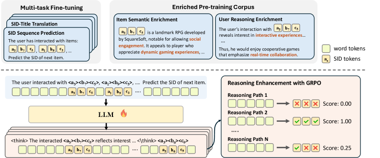
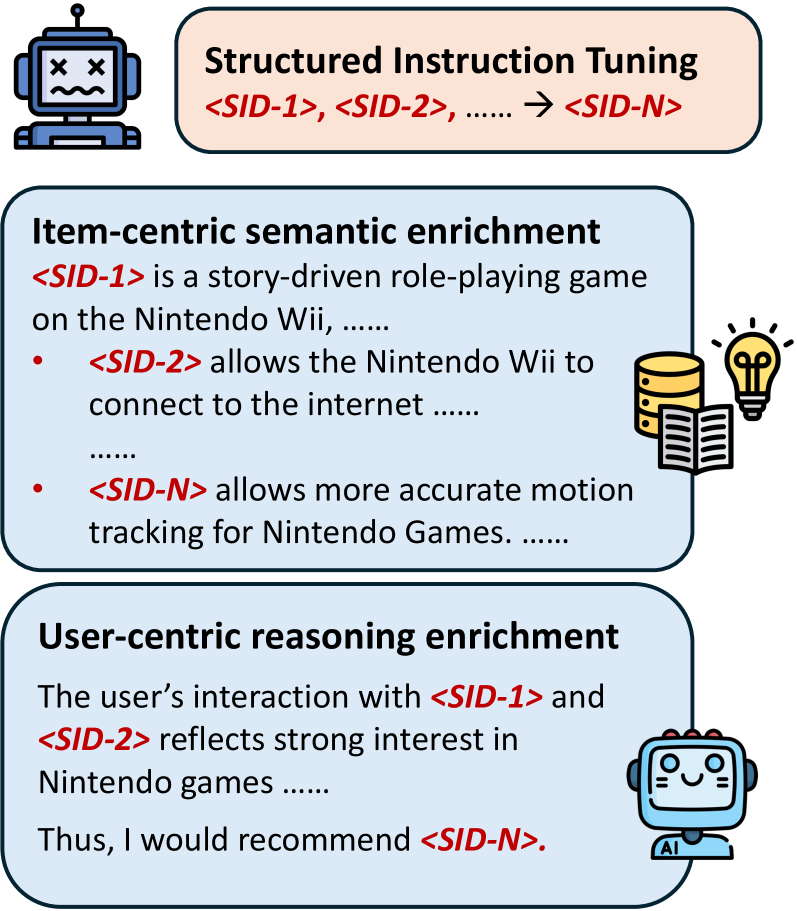
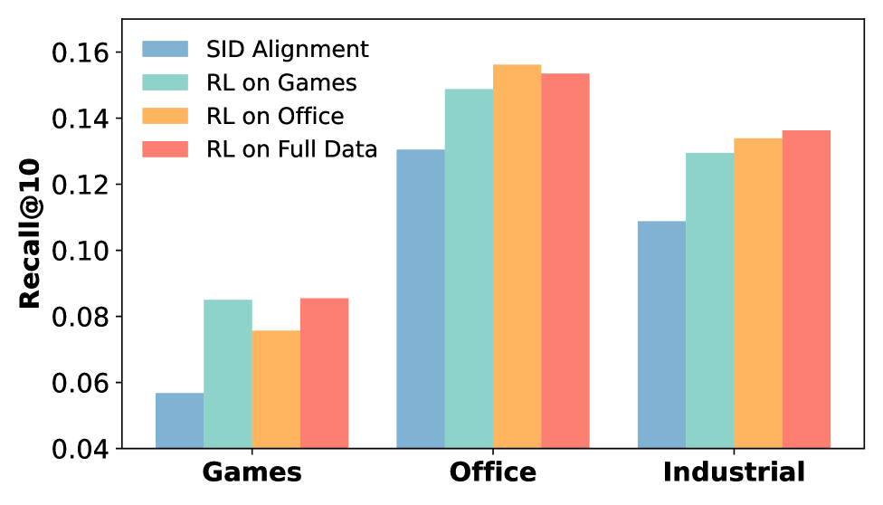
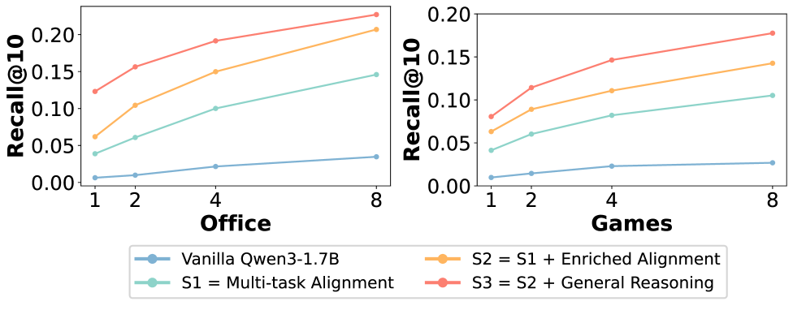
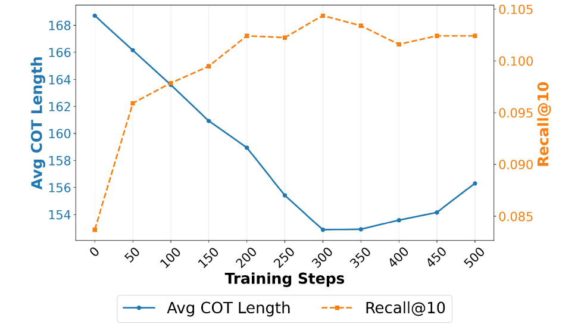
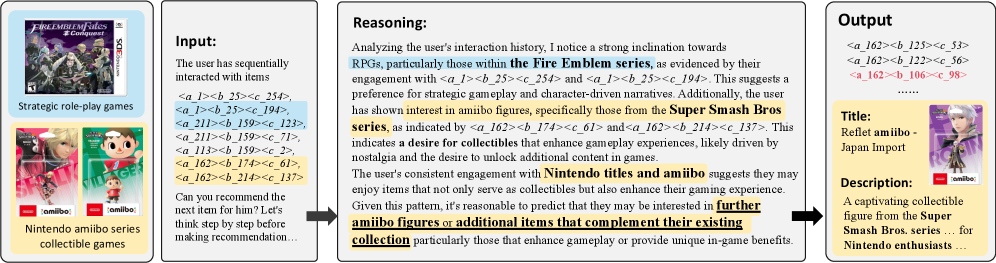

# Reasoning over Semantic IDs Enhances Generative Recommendation

**ArXiv ID**: 2603.23183  
**Submitted**: 2026-03-25  
**Authors**: (Tencent, NUS, USTC)  
**PDF**: [2603.23183](https://arxiv.org/abs/2603.23183)  
**HTML**: [2603.23183v1](https://arxiv.org/html/2603.23183v1)  
**Code**: [SIDReasoner on GitHub](https://github.com/HappyPointer/SIDReasoner)  

---

## Abstract

Recent advances in generative recommendation have leveraged pretrained LLMs by formulating sequential recommendation as autoregressive generation over a unified token space comprising language tokens and **Semantic IDs (SIDs)**. This SID-based formulation enables efficient decoding over large-scale item corpora and provides a natural interface for LLM-based recommenders to leverage rich world knowledge. Meanwhile, breakthroughs in LLM reasoning motivate reasoning-enhanced recommendation, yet **effective reasoning over SIDs remains underexplored**.

**Challenges**: Itemic tokens are not natively meaningful to LLMs; moreover, recommendation-oriented SID reasoning is hard to evaluate, making high-quality supervision scarce.

We propose **SIDReasoner**, a two-stage framework that elicits reasoning over SIDs by strengthening SID–language alignment to unlock transferable LLM reasoning:
1. **Enriched SID-Language Alignment** via multi-task training on enriched SID-centered corpus synthesized by a stronger teacher model
2. **Reinforced Reasoning Enhancement** through outcome-driven GRPO optimization

Extensive experiments on three real-world datasets demonstrate effectiveness beyond accuracy: **improved interpretability and cross-domain generalization**.

---

## 1. Introduction

Generative recommendation leverages Semantic IDs (SIDs) — obtained by quantizing item semantic embeddings into compact discrete identifiers — to formulate recommendation as autoregressive generation.

**Problem**: Reasoning in recommendation requires items represented with SIDs rather than textual descriptions, but:
- High-quality reasoning supervision is scarce and expensive
- Quality of recommendation reasoning is hard to evaluate (implicit user preferences)

**SIDReasoner's approach**: Strengthening SID–language alignment as a complement to unlock transferable LLM reasoning, rather than relying on large amounts of recommendation-specific reasoning traces.

---

## 2. Related Work

### 2.1. Generative Recommendation

Three categories:
1. **Sparse ID-based methods**: unique item identifiers, next-token prediction; scalability issues
2. **Text-based methods**: natural language descriptions; computational overhead, item grounding issues
3. **Semantic ID-based methods**: RQ-VAE quantization; trade-off between semantic expressiveness and decoding efficiency

### 2.2. Large Reasoning Models

Chain-of-Thought (CoT) reasoning decomposes complex problems into simpler steps. Key advances:
- Parallel sampling, iterative refinement
- RL with verifiable rewards (DeepSeek-R1, GRPO)
- **Explicit reasoning** in recommendation (natural language rationales)
- **Latent reasoning** in recommendation (continuous representation space refinement)

---

## 3. Methodology

*Figure 1. Illustration of the overall framework of SIDReasoner.*

### 3.1. Task Formulation

#### 3.1.1. Tokenization with Semantic IDs

For each item $i$, its Semantic ID is a fixed-length sequence:

$$\mathrm{SID}(i) = (s_{i}^{1}, s_{i}^{2}, \ldots, s_{i}^{L}), \quad s_{i}^{l} \in \mathcal{S}$$

Obtained by encoding item metadata and quantizing into $L$ discrete semantic tokens.

#### 3.1.2. Generative Recommendation with Reasoning

Unified token space: $\mathcal{V} = \mathcal{V}_{\text{LM}} \cup \mathcal{S}$

User context: $\mathcal{C}_{u} = [\mathbf{p}; \mathcal{H}_{u}]$ where $\mathcal{H}_{u} = \text{concat}(\mathbf{y}_{1}, \mathbf{y}_{2}, \ldots, \mathbf{y}_{T})$

Overall generation process:

$$\tau \sim \pi_{\theta}(\cdot \mid \mathcal{C}_{u}), \quad \mathbf{y}_{T+1} \sim \pi_{\theta}(\cdot \mid \mathcal{C}_{u}, \tau)$$

where $\tau$ is the intermediate reasoning sequence.

### 3.2. Enriched SID-Language Alignment

#### 3.2.1. Item Quantization

RQ-VAE with $L$ codebooks $\{\mathcal{C}^{1}, \mathcal{C}^{2}, \ldots, \mathcal{C}^{L}\}$. At stage $l$:

$$s_{i}^{l} = \arg\min_{k} \|\mathbf{r}^{l-1} - \mathbf{e}^{l}_{k}\|_{2}^{2}, \quad \mathbf{r}^{l} = \mathbf{r}^{l-1} - \mathbf{e}^{l}_{s_{i}^{l}}$$

Joint training loss:

$$\mathcal{L}_{\text{RQ-VAE}} = \mathcal{L}_{\text{recon}} + \mathcal{L}_{\text{RQ}}$$

$$\mathcal{L}_{\text{recon}} = \|\mathbf{z}_{i} - \hat{\mathbf{z}}_{i}\|_{2}^{2}$$

$$\mathcal{L}_{\text{RQ}} = \sum_{l=1}^{L}\left(\|\text{sg}[\mathbf{r}^{l-1}] - \mathbf{e}^{l}_{s_{i}^{l}}\|_{2}^{2} + \beta\|\mathbf{r}^{l-1} - \text{sg}[\mathbf{e}^{l}_{s_{i}^{l}}]\|_{2}^{2}\right)$$

#### 3.2.2. Multi-task Fine-tuning

Two task categories:
1. **Item prediction**: behavioral pattern capture + SID grounding in semantic item information
2. **SID translation**: bidirectional mapping between SID sequences and textual titles

#### 3.2.3. Enriched Corpus Pre-training

Leverage GPT-4o-mini to synthesize enriched SID–language corpus:

- **Item-centric semantic enrichment**: expand textual metadata into structured descriptions, generate paragraphs interleaving SID tokens with natural language
- **User-centric reasoning enrichment**: infer motivations and generate mixed SID–language description of user behavior

Also mix general-domain reasoning data to prevent catastrophic forgetting.

*Figure 2. Illustration of enriched alignment corpus.*

### 3.3. Reinforced Reasoning Enhancement

#### 3.3.1. Cold-start Reasoning Activation

Lightweight SFT to enforce reason-then-recommend pattern (single epoch).

#### 3.3.2. Group-wise Reinforcement Learning

Reward function:

$$R_{\theta}(\tau, \mathbf{y}) = R_{sr}(\mathbf{y}, i_{T+1}) + \lambda R_{f}(\mathbf{y})$$

**Stepwise rule-based reward** (prefix match reward):

$$R_{sr}(\mathbf{y}, i_{T+1}) = \frac{1}{2^{L-m}}$$

where $m$ is the length of the longest correct prefix. Approaches 1 when entire sequence is correct.

**Format reward** (valid item check):

$$R_{f}(\mathbf{y}) = \begin{cases} 1, & \text{if } \mathbf{y} \text{ maps to a catalog-existing item} \\ 0, & \text{otherwise} \end{cases}$$

**GRPO optimization:** Sample $K$ trajectories $\{o^{k}\}_{k=1}^{K}$. Each trajectory $o^{k} = \tau^{k} \circ \mathbf{y}^{k}$.

$$\mathcal{L}_{\text{GRPO}}(\theta) = \mathbb{E}_{\mathcal{C}_{u}}\left[\frac{1}{K}\sum_{k=1}^{K}\min\!\big(\rho^{k}(\theta)\hat{A}^{k}, \text{clip}(\rho^{k}(\theta), 1-\eta, 1+\eta)\hat{A}^{k}\big)\right] - \beta D_{\mathrm{KL}}(\pi_{\theta} \| \pi_{\text{ref}})$$

#### 3.3.3. Reasoning Generalizes to Out-of-Domain Items

Cross-domain setting: unified SID space covering Games, Office, and Industrial datasets.

---

## 4. Experiments

### 4.1. Experiment Settings

- **Datasets**: Amazon (Video Games, Office Products, Industrial and Scientific); 5-core filtering, max sequence length 10; temporal split 8:1:1
- **Evaluation**: Recall@K and NDCG@K for $K \in \{5, 10\}$; full-item ranking
- **Baselines**:
  - Traditional: Caser, GRU4Rec, SASRec
  - Generative: TIGER, HSTU, LETTER, LCRec
  - Reasoning-based: ReaRec (latent), R²ec (explicit textual reasoning)
- **Implementation**: Qwen3-1.7B backbone, full-parameter fine-tuning, AdamW, batch size 1024; GRPO rollout 16, KL coefficient 1×10⁻³

### 4.2. Performance Comparison (RQ1)

**SIDReasoner achieves the strongest SID prediction performance**, surpassing both conventional generative recommenders and reasoning-enhanced approaches.

**Key observation**: Reasoning effectiveness varies by domain:
- **Games** (semantically rich, aligns with LLM world knowledge): substantial improvements from reasoning
- **Industrial** (limited LLM domain knowledge): more limited benefits from reasoning

This trend is consistent with R²ec, suggesting reasoning effectiveness ties to availability of LLM semantic knowledge.

**Cross-domain generalization** (Figure 3): RL on a single domain consistently improves both in-domain and out-of-domain performance — learned reasoning is not tied to domain-specific item distributions.

*Figure 3. Performance comparison on cross-domain recommendation setting.*

### 4.3. Ablation Study (RQ2)

Four backbone settings with increasingly diverse training corpora:
1. Vanilla Qwen3-1.7B (no alignment)
2. Multi-task Alignment
3. Enriched Alignment (+ enriched corpus)
4. Enriched + General Reasoning (+ general reasoning data)

**Best-of-N analysis** confirms: Models with higher best-of-N performance consistently converge to better final performance after RL. This establishes Best-of-N as an effective indicator of reasoning capacity.

**General ability benchmark** (IFEval, MMLU, GSM8K): Adding general reasoning data during alignment effectively alleviates catastrophic forgetting.

### 4.4. Model Study (RQ3)

**Evolution of reasoning during RL** (Figure 5):
- Reasoning length **decreases** in early stages while performance **increases**
- Model discards teacher-generated (GPT-4o-mini) redundant reasoning patterns
- Shifts toward shorter, more targeted reasoning trajectories

**Case Study** (Figure 6): Given SID-encoded interaction history, model:
1. Summarizes key interests (strategic RPGs, Nintendo amiibo)
2. Concludes amiibo recommendation is appropriate
3. Prioritizes amiibo-related SIDs → hits target item

Reasoning **directly shapes** SID decoding trajectory, not just post-hoc explanation.

*Figure 4. Ablation performance with Best-of-N reasoning selection.*

*Figure 5. Reasoning length and performance during RL training on Games Dataset.*

*Figure 6. Case study: explicit reasoning yields effective recommendations.*

---

## 5. Conclusion

SIDReasoner demonstrates:
1. Effective reasoning over SIDs can be learned even at academic-scale with enriched SID–language alignment
2. Reasoning improves **cross-domain generalization** and **interpretability**
3. GRPO outcome-based feedback guides self-exploration without explicit supervision

Future work: scaling to larger models and datasets.

---

## References

- Rajput et al. (2023) Recommender systems with generative retrieval. NeurIPS 2023
- Shao et al. (2024) DeepSeekMath (GRPO). arXiv:2402.03300
- Yang et al. (2025) Qwen3 Technical Report. arXiv:2505.09388
- He et al. (2025) PLUM: Adapting pre-trained LMs for generative recommendations. arXiv:2510.07784
- Liu et al. (2025) OneRec-Think: in-text reasoning for generative recommendation. arXiv:2510.11639
- Tang et al. (2025) Think before recommend (ReaRec). arXiv:2503.22675
- You et al. (2025) R²ec: explicit textual reasoning recommendation
- Guo et al. (2025) DeepSeek-R1. arXiv:2501.12948
