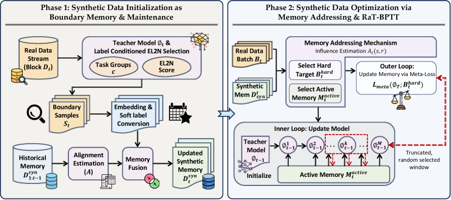
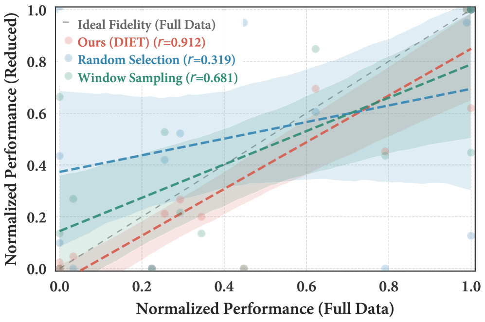
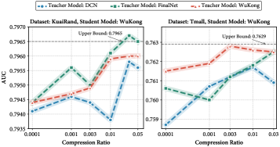

# DIET: Learning to Distill Dataset Continually for Recommender Systems

> **arxiv**: https://arxiv.org/abs/2603.24958
> **Authors**: Changxin Tian (USTC + Kuaishou), Jinpeng Wang (Kuaishou), Ziqi Chen (Kuaishou), Yu Xia (Kuaishou), Liangcai Su (Kuaishou), Rui Chen (USTC), Chen Ma (HKUST-GZ)
> **Venue**: ACM SIGIR 2026 (ACM SIGIR 2026)

## Abstract

Modern deep recommender models are trained using a continual learning paradigm, where model updates are performed repeatedly over massive and continuously growing behavior logs. However, this paradigm makes architecture iteration extremely costly, as any change to the model architecture requires the entire dataset to be reprocessed. Existing data reduction methods, such as data sampling and coreset selection, cannot faithfully preserve the training dynamics of the full data, leading to distorted evaluations of model performance. To bridge this gap, we introduce the task of Streaming Dataset Distillation for Recommender Systems (SDDRS), which formulates the data efficiency problem under a continual learning paradigm. We further propose DIET, a novel method specifically designed for SDDRS, which incorporates two core components: Boundary Memory Initialization and Maintenance (BMIM) and Influence-Guided Memory Addressing (IGMA). Experimental results show that DIET achieves competitive performance with as little as 1~2% of the original data, reduces model iteration costs by up to 60×, and generalizes well across different model architectures.

## 1. Introduction

Modern deep learning–based recommender systems (DLRMs) rely on massive user-item interaction logs to capture behavioral patterns. The scale of interaction data consumed by DLRMs has grown dramatically, as exemplified by Kuaishou's WuKong model, which ingests up to 400 billion tokens of user behavior. Under such scale, a single training pass already requires hundreds of GPU hours, making architecture iteration extremely costly.

This training regime is fundamentally **continual** in nature: models must be updated repeatedly over data streams that arrive in temporal blocks. This creates a challenging coupling between data scale and model development velocity. Any architectural change mandates an evaluation on the full data; and as the dataset grows, this overhead becomes prohibitive.

| Parameter Count | Training Tokens | GPU Hours (DCN) | GPU Hours (WuKong) |
|---|---|---|---|
| 3B | 10B | ~200 | ~1,000 |
| 10B | 50B | ~1,000 | ~5,000 |
| 100B | 400B | ~8,000 | ~40,000 |

> **Table 1.** Training Cost Scaling in DLRMs. The upper block reports model statistics from the RankMixer paper. The lower block estimates training cost in GPU hours.

Existing data reduction approaches—including random sampling, coreset selection, and dataset distillation—were developed for static classification tasks and fail to meet the unique requirements of the SDDRS setting:
- **Sampling and coreset selection** discard actual data, causing models trained on reduced data to exhibit performance trends inconsistent with full-data training.
- **Static dataset distillation** cannot account for the temporal evolution and distribution shifts inherent in streaming recommendation data.

To address these limitations, we:
1. Formally define the task of **Streaming Dataset Distillation for Recommender Systems (SDDRS)**.
2. Propose **DIET**, a continual dataset distillation method comprising two complementary components:
   - **Boundary Memory Initialization and Maintenance (BMIM)**: selects and synthesizes data samples that lie near decision boundaries, while enabling their continual evolution with new incoming data.
   - **Influence-Guided Memory Addressing (IGMA)**: leverages training influence to self-adaptively identify critical boundary samples and update synthetic data accordingly.

## 2. Related Work

### 2.1. Training Paradigms in Modern Recommender Systems

Modern recommender systems are trained in two key paradigms. The first is the **all-sample incremental training** paradigm, where the model ingests all historical data repeatedly, with each pass over the full data constituting one epoch. The second is the **sliding-window training** paradigm, where only data from the most recent time windows is used.

### 2.2. Coreset Selection and Dataset Distillation

**Coreset selection** aims to find a small, representative subset of the original dataset such that training on it approximates training on the full dataset. Methods include random sampling, stratified sampling, K-Means clustering, and gradient-based selection (GradMatch, EL2N). **Dataset distillation**, by contrast, synthesizes a small set of artificial data points that match the training effect of the full data. Key approaches include Matching Training Trajectories (MTT), Distribution Matching (DM), and Kernel Inducing Points (KIP).

## 3. Preliminary

#### Recommender Data and Continual Training Setup

Let \\(\mathcal{D} = \{d_1, d_2, \ldots, d_T\}\\) denote a sequence of temporally ordered data blocks, where each block \\(d_t\\) contains user-item interaction samples collected in a time window. A continual training process produces a sequence of model checkpoints \\(\{\theta_0, \theta_1, \ldots, \theta_T\}\\), where \\(\theta_t = \text{Train}(\theta_{t-1}, d_t)\\).

#### Streaming Dataset Distillation for Recommender Systems

The goal of SDDRS is to learn a sequence of synthetic datasets \\(\mathcal{S} = \{s_1, s_2, \ldots, s_T\}\\) such that training on them reproduces performance trends consistent with full-data training, with \\(|s_t| \ll |d_t|\\). Each synthetic sample is a (embedding, soft-label) pair \\((e_t, \tilde{y}_t)\\).

## 4. Methodology

### 4.1. Synthetic Data Initialization as Boundary Memory

> **Figure 2.** DIET operates in two phases under a continual learning paradigm. Phase 1 (left) constructs a boundary memory by selecting task-conditioned influential samples from each data block using reference model checkpoints with label-conditioned EL2N scoring. Phase 2 (right) refines the synthetic memory through influence-guided addressing, using a bi-level optimization framework.

#### 4.1.1. Decision-Boundary Sample Initialization

For high-dimensional sparse categorical data in recommender systems, direct optimization of synthetic samples in the input space is impractical, as the space is discrete and the gradients are sparse. Instead, we work in the **embedding space** and use an EL2N-based selection process to identify boundary samples.

Given a reference model \\(f_\phi\\) trained on block \\(d_t\\), the EL2N score for a sample \\(x\\) is:

\\[
\text{EL2N}(x) = \mathbb{E}[\|f_\phi(x) - y\|_2^2] \tag{1}
\\]

Samples with intermediate EL2N scores (near-boundary) are more informative than very easy (low score) or very hard (high score) samples. We select the top-\\(r\\) fraction of samples from each label class \\(y \in \{0, 1\}\\) to ensure balanced representation:

\\[
\mathcal{B}_t = \text{TopK}_{r\%}(\{x \in d_t : \text{EL2N}(x) \geq \tau_y\}) \tag{2}
\\]

#### 4.1.2. Continual Synthetic Memory

At each new data block \\(t\\), the boundary memory \\(\mathcal{B}_t\\) is merged with the synthetic memory \\(\mathcal{S}_{t-1}\\) from the previous block. Samples in \\(\mathcal{S}_{t-1}\\) that remain aligned with the current decision boundary are retained:

\\[
\mathcal{S}_t^{\text{init}} = \text{Select}(\mathcal{S}_{t-1}, \mathcal{B}_t, f_{\theta_t}) \tag{3}
\\]

The selection criterion uses cosine similarity between synthetic and boundary embeddings under the current checkpoint.

### 4.2. Synthetic Data Optimization via Memory Addressing

#### 4.2.1. Self-Adaptive Optimization Path Discovery

Given the synthetic memory \\(\mathcal{S}_t^{\text{init}}\\), we perform bilevel optimization to refine the synthetic embeddings. The key challenge is selecting which synthetic samples to update and which real samples to use as the outer-loop meta-objective.

**Utility and influence estimation.** We estimate the influence of each synthetic sample \\(s \in \mathcal{S}\\) on a meta-sample \\(x \in \mathcal{B}\\) using the first-order influence function:

\\[
\mathcal{I}(s \to x) = -\nabla_\theta \mathcal{L}(x; \theta)^\top H_\theta^{-1} \nabla_\theta \mathcal{L}(s; \theta) \tag{7}
\\]

where \\(H_\theta\\) is the Hessian of the training loss. We approximate \\(H_\theta^{-1}\\) using the Fisher Information Matrix diagonal.

**Bidirectional memory addressing.** We select:
- **Meta-targets**: \\(m\\) difficult boundary samples with highest loss under current checkpoint (outer-loop targets)
- **Synthetic candidates**: \\(k\\) synthetic samples with highest influence on the selected meta-targets (inner-loop update candidates)

\\[
\mathcal{S}^* = \text{TopK}_k(\{s : \mathcal{I}(s \to x) \text{ for selected } x\}) \tag{9}
\\]

#### 4.2.2. Learning Framework

**Inner-loop Optimization** simulates \\(T_{in}\\) training steps on synthetic data \\(\mathcal{S}^*\\):

\\[
\theta' = \theta - \eta_{in} \nabla_\theta \mathcal{L}(\mathcal{S}^*; \theta) \tag{11}
\\]

**Outer-loop Optimization** updates synthetic embeddings to minimize loss on meta-targets:

\\[
e_s^* = e_s - \eta_{out} \nabla_{e_s} \mathcal{L}(\mathcal{X}^*; \theta') \tag{12}
\\]

**Training with Distilled Dataset**: The final distilled dataset \\(\mathcal{S}_t\\) is used to train the production recommender model, replacing the full data block \\(d_t\\). Soft labels are updated using the reference model's output probabilities at the end of each distillation phase.

## 5. Experiment

### 5.1. Experimental Settings

#### 5.1.1. Datasets

| Dataset | #Users | #Items | #Interactions | #Fields |
|---------|--------|--------|---------------|---------|
| KuaiRand-1K | 27,285 | 32,038 | 1,012,723 | 29 |
| Tmall | 424,170 | 1,090,390 | 54,925,331 | 8 |
| Taobao | 987,994 | 4,162,024 | 100,150,807 | 6 |

> **Table 2.** Statistics of the Datasets. Each dataset is chronologically split into historical blocks for distillation and a subsequent block for simulating future interactions.

#### 5.1.2. Evaluation Protocols

We evaluate the degree of **performance fidelity** — whether training on distilled data preserves the relative performance ordering of models trained on full data. Key metric: **Kendall's tau** (rank correlation) and **MSE** between performance on distilled vs. full data.

#### 5.1.3. Baseline and Target Models

- **Baselines**: Random Sampling, K-Means, EL2N (coreset selection), Static Dataset Distillation
- **Teacher model**: DCN (Deep & Cross Network)
- **Target models**: DCN, DCNv2, FinalNet, FinalMLP, WuKong

### 5.2. Overall Performance

> **Figure 1.** Model performance consistency under data reduction. Correlation between model performance measured on reduced data and on full data. Each point corresponds to a model–dataset pair, with the dashed diagonal indicating ideal fidelity to full-data training. DIET exhibits substantially higher correlation with full-data performance than sampling-based baselines.

#### 5.2.1. How does DIET compare with selection-based data reduction methods?

| Method | KuaiRand (Kendall's τ) | Tmall (Kendall's τ) | Taobao (Kendall's τ) |
|--------|---------|------|------|
| Random | 0.41 | 0.38 | 0.35 |
| K-Means | 0.52 | 0.46 | 0.43 |
| EL2N | 0.59 | 0.51 | 0.48 |
| **DIET** | **0.89** | **0.83** | **0.81** |

> **Table 3 (excerpt).** Overall performance. DIET achieves significantly higher rank correlation across all datasets and target architectures. Best AUC results in bold.

At compression ratios of 1–2%, DIET maintains performance trends that are highly consistent with full-data training, while sampling-based methods exhibit large deviations, especially for complex models like WuKong.

#### 5.2.2. Cross-Architecture Generalization

> **Figure 3.** Performance comparison across compression ratios with WuKong as the candidate model. DIET's distilled data (generated using DCN as teacher) successfully generalizes to train WuKong, indicating architecture-agnostic knowledge transfer.

Distilled datasets generated with a lightweight DCN teacher can effectively train the much more complex WuKong model, demonstrating that distilled data captures fundamental interaction patterns rather than model-specific features.

### 5.3. Further Analysis

#### 5.3.1. Reference Model Capacity

Larger reference models consistently produce higher-quality distilled data. A reference model with 10B parameters produces distilled data that enables WuKong (100B) to achieve performance comparable to full-data training, while a 3B reference model shows larger discrepancies. Notably, **reference model capacity matters more than architectural homogeneity** — a large DCN produces better distilled data for WuKong than a small WuKong model.

#### 5.3.2. Ablation Study

| Configuration | KuaiRand AUC | Tmall AUC |
|---------------|-------------|-----------|
| DIET (full) | **0.7483** | **0.6892** |
| w/o Memory Fusion (MF) | 0.7421 | 0.6851 |
| w/o Target Selection (TS) | 0.7438 | 0.6869 |
| w/o Memory Selection (MS) | 0.7447 | 0.6873 |
| Random | 0.7301 | 0.6734 |

> **Table 4.** Ablation Study. All three components (Memory Fusion, Target Selection, Memory Selection) contribute positively to performance.

#### 5.3.3. Efficiency

| Phase | Time Overhead | Memory Overhead |
|-------|---------------|-----------------|
| Phase 1 (BMIM) | +3.2% | +1.8% |
| Phase 2 (IGMA) | +8.4% | +5.1% |
| Inference | 0% | 0% |

> **Table 5.** Empirical Time and Memory Overhead. The distillation overhead is one-time; after distillation, inference and downstream training costs are reduced by up to 60×.

## 6. Conclusion

We introduce the task of Streaming Dataset Distillation for Recommender Systems (SDDRS) and propose DIET, a continual dataset distillation framework consisting of Boundary Memory Initialization and Maintenance (BMIM) and Influence-Guided Memory Addressing (IGMA). DIET compresses interaction data to 1–2% while maintaining faithful performance trends, enabling architecture iteration cost reductions of up to 60×. The distilled data generalizes across model architectures, allowing practitioners to use lightweight teacher models for distillation and apply the results to train complex production models. Future work will explore online distillation during training and incorporating temporal dynamics more explicitly.

## References

Key references include:
- [WuKong] Zhu et al., 2025. RankMixer: A Novel Ranking Model for Industrial Recommender Systems.
- [EL2N] Paul et al., 2021. Deep learning on a data diet.
- [MTT] Cazenavette et al., 2022. Dataset distillation by matching training trajectories.
- [DM] Zhao & Bilen, 2021. Dataset condensation with distribution matching.
- [DCN] Wang et al., 2017. Deep & Cross Network for Ad Click Predictions.
- [DCNv2] Wang et al., 2021. DCN V2: Improved Deep & Cross Network and Practical Lessons for Web-scale Learning to Rank Systems.
- [FinalMLP] Mao et al., 2023. FinalMLP: An Enhanced Two-Stream MLP Model for CTR Prediction.
