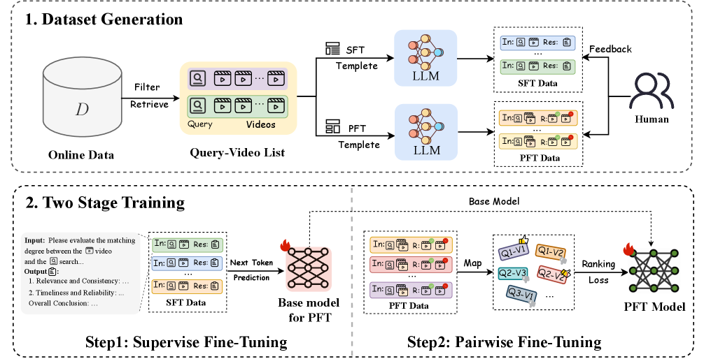
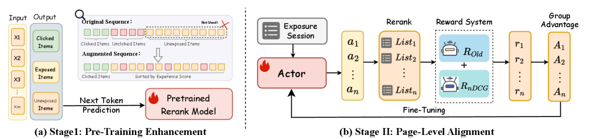
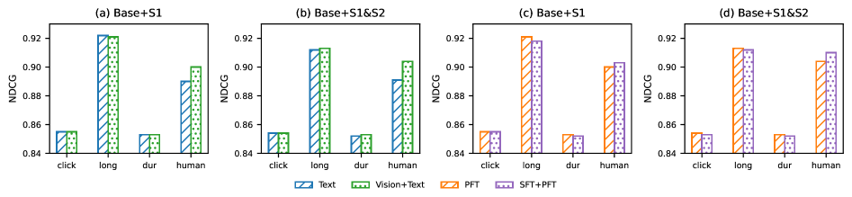

# Unbiased Multimodal Reranking for Long-Tail Short-Video Search

> **arxiv**: https://arxiv.org/abs/2603.24975
> **Authors**: Wenyi Xu (ZJU + Kuaishou), Feiran Zhu (Kuaishou), Songyang Li (Kuaishou), Renzhe Zhou (Kuaishou), Chao Zhang (Kuaishou), Chenglei Dai (Kuaishou), Yuren Mao (ZJU), Yunjun Gao (ZJU), Yi Zhang (Kuaishou)
> **Venue**: WWW 2026 (ACM Web Conference 2026, April 13–17, Dubai)

## Abstract

Kuaishou serving hundreds of millions of searches daily, the quality of short-video search is paramount. However, it suffers from a severe Matthew effect on long-tail queries: sparse user behavior data causes models to amplify low-quality content such as clickbait and shallow content. The recent advancements in Large Language Models (LLMs) offer a new paradigm, as their inherent world knowledge provides a powerful mechanism to assess content quality, agnostic to sparse user interactions. To this end, we propose a LLM-driven multimodal reranking framework, which estimates user experience without real user behavior. The approach involves a two-stage training process: the first stage uses multimodal evidence to construct high-quality annotations for supervised fine-tuning, while the second stage incorporates pairwise preference optimization to help the model learn partial orderings among candidates. At inference time, the resulting experience scores are used to promote high-quality but underexposed videos in reranking, and further guide page-level optimization through reinforcement learning. Experiments show that the proposed method achieves consistent improvements over strong baselines in offline metrics including AUC, NDCG@K, and human preference judgement. An online A/B test covering 15% of traffic further demonstrates gains in both user experience and consumption metrics, confirming the practical value of the approach in long-tail video search scenarios.

## 1. Introduction

On leading short-video platforms serving hundreds of millions of searches daily, search quality is paramount. While long-tail queries constitute a significant fraction of this volume—approximately 20%—they are disproportionately responsible for poor user experiences. For these queries, the scarcity of user interaction data creates a vicious cycle known as the Matthew effect. Lacking reliable signals, ranking models often over-rely on superficial cues like sensational thumbnails or catchy titles. Consequently, the results page is frequently dominated by clickbait and shallow content, which steadily erodes user trust and platform reputation.

In the long-tail regime, sparse behavioral signals make ranking especially vulnerable to three entangled biases:
1. **Position/exposure bias** amplifies items merely because they were seen rather than truly preferred, leading models to overfit presentation effects.
2. **Popularity bias** further distorts supervision by rewarding click-bait and over-exposed creators, especially when feedback is scarce.
3. **Cross-modal mismatch**, where the cover/title narrative diverges from the actual footage, obscures intrinsic quality.

These effects are exacerbated by video's multimodal nature: relevance must be inferred from titles, ASR transcripts, OCR snippets, covers, and key frames, making it hard to disentangle genuine usefulness from noise under weak feedback.

Existing remedies are insufficient as they fail to address these coupled challenges: multimodal inconsistency and query-specific relevance. Methods like query rewriting operate only at the textual level and are fundamentally blind to the multimodal nature of video, thus cannot detect critical inconsistencies between a video's title, its spoken content (ASR), and its actual visual footage. A generic video quality score might assess a video's internal coherence but its assessment is fundamentally query-agnostic.

To address the three sources of long-tail degradation, we propose a unified solution:
- For **popularity bias** and **cross-modal mismatch**: employ a Large Language Model with world knowledge to perform explicitly query-aware multimodal parsing, integrating titles, ASR, OCR, covers, and key frames.
- For **position/exposure bias**: anchor on a user-behavior-agnostic experience score to reconstruct reranking training signals and the page-level RL reward.

Main contributions:
- We analyze the three sources of bias in long-tail queries and propose a user-behavior-agnostic, explicitly query-aware multimodal experience-scoring model.
- We use the model's experience scores to drive label reconstruction and page-level reward optimization in reranking.
- Offline studies and large-scale online A/B tests show stable improvements in user-experience metrics without sacrificing key consumption metrics.

## 2. Related Works

### 2.1. Architecture for Reranking

Modern search systems typically follow a two-stage cascade: an initial retrieval step rapidly recalls candidate documents, and a subsequent reranking step refines these candidates with more sophisticated models. Within this reranking stage, recent studies have explored large language model approaches from four viewpoints: pointwise, pairwise, listwise, and setwise. RankGPT casts reranking as a sequence-generation problem and already outperforms traditional baselines in zero-shot settings. Setwise prompting scores an entire group of candidates in a single pass, markedly lowering inference cost. Self-Calibrated Listwise Reranking introduces a "list view + point view" dual relevance scheme. Novel loss functions have been proposed: Softmax-DPO, diffNDCG, and reinforcement-learning schemes like GRPO align LLM predictions with human preference signals.

### 2.2. Personalized Ranking with LLMs

In personalized ranking, researchers focus on injecting user interests and behaviors into LLM-based rankers. PREMIUM encodes preferences via a tag system. NoteLLM-2 enriches item representations with image-and-text inputs. CHIME encodes a user's entire behavior sequence with an adaptive LLM. HLLM adopts a hierarchical design: one LLM extracts content features from item descriptions, while another predicts future interests from historical interactions. These studies demonstrate how LLMs can learn and adapt to behavioral data to deliver more personalized rankings. However, they depend heavily on high-quality, unbiased user features and thus do not transfer well to long-tail search scenarios.

### 2.3. Multimodal Alignment and Synthetic Data

In rich-media retrieval, textual, visual, and audio cues often misalign, causing click-bait or content mismatch; meanwhile, long-tail items suffer from sparse labels. Recent work tackles these issues via multimodal alignment and synthetic supervision. RagVL fine-tunes a vision-language model as a reranker. Google Multimodal Reranking for Knowledge-Intensive VQA fuses vision, text, and knowledge vectors. In industry, LLM-Alignment Live-Streaming compresses frames, ASR transcripts, and live comments into a unified embedding. When human labels are scarce, generative models can create auxiliary signals offline. Promptagator uses a handful of seed examples to mass-generate queries. EnrichIndex enriches each document with LLM-generated summaries and Q&A pairs.

## 3. Methodology

### 3.1. Framework Overview

To mitigate long-tail ranking bias in short-video search, we propose an experience score–driven multimodal reranking framework that decouples score learning from ranking deployment. Specifically, we:
1. Train an **experience-scoring model** offline to predict an experience score for each query-video pair.
2. Inject this score as an additional, behavior-agnostic signal into the production reranking pipeline.

The overall framework consists of three main stages:
1. **Multimodal quality alignment stage**: construct a high-quality multimodal annotation dataset via LLM-prompted dimension-wise quality analyses.
2. **Pairwise ranking alignment stage**: introduce intra-query video preference pairs and train with a pairwise ranking loss.
3. **Integration into the Ranking Pipeline stage**: integrate the learned scores into the production ranking system.

> **Figure 1.** Data construction and two-stage training of the multimodal experience-scoring model, including supervised fine-tuning with multimodal annotations and pairwise fine-tuning with preference data.

### 3.2. Multimodal Quality Alignment

#### 3.2.1. Dataset

Existing open datasets focus mainly on text-only or vision-only retrieval and lack resources that simultaneously cover text, speech, and visual signals for long-tail short-video search. We design an LLM-based multi-dimensional annotation pipeline:
1. Mine search logs from the past month and filter out long-tail queries whose seven-day page view count is below 70.
2. Randomly sample a subset of long-tail queries and retrieve up to ten candidate videos for each query.
3. For each video, collect multimodal inputs: textual features (title, description, OCR snippets, ASR transcript) and visual features (cover image and four key frames).
4. Prompt a multimodal model to produce dimension-wise reasoning analyses along multiple axes (relevance and consistency, image safety, timeliness and credibility).

| | SFT Data | PFT Data |
|---|---|---|
| Sample Size | 187,150 | 347,935 |
| Queries | 31,392 | 42,308 |
| Avg. per Query | 5.96 | 8.22 |

> **Table 1.** Statistics of the Training Datasets Used for SFT and PFT Stages.

#### 3.2.2. Supervised Fine Tuning

We cast multimodal quality assessment as a standard next-token prediction task for an LLM. Given a multimodal prompt \\(x\\) concatenating a fixed system prefix, user query, and fused textual–audio–visual descriptions, the model is trained to autoregressively generate a complete quality analysis \\(y\\). The training objective minimises the negative log-likelihood:

\\[
\mathcal{L}_{SFT} = -\mathbb{E}_{\langle x, y \rangle \in \mathcal{D}_{SFT}} \left[ \sum_{t=1}^{T} \log p_\theta(y_t | y_{<t}, x) \right] \tag{2}
\\]

After this stage, the model acquires the ability to assess content quality from multiple perspectives conditioned on multimodal evidence.

### 3.3. Pairwise Ranking Alignment

#### 3.3.1. Dataset

In the pairwise ranking alignment stage, we construct multiple candidate video pairs \\(\langle d_i, d_j \rangle\\) for each long-tail query \\(q\\) based on its exposed videos. We perform multi-level quality control combining rule-based filtering with manual verification to ensure logical consistency and overall reliability of the final preference labels.

#### 3.3.2. Pairwise Preference Fine Tuning

Building upon the SFT model, we replace the generative head with a sequence classification head to output a comparable scalar quality score. Given a query–video pair \\((q, v)\\):

\\[
s_{q,v} = f_\theta(q,v) = w^\top h_{q,v} + b \tag{3}
\\]

For a pair of candidate videos \\((A, B)\\) under the same query with annotated preference \\(A \succ B\\):

\\[
\mathcal{L} = -\mathbb{E}[\log \sigma(s^+ - s^-)] + \lambda \mathbb{E}[(s^+ + s^-)^2] \tag{4}
\\]

where the first term encourages the model to assign higher scores to preferred videos, and the second term regularizes the overall score distribution to remain centered and stable.

### 3.4. Integration into the Ranking Pipeline

We integrate the learned experience scores into a two-stage generative reranking pipeline for short-video search:

> **Figure 2.** Overview of the two-stage reranking integration. Stage I enhances pre-training with experience-score-ordered supervision; Stage II aligns page-level ranking through GRPO-based reward optimization guided by experience-derived nDCG.

#### 3.4.1. Stage I: Pre-Training Enhancement

For a query \\(q\\), let \\(S\\) denote the candidate set for a session and \\(s_{exp}(q, i)\\) the point-wise experience score of item \\(i\\). We construct the training target sequence by concatenating two segments:

\\[
y_{aug} = [\text{sort}(C; s_{exp}\downarrow) \triangleright \text{sort}(E \cup U; s_{exp}\downarrow)] \tag{5}
\\]

The loss remains the standard autoregressive next-token negative log-likelihood:

\\[
\mathcal{L}_{stage1} = \sum_{t=1}^{|y_{aug}|} -\log \pi_\theta(y_t | q, y_{<t}, C) \tag{6}
\\]

#### 3.4.2. Stage II: Page-Level Alignment

We sort the candidates in descending order of their experience scores to obtain the ideal ranking list:

\\[
y_s = \text{sort}(C; s_{exp}\downarrow) \tag{7}
\\]

The position of item \\(i\\) in this ideal list is denoted as \\(\text{rank}_{y_s}(i)\\). Based on this order, we define a graded relevance value:

\\[
\text{rel}_{y_s}(i) = K - \text{rank}_{y_s}(i) + 1 \tag{8}
\\]

The GRPO-style sequence-level reward that interpolates the existing behavioral objective with the experience-based page utility:

\\[
r(q, y) = \alpha R_{old}(q, y) + \beta \text{nDCG}@K(y, y_s) \tag{10}
\\]

where \\(\alpha, \beta > 0\\) are mixing coefficients that control the trade-off between behavioral and page-level objectives.

## 4. Experiments

### 4.1. Experimental Setup

#### 4.1.1. Dataset

We constructed a large-scale annotated dataset with strict temporal splitting and rule-based deduplication. All supervised and preference annotations are generated offline using Qwen2.5-VL-32B model.

#### 4.1.2. Metrics

We evaluate using:
- **Pairwise Accuracy (Acc) / AUC**: whether the model consistently assigns higher scores to preferred videos
- **NDCG@K**: listwise ranking quality
- **GSB (Good/Same/Bad)** pairwise human preference judgments

#### 4.1.3. Baselines

- **API-based LLM**: GPT-4o (T-P), GPT-4o (VL-P), GPT-4o (T-L)
- **Listwise Rerankers**: RankGPT
- **Dual-Encoder Retrieval**: BGE-m3 (dense mode)

### 4.2. Evaluation Result

#### 4.2.1. Effectiveness of the experience-scoring model

| Method | NDCG@1 | NDCG@5 | NDCG@10 |
|--------|--------|--------|---------|
| GPT-4o (T-P) | 0.793 | 0.824 | 0.905 |
| GPT-4o (VL-P) | 0.811 | 0.837 | 0.921 |
| GPT-4o (T-L) | 0.687 | 0.752 | 0.885 |
| RankGPT | 0.759 | 0.801 | 0.904 |
| BGE-m3 | 0.612 | 0.721 | 0.864 |
| **ExpModel (Ours)** | **0.849** | **0.854** | **0.930** |

> **Table 2.** Comparison of baseline methods on the human-labeled query set: NDCG@{1,5,10}.

ExpModel achieves the best NDCG@1,5,10 scores. The gain @1 is particularly notable, indicating stronger discrimination among top-ranked items.

#### 4.2.2. Effectiveness of reranking deployment

| Model | NDCG@1 | NDCG@5 | NDCG@10 |
|-------|--------|--------|---------|
| Exposure Seq | 0.707 | 0.754 | 0.884 |
| CTR score | 0.610 | 0.687 | 0.854 |
| Relevance score | 0.611 | 0.722 | 0.866 |
| Quality score | 0.564 | 0.673 | 0.843 |
| Base rerank | 0.763 | 0.794 | 0.891 |
| Base + S1 | 0.782 | 0.816 | 0.903 |
| Base + S1&S2 | 0.785 | 0.822 | 0.910 |
| ExpModel | **0.849** | **0.854** | **0.930** |

> **Table 3.** Performance of integrating the experience scores into two-stage reranking pipeline on the human-labeled query set: NDCG@{1,5,10}.

When the reranking side is progressively enhanced from Base to Base+S1 and Base+S1&S2, the experience metrics exhibit a monotonic improvement.

| Model | Long-play AUC | Long-play NDCG@10 | Click AUC | Click NDCG@10 |
|-------|---|---|---|---|
| Exposure Seq | 0.595 | 0.879 | 0.612 | 0.883 |
| CTR Score | 0.762 | 0.918 | 0.863 | 0.920 |
| Base Rerank | 0.696 | 0.877 | 0.680 | 0.898 |
| Base + S1 | 0.694 | 0.872 | 0.679 | 0.883 |
| Base + S1&S2 | 0.691 | 0.866 | 0.675 | 0.879 |
| ExpModel | 0.654 | 0.863 | 0.673 | 0.868 |

> **Table 4.** Evaluation of models on long-play and click-through metrics.

After injecting the experience scores, we observe only a slight and controllable decline relative to Base in consumption metrics, with no significant degradation.

#### 4.2.3. Human Preference Evaluation

| Method | Good | Same | Bad | Adv |
|--------|------|------|-----|-----|
| ExpModel | 48 | 114 | 26 | +11.70% |
| Base + S1&S2 | 39 | 133 | 28 | +5.50% |

> **Table 5.** Human GSB evaluation vs. base rerank. Adv = (G−B)/(G+S+B) × 100%.

### 4.3. Ablation Study

> **Figure 3.** Ablations within the two-stage optimization in reranking. Bars report NDCG under four label types: click: click-based labels, long = long-play labels, dur = watch-duration labels, human = human-preference labels.

#### 4.3.1. Impact of Two-stage training

With identical model capacity and data, inserting the supervised fine-tuning stage raises ACC from 79.9% to 80.7% on the text model and from 82.2% to 84.6% on the multimodal model.

| Scheme | Modality | Model | Accuracy (%) |
|--------|----------|-------|-------------|
| PFT | text | Qwen3-4B | 79.9 |
| SFT + PFT | text | Qwen3-4B | 80.7 |
| PFT | text+image | Qwen2.5-VL-3B | 82.2 |
| SFT + PFT | text+image | Qwen2.5-VL-3B | **84.6** |

> **Table 6.** Accuracy of different training schemes and modalities.

#### 4.3.2. Impact of Modalities and Training Strategy on Reranking

At either stage the text-only input underperforms the multimodal setting (text + vision), with a larger gap on experience-oriented metrics. Visual cues complement textual signals, enhance query–content consistency, and help surface high-quality items at the top ranks.

## 5. Online Applications

### 5.1. Deployment Details

We deployed the method in Kuaishou's production search system and conducted a large-scale A/B test:
- **Target segment**: long-tail query segment (queries with fewer than 70 page views over a 7-day window)
- **Traffic**: 5% of total search traffic, within which long-tail queries accounted for approximately 15.4%
- **Duration**: two weeks, handling over 50 million queries per day
- **Model architecture**: compact 4M parameter architecture implemented in TensorFlow
- **Online inference**: 2 nodes, each equipped with 2 NVIDIA A10 GPUs
- **Training**: distributed setup with 6 nodes, each using 2 Tesla T4 GPUs (16 GB)
- **Update cadence**: model weights refreshed every 12 hours

### 5.2. Performance of A/B Test

| Metric Name | IQRR | CTR | LVR |
|-------------|------|-----|-----|
| all queries | -0.11% | +0.13% | +0.19% |
| long-tail queries | **-1.28%** | **+1.24%** | **+1.67%** |

> **Table 7.** Online A/B test results on Kuaishou Search. IQRR: Intent Query Reformulation Rate; CTR: Click-Through Rate; LVR: Long-View Ratio.

In the long-tail query segment, all three core metrics show significant gains:
- IQRR rate dropped by 1.28% (users more satisfied, less likely to reformulate queries)
- CTR increased by 1.24% (better surfacing of relevant candidates)
- LVR rose by 1.67% (higher content quality and user retention)

These benefits generalized to overall traffic as well.

## 6. Conclusion

This paper presents an unbiased multimodal reranking framework for long-tail short-video search. By combining multimodal evidence–aligned supervised fine-tuning with pairwise preference optimization, the model learns a comparable, de-biased experience score capturing query alignment and content quality. Injecting this score into the production reranker, together with pointwise enhancement and page-level alignment, improves top-of-page experience metrics without disrupting consumption behavior. Large-scale online A/B tests further validate the deployability and scalability of the framework, achieving statistically significant improvements in both user experience and consumption behavior. For future work, we plan to further refine the two-stage training mechanism by exploring direct listwise modeling, and to incorporate richer audio semantics and session-level feedback.

## References

Key references include:
- [RankGPT] Sun et al., 2023. Is ChatGPT good at search? Investigating large language models as re-ranking agents.
- [SoftmaxDPO] Chen et al., 2024. On softmax direct preference optimization for recommendation.
- [GRPO] Shao et al., 2024. DeepSeekMath: Pushing the limits of mathematical reasoning in open language models.
- [NoteLLM-2] Zhang et al., 2025. NoteLLM-2: Multimodal large representation models for recommendation.
- [CHIME] Bai et al., 2025. Chime: A compressive framework for holistic interest modeling.
- [EnrichIndex] Chen et al., 2025. EnrichIndex: Using LLMs to Enrich Retrieval Indices Offline.
- [BGE-M3] Chen et al., 2024. BGE M3-Embedding: Multi-lingual, multi-functionality, multi-granularity text embeddings.
