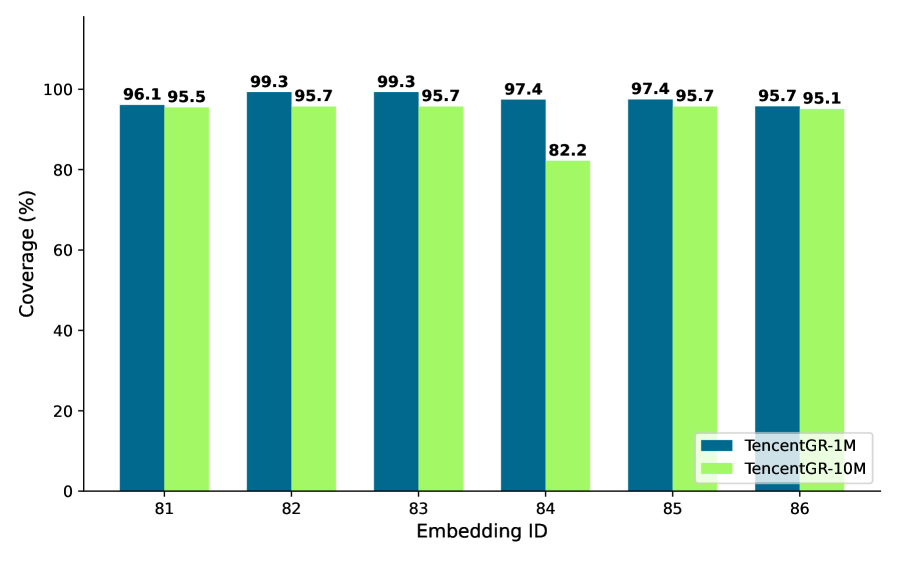
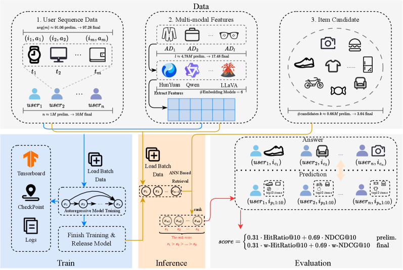

# The Tencent Advertising Algorithm Challenge 2025: All-Modality Generative Recommendation

**Authors:** Junwei Pan, Wei Xue, Chao Zhou, Xing Zhou, Lunan Fan, Yanbo Wang, Haoran Xin, Zhiyu Hu, Yaozheng Wang, Fengye Xu, Yurong Yang, Xiaotian Li, Junbang Huo, Wentao Ning, Yuliang Sun, Chengguo Yin, Jun Zhang, Shudong Huang, Lei Xiao, Huan Yu, Irwin King, Haijie Gu, Jie Jiang

**Affiliations:** Tencent, The Chinese University of Hong Kong

**Paper:** https://arxiv.org/abs/2604.04976

**PDF:** attachment/2604.04976_TencentAdGenRec.pdf

**Submitted:** April 7, 2025

---

## Abstract

Generative recommender systems are rapidly emerging as a new paradigm for recommendation, where collaborative identifiers and/or multi-modal content are mapped into discrete token spaces and user behavior is modelled with autoregressive sequence models. Despite progress on multi-modal recommendation datasets, there is still a lack of public benchmarks that jointly offer large-scale, realistic and fully all-modality data (including collaborative IDs, visual and textual modality features) designed specifically for generative recommendation (GR) in industrial advertising. To foster research in this direction, we organised the Tencent Advertising Algorithm Challenge 2025: All-Modality Generative Recommendation, a global competition built on top of two all-modality datasets for GR: **TencentGR-1M** and **TencentGR-10M**. Both datasets are constructed from real de-identified Tencent Ads logs and contain rich collaborative IDs and multi-modal representations (text and vision) extracted with state-of-the-art embedding models. The preliminary track (TencentGR-1M) provides one million user sequences with up to 100 interacted items each, where each interaction is labeled with exposure and click signals, while the final track (TencentGR-10M) scales this to ten million users and explicitly distinguishes between click and conversion events at both the sequence and target level.

We release our datasets at: https://huggingface.co/datasets/TAAC2025/TencentGR-1M and https://huggingface.co/datasets/TAAC2025/TencentGR-10M

---

## 1. Introduction

Discriminative recommendation models have long been the dominant paradigm in industrial recommender systems. Their evolution has been marked by two major lines of progress: increasingly expressive feature interaction modeling and increasingly powerful sequence-based user interest modeling. Building on these advances, recommender systems are now increasingly moving from discriminative formulations to generative architectures that operate directly on user behavior sequences.

Instead of merely re-scoring a fixed candidate set, recent generative recommendation models reformulate retrieval or ranking as sequence generation over item identifiers or semantic codes. These models focus on: (i) how to organize the data (non-sequential tokens such as user demographics, plus heterogeneous sequential tokens including interacted item tokens and action type tokens); (ii) how to encode actions (exposure, click, conversion) as explicit tokens or conditioning signals so that different behavioral intents can be disentangled.

In parallel, there is a rapidly growing body of work on integrating multi-modal representations into recommendation models. Beyond early semantic-ID-based models like TIGER, methods such as LETTER, DAS, MMQ, OneRec and parallel semantic IDs design tokenisers that map multi-modal item content and collaborative signals into discrete code sequences suitable for generative retrieval and ranking.

Despite rapid methodological progress, the ecosystem of public benchmarks for generative recommendation is still limited. Most GR papers evaluate on medium-scale e-commerce corpora such as Amazon Beauty/Toys/Sports and Yelp. Recent surveys on generative recommendation explicitly highlight the lack of large-scale, fully multi-modal, interactive benchmarks — especially in high-value industrial domains such as advertising — as a major bottleneck.

---

## 2. Challenge Setting

### 2.1. Problem

The core task is a **next-item recommendation** problem on multi-modal ad interaction sequences. For each user $u$, we observe chronological sequence of ad-related behaviors (impressions, clicks, conversions):

$$S_u = \{x_u, x_{u,1}, x_{u,2}, \ldots, x_{u,T_u}\}$$

where $x_u$ is a user-profile token aggregating static user features and each $x_{u,t}$ denotes an item token (an ad impression) at time $t$. Each token is a tuple:

$$x_u = (f_{\text{pf.}}^{(1)}, \ldots, f_{\text{pf.}}^{(K_p)})$$
$$x_{u,t} = (f_{\text{cate}}^{(1)}, \ldots, f_{\text{cate}}^{(K_a)}; f_{\text{act}}; f_{\text{mm}}^{(1)}, \ldots, f_{\text{mm}}^{(K_m)})$$

where $f_{\text{pf.}}$ denotes user profile features, $f_{\text{cate}}$ denotes categorical attributes, $f_{\text{act}}$ denotes action/feedback signals, and $f_{\text{mm}}$ denotes pre-computed multi-modal embeddings.

### 2.2. Challenge Rounds

**Preliminary round:** TencentGR-1M with ~1M user sequences. Task: predict next clicked ad. Ranked by weighted HitRate@10 + NDCG@10.

**Second round:** TencentGR-10M with 10M user sequences, explicit click and conversion signals. Task: next click-or-conversion prediction. Evaluation uses behavior-type weighting to emphasize conversions.

**On-site final:** Top 20 teams present. Overall ranking = 75% leaderboard + 25% committee review.

### 2.3. Awards and Talent Programs

- Champion: 2,000,000 RMB
- 2nd place: 600,000 RMB
- 3rd place: 300,000 RMB
- 4th–10th place: 100,000 RMB each
- Technical Innovation Award: 200,000 RMB

All finalist team members are eligible for full-time offer interviews with Tencent.

### 2.4. Participation Rules

- Open to full-time students worldwide (undergraduate, master's, PhD, postdoctoral)
- Teams of 1–3 members
- **No model ensembling** (to focus on single-model quality)
- Participants must employ generative recommendation ideas (autoregressive architectures or generative semantic ID construction)

---

## 3. Data

### 3.1. Preliminary Round: TencentGR-1M

**Key statistics:**
- 1,001,845 users with at least one click in the answer time window
- Prediction target: first clicked ad after $t_{\text{begin}}$
- History: all behaviors before target's exposure time, truncated to ≤100 item tokens
- Action labels: $r_{u,t} \in \{0, 1\}$ for exposure and click (9.81% clicks, 90.19% exposures)
- Candidate pool: 660k de-duplicated ads (~40% appear as targets for at least one user)

### 3.2. Second Round: TencentGR-10M

**Key statistics:**
- 10,139,575 users with at least one click or conversion
- Prediction target: earliest qualifying target event (conversion takes priority over click)
- Action labels: $r_{u,t} \in \{0, 1, 2\}$ for exposure, click, and conversion
  - 94.63% exposures, 2.85% clicks, 2.52% conversions
- Candidate pool: 3,637,720 ads
- Conversions appear **both as events within sequences and as part of the prediction target type**

### 3.3. Multi-Modal Features

Raw ad creatives (text, images, videos) are **not** released for privacy reasons. Instead, multi-modal embeddings are extracted using a suite of production models:

| Model | Modality | Notes |
|-------|----------|-------|
| BERT (finetuned) | Text | Finetuned with contrastive learning on collaborative data |
| Hunyuan (finetuned) | Text+Image | Finetuned with contrastive learning on collaborative data |
| Conan-Embedding | Text | Not finetuned |
| GTE-multilingual | Text | Not finetuned |
| Hunyuan | Image | Not finetuned |
| Universal-Embedding | Image | Not finetuned |

Up to **6 embedding vectors** per creative, from different encoders and modalities.

---

## 4. Baseline Model

The baseline adopts a **next-token prediction formulation** with a causal Transformer backbone and approximate-nearest-neighbour (ANN) based retrieval.

### 4.1. Training

**Feature encoding:** Multi-field feature fusion. Each categorical/ID feature has its own embedding table; multi-modal features are used directly as continuous embeddings. All field embeddings are concatenated and projected via MLP:

$$\mathbf{e}_f = \text{Emb}_f(f), \quad \forall f \in \mathcal{F}$$
$$\mathbf{x}_u^0 = \text{MLP}(\text{concat}(\{\mathbf{e}_f\}_{f \in \mathcal{F}_u}))$$
$$\mathbf{x}_{u,t}^0 = \text{MLP}(\text{concat}(\{\mathbf{e}_f\}_{f \in \mathcal{F}_{u,t}}, \{f_{\text{mm}}^{(j)}\}_j))$$

**Backbone:** Causal Transformer with $L$ layers and causal masking:

$$\mathbf{H}^0 = [\mathbf{x}_u^0 + \mathbf{p}_0, \mathbf{x}_{u,1}^0 + \mathbf{p}_1, \ldots, \mathbf{x}_{u,T_u}^0 + \mathbf{p}_{T_u}]$$
$$\mathbf{H}^l = \text{TransformerLayer}^l(\mathbf{H}^{l-1}), \quad l = 1, \ldots, L$$
$$\mathbf{h}_{u,t} = \mathbf{H}^L[t]$$

**Training objective:** InfoNCE loss:

$$\mathcal{L} = -\sum_{(u,t)} \log \frac{\exp(s_{u,t,i^+})}{\exp(s_{u,t,i^+}) + \sum_{i^- \in \mathcal{N}_{u,t}} \exp(s_{u,t,i^-})}$$

For the second round, action-type weights $w_a$ are applied to emphasize conversion events:

$$\mathcal{L} = -\sum_{(u,t,a)} w_a \cdot \log \frac{\exp(s_{u,t,i^+})}{\exp(s_{u,t,i^+}) + \sum_{i^- \in \mathcal{N}_{u,t}} \exp(s_{u,t,i^-})}$$

**Implementation:** 11 Transformer layers, hidden dimension $d=32$, 11 attention heads, dropout 0.2, max sequence length 101.

### 4.2. Inference

1. **User embedding:** Last-layer hidden state at final position
2. **Candidate item embeddings:** Pre-computed and cached using the same feature encoder
3. **ANN search:** FAISS index for top-$K$ retrieval

---

## 5. Competition Platform

All workflows run on the **Tencent Angel** machine learning platform, which provides distributed training/evaluation for large-scale advertising models. Evaluation environment is strictly sandboxed (no network access, isolated from user environments). Teams get up to 3 submissions per 24-hour window.

---

## 6. Evaluation Protocol

### 6.1. Preliminary-Round Metrics

Standard HitRate@10 and NDCG@10 (no behavior-type weighting):

$$\text{HitRate@K}(u) = \mathbb{I}\{G_u \in \{\hat{y}_{u,1}, \ldots, \hat{y}_{u,K}\}\}$$

$$\text{NDCG@K}(u) = \sum_{k=1}^K \frac{\mathbb{I}\{\hat{y}_{u,k} = G_u\}}{\log_2(k+1)}$$

**Leaderboard score:**
$$\text{Score}_{\text{prelim}} = 0.31 \cdot \text{HitRate@10} + 0.69 \cdot \text{NDCG@10}$$

### 6.2. Second-Round Metrics

**Weighted relevance:** Different weights per behavior type:
$$w(i) = \begin{cases} 0 & \text{if } i \text{ is exposure only} \\ 1 & \text{if } i \text{ is click} \\ 2.5 & \text{if } i \text{ is conversion} \end{cases}$$

**Weighted HitRate@K:**
$$w\text{-HitRate@K}(u) = \frac{\sum_{k=1}^K w(\hat{y}_{u,k}) \mathbb{I}\{\hat{y}_{u,k} \in G_u\}}{\sum_{i \in G_u} w(i)}$$

**Weighted NDCG@K:**
$$w\text{-DCG@K}(u) = \sum_{k=1}^K \frac{w(\hat{y}_{u,k}) \mathbb{I}\{\hat{y}_{u,k} \in G_u\}}{\log_2(k+1)}$$

$$w\text{-IDCG@K}(u) = \sum_{k=1}^{\min(K, |G_u|)} \frac{w(i_k^*)}{\log_2(k+1)}$$

$$w\text{-NDCG@K}(u) = \frac{w\text{-DCG@K}(u)}{w\text{-IDCG@K}(u)}$$

---

## 7. Challenge Summary

**Participation:** 8,440+ registered participants from ~30 countries, 2,800+ teams, 4,600 active participants from 340+ mainland China universities and 140+ international institutions.

**Top University Participants:** USTC, Tsinghua, UCAS, Zhejiang University, Fudan University.

### First Place (Champion)

Built a multi-modal auto-regressive generative recommendation model on a dense **Qwen backbone**:
- **Per-position action-conditioning** mechanism using gated fusion, FiLM layers, and attention biasing to disentangle behavioral semantics
- **Hierarchical time features**: absolute timestamps, relative gaps, session structures, multi-frequency Fourier features for periodicity
- **RQ-KMeans semantic IDs** from multi-modal embeddings for long-tail items, combined with random-$k$ regularization strategy
- **Hybrid Muon + AdamW optimizer** with static-shape GPU-friendly contrastive InfoNCE loss and large negative banks
- End-to-end generation of user vectors followed by ANN retrieval

### Second Place

Encoder-decoder architecture:
- **Encoder:** Multiple gated MLPs + graph neural networks on user-item interaction graph neighborhoods
- **Decoder:** Improved SASRec-style Transformer (hidden size 2048, 8 layers, 8 attention heads)
- **SVD-based RQ-KMeans** for discrete semantic IDs
- **PinRec-style action conditioning** for behavioral intent disentanglement
- **Two-stage training:** pre-training on exposures, fine-tuning on clicks/conversions

### Third Place

Decoder-only Transformer with:
- Rich temporal signals (absolute timestamps, relative time gaps)
- **Action-type conditioning** (next item predicted under specified behavior type)
- **InfoNCE loss** with AMP mixed-precision and static graph compilation
- **Key finding:** Systematic study of scaling laws for generative recommendation
  - Scaled per-batch negatives to **380K** with substantial performance gains
  - Performance driven more by scale than intricate model design

### Technical Innovation Award

Decoder-only generative model that jointly modeled **next interested item + user action**:
- Unified training: semantic-ID generation loss + action prediction loss
- State-of-the-art components: FlashAttention, SwiGLU, RMSNorm, RoPE, DeepSeek-V3-style MoE
- **Collision-resolution mechanism** for second-level semantic codes (automatically finds next-closest cluster center)
- Mixed-precision training, separate sparse/dense optimizer updates, grouped GEMM, KV cache acceleration

---

## 8. Conclusion

We presented the TencentGR datasets and the TAAC 2025 challenge, centered on all-modality generative recommendation for advertising. Key contributions:
- Two large-scale de-identified datasets with rich multi-modal features (TencentGR-1M, TencentGR-10M)
- Carefully designed weighted evaluation metrics that account for conversion value
- Strong baseline implementation and top-performing solutions released publicly

The combination of realistic industrial data, clearly defined generative tasks, and diverse strong solutions aims to catalyse further research on all-modality generative recommendation.

---

## Key References

- PinRec: outcome-conditioned, multi-token generative retrieval (Badrinath et al., 2025)
- TIGER: Recommender systems with generative retrieval (Rajput et al., 2023)
- Actions speak louder: trillion-parameter sequential transducers (Zhai et al., 2024)
- OneRec technical report (Zhou et al., 2025)
- QARM: Quantitative alignment multi-modal recommendation at Kuaishou (Luo et al., 2025)
- KuaiRec/KuaiRand: Short video recommendation datasets (Gao et al., 2022)
- Scaling laws for neural language models (Kaplan et al., 2020)
