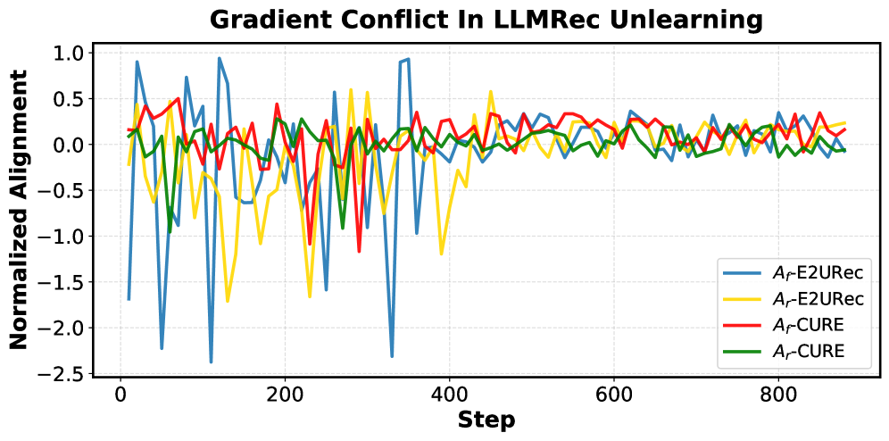
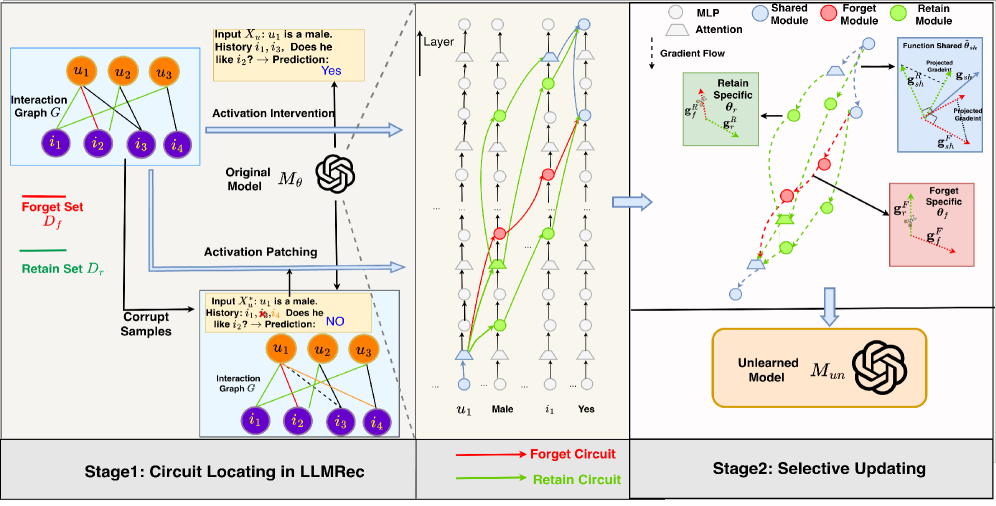
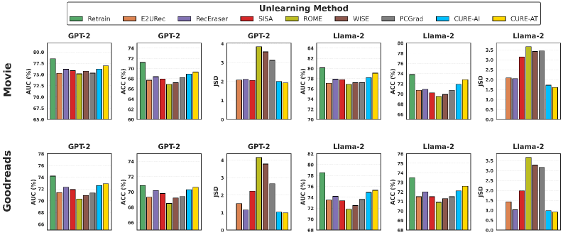
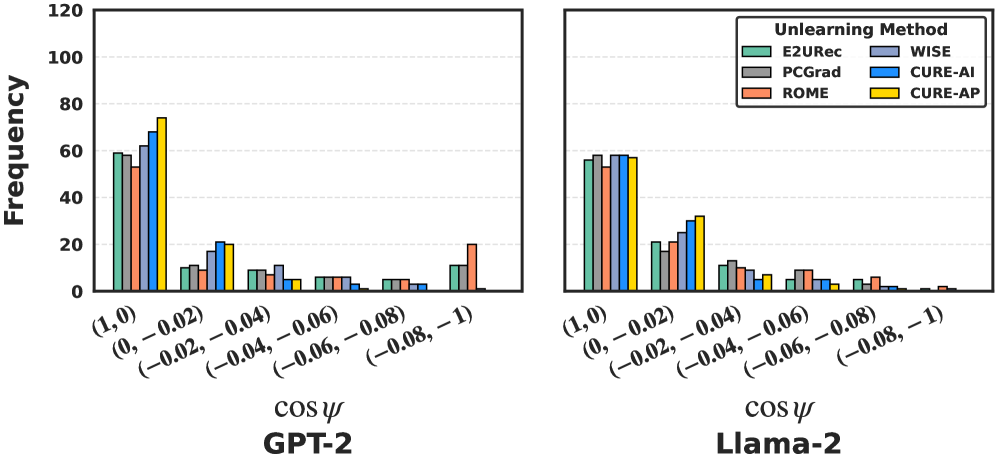
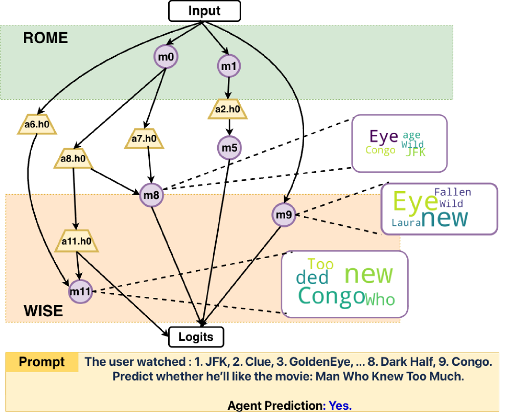

# CURE: Circuit-Aware Unlearning for LLM-based Recommendation

**Authors:** (From Walmart/academic collaboration)

**Affiliations:** Walmart / Academic Research

**Paper:** https://arxiv.org/abs/2604.04982

**PDF:** attachment/2604.04982_CIRCUITUnlearningRec.pdf

**Submitted:** April 7, 2025

---

## Abstract

Recent advances in large language models (LLMs) have opened new opportunities for recommender systems. However, as privacy regulations tighten, incorporating user data into LLM-based recommendation (LLMRec) introduces significant privacy risks, making **unlearning algorithms** increasingly crucial for practical deployment. Existing approaches formulate unlearning as a weighted combination of forgetting and retaining objectives with uniform parameter updates, which inevitably induces **gradient conflicts** between the two objectives, leading to unstable optimization and either ineffective unlearning or severe degradation of model utility.

We propose **CURE** (Circuit-aware Unlearning for Recommendation), a circuit-aware unlearning framework that:
1. Disentangles model components into functionally distinct subsets (circuits)
2. Selectively updates each subset to mitigate gradient conflicts during unlearning
3. Achieves **18% improvement in unlearning efficiency** and **6% improvement in model utility** compared to baseline
4. Is **3.5× faster** than the baseline

---

## 1. Introduction

LLM-based recommenders (LLMRec) face critical ethical and privacy concerns. Recommendation unlearning aims to remove the influence of sensitive data from pre-trained LLMRecs while preserving overall utility.

**Existing approaches:**
- **Exact unlearning:** Retraining from scratch (computationally prohibitive)
- **Approximate unlearning:** Teacher-student framework balancing data removal and model utility

**Core problem:** Most approximate unlearning formulates the objective as:

$$\mathcal{M}_{un} = \arg\min_{\mathcal{M}} \sum_{(\mathbf{x}_u,y_u) \in \mathcal{D}_f} \omega_f \mathcal{L}_F(y_u|\mathbf{x}_u;\mathcal{M}) + \sum_{(\mathbf{x}_u,y_u) \in \mathcal{D}_r} \omega_r \mathcal{L}_R(y_u|\mathbf{x}_u;\mathcal{M})$$

This ignores **gradient conflicts**: when gradients of forget and retain losses point in opposing directions, updates intended to improve one objective inadvertently harm the other.

**Insight from mechanistic interpretability:** Knowledge in LLMs is dynamically activated through specific computational circuits (sparse functional subgraphs). Gradient conflicts arise when circuits responsible for forget and retain sets become entangled, driving shared modules toward conflicting optimization directions.

---

## 2. Preliminary

### 2.1. LLM as Recommender

LLMRec $\mathcal{M}_\theta$ reformulates collaborative filtering as a prompt-based prediction task. Given a user $u$ with historical interactions $\mathcal{H}_u = \{i_1, i_2, \ldots, i_{|\mathcal{H}_u|}\}$ and a target item $i_t$, the model predicts $y_u \in \{\text{"YES"}, \text{"No"}\}$ using conditional language modeling:

$$\min \mathcal{L}_{\text{pred}} = -\sum_{(\mathbf{x}_u, y_u) \in \mathcal{D}} \log(\mathcal{M}_\theta(y_{u,t}|\mathbf{x}_u, y_{u,<t}))$$

### 2.2. LLMRec Unlearning

Given dataset $\mathcal{D}$, forget set $\mathcal{D}_f$, and retain set $\mathcal{D}_r = \mathcal{D} \setminus \mathcal{D}_f$:
- **Goal:** Obtain $\mathcal{M}_{un} \approx \mathcal{M}_{\theta^*}$ (model trained without $\mathcal{D}_f$)
- **Types:** User/item-wise deletion or interaction deletion

**Gradient conflict analysis:** Let $g_f = \nabla \mathcal{L}_F(\theta)$, $g_r = \nabla \mathcal{L}_R(\theta)$. When $g \cdot g_f < 0$, updates increase forget loss (ineffective forgetting). When $g \cdot g_r < 0$, updates degrade model utility.

---

## 3. Motivation

The normalized alignment metrics $A_f(\theta) = \frac{g \cdot g_f}{\|g_f\|^2}$ and $A_r(\theta) = \frac{g \cdot g_r}{\|g_r\|^2}$ frequently switch between positive and negative during training in existing methods (E2URec), reflecting entangled optimization signals. CURE exhibits more stable optimization with gradient conflicts largely mitigated.

---

## 4. Method

CURE is a **two-stage circuit-aware framework**:

### 4.1. Stage 1: Locating Circuits in LLMRec

The LLM is represented as a computational DAG $G^{LM}$ where attention heads and MLPs are nodes, and directed edges specify information flow. A **circuit** is a subgraph connecting input tokens to output logits.

**Edge importance score:**
$$I(e) = |\Delta(x_u | \text{do}(e)) - \Delta(x_u)|$$
where $\Delta(x_u) = \mathcal{M}_\theta(\text{Yes}|x_u) - \mathcal{M}_\theta(\text{No}|x_u)$

#### 4.1.1. Activation Intervention (AI)
For edge $e = v_1 \to v_2$, set $m_{v_1 \to v_2} = 0$. Using first-order Taylor expansion:
$$\Delta(x_u | \text{do}(m_{v_1 \to v_2}=0)) \approx \Delta(x_u) - m_{v_1 \to v_2}^\top \frac{\partial \Delta(x_u)}{\partial v_2}$$
Only requires **one forward + one backward pass** per sample.

#### 4.1.2. Activation Patching (AP)
Construct a **corrupt sample** $x_u^*$ that shares the task schema but elicits different output. Replaces one item in the user history:
$$\mathbf{x}_u^* = \arg\min_{\mathbf{x}} \Delta(\mathbf{x}) \quad \text{s.t.} \quad \|\mathbf{x} - \mathbf{x}_u\|_0 \leq K$$

**Graph-based Item Scoring using Personalized PageRank (PPR):**
$$\boldsymbol{\pi}_u = \alpha P^\top \boldsymbol{\pi}_u + (1-\alpha) \boldsymbol{p}_u$$

Item importance for PPR initialization:
$$S(i) = \sum_{t \in \text{tokens}(i)} \left\| \frac{\partial \Delta(x_u)}{\partial \mathbf{e}_t} \right\|$$

Pre-computed per-item PPR vectors allow efficient online computation as a weighted sum:
$$\boldsymbol{\pi}_u = \sum_{i \in \mathcal{H}_u} \frac{\exp(\tau S(i))}{\sum_{j \in \mathcal{H}_u} \exp(\tau S(j))} \boldsymbol{\pi}_i^{pre}$$

#### 4.1.3. Greedy Circuit Discovery
Starting from logits, iteratively add the highest-scoring edge whose child is already in the circuit. Resembles a maximization variant of Dijkstra's algorithm.

### 4.2. Stage 2: Selective Circuits Updating

For each forget sample, selects nearby retain samples using PPR proximity (retain buffer size $k|D_f|$, typically $k=6$).

**Unlearning losses** (based on SCRUB):
- Forget loss: $\mathcal{L}_F = -D_{KL}(\mathcal{M}_\theta(\text{Yes}|x_u) \| \mathcal{M}_{un}(\text{Yes}|x_u))$
- Retain loss: $\mathcal{L}_R = \frac{1}{|\mathcal{D}_r|} D_{KL}(\mathcal{M}_\theta(\text{Yes}|x_r) \| \mathcal{M}_{un}(\text{Yes}|x_r))$

**Module categorization and update policies:**

| Category | Condition | Update Rule |
|----------|-----------|-------------|
| **Forget-Specific** $\Theta_f$ | $\theta_f \in \mathcal{C}_f \cap \mathcal{C}_r^c$ | Update only with $\mathcal{L}_F$: $\theta_f \leftarrow \theta_f - \alpha \mathbf{g}_f^F$ |
| **Retain-Specific** $\Theta_r$ | $\theta_r \in \mathcal{C}_r \cap \mathcal{C}_f^c$ | Update only with $\mathcal{L}_R$: $\theta_r \leftarrow \theta_r - \alpha \mathbf{g}_r^R$ |
| **Function-Shared** $\Theta_{sh}$ | $\theta_{sh} \in \mathcal{C}_r \cap \mathcal{C}_f$ | Gradient projection to resolve conflicts |

**Gradient projection for shared neurons** (when $(g_{sh}^R)^\top g_{sh}^F < 0$):
$$\mathbf{g}_{sh} = \omega_R\left(\mathbf{g}_{sh}^R - \frac{(\mathbf{g}_{sh}^R)^\top \mathbf{g}_{sh}^F}{\|\mathbf{g}_{sh}^F\|^2} \mathbf{g}_{sh}^F\right) + \omega_F\left(\mathbf{g}_{sh}^F - \frac{(\mathbf{g}_{sh}^F)^\top \mathbf{g}_{sh}^R}{\|\mathbf{g}_{sh}^R\|^2}\right)$$

---

## 5. Theoretical Analysis

**Theorem 5.1:** For any sufficiently small learning rate $\alpha > 0$:
$$L(\hat{\Theta}) \leq L(\tilde{\Theta})$$

where $\hat{\Theta}$ uses CURE's selective update and $\tilde{\Theta}$ uses conventional uniform update.

The proof shows:
- **Part A:** Gradient projection for shared neurons reduces conflict, with condition satisfied when gradient magnitudes are comparable ($\gamma \approx 1$)
- **Part B:** Circuit-based module selection ensures forget-specific and retain-specific neurons have correctly aligned gradient directions

---

## 6. Experiments

### 6.1. Settings

**Datasets:** MovieLens-1M (ML-1M) and GoodReads (GD)
- Binary labels: ratings > 3 → "Yes", otherwise "No"

**Backbones:** GPT-2 (Large) and Llama-2 (7B)

**Variants:** CURE-AI (Activation Intervention) and CURE-AP (Activation Patching)

**Forget set:** 20% of training data

**Hyperparameters:**
- Top-5% activation weights threshold for circuit extraction
- AdamW optimizer, lr=5×10⁻⁵
- LoRA rank r=8 for Llama-2 (7B)

**Baselines:**
- **Exact:** Retrain, SISA, RecEraser
- **Approximate:** E2URec, ROME, WISE, PCGrad

### 6.2. Main Results

**Evaluation metrics:**
- Recommendation performance: AUC↑, ACC↑, LogLoss↓
- Unlearning effectiveness: Jensen-Shannon Divergence (JSD↓) between unlearned and retrained models
- Efficiency: Unlearning Time↓

**Key results:**
- CURE-AT achieves lowest divergence from retraining (JSD=1.93 on ML-1M/GPT-2) while preserving recommendation quality (AUC=76.93, ACC=69.3)
- **3.5× faster** than E2URec with better performance
- More stable optimization with **55%-76% reduction** in severely conflicting gradient pairs

**Unlearning Time Comparison:**

| Method | GoodReads (GPT2) | GoodReads (LLaMA2) | MovieLens1M (GPT2) | MovieLens1M (LLaMA2) |
|--------|-----------------|-------------------|-------------------|---------------------|
| Retrain | 15,800s | 128,000s | 29,300s | 132,300s |
| E2URec | 1,900s | 13,600s | 3,200s | 21,800s |
| CURE-AI (Ours) | 600s | 3,900s | 1,500s | 10,200s |
| CURE-AT (Ours) | 600s | 4,100s | 1,700s | 11,300s |

### 6.3. Gradient Conflict Analysis

CURE substantially suppresses severely conflicting gradient pairs ($\cos\psi \in [-1, -0.02)$):
- Reduction of **55%–76%** compared to E2URec
- PCGrad and ROME yield only marginal reductions

### 6.4. Circuit Analysis

- WISE primarily edits later layers; ROME focuses on early layers
- Both methods fail to capture critical components involved in the unlearning procedure
- CURE identifies complete **end-to-end circuits** spanning all relevant modules
- Each circuit module attends to semantically relevant input tokens (e.g., movies sharing the same genre)

### 6.5. Ablation Study

| $\omega_r$ | Llama2 AUC↑ | Llama2 JSD↓ | GPT2 AUC↑ | GPT2 JSD↓ |
|-----------|------------|------------|----------|----------|
| 0.2 | 71.3 | 0.91 | 69.1 | 0.94 |
| 0.4 | 73.5 | 0.90 | 71.2 | 0.98 |
| **0.6** | **75.3** | **0.91** | **72.9** | **0.98** |
| 0.8 | 74.9 | 0.95 | 72.9 | 1.05 |

Performance stable when $\omega_r \geq 0.6$; drops sharply when $\omega_r \leq 0.4$.

---

## 7. Related Work

### 7.1. LLMRec Unlearning
- **RecEraser, AltEraser:** Traditional unlearning via collaborative data partitioning
- **E2URec:** Teacher-student architecture with minimal LoRA updates
- **APA framework:** Data sharding + adapter retraining for exact unlearning

### 7.2. Circuit Discovery
- **ACDC:** Automated circuit identification by recursive edge pruning
- **EAP (Edge Attribution Patching):** Gradient-based importance scores for efficient circuit extraction
- CURE: First to apply circuit discovery for LLMRec unlearning

### 7.3. Gradient Conflicts in Unlearning
- **PCGrad:** Gradient surgery — projecting conflicting gradients onto their normal planes (model-agnostic but ignores LLM functional structure)
- **BLUR:** Hierarchical unlearning prioritizing forgetting over retention
- CURE: Component-specific optimization based on circuit structure

---

## 8. Conclusion

CURE achieves more effective and efficient LLM-based recommendation unlearning by:
1. Identifying functional circuits for forget and retain objectives
2. Categorizing modules into forget-specific, retain-specific, and function-shared groups
3. Applying targeted update rules that mitigate gradient conflicts
4. Providing theoretical guarantees and empirical evidence of superior performance

The framework is model-agnostic and applicable to a wide range of LLM backbones.
