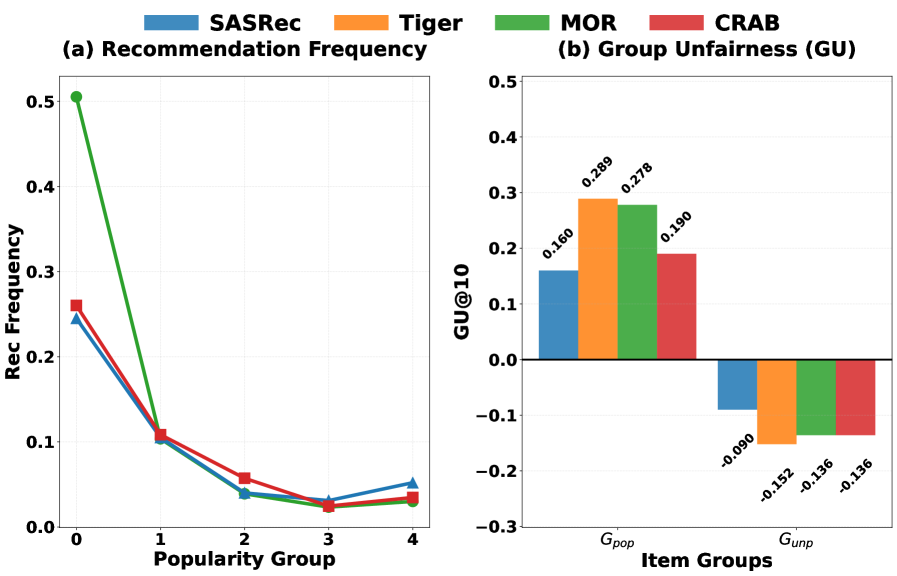
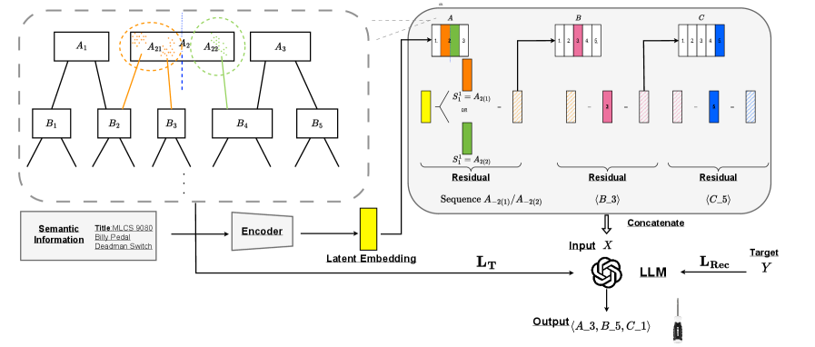
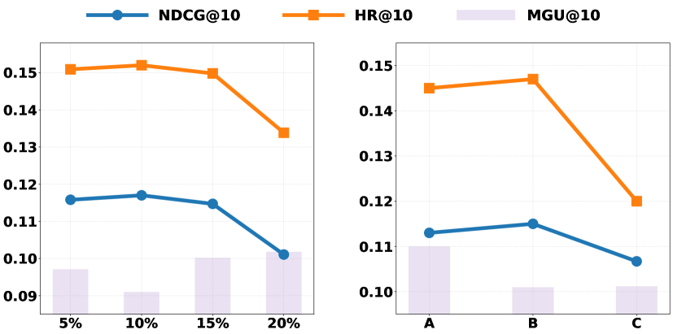
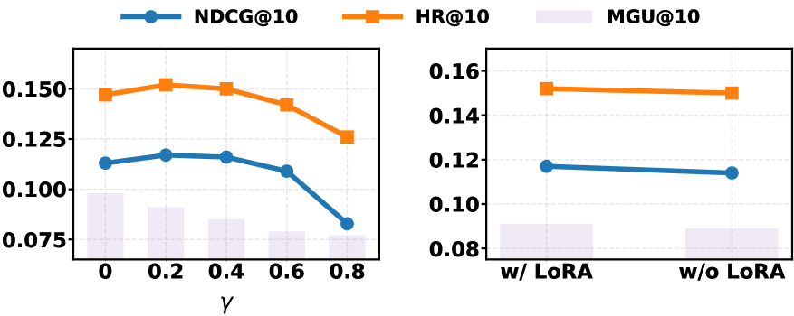

# CRAB: Codebook Rebalancing for Bias Mitigation in Generative Recommendation

**Authors:** (Walmart/academic research team)

**Affiliations:** Walmart / Academic Research

**Paper:** https://arxiv.org/abs/2604.05113

**PDF:** attachment/2604.05113_CodebookRebalancingGenRec.pdf

**Submitted:** April 7, 2025

---

## Abstract

Generative recommendation (GeneRec) has introduced a new paradigm that represents items as discrete semantic tokens and predicts items in a generative manner. Despite its strong performance across multiple recommendation tasks, existing GeneRec approaches still suffer from severe popularity bias and may even exacerbate it.

Comprehensive empirical analysis reveals two core insights:
1. **Imbalanced tokenization** inherits and can further amplify popularity bias from historical item interactions
2. **Current training procedures** disproportionately favor popular tokens while neglecting semantic relationships among tokens, thereby intensifying popularity bias

We propose **CRAB**, a post-hoc debiasing strategy for GeneRec that reduces popularity bias by rebalancing semantic token frequencies:
- **Codebook Rebalancing:** Identify and split over-popular tokens while preserving the overall hierarchical structure of the codebook
- **Hierarchical Semantic Alignment:** Introduce a hierarchical regularizer to enhance semantic consistency for unpopular tokens

**Results:** CRAB reduces popularity bias by 16.5% while maintaining competitive recommendation performance, with training time only 1/11 of reweighting-based approaches.

---

## 1. Introduction

GeneRec tends to recommend popular items more frequently than traditional methods. Compared with SASRec, the recommendation frequency of popular items increases by:
- **+6.7%** for Mini-OneRec (MOR)
- **+7.2%** for TIGER

While the frequency for unpopular items decreases by 3.8% and 4.1% respectively.

**Why existing debiasing methods fail:** Existing LLM-based debiasing (Reweighting, Reranking, D2LR) focus solely on mitigating bias at the model level, while overlooking the bias inherited and amplified by over-popular tokens in the codebook.

**Key finding:** The GU (Group Unfairness) gap between popular and unpopular token groups reaches 0.42 on MOR, indicating items associated with popular tokens receive disproportionately higher exposure — **1.8× that of SASRec**.

---

## 2. Background and Preliminaries

### 2.1. Residual Quantization (RQ-KMeans)

For each item $i$, text description → frozen encoder → continuous embedding $\boldsymbol{z}_i$. Quantize using $L$ hierarchical levels:

$$s_i^l = \arg\min_k \|\boldsymbol{r}_i^l - c_k^l\|^2, \quad \boldsymbol{r}_i^{l+1} = \boldsymbol{r}_i^l - \boldsymbol{c}_{s_i^l}^l$$

At each level, codeword $\boldsymbol{c}_k^l$ = centroid of the $k$-th cluster from K-means on residuals.

Result: Each item $i$ → tuple of $L$ codes = Semantic ID (SID).

### 2.2. Autoregressive Generation

Input sequence $\boldsymbol{X}$ = flattened SID tokens, target $\boldsymbol{Y}$ = next item's SID:

$$\boldsymbol{X} = [\underbrace{s_1^1, s_1^2, \ldots, s_1^L}_{i_1}, \ldots, \underbrace{s_T^1, s_T^2, \ldots, s_T^L}_{i_T}], \quad \boldsymbol{Y} = [\underbrace{s_{T+1}^1, s_{T+1}^2, \cdots s_{T+1}^L}_{i_{T+1}}]$$

Training objective:
$$\mathcal{L}_{Rec} = -\sum_{l=1}^L \log F(\boldsymbol{Y}_l \mid \boldsymbol{X}, \boldsymbol{Y}_{<l})$$

---

## 3. Motivation: Why Codebook Causes Popularity Bias

**Token popularity score:**
$$P(c_k^l) = \sum_{i \in \mathcal{I}_{c_k^l}} f_i, \quad \mathcal{I}_{c_k^l} = \{i \in \mathcal{I} \mid s_i^l = c_k^l\}$$

Token categories:
- **$T_{pop}$:** Top 5% popular tokens
- **$T_{neu}$:** 5%–95% neutral tokens
- **$T_{unp}$:** Bottom 5% unpopular tokens

**Mechanism:** Semantically similar items → same token. When such items are popular, interactions accumulate on that token, further increasing its frequency. The LLM then becomes biased toward generating items associated with these dominant tokens, **amplifying popularity bias**.

---

## 4. Method

CRAB has two stages: (1) Codebook Rebalancing, (2) Hierarchical Semantic Alignment.

### 4.1. Rebalancing the Codebook

**Parent–child relation:** Token $c_k^l \to c_j^{l+1}$ if at least one item has $l$-th token $c_k^l$ and $(l+1)$-th token $c_j^{l+1}$.

**Children set:** $\mathrm{Ch}(c_k^l) = \{c_j^{l+1} \in \mathcal{C}^{l+1} \mid c_k^l \to c_j^{l+1}\}$

**Key constraint:** Items sharing the same $(l+1)$-th level semantic token must be assigned to the same new parent token. This preserves semantic integrity at the finer level.

**Balanced loss:**
$$P(c_{k(m)}^l) = \sum_{j=1}^{|\mathrm{Ch}(c_k^l)|} \boldsymbol{z}_j[m] P(c_j^{l+1}), \quad \mathcal{L}_{bal} = \sum_{m=1}^M (P(c_{k(m)}^l) - \bar{P})^2$$

**Regularized K-means formulation:**

$$\min_{\boldsymbol{z}} \sum_{m=1}^M \sum_{j=1}^{\mathrm{Ch}(c_k^l)} \boldsymbol{z}_j[m] n_j \|\mathbf{\bar{r}}_j^l - \bar{\mathbf{\mu}}_m\|^2 + \lambda \mathcal{L}_{bal}$$

$$\text{s.t.} \quad \boldsymbol{z}_j[m] \in \{0,1\}, \quad \sum_{m=1}^M \boldsymbol{z}_j[m] = 1, \quad \forall c_j^{l+1} \in \mathrm{Ch}(c_k^l)$$

where $\mathbf{\bar{r}}_j^l$ = mean residual of items $i \in \mathcal{I}_{c_j^{l+1}}$ at level $l$, $\bar{\mathbf{\mu}}_m$ = centroid of newly formed cluster.

The objective is derived from K-means variance decomposition — since all items in $\mathcal{I}_{c_j^{l+1}}$ are assigned to same cluster, the within-cluster variance is constant, reducing optimization to the between-cluster term.

**For RQ-VAE** (where a child token may have multiple parents), the popularity formula is revised to aggregate frequencies only over items associated with both tokens.

**Implementation:**
- Splitting ratio: top 10% popular tokens at each level
- Number of new tokens $M$: determined by frequency ratio of target to average token (upper bound $M \leq 3$)
- Efficiently optimized using the regularized K-means framework of Raymaekers & Zamar (2022)

### 4.2. Hierarchical Semantic Alignment

After splitting, $M$ new tokens are introduced. To adapt the LLM to the rebalanced codebook, a **tree-structure-aware regularizer** promotes representation consistency among tokens sharing the same parent:

$$\mathcal{L}_T = \sum_{l=1}^{L-1} \sum_{k=1}^{|\mathcal{C}^l|} \frac{1}{|\mathrm{Ch}(c_k^l)|} \sum_{c \in \mathrm{Ch}(c_k^l)} \|e(c) - \bar{e}_k^l\|_2^2$$

where $e(c)$ = LLM embedding of token $c$, $\bar{e}_k^l$ = mean embedding of child tokens of $c_k^l$.

**Two purposes:**
1. Enhancing under-represented tokens via supervision from semantically related siblings
2. Enabling efficient knowledge transfer to newly introduced tokens after rebalancing

### 4.3. Model Optimization

$$\mathcal{L} = \mathcal{L}_{Rec} + \gamma \mathcal{L}_T$$

Implementation:
- Update embedding layers for both existing and newly introduced tokens
- LoRA adapters applied only to attention layers (for efficiency)
- Backbone: Qwen2-0.5B; 4× NVIDIA A100 GPUs; 10 epochs
- AdamW optimizer; lr = 1×10⁻⁴; weight decay 0.01
- LoRA: rank $r=8$, $\alpha=16$

---

## 5. Experiments

### 5.1. Datasets

| Dataset | Description |
|---------|-------------|
| **Industrial** | Internal industrial dataset |
| **Office** | Amazon Office dataset (≥5 interactions per user/item, 8:1:1 split) |

### 5.2. Baselines

Backbone generative models:
- **TIGER** (Rajput et al., 2023)
- **MiniOneRec (MOR)** (Kong et al., 2025)

Debiasing methods atop MOR:
- **Reweighting (RW):** Balances loss contribution via item popularity
- **Reranking (RR):** Penalizes popular items during post-processing
- **D2LR:** Propensity score weighting for LLMs

### 5.3. Evaluation Metrics

- **HR@K, NDCG@K:** Recommendation performance
- **DGU@K, MGU@K:** Bias amplification (Group Unfairness)
  - $\text{GU} = $ discrepancy between recommendation exposure and historical interaction frequency
- **Training time**

### 5.4. Overall Performance

| Dataset | Metric | MOR | Tiger | RW | RR | D2LR | CRAB |
|---------|--------|-----|-------|----|----|------|------|
| Industrial | HR@10↑ | 0.152 | 0.132 | 0.126 | 0.141 | 0.147 | **0.152** |
| | NDCG@10↑ | 0.116 | 0.090 | 0.070 | 0.107 | 0.113 | **0.117** |
| | DGU@10↓ | 0.418 | 0.423 | 0.367 | 0.406 | 0.410 | **0.356** |
| | MGU@10↓ | 0.109 | 0.112 | 0.105 | 0.109 | 0.106 | **0.091** |
| | Time(h)↓ | — | — | 3.11 | 0.21 | 2.75 | **0.28** |
| Office | HR@10↑ | 0.161 | 0.137 | 0.131 | 0.146 | 0.153 | **0.160** |
| | NDCG@10↑ | 0.122 | 0.100 | 0.090 | 0.119 | 0.119 | **0.122** |
| | DGU@10↓ | 0.423 | 0.427 | 0.386 | 0.410 | 0.414 | **0.368** |
| | MGU@10↓ | 0.111 | 0.113 | 0.108 | 0.110 | 0.110 | **0.093** |

**Key results:**
- CRAB **matches MOR** in recommendation performance while **significantly reducing bias**
- DGU reduction: **14.8%** vs MOR, **13.2%** vs D2LR
- MGU reduction: **16.5%** vs MOR, **14.2%** vs D2LR
- RW also mitigates bias but causes severe performance degradation
- CRAB: training time = **~1/11 of RW, ~1/10 of D2LR**

### 5.5. In-depth Analysis

#### Impact of Splitting Ratio

Optimal range: < 10% tokens at each level.
- Splitting small fraction: smooths token popularity + enhances long-tail representation
- Over-splitting: disrupts semantic integrity → performance degradation

#### Impact of Splitting Position

Splitting at **level B (intermediate)** improves representation while significantly mitigating bias.
- Consistent with the "Hourglass" phenomenon (Kuai et al., 2024): intermediate-level tokens concentrate excessive semantic information
- Splitting only the last level: hurts performance (fine-grained semantics already captured)

#### Ablation: Hyperparameter γ

- $\gamma \leq 0.2$: recommendation performance stable
- $\gamma > 0.2$: NDCG drops sharply → use $\gamma = 0.2$
- Removing LoRA: noticeable drops in both NDCG and HR

---

## 6. Related Work

- **GeneRec:** TIGER, MiniOneRec, OneRec, MTGR (Meituan)
- **Debiasing in Recommendation:** Reweighting, Reranking, D2LR (propensity scores for LLMs)
- **Balanced Codebook Construction:** Kuai et al. 2024 (Hourglass phenomenon), OneRec (item count constraint per token)
- **CRAB difference from balanced codebooks:** Other works constrain the number of items assigned per token to prevent concentrated mappings; CRAB addresses token **popularity driven by historical interactions**

---

## 7. Conclusion

CRAB presents the first systematic investigation of popularity bias in GeneRec:
1. Demonstrates imbalanced codebooks give rise to over-popular tokens, exacerbating popularity bias
2. Post-hoc two-stage framework:
   - Codebook Rebalancing: regularized K-means to split over-popular tokens while preserving hierarchy
   - Hierarchical Semantic Alignment: tree-structure-aware regularizer for representation consistency
3. Reduces popularity bias by 16.5% while maintaining competitive performance
4. Training time ≈ 1/11 of reweighting-based approaches
