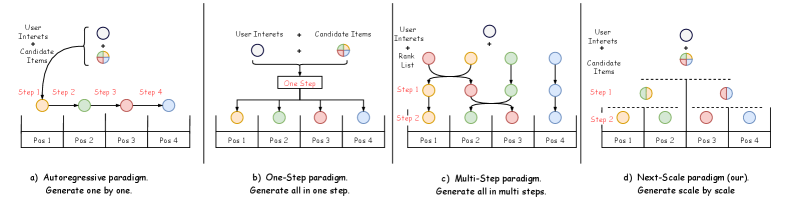
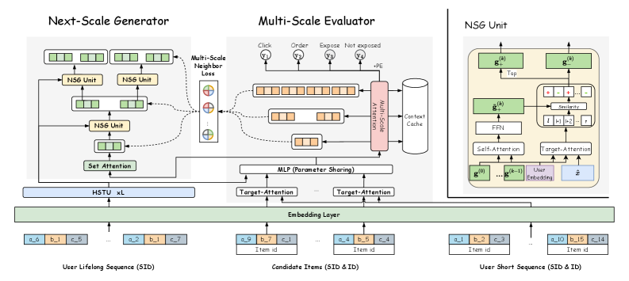
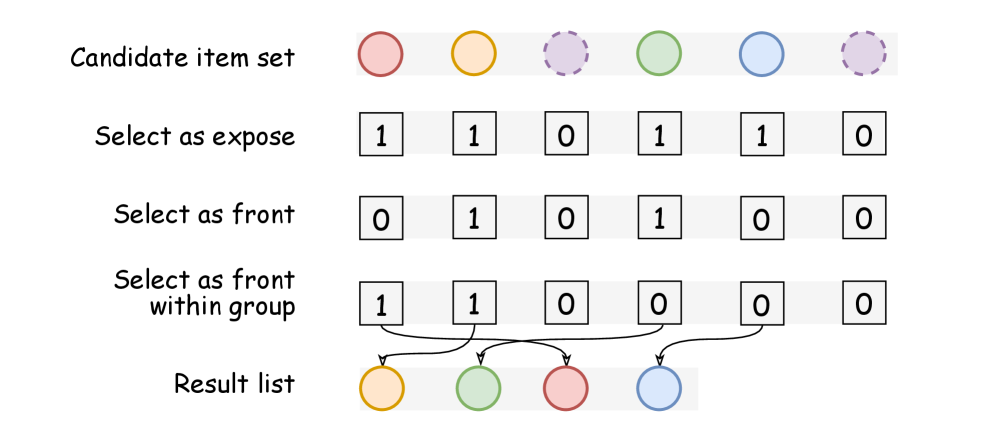
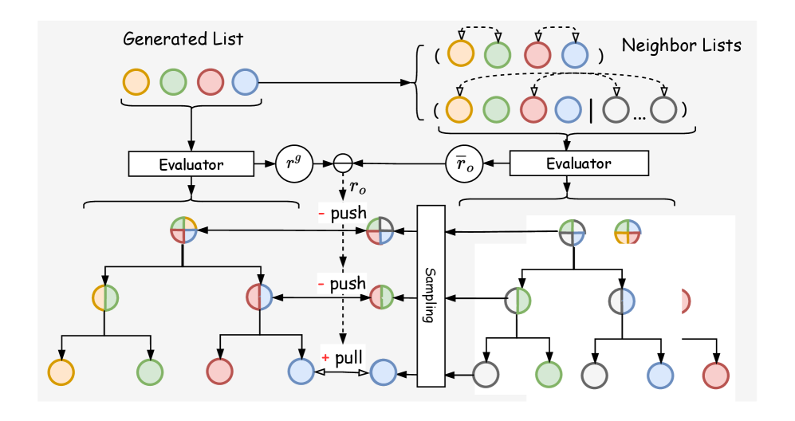
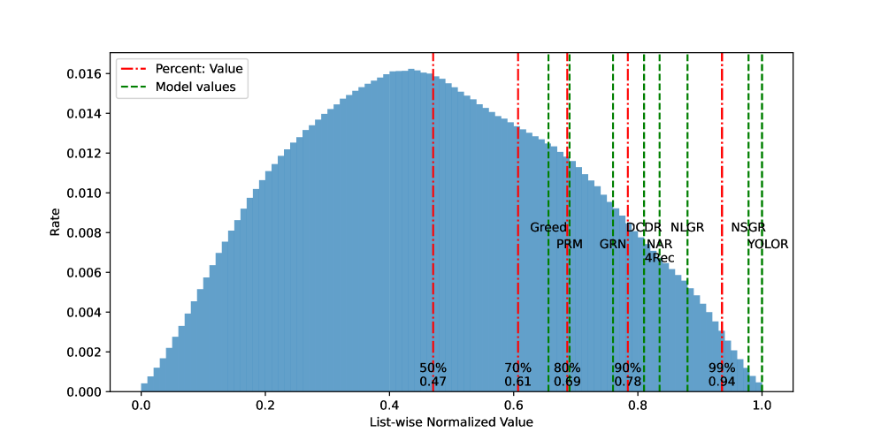
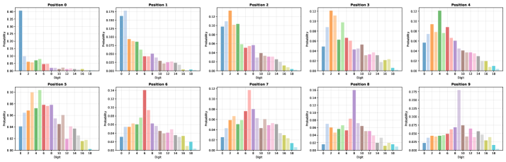
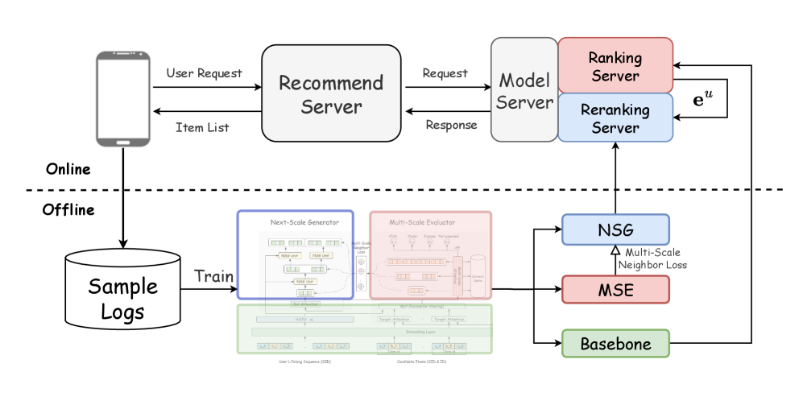

# Next-Scale Generative Reranking: A Tree-based Generative Rerank Method at Meituan

**Authors:** (Meituan research team)

**Affiliations:** Meituan

**Paper:** https://arxiv.org/abs/2604.05314

**PDF:** attachment/2604.05314_NextScaleGenReranking.pdf

**Submitted:** April 7, 2025

---

## Abstract

In modern multi-stage recommendation systems, reranking plays a critical role by modeling contextual information. Due to inherent challenges such as the combinatorial space complexity, an increasing number of methods adopt the generative paradigm: the generator produces the optimal list during inference, while an evaluator guides the generator's optimization during the training phase. However, these methods still face two problems:
1. Generators fail to produce optimal results due to the lack of **both local and global perspectives**, regardless of whether the generation strategy is autoregressive or non-autoregressive
2. The **goal inconsistency** problem between the generator and the evaluator during training complicates the guidance signal, leading to suboptimal performance

We propose **NSGR** (Next-Scale Generation Reranking), a tree-based generative framework that:
- Introduces **NSG** (Next-Scale Generator): progressively expands a recommendation list from user interests in a coarse-to-fine manner, balancing global and local perspectives
- Designs **multi-scale neighbor loss**: leverages a tree-based **MSE** (Multi-Scale Evaluator) to provide scale-specific guidance to the NSG at each scale

NSGR achieves **+2.89% CTR** and **+3.15% GMV** improvement over the baseline in online A/B test and is deployed on the **Meituan food delivery platform**.

---

## 1. Introduction

Reranking is crucial in multi-stage recommendation systems (matching → ranking → reranking) as it models contextual information and optimizes listwise utility.

**Three paradigms of generative reranking:**
- **(a) Autoregressive:** Left-to-right item generation (Seq2Slate, DLCM, GRN, PRM) — time-consuming, limited by lack of global perspective
- **(b) One-step:** Generates positional probability matrix in single step (NAR4Rec, GREF) — lacks local perspective, coarse generation
- **(c) Multi-step:** Starts with initial list, iteratively swaps 1-2 items (DCDR, NLGR) — susceptible to local optima due to non-monotonic permutation space

**Goal inconsistency problem:** Generator seeks optimal list; evaluator estimates listwise scores. NLGR partially addressed this via relative scores of neighboring lists, but its approach is limited to multi-step paradigm and still susceptible to local optima.

**NSGR's approach:** "One-generates-two, two-generate-four" — a novel **(d) next-scale paradigm** that balances global and local perspectives via coarse-to-fine tree expansion.

---

## 2. Related Work

### 2.1. Reranking Methods

**Generator-based:**
- **Seq2Slate:** Pointer network for sequential order determination
- **PRM, DLCM:** Self-attention on initial ranked list, output per-item scores
- **MIR:** Permutation-equivariant module for set-to-list interactions
- Common limitation: "evaluation-before-reranking" problem

**Evaluator-based:**
- **PRS:** Beam search for candidate permutations + permutation-wise scoring
- **PIER:** SimHash for top-K candidate selection
- **YOLOR:** Tree-based enumeration with context cache for A₈⁸ permutation space exhaustive evaluation

### 2.2. Generative Reranking Solutions

- **ListCVAE:** CVAE capturing positional biases and list distribution dependencies
- **GRN:** Evaluator-generator framework replacing greedy strategy — still has evaluation-before-reranking problem
- **DCDR:** Discrete conditional diffusion reranking framework
- **NAR4Rec:** Non-autoregressive generative model for reranking
- **NLGR:** Neighbor loss-guided generator training — limited to multi-step paradigm
- **Core unresolved issue:** Generator-evaluator consistency

---

## 3. Problem Definition

Given user $u$ and candidate set $S = \{x_1, x_2, \ldots, x_n\}$, the reranking model selects an ordered list $L = \{x_1, x_2, \ldots, x_m\}$ ($m \leq n$) from $\mathcal{O}(A_n^m)$ candidate space.

**Evaluator objective:**
$$E^* = \arg\min_E \mathcal{L}(E(u, L), \mathcal{R}(u, L))$$

**Generator objective:**
$$G^* = \arg\max_G E^*(G(u, S)), \quad L^* = G^*(u, S)$$

---

## 4. Proposed Method

NSGR consists of two core components: Multi-Scale Evaluator (MSE) and Next-Scale Generator (NSG).

### 4.1. Multi-Scale Evaluator (MSE)

The MSE models multi-scale list contextual relationships based on users' semantic interests.

**Step 1: User interest extraction**

Long-term history $\mathcal{H}_u = \{x_1, x_2, \ldots, x_H\}$ → HSTU (Hierarchical Sequential Transduction Unit, from actions-speak-louder) with SID (3-level semantic ID from TIGER/DAS/RPG):
$$\mathbf{e}_u = \text{AvgPool}(\text{HSTU}(\mathcal{H}_u))$$

Pre-computed offline for efficiency.

**Step 2: Item semantic enrichment**

Candidate items $\mathbf{X} = \{\mathbf{x}_1, \ldots, \mathbf{x}_n\} \in \mathbb{R}^{n \times D}$, recent short-term behaviors $\mathcal{H}_u^{short}$:
$$\mathbf{x}_i^s = \text{MLP}(\mathbf{x}_i \| \text{TA}(\mathbf{x}_i, \mathcal{H}_u^{short}) \| \mathbf{e}^u \| \mathbf{e}^o)$$

**Step 3: Multi-scale context extraction**

For position $t$, extract context at $K = \log_2 m$ scales without position encoding (for reusability):

$$\mathbf{e}_t^{(1)} = \mathbf{e}_{1,m} = \text{SA}(\mathbf{x}_1^s, \ldots, \mathbf{x}_m^s)$$
$$\mathbf{e}_t^{(2)} = \mathbf{e}_{1,m/2} = \text{SA}(\mathbf{x}_1^s, \ldots, \mathbf{x}_t^s, \ldots, \mathbf{x}_{m/2}^s)$$
$$\vdots$$
$$\mathbf{e}_t^{(K)} = \mathbf{e}_{t,t+1} = \text{SA}(\mathbf{x}_t^s, \mathbf{x}_{t+1}^s)$$

Multi-scale context: $\mathbf{x}_t^c = [\mathbf{e}_t^{(1)}; \mathbf{e}_t^{(2)}; \ldots; \mathbf{e}_t^{(\log_2 m)}]$

**Step 4: Position-aware CTR prediction**

$$\hat{y}_t = \sigma\left(\text{MLP}\left(\underbrace{\mathbf{x}_t^s}_{\text{semantics}} \| \underbrace{\mathbf{x}_t^c}_{\text{context}} \| \underbrace{\mathbf{e}_t^p}_{\text{position}}\right)\right)$$

**List-level value:**
$$\hat{y}_L = \sum_{t=1}^m \hat{y}_t$$

Flexible adjustment to CTR, CVR, GMV metrics by changing the label $y_t$.

### 4.2. Next-Scale Generator (NSG)

NSG generates the optimal list via hierarchical coarse-to-fine tree traversal. At each step $k$, operates on subset $S_{l:r}^{(k)} = \{\mathbf{x}_l^s, \ldots, \mathbf{x}_r^s\}$ and splits into two child subsets.

**Sub-step 1: Item Priority**
$$p_i^{(k)} = \text{MLP}_p(\mathbf{x}_i^s) \in \mathbb{R}$$

**Sub-step 2: Pairwise Relationship Classification**

Each ordered pair $(i,j)$ classified into competitive suppression, complementary enhancement, or neutral coexistence:
$$\mathbf{r}_{ij}^{(k)} = [r_{ij}^{\text{sup}}, r_{ij}^{\text{enh}}, r_{ij}^{\text{neu}}] = \text{softmax}(\text{MLP}_{\text{rel}}([\mathbf{x}_i^s; \mathbf{x}_j^s; \mathbf{x}_i^s - \mathbf{x}_j^s; \mathbf{x}_i^s \odot \mathbf{x}_j^s]))$$

**Sub-step 3: Asymmetric Influence Weight**
$$w_{ij} = -r_{ij}^{\text{sup}} \cdot \text{ReLU}(p_i - p_j) + r_{ij}^{\text{enh}} \cdot \frac{p_i + p_j}{2}$$

Suppression is asymmetric (higher priority suppresses lower); enhancement is symmetric.

**Sub-step 4: Set-Conditioned Item Refinement**
$$\hat{x}_j^s = \mathbf{x}_j^s + W_\Delta \text{MLP}_{\text{set}}([\mathbf{x}_j^s; \sum_{i \neq j} w_{ij}^{(k)} \mathbf{x}_i^s; g^{(k-1)}])$$

**Sub-step 5: Item-to-Tree Attention Scoring**

Global anchor vector (aggregates history of tree nodes):
$$\tilde{g}^{(k)} = \text{FFN}(\text{SA}(e_u \| g^{(0)} \| \cdots \| g^{(k-1)}))$$

Per-item personalized context:
$$a_j^{(k)} = \text{TA}(\hat{x}_j^s, [e_u \| g^{(0)} \| \cdots \| g^{(k-1)}])$$

Relevance score:
$$\text{Sim}_j^{(k)} = \text{MLP}_{\text{score}}([\hat{x}_j^s; a_j^{(k)}; \tilde{g}^{(k)}])$$

**Sub-step 6: Binary Split**

Split subset by ranking $\text{Sim}_j^{(k)}$:
$$\text{Flag}_+^{(k)} = \mathbf{1}[\text{rank}(j) < \frac{r-l}{2}]$$
$$g_+^{(k)} = \text{AvgPool}(\hat{x}_j^s \cdot \text{Flag}_+^{(k)}), \quad g_-^{(k)} = \text{AvgPool}(\hat{x}_j^s \cdot (1 - \text{Flag}_+^{(k)}))$$

Process recurses for $K = \log_2 m$ steps.

**Final Ranking:** Aggregate $\text{Flag}_+^{(k)}$ masks from all tree traversal steps.

### 4.3. Training with Multi-Scale Neighbor Loss (MSNL)

#### MSE Training

Trained with binary cross-entropy on real online logs (exposure, click, conversion):
$$\mathcal{L}_E = -\sum_{t=1}^m [y_t \log(\hat{y}_t) + (1-y_t)\log(1-\hat{y}_t)]$$

#### NSG Training: Multi-Scale Neighbor Loss

To address goal inconsistency, MSNL constructs relative rewards for generator training.

**Step 1: Collect neighbor lists at multiple scales**

For a list $L^g$ generated by NSG, construct $O$ neighbor lists $\overline{L} = \{\overline{L}_1, \ldots, \overline{L}_O\}$ by:
- Swapping positions of items within $L^g$
- Swapping positions between items in $L^g$ and other candidates

**Step 2: Evaluate with MSE**

$r^g$ = MSE score of $L^g$; $\overline{r} = \{\overline{r}_1, \ldots, \overline{r}_O\}$ = MSE scores of neighbor lists

Relative reward:
$$r_o = \overline{r}_o - r^g, \quad \forall o \in [O]$$

**Step 3: Multi-scale contrastive loss**

Since NSG and MSE share similar tree structures, MSE's $\mathbf{e}^{(k)}$ can directly guide NSG's $\mathbf{g}^{(k)}$:

$$\mathcal{L}_G = -\sum_{k=1}^K \sum_{o=1}^O \log \frac{\mathbb{1}_{r_o > 1} r_o \cdot \exp(\mathbf{g}_o^{(k)\top} \mathbf{e}_o^{(k)} / \tau)}{\sum_{o=1}^O \mathbb{1}_{r_o < 1} \exp(\mathbf{g}_o^{(k)\top} \mathbf{e}_o^{(k)} / \tau)}$$

MSE parameters frozen during NSG training. HSTU pre-trained with Next-Token Prediction.

Note: Multi-scale vectors of neighbor lists can be cached to avoid repeated calculations.

---

## 5. Experiments

### 5.1. Datasets

| Dataset | #Users | #Items | #Records |
|---------|--------|--------|----------|
| Taobao Ad | 1,141,729 | 99,815 | 26,557,961 |
| Meituan | 5,685,119 | 17,264,613 | 242,549,848 |

- **Taobao Ad:** 8-day data, first 7 days training, last 1 day test. Features: user ID, timestamp, behavior type, item brand ID, category ID. Four behavior types: browse, cart, like, buy.
- **Meituan:** 15-day data from food delivery platform (August 2025), 14 days training + 1 day test. 239 features, three labels: expose, click, conversion. All items on same page = one list-level record.

### 5.2. Baselines

- **Group I (Autoregressive):** PRM, GRN
- **Group II (One-step):** NAR4Rec
- **Group III (Multi-step):** DCDR, NLGR
- **Group IV (Evaluator-based):** YOLOR (tree-based enumeration with A₈⁸ space)

### 5.3. Evaluation Metrics

- **Offline:** AUC, GAUC (per-list average AUC)
- **Generator consistency:** HR@1%, HR@10% (proportion of requests where generated list is in top 1%/10% of 1000 randomly sampled permutations)
- **Online:** CTR, CVR, GMV, Time-cost (ms)

### 5.4. Evaluator Performance

**Table: Taobao Ad Dataset**

| Model | AUC | GAUC | Loss |
|-------|-----|------|------|
| PRM | 0.6052 | 0.8163 | 0.1842 |
| GRN | 0.6101 | 0.8209 | 0.1820 |
| NAR4Rec | 0.6306 | 0.8288 | 0.1786 |
| DCDR | 0.6217 | 0.8288 | 0.1792 |
| NLGR | 0.6344 | 0.8311 | 0.1752 |
| YOLOR | 0.6351 | 0.8323 | 0.1743 |
| **NSGR** | **0.6396** | **0.8389** | **0.1713** |

**Table: Meituan Dataset**

| Model | AUC | GAUC | Loss |
|-------|-----|------|------|
| PRM | 0.8595 | 0.8573 | 0.1008 |
| GRN | 0.8643 | 0.8598 | 0.1001 |
| NAR4Rec | 0.8711 | 0.8636 | 0.0957 |
| DCDR | 0.8695 | 0.8616 | 0.0977 |
| NLGR | 0.8732 | 0.8644 | 0.0946 |
| YOLOR | 0.8749 | 0.8669 | 0.0932 |
| **NSGR** | **0.8902** | **0.8829** | **0.0842** |

NSGR achieves **+0.0153 AUC** and **+0.0160 GAUC** on Meituan — significant improvement in industrial systems.

### 5.5. Generator Consistency (A₂₀²⁰ space)

**Table: HR@1% and HR@10% on Meituan (A₂₀²⁰ space)**

| Model | HR@1% | HR@10% |
|-------|-------|--------|
| PRM | 0.510 | 0.691 |
| GRN | 0.632 | 0.844 |
| NAR4Rec | 0.658 | 0.897 |
| NLGR | 0.784 | 0.916 |
| YOLOR | 0.822 | 0.943 |
| **NSGR** | **0.861** | **0.987** |

**A₈⁸ space detailed analysis (2,000 users):**

- Value distribution in permutation space ≈ normal distribution
- Greedy ordering (based on ranking scores) achieves 0.66 — large reranking headroom
- **NSGR achieves 0.978** (YOLOR = optimal 1.0 only because exhaustive evaluation is feasible in A₈⁸)

**Proximity to optimal list:**

| Model | Same | Diff₂ | Diff₃ | Diff₄ |
|-------|------|-------|-------|-------|
| NSGR | 0.689 | 0.909 | 0.933 | 0.968 |

NSGR's generated list differs from optimal by at most 2 items in **90.9%** of cases.

### 5.6. Position Analysis

Three observations:
1. Each position predominantly retains its originally top-ranked item (positional inertia)
2. Allocation probabilities decay with positional displacement (distance-decay relationship)
3. Distribution flattens in posterior positions (diminishing marginal returns — earlier positions yield greater utility)

### 5.7. Ablation Study

| Variant | AUC | GAUC | HR@1% |
|---------|-----|------|-------|
| w/o SID | 0.8761 | 0.8692 | 0.834 |
| w/o MSEU | 0.8835 | 0.8742 | 0.846 |
| w/o NSGU | 0.8902 | 0.8829 | 0.796 |
| w/o MSNL | 0.8902 | 0.8829 | 0.772 |
| **NSGR** | **0.8902** | **0.8829** | **0.861** |

Key findings:
- SID removal: significant drop in both evaluator and generator
- MSE unit critical for evaluator (multi-scale context > single global attention)
- NSG unit vital for generator's HR without affecting evaluator AUC/GAUC
- MSNL removal causes the largest HR drop → essential for generator consistency

### 5.8. Hyperparameter Analysis

| | τ=0.01 | τ=0.1 | τ=0.5 | τ=1.0 | τ=2.0 |
|-|--------|-------|-------|-------|-------|
| HR@1% | 0.842 | **0.861** | 0.858 | 0.851 | 0.849 |
| HR@10% | 0.977 | **0.987** | 0.983 | 0.980 | 0.979 |

| | β=0.1 | β=0.5 | β=1 | β=2 | β=5 |
|-|-------|-------|-----|-----|-----|
| HR@1% | 0.823 | 0.842 | 0.859 | **0.861** | 0.860 |
| HR@10% | 0.951 | 0.975 | 0.986 | **0.987** | 0.987 |

β=1: each position contributes one neighbor. Increasing β improves HR but increases training cost. Performance plateaus at β≥2.

### 5.9. Online A/B Test

NSGR deployed on Meituan CPS business. Key efficiency: **NSGR reuses `eᵤ` and `xˢ` from the ranking model**, reducing computation and improving link consistency.

**8-week A/B test (August–October 2025):**
- NSGR: 30% traffic
- Baseline: YOLOR(8) with A₈⁸ space — 70% traffic

| Method | CTR | CVR | GMV | Cost (ms) |
|--------|-----|-----|-----|-----------|
| NSGR (8) | -0.42% | -0.18% | -1.02% | -2.1 |
| **NSGR (20)** | **+2.89%** | **+0.58%** | **+3.15%** | **-1.4** |

Key finding: Scaling candidates from 8 to 20 items (A₂₀²⁰ space) is critical — NSGR (8) slightly underperforms YOLOR(8) but NSGR (20) significantly outperforms.

NSGR is now **serving millions of users** on the Meituan food delivery platform.

---

## 6. Conclusion

NSGR addresses two fundamental challenges in generative reranking:
1. **Local-global balance:** NSG's tree-based coarse-to-fine generation — "one-generates-two, two-generate-four" — provides both global user interest modeling and local pairwise interaction modeling
2. **Goal consistency:** Multi-scale neighbor loss (MSNL) leverages MSE's multi-scale tree structure to provide scale-specific guidance during training

The framework is deployed at Meituan scale and achieves +2.89% CTR and +3.15% GMV gains.
