# Semantic Trimming and Auxiliary Multi-step Prediction for Generative Recommendation

**Authors:** (Alibaba research team)

**Affiliations:** Alibaba Group

**Paper:** https://arxiv.org/abs/2604.05329

**PDF:** attachment/2604.05329_SemanticTrimmingGenRec.pdf

**Submitted:** April 7, 2025

---

## Abstract

Generative Recommendation (GR) has recently transitioned from atomic item-indexing to **Semantic ID (SID)-based** frameworks to capture intrinsic item relationships and enhance generalization. However, the adoption of high-granularity SIDs leads to two critical challenges:
1. **Prohibitive training overhead** due to sequence expansion
2. **Unstable performance reliability** characterized by non-monotonic accuracy fluctuations

We identify that these issues are rooted in the **Semantic Dilution Effect**: redundant tokens waste massive computation and dilute the already sparse learning signals in recommendation.

We propose **STAMP** (Semantic Trimming and Auxiliary Multi-step Prediction):
- **SAP** (Semantic Adaptive Pruning): dynamically filters redundancy during forward pass, converting noise-laden sequences into compact information-rich representations
- **MAP** (Multi-step Auxiliary Prediction): employs multi-token objective to densify feedback, strengthening long-range dependency capture

**Results:** 1.23–1.38× speedup, 17.2%–54.7% VRAM reduction, while maintaining or improving performance across multiple architectures.

---

## 1. Introduction

SID-based Generative Recommendation (SID-GR) decomposes each item ID into a sequence of SIDs, enabling knowledge transfer among semantically similar items via shared vocabulary.

**Two critical limitations:**
1. **High resource consumption:** Expanding an item ID into $L$ SIDs increases sequence length from $N$ to $N \times L$, causing quadratic growth in VRAM and training time
2. **Large performance fluctuations:** The relationship between SID granularity and recommendation accuracy is **non-monotonic** and inconsistent across models/datasets

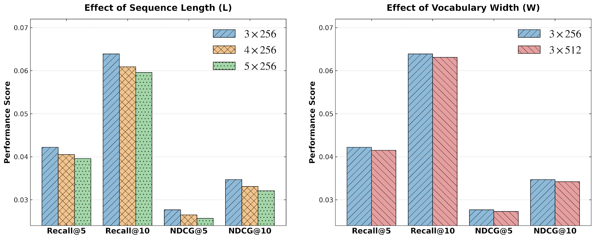

**Root cause — Semantic Dilution Effect:** User intent is typically driven by a sparse subset of critical tokens; the rest is harmful redundancy. This redundancy causes:
- **Information Non-uniformity:** redundant tokens waste computation
- **Supervision Sparsity:** sparse feedback from recommendation makes it hard to distinguish pivotal features from noise

---

## 2. Preliminaries

### 2.1. SID-based Generative Recommendation

**SID Construction (two-stage):**
$$s_i = \mathcal{T}(i) = \text{RQ}(h_i) = [c_{i,1}, c_{i,2}, \ldots, c_{i,L}]$$

where $h_i$ is the semantic embedding of item $i$ (e.g., encoded by Flan-T5-XL), and $\text{RQ}(\cdot)$ is a hierarchical residual quantization function (e.g., RQ-VAE or RQ-Kmeans).

**Training input:** $X = [\mathcal{T}(i_1), \ldots, \mathcal{T}(i_t)]$, total length $N = t \times L$

**Training objective:**
$$\mathcal{L}_{\text{NTP}} = -\sum_{j=1}^L \log P(y_j | X, y_{<j}; \theta)$$

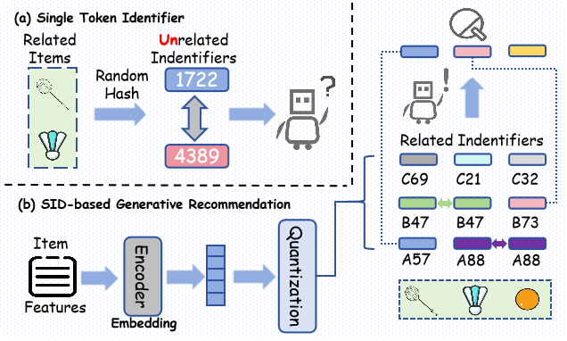

### 2.2. Finding 1: Information Non-uniformity

**Two types of SID redundancy:**
1. **Feature-level Redundancy:** User intent driven by subset of key semantic features (e.g., Brand only, not fine-grained Attribute)
2. **Sequence-level Redundancy:** Semantic overlaps among SIDs (different items sharing identical SIDs like the same brand)

SID's hierarchical decomposition provides natural structural foundation for pruning.

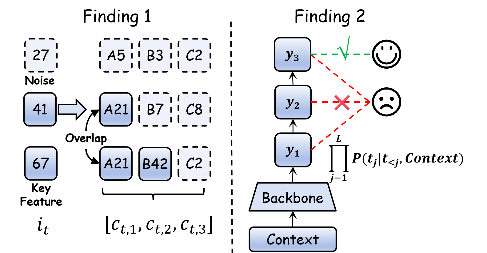

### 2.3. Finding 2: Supervision Sparsity

Valid training signals come **only from the ground-truth item at the end of the sequence**. Though SID extends prediction to $L$ SIDs, input expands by $L$ too — relative signal density doesn't improve.

Furthermore, correct item prediction requires accurately predicting **all $L$ SID tokens consecutively:**
$$P(\text{Item}) = \prod_{j=1}^L P(y_j | y_{<j}, \text{Context})$$

Error accumulation via chain rule: finer granularity → longer sequences + harder prediction.

---

## 3. Methodology

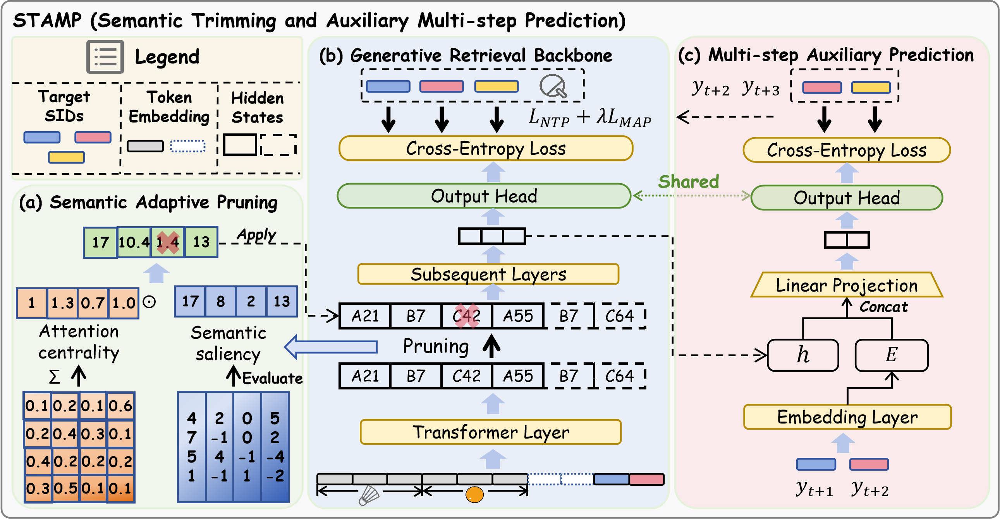

### 3.1. Semantic Adaptive Pruning (SAP)

SAP is inserted at designated layer $l_{\text{prune}}$ during the forward pass, evaluating token utility via two complementary dimensions:

**Semantic Saliency** (feature magnitude):
$$S_{\text{sem}}(i) = \text{Norm}(|\mathbf{h}_i^{(l)}|_1)$$

High-magnitude features typically correlate with significant semantic activation.

**Attention Centrality** (structural importance):
$$S_{\text{attn}}(i) = \sum_{h=1}^{\mathcal{H}} \sum_{j=1}^N \mathbf{A}_{h,j,i}$$

Aggregates attention weights received from all other tokens across all heads. High score = token is a critical information hub.

**Combined importance score:**
$$\mathcal{I}_i = S_{\text{sem}}(i) \times S_{\text{attn}}(i)$$

**Architecture-Adaptive Pruning Execution:**

Retention ratio $\alpha \in (0, 1]$ → keep $|K| = \lfloor \alpha \cdot N \rfloor$ tokens.

For decoder-only architectures (Qwen): protected window $W$ of most recent tokens is mandatorily retained (ensures gradient flow for target prediction). Remaining capacity filled by highest importance tokens.

Order-preserving compression:
$$\mathcal{K}_{\text{sorted}} = \text{Sort}(\mathcal{K}, \text{order=ascending})$$
$$H_{\text{compressed}}^{(l)} = \text{Gather}(H^{(l)}, \mathcal{K}_{\text{sorted}})$$

Reduces sequence length from $N$ to $\alpha \cdot N$ for all subsequent layers.

### 3.2. Multi-step Auxiliary Prediction (MAP)

MAP combats supervision sparsity via **Multi-Token Prediction (MTP)**. Beyond standard next-token prediction, MAP predicts $y_{t+2}$ in parallel with $y_{t+1}$.

**Foresight representation:**
$$\mathbf{h}_t^{mtp} = \text{MLP}(\text{Concat}(\mathbf{h}_t, E(y_{t+1})))$$

Simulates the hidden state at step $t+1$, forcing the backbone to encode features that are sufficient for the current step and transferable to future contexts.

**Shared projection strategy** (reuses same LM_Head):
$$P(y_{t+2} | \mathbf{h}_t, y_{t+1}) = \text{Softmax}(\text{LM\_Head}(\mathbf{h}_t^{mtp}))$$

### 3.3. Optimization Objective

$$\mathcal{L}_{\text{MAP}} = -\sum_{j=1}^{L-1} \log P(y_{j+1} | \mathbf{h}_j, y_j)$$

$$\mathcal{L}_{\text{total}} = \mathcal{L}_{\text{NTP}} + \lambda \cdot \mathcal{L}_{\text{MAP}}$$

**MAP is discarded at inference** → zero latency overhead.

---

## 4. Experiments

### 4.1. Datasets

| Dataset | #Users | #Items | #Interactions |
|---------|--------|--------|---------------|
| Sports | 35.6K | 18.4K | 296.3K |
| Beauty | 22.4K | 12.1K | 198.5K |
| Toys | 19.4K | 11.9K | 167.6K |
| ALGR (AL-GR-Tiny) | 131M | 251M | 14B |

**ALGR:** From Taobao (Alibaba), first industrial-scale benchmark for SID-GR with rich multimodal features (text + images) across 250M+ items.

### 4.2. Backbone Frameworks

- **GRID** (Encoder-Decoder T5): Flan-T5-XL for semantic encoding, RK-Means tokenization with 3 codebooks, T5 Encoder-Decoder (8 layers, hidden=128, 6 heads)
- **FORGE** (Decoder-Only Qwen): Qwen2.5-0.5B-Instruct, max length 1280 tokens (1024 source + 256 target)

### 4.3. Overall Performance on GRID (T5)

**Table: Overall Performance on GRID (T5) over Beauty, Sports, Toys**

| Backbone | Dataset | Method | Recall@5 | Recall@10 | Speedup↑ | VRAM↓ |
|----------|---------|--------|---------|----------|---------|-------|
| GRID (T5) | Beauty | Base | 0.0426 | 0.0645 | — | 22234 MiB |
| | | STAMP (L=2) | **0.0444** | **0.0655** | **1.25×** | **13862 MiB (-37.7%)** |
| | | STAMP (L=1) | 0.0441 | 0.0657 | **1.38×** | 10378 MiB (-53.3%) |
| GRID (T5) | Sports | Base | 0.0234 | 0.0354 | — | 29370 MiB |
| | | STAMP (L=1) | 0.0232 | 0.0354 | 1.36× | 13302 MiB (-54.7%) |
| GRID (T5) | Toys | Base | 0.0345 | 0.0499 | — | 22268 MiB |
| | | STAMP (L=2) | **0.0356** | **0.0503** | 1.24× | 14256 MiB (-36.0%) |

### 4.4. Overall Performance on FORGE (Qwen, Industrial Scale)

| Method | Hit@20 | Hit@100 | Speedup | VRAM Reduction |
|--------|--------|---------|---------|----------------|
| Base | 0.0209 | 0.0508 | — | — |
| STAMP (L=6) | 0.0207 | 0.0506 | **1.34×** | **17.2%** |

Performance nearly identical to Base while achieving significant speedup.

### 4.5. Ablation Study

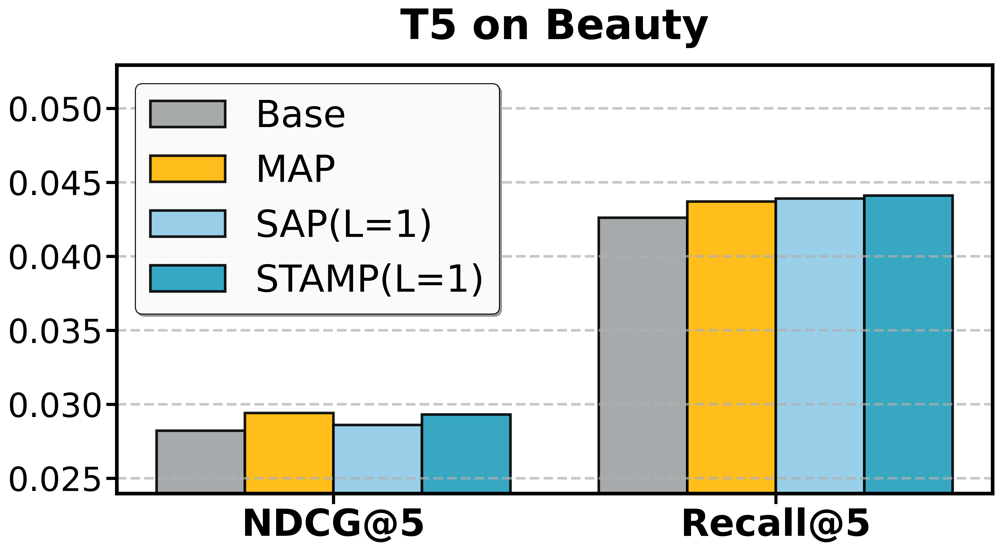
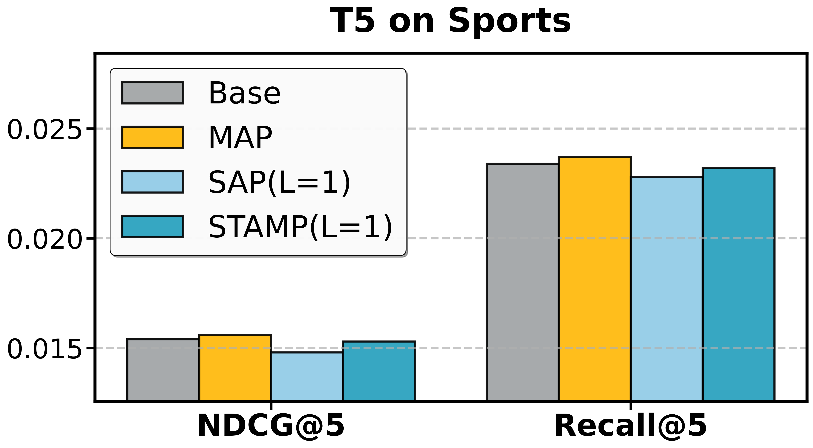
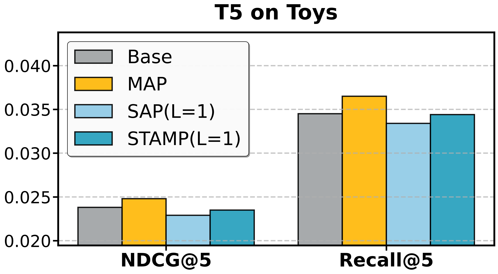
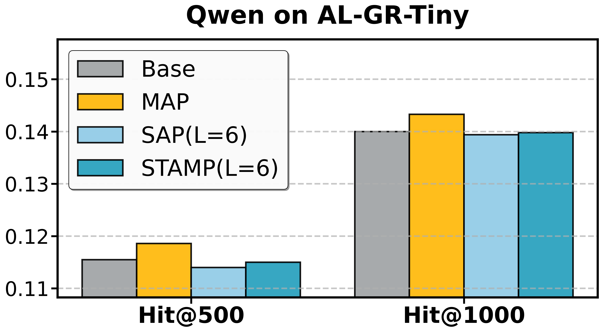

Key findings:
- **MAP alone** consistently outperforms Base — provides independent enhancement beyond compensation
- **SAP alone** substantially reduces latency/VRAM; on noisy datasets (Beauty, Toys) pruning at layer 2 acts as **denoising**, improving performance
- **STAMP** achieves best of both: high efficiency + robustness

### 4.6. Impact of Pruning Strategies

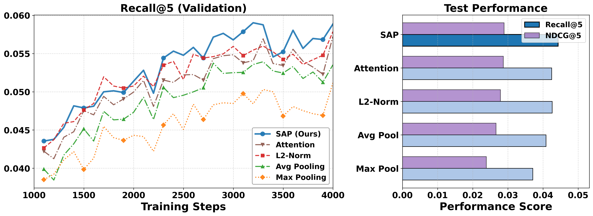

Compared baselines:
- **Aggregation methods** (Max/Avg Pooling): Destroys specific semantic details, performs worst
- **ℓ₂-norm method**: Ignores context; may remove highly-attended but low-magnitude tokens
- **Attention-only method**: Ignores tokens that accumulate information from others
- **SAP**: Consistently best; considers both semantic saliency AND attention centrality

### 4.7. Hyperparameter Sensitivity

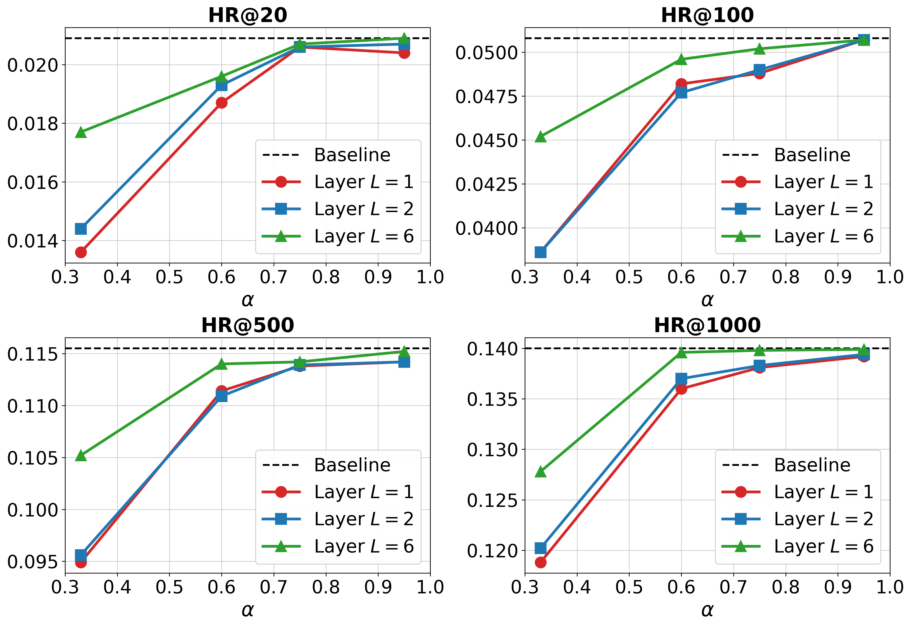

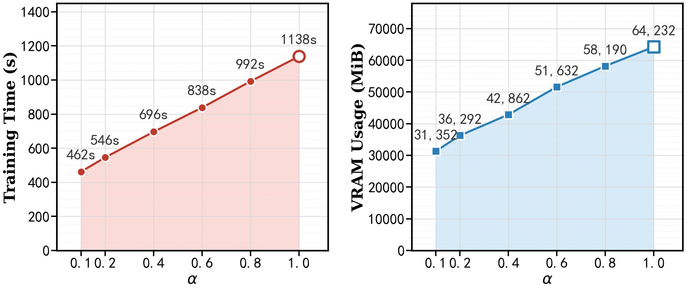

- Good tolerance for moderate compression; sharp drop beyond critical limit
- Optimal pruning depth related to retention ratio: shallow layers crucial for basic features, deeper layers more robust

### 4.8. Why is Pruning Safe?

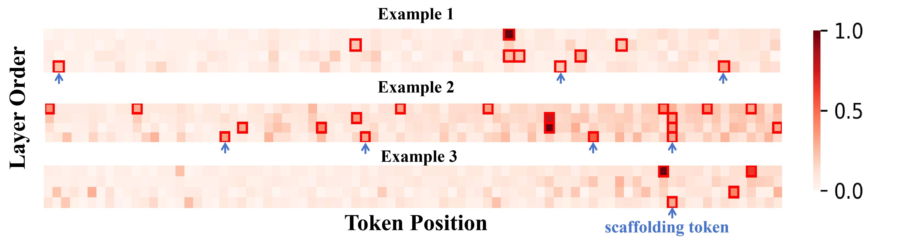

Two key observations from attention heatmaps:
1. **Consistently low attention scores** for many item tokens throughout encoding → can be safely pruned ("dead weight")
2. **Dynamic attention pattern**: some tokens receive high attention early but fade in deeper layers → early layers use them as scaffolding for basic features, absorbed by key tokens later

This explains why pruning should **not** be applied too early in shallow layers.

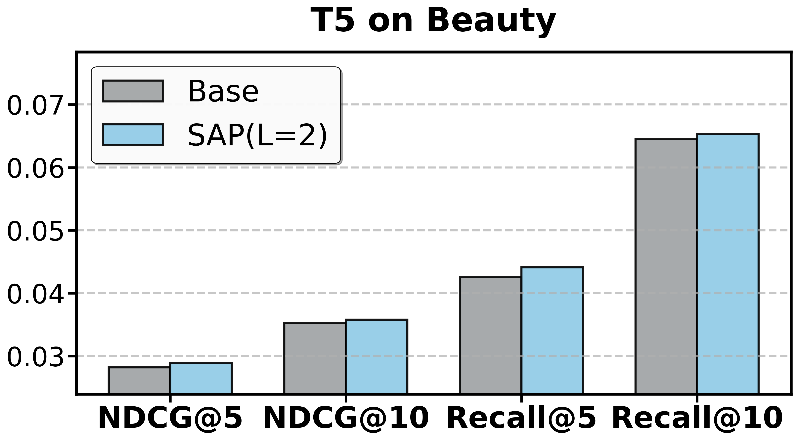
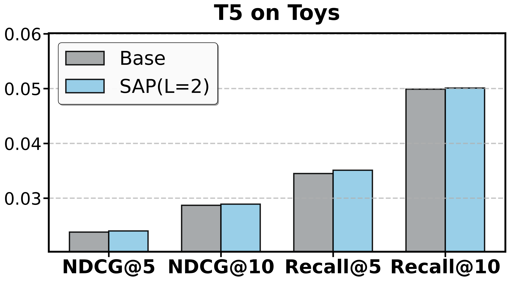

---

## 5. Related Work

- **Generative Retrieval:** TIGER, GRID, FORGE; speculative sampling, efficient attention
- **Semantic Identifier:** TIGER (pioneered SIDs), LETTER, DAS, OneRec (RQ-Kmeans), FORGE (industrial-scale)
- **Acceleration of LLMRec:** Quantization, knowledge distillation, token pruning (mainly inference-centric; STAMP addresses training efficiency)

---

## 6. Conclusion

STAMP addresses the **Semantic Dilution Effect** in SID-based GR through a dual-end optimization strategy:
- **SAP**: Input purification via dynamic token pruning (1.23–1.38× speedup, 17.2–54.7% VRAM reduction)
- **MAP**: Signal amplification via multi-token prediction (independent enhancement of representation quality)

The framework is model-agnostic across Encoder-Decoder (T5) and Decoder-Only (Qwen) architectures.
