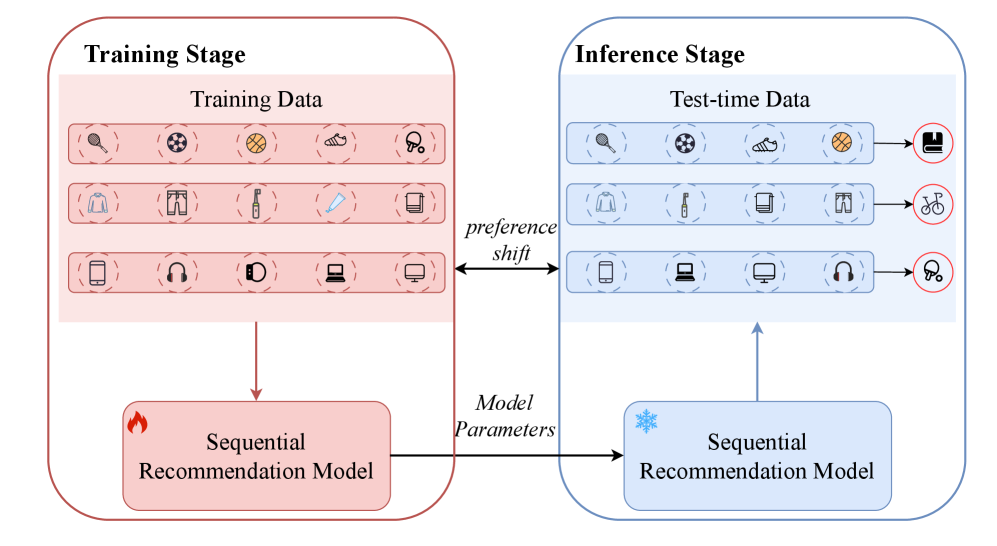
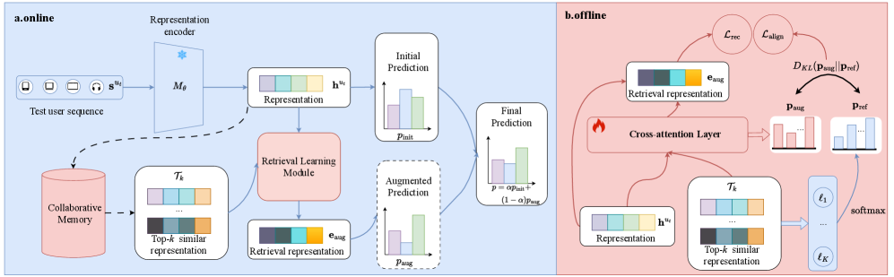
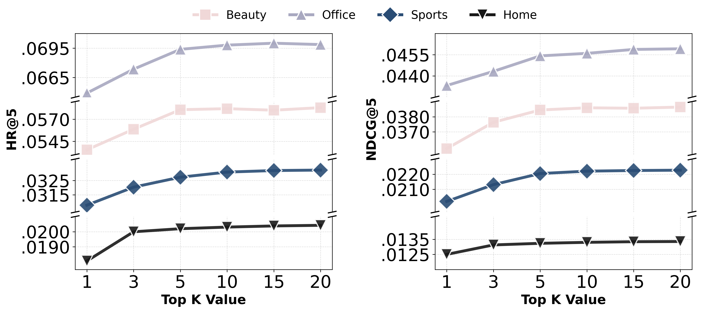
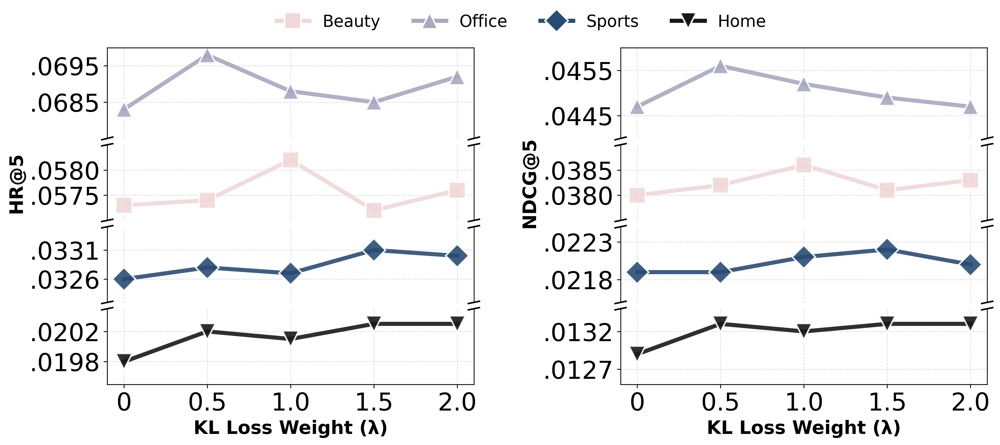
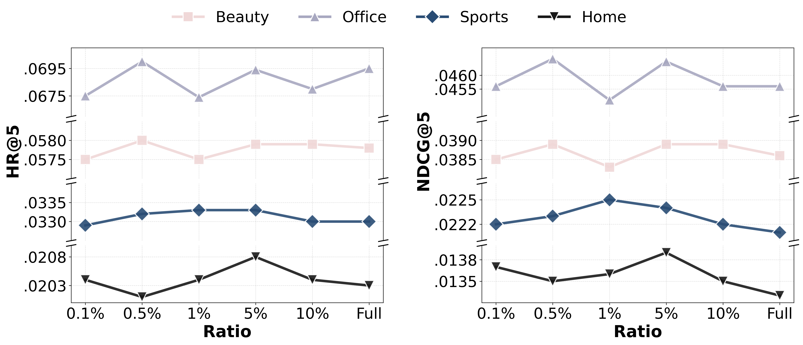
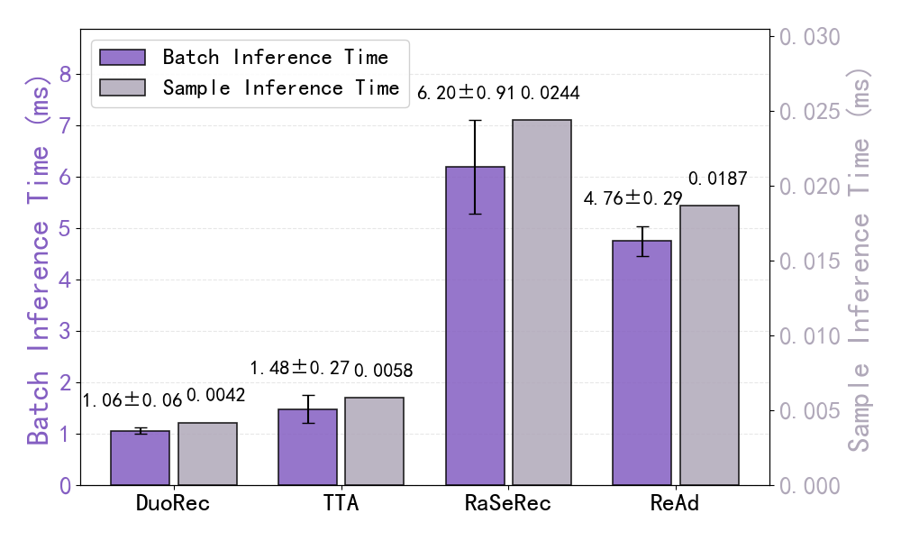
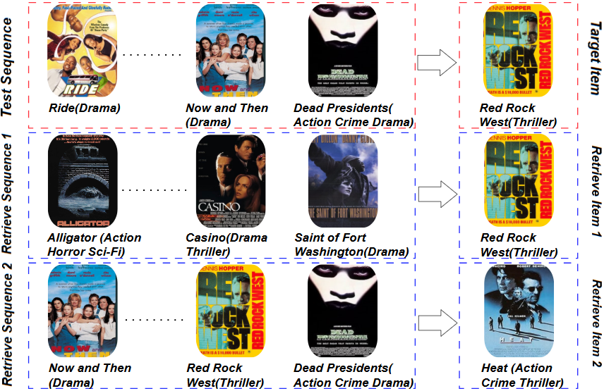

# Retrieve-then-Adapt: Retrieval-Augmented Test-Time Adaptation for Sequential Recommendation

**Authors:** Jingyang Bin, Ziqiang Cui, Xiaokun Zhang, Fuyuan Lyu, Jingyan Jiang, Dugang Liu, Chen Ma, Xiuqiang He

**Affiliations:** Shenzhen Technology University, City University of Hong Kong, McGill University, Shenzhen University

**Paper:** https://arxiv.org/abs/2604.05379

**PDF:** attachment/2604.05379_RetrieveAdaptSeqRec.pdf

**Submitted:** April 7, 2025

---

## Abstract

The sequential recommendation (SR) task aims to predict the next item based on users' historical interaction sequences. Typically trained on historical data, SR models often struggle to adapt to real-time **preference shifts** during inference due to distributional divergence and parameterized constraints. Existing approaches (test-time training, test-time augmentation, retrieval-augmented fine-tuning) either introduce significant computational overhead, rely on random augmentation strategies, or require carefully designed two-stage training.

We propose **ReAd** (Retrieve-then-Adapt), a novel framework that dynamically adapts a deployed SR model to the test distribution through **retrieved user preference signals**:
1. Retrieves collaboratively similar items from a constructed **collaborative memory database**
2. Integrates retrieved items via a **lightweight retrieval learning module** into an informative augmentation embedding
3. Refines initial SR predictions via a **confidence-aware fusion mechanism**

Extensive experiments across five benchmark datasets demonstrate that ReAd consistently outperforms existing SR methods.

---

## 1. Introduction

SR models inherit frozen parameters from training during inference — this static representation fails to adapt to dynamic test-time environments.

**Two key challenges:**
1. **Preference shifts:** temporal, locational, or interest changes make historical patterns outdated (e.g., sports products during vacation → books at semester start)
2. **Biased collaborative signals:** interactions involving long-tail items suffer inadequate representation; signals become outdated when long-tail items gain popularity

**Existing test-time approaches and limitations:**
- **Test-Time Training (TTT):** Auxiliary tasks for real-time model updating → too computationally expensive for complex architectures
- **Test-Time Augmentation (TTA):** Random augmentation + simple averaging → lacks robustness, may fail to generalize
- **Retrieval-Augmented Fine-tuning (RaSeRec):** Requires carefully structured two-stage pre-training → cannot adapt dynamically during inference

**Key insight:** Effective test-time adaptation requires both **effective augmentation** (collaborative signals) and **efficient adaptation** (lightweight, no retraining).

---

## 2. Related Work

### 2.1. Sequential Recommendation
Evolution from GRU4Rec, Caser → Transformer-based SASRec, BERT4Rec → scaling up (HSTU, LONGER). SSL techniques address data sparsity via augmentation (cropping, masking) and contrastive learning.

### 2.2. Test-Time Learning Paradigms
- **TTT4Rec:** Auxiliary task + real-time model update
- **T2ARec:** State-space model with two alignment modules for interest distribution shift
- **PCRec:** Real-time hidden-state inference + one-step optimization
- **TTA (TNoise/TMask):** Random augmentation at test time → susceptible to randomness

### 2.3. Retrieval-Augmented Recommendation
RAG for LLMs → applied to recommendation. **RaSeRec:** two-stage framework with retrieval-augmented pre-training, but operates only during training, cannot adapt dynamically during inference.

---

## 3. Preliminaries

**Problem:** Given a trained SR model $M$, adapt it to test user $u_t$ with input sequence $\mathbf{s}^{u_t}$, using item embeddings $\{\mathbf{e}_j | j \in \mathcal{V}\}$.

**Subproblem 1:** Construct collaborative memory base $\mathcal{D}$ supporting efficient lookup:
$$f_{\text{aug}}: (\mathcal{D}, M; \mathbf{s}^{u_t}) \longrightarrow \mathbf{e}_{\text{aug}}$$

**Subproblem 2:** Adapt final prediction:
$$v^* = g_{\text{adapt}}(p_{\text{init}}, p_{\text{aug}})$$

During test-time adaptation: original training data is inaccessible, forward computation through $M$ must be computationally efficient.

---

## 4. Methodology

### 4.1. Two-Stage Overview

**Offline:** Construct collaborative memory database + train retrieval learning module
**Online:** Retrieve relevant items → fuse into augmentation embedding → refine prediction

### 4.2. Collaborative-based Retrieval

#### 4.2.1. Model Training

Standard SR training with next-item prediction loss:
$$\mathcal{L}_{\text{rec}} = -\sum_{u \in \mathcal{U}} \sum_{j=1}^{|\mathbf{s}^u|} \log \frac{e^{\mathbf{h}_j^u \mathbf{e}_{v_{j+1}^u}^\top}}{\Sigma_{v_i \in \mathcal{V}} e^{\mathbf{h}_j^u \mathbf{e}_{v_i}^\top}}$$

#### 4.2.2. Collaborative Memory Database

For each training sequence $\mathbf{s}^u$, compute representation $\mathbf{h}^u$ via $M_\theta$ and pair with corresponding next item embedding:
$$\mathcal{D} = \{<\mathbf{h}^u, \mathbf{e}_{v_u}>\}_{u \in \mathcal{U}}$$

During inference, retrieve top-$K$ items from $\mathcal{D}$ using cosine similarity:
$$\mathcal{T}_K = \{\mathbf{e}_k | s_{u_t, k} \in \text{Top-}k(\mathbf{h}^{u_t}, \mathcal{D}, K)\}$$

Accelerated with FAISS for approximate nearest-neighbor search.

#### 4.2.3. Retrieval Learning

Instead of simple averaging (which introduces noise as $K$ grows), a **lightweight cross-attention module**:

$$\mathbf{e}_{\text{aug}} = \text{softmax}\left(\frac{QK^\top}{\sqrt{d}}\right)V$$

where $Q = \mathbf{h}^{u_t} \mathbf{W}_q$, $K = \mathbf{e}_K \mathbf{W}_k$, $V = \mathbf{e}_K \mathbf{W}_v$

**Attention distribution:**
$$\mathbf{p}_{\text{aug}} = \text{softmax}\left(\frac{QK^\top}{\sqrt{d}}\right)$$

**Two complementary training losses:**

**Recommendation loss** (ensures augmented representation improves prediction):
$$\mathcal{L}_{\text{rec}} = -\log \frac{\exp(\mathbf{h} \mathbf{e}_t^\top)}{\sum_{v_i \in \mathcal{V}} \exp(\mathbf{h} \mathbf{e}_{v_i}^\top)}$$

where $\mathbf{h} = 0.5 \mathbf{h}^{u_t} + 0.5 \mathbf{e}_{\text{aug}}$

**Alignment loss** (calibrates attention weights based on each retrieved item's predictive utility):

Per-item predictive utility:
$$\ell(\mathbf{e}_k, \mathbf{e}_t) = -\log \frac{\exp(\mathbf{e}_k \mathbf{e}_t^\top)}{\Sigma_{v_i \in \mathcal{V}} \exp(\mathbf{e}_k \mathbf{e}_{v_i}^\top)}$$

Reference distribution (higher probability = more predictive):
$$\mathbf{p}_{\text{ref}} = \text{softmax}(\{-\ell(\mathbf{e}_k, \mathbf{e}_t)\}_{k=1}^K)$$

Alignment loss via KL divergence:
$$\mathcal{L}_{\text{align}} = D_{KL}(\mathbf{p}_{\text{aug}} \| \mathbf{p}_{\text{ref}})$$

Total training objective:
$$\mathcal{L} = \mathcal{L}_{\text{rec}} + \lambda \mathcal{L}_{\text{align}}$$

**Benefits:**
1. Cross-attention captures collaborative signals (historical co-occurrence patterns)
2. KL alignment ensures attention weights reflect predictive utility, not just similarity (amplifies discriminative but moderately-similar long-tail items)

### 4.3. Test-Time Adaptation

**Augmented prediction:**
$$p_{\text{aug}}(v = v^* | \mathbf{s}^{u_t}) = \frac{\exp(\mathbf{e}_{\text{aug}} \mathbf{e}_{v^*}^\top)}{\sum_{v_i \in \mathcal{V}} \exp(\mathbf{e}_{\text{aug}} \mathbf{e}_{v_i}^\top)}$$

**Entropy-based confidence-aware fusion:**
$$p(v = v^* | \mathbf{s}^{u_t}) = \alpha \times p_{\text{init}} + (1-\alpha) \times p_{\text{aug}}$$

**Truncated entropy** (concentrated on top-$\rho$ items to avoid long-tail dilution):
$$H_{\text{top}}(\mathbf{p}) = -\sum_{v_i \in \tau_{\text{top}}(\mathbf{p})} p_{v_i} \log(p_{v_i} + \epsilon)$$

**Confidence-driven fusion weight** (lower entropy = higher confidence = larger weight):
$$\alpha = \frac{\exp\left(\frac{1}{1+H_{\text{top}}^{\text{init}}}\right)}{\exp\left(\frac{1}{H_{\text{top}}^{\text{init}}}\right) + \exp\left(\frac{1}{1+H_{\text{top}}^{\text{aug}}}\right)}$$

---

## 5. Experiments

### 5.1. Datasets

| Dataset | #Users | #Items | #Interactions | Avg. Actions | Sparsity |
|---------|--------|--------|---------------|--------------|----------|
| Office | 4,906 | 2,421 | 53,258 | 10.86 | 99.55% |
| Beauty | 22,364 | 12,102 | 198,502 | 8.88 | 99.93% |
| Sport | 35,599 | 18,358 | 296,337 | 8.32 | 99.95% |
| Home | 66,520 | 28,238 | 551,682 | 8.29 | 99.97% |
| ML1M | 6,040 | 3,706 | 1,000,209 | 165.60 | 95.53% |

Leave-one-out evaluation; full ranking over all items (no negative sampling).

### 5.2. Overall Performance

**ReAd (+DuoRec) achieves best results across all five datasets.**

Selected results (ML-1M dataset):

| Method | HR@5 | HR@10 | NDCG@5 | NDCG@10 |
|--------|------|-------|--------|---------|
| SASRec | 0.1407 | 0.2200 | 0.0898 | 0.1153 |
| DuoRec | 0.1909 | 0.2859 | 0.1297 | 0.1603 |
| RaSeRec | 0.1932 | 0.2844 | 0.1328 | 0.1646 |
| TTA | 0.1359 | 0.2136 | 0.0814 | 0.1105 |
| **ReAd (+SASRec)** | 0.1624 | 0.2382 | 0.1053 | 0.1297 |
| **ReAd (+DuoRec)** | **0.1956** | **0.2897** | **0.1341** | **0.1653** |

Key observations:
- ReAd gains more pronounced on **sparse Amazon datasets** (Office, Beauty, Sports, Home) than denser ML-1M
- Sparse sequences benefit more from retrieval-augmented collaborative signals
- Model-agnostic: consistently improves all tested architectures (SASRec, DuoRec, GRU4Rec, BERT4Rec)

### 5.3. Generalization to Other Architectures

ReAd consistently improves GRU4Rec, BERT4Rec (with bidirectional attention), and SASRec (unidirectional). Most gains exceed 10%.

### 5.4. Hyperparameter Analysis

- **Number of retrieved items $K$:** Performance peaks at optimal $K$; too many introduces irrelevant items
- **Alignment loss coefficient $\lambda$:** Limited impact (retrieved items already collaboratively relevant)
- **Top ratio $\rho$:** Larger top-ratio generally better; full item set (100%) consistently degrades results due to long-tail dilution

### 5.5. Ablation Study

| Variant | Beauty HR@10 | Beauty NDCG@10 |
|---------|-------------|----------------|
| w/o Rec | 0.0643 | 0.0332 |
| w/o Att | 0.0786 | 0.0413 |
| w/o α | 0.0845 | 0.0451 |
| w/o KL | 0.0863 | 0.0473 |
| **ReAd** | **0.0874** | **0.0481** |

All components contribute; removing $\mathcal{L}_{\text{rec}}$ has the largest impact.

### 5.6. Case Study: Preference Shift in MovieLens

Test sequence transitions from drama to thriller. Retrieved sequences (blue):
- Share overlapping items confirming collaborative relevance
- Supply complementary thriller items ("Casino", "Heat") reinforcing emerging preference
- Bridge earlier drama context to current interest

---

## 6. Conclusion

ReAd provides a practical, model-agnostic framework for enhancing SR models under real-world test-time distribution shifts through:
1. **Collaborative memory database** for retrieving historically relevant items
2. **Lightweight retrieval learning module** with cross-attention + KL alignment
3. **Entropy-based dynamic fusion** balancing original and augmented predictions

Only minimal additional inference overhead compared to existing retrieval-based methods.
