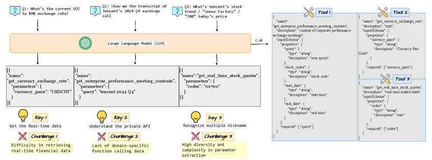
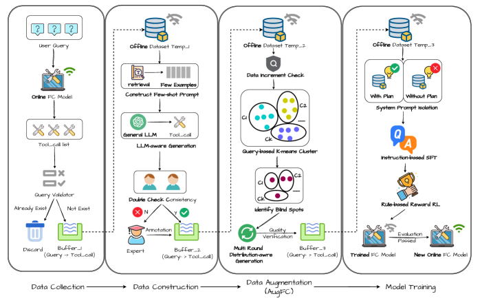
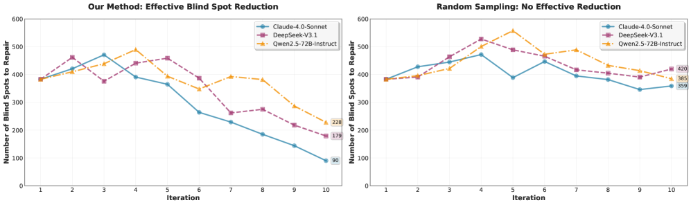
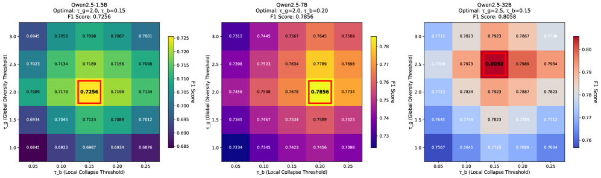
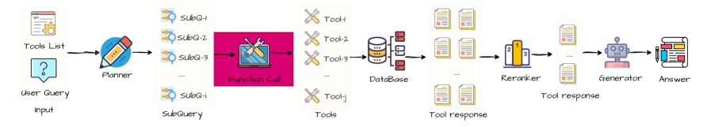
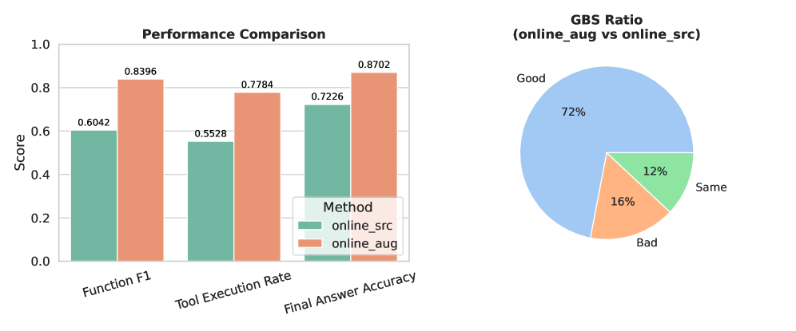

# Data-Driven Function Calling Improvements in Large Language Model for Online Financial QA

**Authors:** Hao Chen, Shiwei Li, Fuyuan Lyu, Weijie Shi, Lingjie Li, Dugang Liu, Weihong Luo, Xiku Du, Xiuqiang He

**Affiliations:** FiT (Tencent), Huazhong University of Science and Technology, McGill University, The Hong Kong University of Science and Technology, Shenzhen Technology University, Shenzhen University

**Paper:** https://arxiv.org/abs/2604.05387

**PDF:** attachment/2604.05387_FunctionCallingFinancialQA.pdf

**Submitted:** April 7, 2025 (Published: WWW 2026)

---

## Abstract

Large language models (LLMs) have been incorporated into numerous industrial applications. An online financial question-answering (QA) system can leverage both LLMs and private APIs to provide timely financial analysis and information. However, a generic LLM requires customized financial APIs and struggles to adapt to the financial domain. Additionally, online user queries contain **out-of-distribution parameters** compared with required function input parameters.

We propose a **data-driven pipeline** to enhance function calling in LLM for our online deployed financial QA, comprising:
1. **Dataset construction** from online user queries + manually annotated seed data
2. **AugFC** (Augmented Function Calling): automated augmentation method exploring possible parameter values to enhance diversity
3. **Two-step model training**: Supervised Fine-tuning (SFT) + Reinforcement Learning (RL)

The pipeline is deployed in **YuanBao** (https://yuanbao.tencent.com/chat/), one of the largest chat platforms in China.

---

## 1. Introduction

Building an online financial QA system powered by LLM faces specific challenges:

1. **Domain-specific APIs:** Financial information provided by external APIs (e.g., "get enterprise performance meeting contents") is unavailable in general function calling datasets
2. **Query diversity:** Same entity described differently ("700", "Goose Factory", and "Tencent" all refer to the same company)
3. **Real-time updates:** Financial data changes rapidly, requiring dynamic API calls

**Approach:** Data-driven pipeline that collects online user queries to exploit the existing toolset, proposes AugFC for diversity enhancement, and trains LLM with SFT + RL.

---

## 2. Related Work

### 2.1. Financial QA
- **ZS-FinPYT / ZS-FinDSL:** Zero-shot techniques for complex numerical reasoning over financial documents
- **WeaverBird:** Dialogue system finetuned on extensive financial corpora

### 2.2. Function Calling
- **Data synthesis:** Toolformer, ToolLLM, ToolACE, xLAM, ToolHop
- **Model enhancement:** SFT-based (Hammer, xLAM), then shift to RL
- **RLVR:** Tool-star and TooRL pioneer tool calling with reinforcement learning

---

## 3. Methodology

### 3.1. Problem Formulation

Given:
- User query record $\mathbb{Q}$
- Toolset $\mathbb{T} = \{t_1, t_2, \ldots, t_n\}$
- Each tool: $t_i = (name_i, description_i, parameters_i)$

Goal: Train policy $\pi: (q, \mathbb{T}) \to a$ to generate correct tool-call list $a_g = [t_1(p_1), \ldots, t_m(p_m)]$.

Following xLAM format: dataset as tuples $\langle q, a, \mathbb{T}\rangle$.

### 3.2. The Data-Driven Pipeline

Four components:
1. **Data collection:** Collect online user queries
2. **Data construction:** Build credible tool-call lists
3. **Data augmentation (AugFC):** Enhance parameter diversity
4. **Two-stage training:** SFT + RL

#### 3.2.1. Initial Settings (Seed Data)

Manually annotated by financial experts following xLAM format. Principles: diversity, uniqueness, consistency.

#### 3.2.2. Data Collection

Collect online query-response pairs. Validation via embedding model $E$ to filter duplicates. Candidate set $\mathbb{B}_g$ for further construction.

#### 3.2.3. Data Construction

For new queries, use a more powerful LLM $M_p$ with few-shot prompting (most similar queries from buffer $\mathbb{B}$) to generate reference tool-call list $a_{M_g}$.

- Compare $a_{M_g}$ with online LLM's $a_g$
- Consistent → merge into buffer $\mathbb{B}$
- Inconsistent → annotated by financial experts

#### 3.2.4. Data Augmentation (AugFC)

Online queries follow **power-law distribution** in parameter values → dataset inadequate for diversity requirements.

**Blind spot identification using information entropy:**

Global entropy for parameter $p_j$:
$$H_G^{p_j} = -\sum_{p \in p_j} \frac{n_p}{N} \log_2 \frac{n_p}{N}$$

Cluster entropy (after semantic clustering into $K$ clusters):
$$H_k^{p_j} = -\sum_{p \in p_j} \frac{n_p^k}{N_k} \log_2 \frac{n_p^k}{N_k}$$

**Definition (Blind Spot Parameter):** Parameter $p_j$ is a blind spot $\iff H_G^{p_j} > \tau_g$ AND for each cluster $k$: $\frac{H_k^{p_j}}{H_G^{p_j}} < \tau_b$

- First condition: ensures global diversity needs guaranteed
- Second condition: local distribution collapses in this cluster

**Multi-round distribution-aware generation:**
- Select representative queries in cluster $k$
- Design prompt with entropy information: $\mathcal{P}_{aug}(\{q_k^{rep}\}, q, H_G^{p_b}, H_k^{p_b}, \tau_b, \mathbb{T})$
- Generated queries update dataset only if cluster diversity improves
- **Fully automatic, no manual intervention**

#### 3.2.5. Model Training (Two-Step)

**SFT Step:** Two types of samples with prompt isolation:

- **System Prompt 1:** Output reasoning in `<plan>...</plan>` before `<tool_call>...</tool_call>`
- **System Prompt 2:** Output tool call directly (no reasoning) — for inference efficiency

**RL Step (GRPO-based):**

Format reward: $\mathcal{R}_{format} \in \{0, 1\}$

Correctness components:
$$\mathcal{R}_{correct} = F1_t + F1_p + EM$$

where:
- $F1_t$ = F1 for tool call list retrieval
- $F1_p$ = average F1 for parameter name key retrieval
- $EM$ = exact matching for parameter values

GRPO optimization:
$$J_{GRPO}(\theta) = E_{Q \sim \mathbb{B}} E_{s \sim \pi_\theta} \left[\min\left(\frac{\pi(s_i Q)}{\pi_{old}(s_i Q)} A_i(s_i Q), \text{clip}(\cdots) A_i(s_i Q)\right) - \beta KL(\pi \| \pi_{ref})\right]$$

---

## 4. Offline Experiments

### 4.1. Datasets

| Benchmark | Details |
|-----------|---------|
| API-Bank L1 | 314 dialogues, 753 API calls, known API invocation |
| API-Bank L2 | Same but with API retrieval |
| Tool-Alpaca | 271 instances across 50 categories |
| Seal-Tools | 4,076 automatically generated APIs |
| Nexus Raven | 318 test examples, 65 distinct APIs |
| xLAM-small | 10% sample from xLAM-60k (3,673 APIs, 21 categories) |

### 4.2. Overall Performance of AugFC (RQ1)

**Table: Performance with AugFC on Qwen2.5 models**

| Model Size | Training Dataset | Avg F1 |
|-----------|-----------------|--------|
| Qwen2.5-1.5B | vanilla | 0.5527 |
| | src-only | 0.6765 |
| | aug-only | 0.6519 |
| | **src+aug** | **0.7256** |
| Qwen2.5-7B | vanilla | 0.6743 |
| | src-only | 0.7719 |
| | **src+aug** | **0.7856** |
| Qwen2.5-32B | **src+aug** | **0.8058** |

Key findings:
- Base model's function calling fails to meet accuracy requirements
- aug-only < src-only (augmented data alone insufficient)
- **src+aug consistently achieves best performance**

### 4.3. Blind Spot Reduction (RQ2)

AugFC significantly reduces blind spots compared to random sampling across all three LLMs (Claude-4, Deepseek-v3.1, Qwen2.5-72B).

### 4.4. Hyperparameter Sensitivity (RQ3)

- $\tau_g$ not largest → better (too large filters out useful parameters)
- $\tau_b$ not smallest → better (too small makes blind spot repair too difficult)

### 4.5. Ablation of AugFC Components (RQ4)

| Variant | 1.5B Avg | 7B Avg | 32B Avg |
|---------|---------|-------|--------|
| AugFC | 0.726 | 0.786 | 0.806 |
| w/o blind spots | 0.689 | 0.742 | 0.765 |
| w/o designed prompt | 0.672 | 0.738 | 0.772 |
| w/o multi-round | 0.695 | 0.752 | 0.780 |

**Designed prompt** has the largest impact (7.4%, 6.1%, 4.2% across sizes).

### 4.6. Two-Step Training vs. Baselines (RQ5)

| Model | Type | Avg F1 |
|-------|------|--------|
| Qwen2.5-1.5B | vanilla | 0.5527 |
| xLAM-1.3B-fc | SFT | 0.6459 |
| Hammer-1.5B | SFT | 0.6382 |
| **Ours-1.5B** | SFT+RL | **0.7256** |
| Qwen2.5-7B | vanilla | 0.6743 |
| xLAM-7B-fc | SFT | 0.6644 |
| Hammer-7B | SFT | 0.7358 |
| **Ours-7B** | SFT+RL | **0.7856** |
| Qwen2.5-32B | vanilla | 0.7580 |
| **Ours-32B** | SFT+RL | **0.8058** |

Two-step SFT+RL outperforms pure SFT methods across all model sizes.

---

## 5. Online Experiments

### 5.1. Online System Architecture

System components:
1. **Planner:** Generates subqueries based on tools and user query
2. **Function Call:** Where our pipeline works
3. **Reranker:** Reranks inputs by relevance and constraints
4. **Generator:** Outputs final answer

### 5.2. Online Results

Evaluated on 350 end-to-end query-answer pairs (~2,000 query/tool-call pairs):

| Metric | Improvement |
|--------|-------------|
| F1 score (automated) | **+39.1%** |
| Tool Execution Rate (automated) | **+40.7%** |
| Final Answer Accuracy (manual) | **+20.3%** |
| GBS Ratio (manual) | 72% Good vs 16% Bad |

**Data quality check:** 90% augmented data directly usable, 6% minor issues, 4% discarded.

---

## 6. Conclusion

A data-driven pipeline for improving function calling in LLMs for online financial QA:
1. **Periodic dataset updates** from online user queries to exploit the toolset
2. **AugFC:** Automated, entropy-guided augmentation to address blind spots in parameter diversity
3. **Two-step training (SFT + GRPO RL):** Balances accuracy and inference efficiency via prompt isolation

Deployed in YuanBao, demonstrating significant improvements in both automated and manual evaluation metrics.
